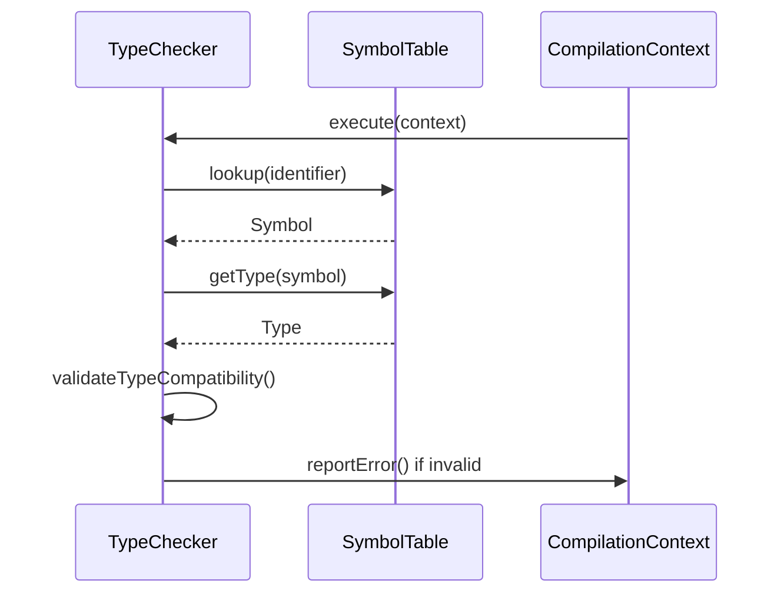
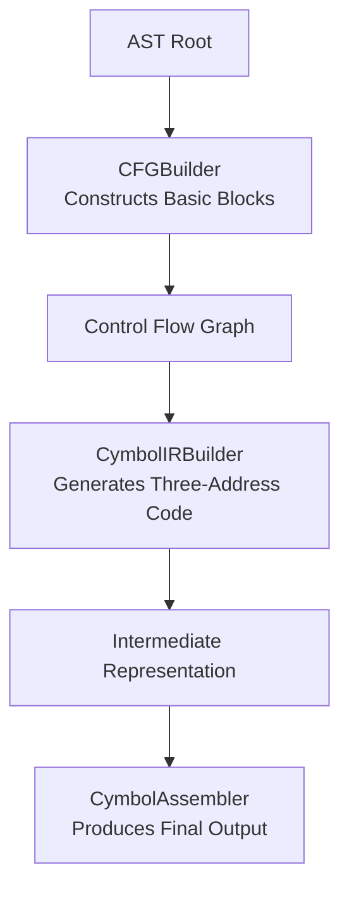
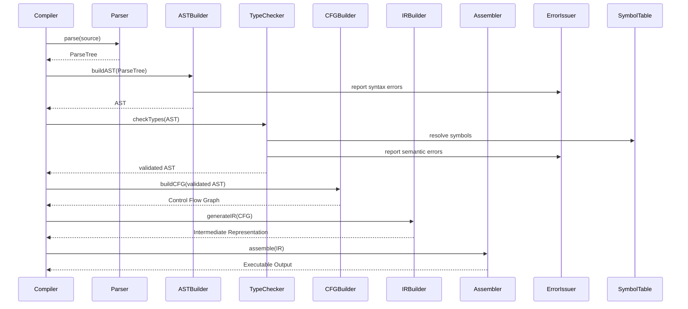

# Component Interaction Patterns

<cite>
**Referenced Files in This Document**   
- [Compiler.java](file://ep20/src/main/java/org/teachfx/antlr4/ep20/Compiler.java)
- [CymbolParser.java](file://ep20/src/main/java/org/teachfx/antlr4/ep20/parser/CymbolParser.java)
- [CymbolASTBuilder.java](file://ep20/src/main/java/org/teachfx/antlr4/ep20/pass/ast/CymbolASTBuilder.java)
- [TypeChecker.java](file://ep20/src/main/java/org/teachfx/antlr4/ep20/pass/sematic/TypeChecker.java)
- [LocalDefine.java](file://ep20/src/main/java/org/teachfx/antlr4/ep20/pass/symtab/LocalDefine.java)
- [CFGBuilder.java](file://ep20/src/main/java/org/teachfx/antlr4/ep20/pass/cfg/CFGBuilder.java)
- [CymbolIRBuilder.java](file://ep20/src/main/java/org/teachfx/antlr4/ep20/pass/ir/CymbolIRBuilder.java)
- [CymbolAssembler.java](file://ep20/src/main/java/org/teachfx/antlr4/ep20/pass/codegen/CymbolAssembler.java)
- [ErrorIssuer.java](file://ep20/src/main/java/org/teachfx/antlr4/ep20/driver/ErrorIssuer.java)
- [Phase.java](file://ep20/src/main/java/org/teachfx/antlr4/ep20/driver/Phase.java)
- [Task.java](file://ep20/src/main/java/org/teachfx/antlr4/ep20/driver/Task.java)
- [SymbolTable.java](file://ep20/src/main/java/org/teachfx/antlr4/ep20/symtab/type/TypeTable.java)
</cite>

## Table of Contents
1. [Introduction](#introduction)
2. [Compiler Class and Phase Coordination](#compiler-class-and-phase-coordination)
3. [Dependency Injection and Context Propagation](#dependency-injection-and-context-propagation)
4. [Shared State Management via Compilation Context](#shared-state-management-via-compilation-context)
5. [Error Reporting and Propagation Mechanism](#error-reporting-and-propagation-mechanism)
6. [AST Construction and Parser Integration](#ast-construction-and-parser-integration)
7. [Symbol Table and Type Checking Interaction](#symbol-table-and-type-checking-interaction)
8. [Control Flow and IR Generation Pipeline](#control-flow-and-ir-generation-pipeline)
9. [Component Collaboration Diagrams](#component-collaboration-diagrams)
10. [Interface Contracts and Loose Coupling](#interface-contracts-and-loose-coupling)
11. [Conclusion](#conclusion)

## Introduction
This document details the component interaction patterns within the compiler architecture, focusing on how the Compiler class orchestrates various phases of compilation. It explains the coordination between ANTLR4-generated parsers, AST builders, symbol table managers, semantic analyzers, and code generators. The design emphasizes dependency injection, shared context management, and well-defined interfaces to ensure loose coupling while maintaining coherent data flow across compilation stages.

## Compiler Class and Phase Coordination
The Compiler class serves as the central orchestrator of the compilation pipeline, managing the execution of distinct phases in a predefined sequence. Each phase is encapsulated as a Task that operates on a shared CompilationContext, ensuring consistent state access and modification. The Compiler class initializes and invokes these tasks in a specific order: parsing, AST construction, symbol definition, type checking, control flow analysis, and code generation.

**Section sources**
- [Compiler.java](file://ep20/src/main/java/org/teachfx/antlr4/ep20/Compiler.java#L1-L100)

## Dependency Injection and Context Propagation
The compiler employs a dependency injection pattern to pass contextual information between phases. The CompilationContext object is injected into each phase's Task, allowing components to access shared resources such as the ParseTree, AST, SymbolTable, and ErrorIssuer. This pattern ensures that each phase receives exactly what it needs without direct dependencies on other components, promoting modularity and testability.

For example, the ASTBuilder receives the ParseTree from the parser phase and uses the injected context to store the resulting AST, which is then accessed by subsequent phases like semantic analysis.

**Section sources**
- [Compiler.java](file://ep20/src/main/java/org/teachfx/antlr4/ep20/Compiler.java#L45-L80)
- [Task.java](file://ep20/src/main/java/org/teachfx/antlr4/ep20/driver/Task.java#L5-L25)

## Shared State Management via Compilation Context
The CompilationContext acts as a central repository for shared state across compilation phases. It holds references to critical data structures including the ParseTree, AST root, SymbolTable, and intermediate representations. This shared context enables seamless data flow between phases while preventing the need for global variables or static state.

Each phase modifies only the portions of the context relevant to its responsibilities, ensuring clear ownership and reducing side effects. The context also maintains phase-specific flags and metadata that guide conditional behavior in later stages.

**Section sources**
- [Compiler.java](file://ep20/src/main/java/org/teachfx/antlr4/ep20/Compiler.java#L30-L60)
- [Task.java](file://ep20/src/main/java/org/teachfx/antlr4/ep20/driver/Task.java#L10-L35)

## Error Reporting and Propagation Mechanism
Error reporting is centralized through the ErrorIssuer component, which is accessible via the CompilationContext. All phases use this single instance to report errors, warnings, and diagnostic messages, ensuring consistent formatting and handling. The ErrorIssuer maintains a list of reported issues that can be queried at the end of compilation.

Errors are propagated by adding them to the shared ErrorIssuer instance, which allows upstream phases to detect and respond to problems discovered in earlier stages. This mechanism supports both immediate error handling and batch reporting at the end of compilation.

**Section sources**
- [ErrorIssuer.java](file://ep20/src/main/java/org/teachfx/antlr4/ep20/driver/ErrorIssuer.java#L1-L50)
- [Compiler.java](file://ep20/src/main/java/org/teachfx/antlr4/ep20/Compiler.java#L70-L90)

## AST Construction and Parser Integration
The AST construction phase begins with the ANTLR4-generated parser producing a ParseTree, which is then traversed by the CymbolASTBuilder visitor to construct an Abstract Syntax Tree. The ASTBuilder is injected with the CompilationContext and uses it to store the resulting AST nodes.

The parser and ASTBuilder are loosely coupled through the visitor pattern, with the ASTBuilder implementing the CymbolBaseListener interface to receive parse events. This design allows the parser to remain unaware of the AST structure while enabling the builder to construct a rich, typed AST representation.

**Section sources**
- [CymbolParser.java](file://ep20/src/main/java/org/teachfx/antlr4/ep20/parser/CymbolParser.java#L1-L30)
- [CymbolASTBuilder.java](file://ep20/src/main/java/org/teachfx/antlr4/ep20/pass/ast/CymbolASTBuilder.java#L15-L60)

## Symbol Table and Type Checking Interaction
The TypeChecker and SymbolTable interact closely during semantic analysis. The LocalDefine phase first populates the SymbolTable with declarations, establishing scope hierarchies and symbol bindings. The TypeChecker then queries this SymbolTable to resolve identifiers, verify type compatibility, and enforce semantic rules.

This interaction follows a contract where the SymbolTable provides lookup and insertion operations, while the TypeChecker consumes this information to perform validation. The two components communicate through well-defined interfaces rather than direct implementation dependencies, allowing for independent evolution.

**Diagram sources**
- [TypeChecker.java](file://ep20/src/main/java/org/teachfx/antlr4/ep20/pass/sematic/TypeChecker.java#L20-L50)
- [SymbolTable.java](file://ep20/src/main/java/org/teachfx/antlr4/ep20/symtab/type/TypeTable.java#L10-L40)

**Section sources**
- [TypeChecker.java](file://ep20/src/main/java/org/teachfx/antlr4/ep20/pass/sematic/TypeChecker.java#L1-L80)
- [LocalDefine.java](file://ep20/src/main/java/org/teachfx/antlr4/ep20/pass/symtab/LocalDefine.java#L15-L45)

## Control Flow and IR Generation Pipeline
The control flow construction phase is managed by the CFGBuilder, which transforms the AST into a Control Flow Graph (CFG). This process is followed by the CymbolIRBuilder, which generates Three-Address Code from the CFG.

The CFGBuilder analyzes statement sequences, loops, and conditionals to create basic blocks and establish control flow edges. The resulting CFG is then used by the IRBuilder to emit low-level instructions that represent the program's logic in an intermediate form suitable for optimization and code generation.

**Diagram sources**
- [CFGBuilder.java](file://ep20/src/main/java/org/teachfx/antlr4/ep20/pass/cfg/CFGBuilder.java#L10-L40)
- [CymbolIRBuilder.java](file://ep20/src/main/java/org/teachfx/antlr4/ep20/pass/ir/CymbolIRBuilder.java#L15-L50)

**Section sources**
- [CFGBuilder.java](file://ep20/src/main/java/org/teachfx/antlr4/ep20/pass/cfg/CFGBuilder.java#L1-L100)
- [CymbolIRBuilder.java](file://ep20/src/main/java/org/teachfx/antlr4/ep20/pass/ir/CymbolIRBuilder.java#L1-L70)

## Component Collaboration Diagrams
The following sequence diagram illustrates the message passing between key components during compilation:

**Diagram sources**
- [Compiler.java](file://ep20/src/main/java/org/teachfx/antlr4/ep20/Compiler.java#L20-L100)
- [Phase.java](file://ep20/src/main/java/org/teachfx/antlr4/ep20/driver/Phase.java#L5-L30)

## Interface Contracts and Loose Coupling
The compiler maintains loose coupling between phases through well-defined interfaces and contracts. Each phase interacts with others only through the CompilationContext and standardized data structures, avoiding direct dependencies.

Key interface contracts include:
- **Task interface**: Defines the execute method that all compilation phases must implement
- **ErrorIssuer interface**: Standardizes error reporting across components
- **ASTVisitor interface**: Enables tree traversal without coupling to specific node implementations
- **SymbolTable interface**: Provides symbol resolution services to semantic analysis phases

This design allows phases to be developed, tested, and modified independently while ensuring proper data flow and error handling throughout the compilation process.

**Section sources**
- [Task.java](file://ep20/src/main/java/org/teachfx/antlr4/ep20/driver/Task.java#L1-L30)
- [ErrorIssuer.java](file://ep20/src/main/java/org/teachfx/antlr4/ep20/driver/ErrorIssuer.java#L1-L40)
- [ASTVisitor.java](file://ep20/src/main/java/org/teachfx/antlr4/ep20/ast/ASTVisitor.java#L5-L25)

## Conclusion
The compiler architecture demonstrates effective component interaction patterns through its use of dependency injection, shared context management, and well-defined interfaces. The Compiler class successfully coordinates between ANTLR4-generated parsers, AST builders, symbol table managers, and code generators by providing a consistent execution framework and data sharing mechanism. The design prioritizes loose coupling while ensuring reliable data flow and error propagation, resulting in a maintainable and extensible compilation pipeline.