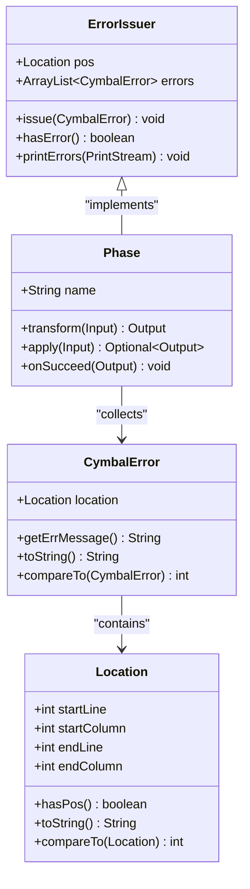
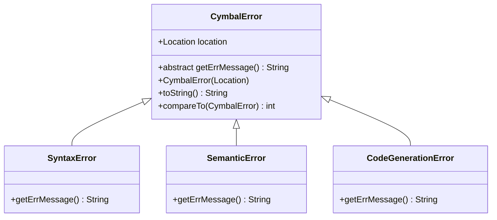
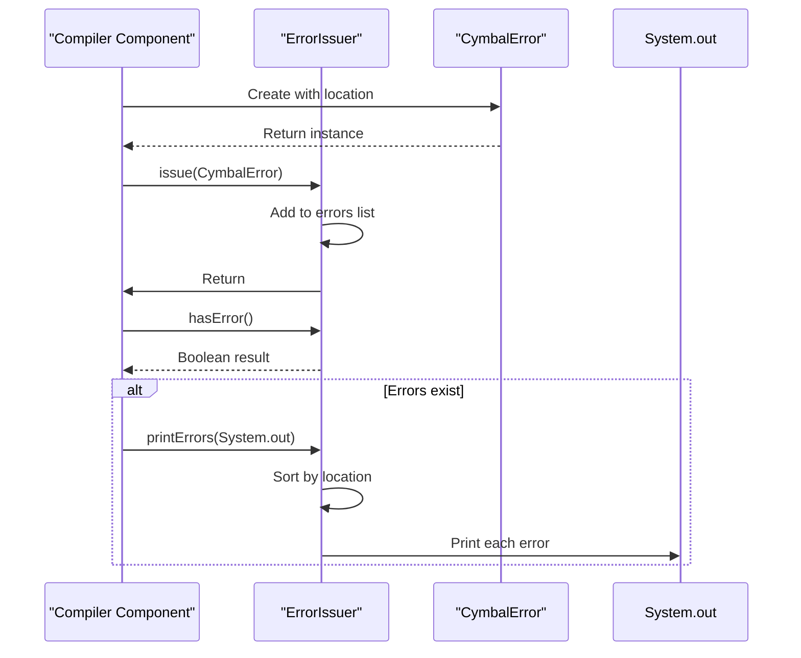
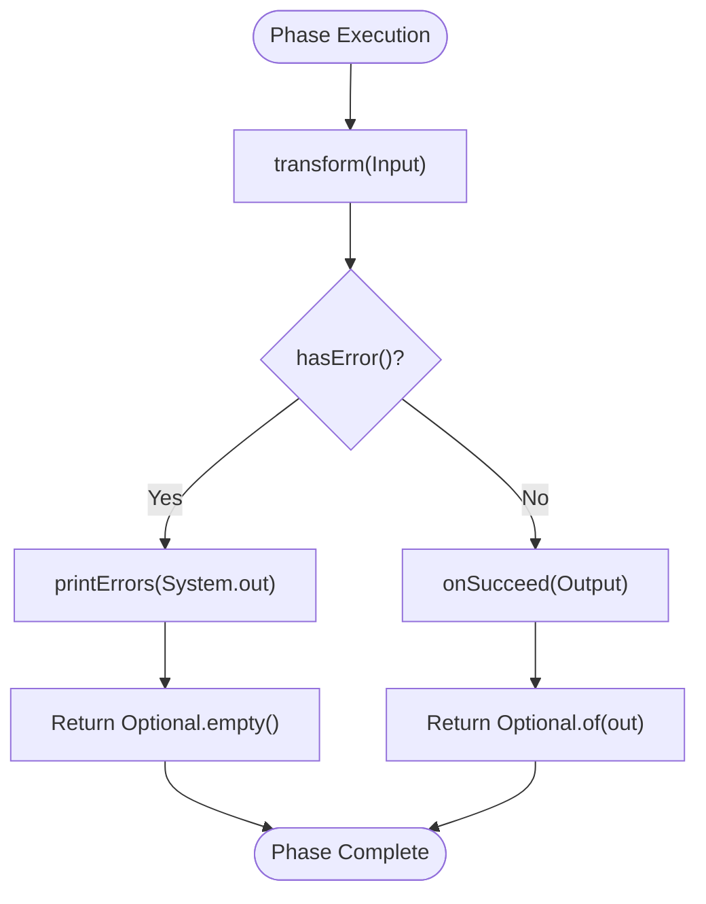
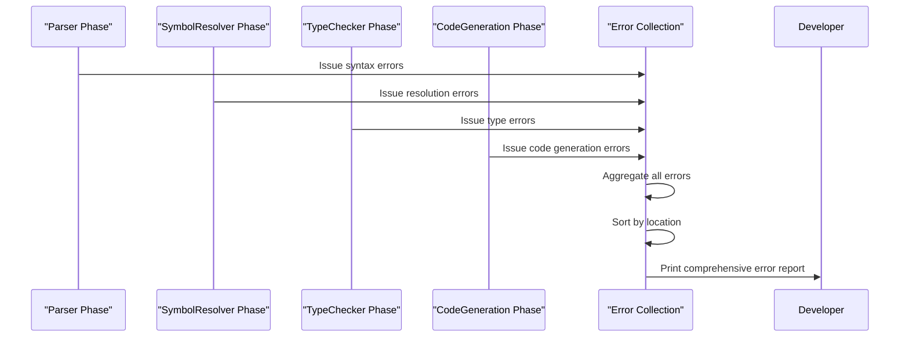
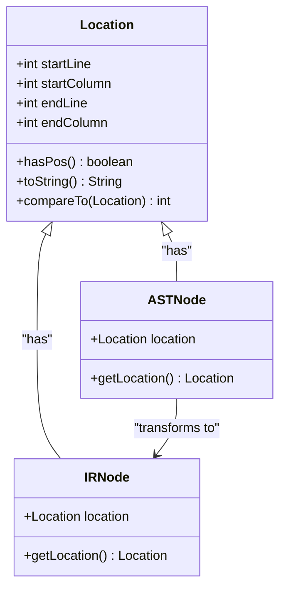
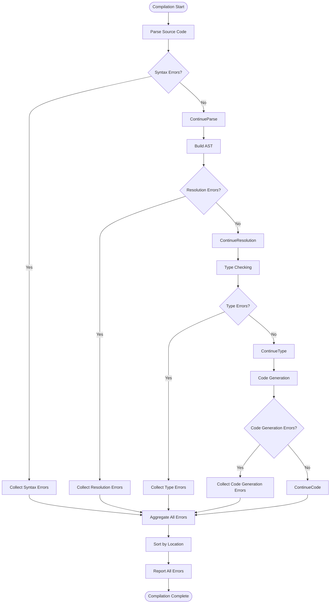

# Error Reporting and Handling Integration

<cite>
**Referenced Files in This Document**   
- [CymbalError.java](file://ep20/src/main/java/org/teachfx/antlr4/ep20/error/CymbalError.java)
- [ErrorIssuer.java](file://ep20/src/main/java/org/teachfx/antlr4/ep20/driver/ErrorIssuer.java)
- [Phase.java](file://ep20/src/main/java/org/teachfx/antlr4/ep20/driver/Phase.java)
- [Location.java](file://ep20/src/main/java/org/teachfx/antlr4/ep20/parser/Location.java)
- [Compiler.java](file://ep20/src/main/java/org/teachfx/antlr4/ep20/Compiler.java)
</cite>

## Table of Contents
1. [Introduction](#introduction)
2. [Core Error Handling Components](#core-error-handling-components)
3. [Error Representation with CymbalError](#error-representation-with-cymbalerror)
4. [Error Issuance through ErrorIssuer](#error-issuance-through-errorissuer)
5. [Phase-Based Error Aggregation](#phase-based-error-aggregation)
6. [Error Propagation Across Compilation Phases](#error-propagation-across-compilation-phases)
7. [Error Location Preservation](#error-location-preservation)
8. [Error Recovery and Collection](#error-recovery-and-collection)
9. [Conclusion](#conclusion)

## Introduction
The Cymbol compiler implements a comprehensive error reporting and handling system that maintains error context throughout the compilation pipeline. This system ensures that errors are captured with precise location information, can be issued by any compiler component, and are aggregated and reported in a consistent manner. The design enables meaningful error messages that help developers identify and fix issues in their source code.

## Core Error Handling Components

The error handling system consists of several key components that work together to capture, store, and report compilation errors. These components form a cohesive framework that spans the entire compilation process from parsing to code generation.

**Diagram sources**
- [CymbalError.java](file://ep20/src/main/java/org/teachfx/antlr4/ep20/error/CymbalError.java#L6-L36)
- [ErrorIssuer.java](file://ep20/src/main/java/org/teachfx/antlr4/ep20/driver/ErrorIssuer.java#L9-L42)
- [Phase.java](file://ep20/src/main/java/org/teachfx/antlr4/ep20/driver/Phase.java#L4-L27)
- [Location.java](file://ep20/src/main/java/org/teachfx/antlr4/ep20/parser/Location.java#L2-L29)

**Section sources**
- [CymbalError.java](file://ep20/src/main/java/org/teachfx/antlr4/ep20/error/CymbalError.java#L1-L40)
- [ErrorIssuer.java](file://ep20/src/main/java/org/teachfx/antlr4/ep20/driver/ErrorIssuer.java#L1-L45)
- [Phase.java](file://ep20/src/main/java/org/teachfx/antlr4/ep20/driver/Phase.java#L1-L30)

## Error Representation with CymbalError

The `CymbalError` class serves as the base representation for all compiler errors. It captures essential error information including the error message and location in the source code. As an abstract class, it requires subclasses to implement the specific error message through the `getErrMessage()` method.

**Diagram sources**
- [CymbalError.java](file://ep20/src/main/java/org/teachfx/antlr4/ep20/error/CymbalError.java#L6-L36)

**Section sources**
- [CymbalError.java](file://ep20/src/main/java/org/teachfx/antlr4/ep20/error/CymbalError.java#L6-L36)

## Error Issuance through ErrorIssuer

The `ErrorIssuer` interface enables any compiler component to issue errors in a standardized way. By implementing this interface, components can add errors to a shared collection, check for existing errors, and print all accumulated errors in a consistent format.

**Diagram sources**
- [ErrorIssuer.java](file://ep20/src/main/java/org/teachfx/antlr4/ep20/driver/ErrorIssuer.java#L9-L42)

**Section sources**
- [ErrorIssuer.java](file://ep20/src/main/java/org/teachfx/antlr4/ep20/driver/ErrorIssuer.java#L9-L42)

## Phase-Based Error Aggregation

Compilation phases implement the `Phase` abstract class, which incorporates the `ErrorIssuer` interface. This design allows each phase to collect errors during its execution and automatically handle error reporting when errors occur.

**Diagram sources**
- [Phase.java](file://ep20/src/main/java/org/teachfx/antlr4/ep20/driver/Phase.java#L4-L27)

**Section sources**
- [Phase.java](file://ep20/src/main/java/org/teachfx/antlr4/ep20/driver/Phase.java#L4-L27)

## Error Propagation Across Compilation Phases

Errors propagate through the compilation pipeline as the source code progresses through different phases. Each phase can generate its own errors while preserving errors from previous phases, creating a comprehensive error report.

**Section sources**
- [Phase.java](file://ep20/src/main/java/org/teachfx/antlr4/ep20/driver/Phase.java#L4-L27)
- [ErrorIssuer.java](file://ep20/src/main/java/org/teachfx/antlr4/ep20/driver/ErrorIssuer.java#L9-L42)

## Error Location Preservation

The `Location` class preserves precise source code location information throughout the compilation process. This information is captured from the parser and maintained through the AST and IR representations, enabling accurate error reporting.

**Diagram sources**
- [Location.java](file://ep20/src/main/java/org/teachfx/antlr4/ep20/parser/Location.java#L2-L29)

**Section sources**
- [Location.java](file://ep20/src/main/java/org/teachfx/antlr4/ep20/parser/Location.java#L2-L29)

## Error Recovery and Collection

The compiler implements error recovery strategies that allow it to continue processing after encountering errors. Multiple errors are collected and reported together, providing developers with comprehensive feedback rather than stopping at the first error.

**Section sources**
- [ErrorIssuer.java](file://ep20/src/main/java/org/teachfx/antlr4/ep20/driver/ErrorIssuer.java#L9-L42)
- [Phase.java](file://ep20/src/main/java/org/teachfx/antlr4/ep20/driver/Phase.java#L4-L27)

## Conclusion
The Cymbol compiler's error handling system provides a robust framework for capturing, aggregating, and reporting compilation errors. By using the `CymbalError` class to represent errors with precise location information, the `ErrorIssuer` interface to standardize error issuance, and the `Phase` class to manage error aggregation, the compiler ensures that developers receive meaningful and actionable error messages. The system preserves error locations from the source code through AST to IR representations, and implements error recovery strategies that allow multiple errors to be collected and reported together, significantly improving the development experience.