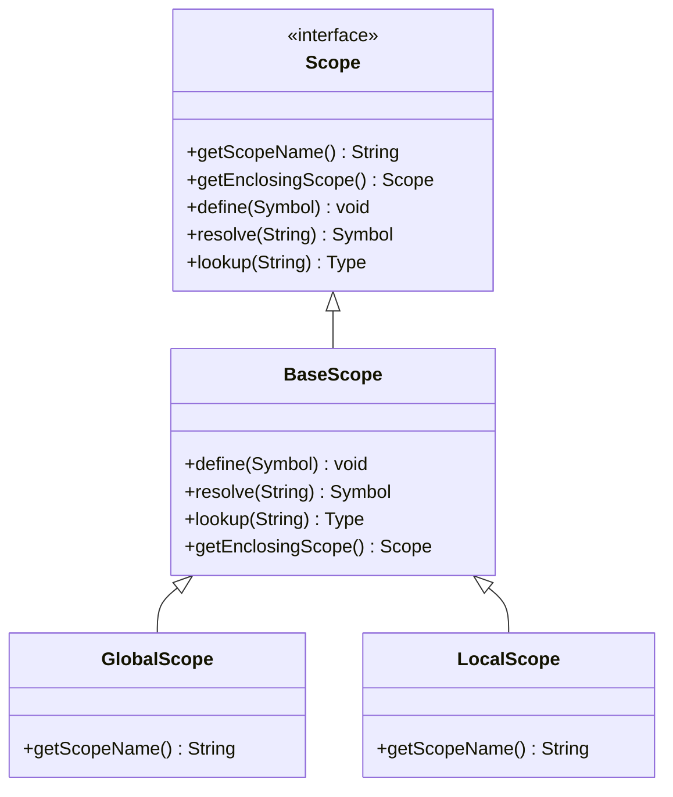
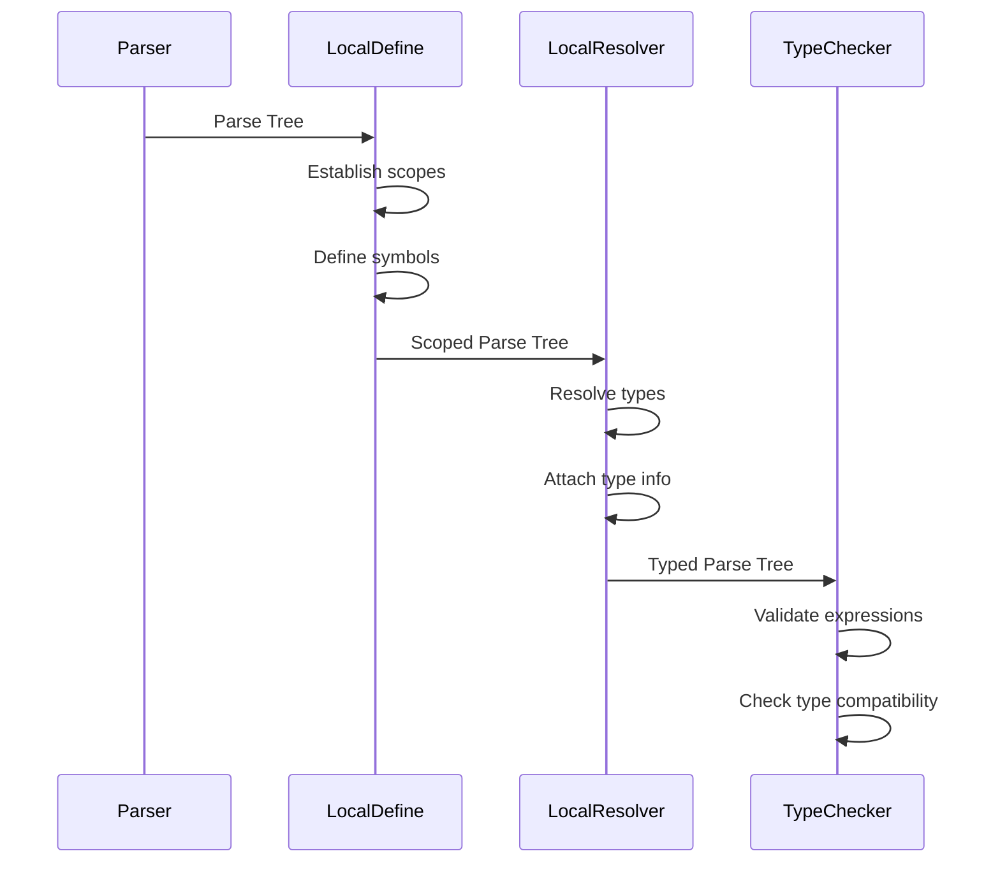
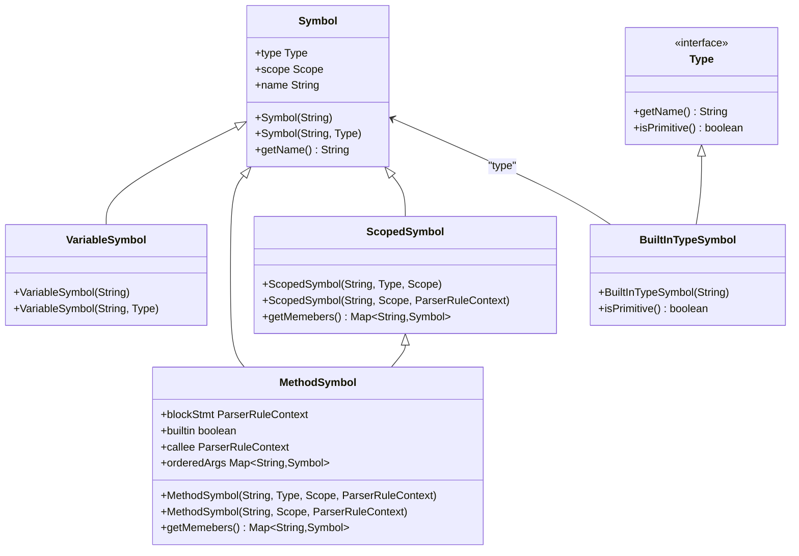
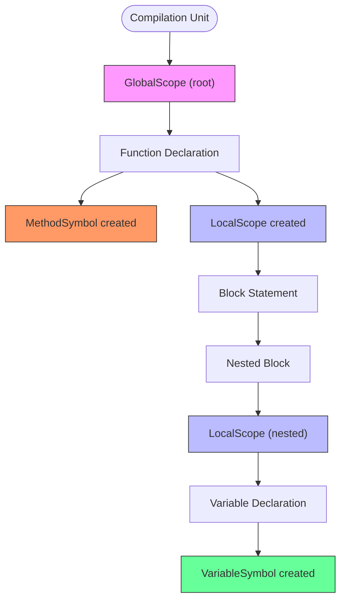

# Symbol Table and Type System Interactions

<cite>
**Referenced Files in This Document**   
- [LocalDefine.java](file://ep16/src/main/java/org/teachfx/antlr4/ep16/visitor/LocalDefine.java)
- [LocalResolver.java](file://ep16/src/main/java/org/teachfx/antlr4/ep16/visitor/LocalResolver.java)
- [TypeChecker.java](file://ep19/src/main/java/org/teachfx/antlr4/ep19/pass/TypeCheckVisitor.java)
- [GlobalScope.java](file://ep16/src/main/java/org/teachfx/antlr4/ep16/symtab/GlobalScope.java)
- [LocalScope.java](file://ep16/src/main/java/org/teachfx/antlr4/ep16/symtab/LocalScope.java)
- [Scope.java](file://ep16/src/main/java/org/teachfx/antlr4/ep16/symtab/Scope.java)
- [Symbol.java](file://ep16/src/main/java/org/teachfx/antlr4/ep16/symtab/Symbol.java)
- [VariableSymbol.java](file://ep16/src/main/java/org/teachfx/antlr4/ep16/symtab/VariableSymbol.java)
- [MethodSymbol.java](file://ep16/src/main/java/org/teachfx/antlr4/ep16/symtab/MethodSymbol.java)
- [Type.java](file://ep16/src/main/java/org/teachfx/antlr4/ep16/symtab/Type.java)
- [TypeTable.java](file://ep16/src/main/java/org/teachfx/antlr4/ep16/symtab/TypeTable.java)
- [BuiltInTypeSymbol.java](file://ep16/src/main/java/org/teachfx/antlr4/ep16/symtab/BuiltInTypeSymbol.java)
- [ScopedSymbol.java](file://ep16/src/main/java/org/teachfx/antlr4/ep16/symtab/ScopedSymbol.java)
</cite>

## Table of Contents
1. [Introduction](#introduction)
2. [Symbol Resolution and Declaration Processing](#symbol-resolution-and-declaration-processing)
3. [Type Checking and Expression Validation](#type-checking-and-expression-validation)
4. [Symbol and Type Relationships](#symbol-and-type-relationships)
5. [Scope Hierarchy and Name Resolution](#scope-hierarchy-and-name-resolution)
6. [Type Compatibility and Operator Resolution](#type-compatibility-and-operator-resolution)
7. [Type Information Propagation in AST](#type-information-propagation-in-ast)
8. [Conclusion](#conclusion)

## Introduction
This document details the interaction between symbol resolution and type checking systems in the compiler implementation. It explains how declarations are processed to populate symbol tables, how types are resolved and validated, and how scope hierarchies enable proper name resolution. The document covers the relationship between Type objects and Symbol implementations, including built-in type registration and type compatibility checks.

## Symbol Resolution and Declaration Processing

The symbol resolution system uses the `LocalDefine` visitor to establish scope boundaries and associate AST nodes with their respective scopes. During declaration processing, `LocalDefine` traverses the AST and creates appropriate scope instances for different program constructs.

When processing a function declaration, `LocalDefine` creates a `MethodSymbol` instance and defines it in the current scope. For block statements, it creates a `LocalScope` instance that inherits from the enclosing scope, establishing proper lexical scoping. Variable declarations are processed by creating `VariableSymbol` instances that are later populated with type information.



**Diagram sources**
- [Scope.java](file://ep16/src/main/java/org/teachfx/antlr4/ep16/symtab/Scope.java#L0-L16)
- [BaseScope.java](file://ep16/src/main/java/org/teachfx/antlr4/ep16/symtab/BaseScope.java)
- [GlobalScope.java](file://ep16/src/main/java/org/teachfx/antlr4/ep16/symtab/GlobalScope.java#L0-L15)
- [LocalScope.java](file://ep16/src/main/java/org/teachfx/antlr4/ep16/symtab/LocalScope.java#L0-L13)

**Section sources**
- [LocalDefine.java](file://ep16/src/main/java/org/teachfx/antlr4/ep16/visitor/LocalDefine.java#L0-L152)

## Type Checking and Expression Validation

The `LocalResolver` visitor performs type resolution by associating type information with AST nodes. It uses the `ParseTreeProperty<Type>` to store type information for each context, enabling subsequent type checking passes to validate expressions.

During variable declaration processing, `LocalResolver` looks up the type specified in the declaration and creates a `VariableSymbol` with that type. For function declarations, it resolves the return type and associates it with the `MethodSymbol`. The visitor also handles type resolution for literals, assigning appropriate built-in types to integer, floating-point, boolean, character, and string constants.



**Diagram sources**
- [LocalDefine.java](file://ep16/src/main/java/org/teachfx/antlr4/ep16/visitor/LocalDefine.java#L0-L152)
- [LocalResolver.java](file://ep16/src/main/java/org/teachfx/antlr4/ep16/visitor/LocalResolver.java#L0-L212)
- [TypeCheckVisitor.java](file://ep19/src/main/java/org/teachfx/antlr4/ep19/pass/TypeCheckVisitor.java)

**Section sources**
- [LocalResolver.java](file://ep16/src/main/java/org/teachfx/antlr4/ep16/visitor/LocalResolver.java#L0-L212)

## Symbol and Type Relationships

The symbol and type system establishes a clear relationship between `Symbol` implementations and `Type` objects. The `Symbol` class serves as the base for all symbol types and contains a reference to its associated `Type`. Built-in types are represented by `BuiltInTypeSymbol` instances, which implement the `Type` interface and are registered in the `TypeTable` class.

`VariableSymbol` and `MethodSymbol` extend `Symbol` and inherit its type association capabilities. `MethodSymbol` additionally maintains a map of ordered parameters, enabling proper function signature resolution. The `ScopedSymbol` base class provides member management functionality for symbols that can contain other symbols.



**Diagram sources**
- [Symbol.java](file://ep16/src/main/java/org/teachfx/antlr4/ep16/symtab/Symbol.java#L0-L38)
- [VariableSymbol.java](file://ep16/src/main/java/org/teachfx/antlr4/ep16/symtab/VariableSymbol.java#L0-L13)
- [MethodSymbol.java](file://ep16/src/main/java/org/teachfx/antlr4/ep16/symtab/MethodSymbol.java#L0-L31)
- [ScopedSymbol.java](file://ep16/src/main/java/org/teachfx/antlr4/ep16/symtab/ScopedSymbol.java)
- [Type.java](file://ep16/src/main/java/org/teachfx/antlr4/ep16/symtab/Type.java#L0-L7)
- [BuiltInTypeSymbol.java](file://ep16/src/main/java/org/teachfx/antlr4/ep16/symtab/BuiltInTypeSymbol.java#L0-L14)

**Section sources**
- [Symbol.java](file://ep16/src/main/java/org/teachfx/antlr4/ep16/symtab/Symbol.java#L0-L38)
- [VariableSymbol.java](file://ep16/src/main/java/org/teachfx/antlr4/ep16/symtab/VariableSymbol.java#L0-L13)
- [MethodSymbol.java](file://ep16/src/main/java/org/teachfx/antlr4/ep16/symtab/MethodSymbol.java#L0-L31)
- [BuiltInTypeSymbol.java](file://ep16/src/main/java/org/teachfx/antlr4/ep16/symtab/BuiltInTypeSymbol.java#L0-L14)
- [TypeTable.java](file://ep16/src/main/java/org/teachfx/antlr4/ep16/symtab/TypeTable.java#L0-L18)

## Scope Hierarchy and Name Resolution

The scope hierarchy system implements lexical scoping through a parent-child relationship between scope instances. The `GlobalScope` serves as the root scope, containing built-in functions and types. `LocalScope` instances are created for block statements and function bodies, inheriting from their enclosing scopes.

Name resolution follows the lexical scoping rules, searching for symbols in the current scope and progressively moving up the scope chain until the symbol is found or the global scope is reached. The `ScopedSymbol` class maintains the association between symbols and their defining scopes, enabling proper symbol resolution and preventing name collisions.



**Diagram sources**
- [GlobalScope.java](file://ep16/src/main/java/org/teachfx/antlr4/ep16/symtab/GlobalScope.java#L0-L15)
- [LocalScope.java](file://ep16/src/main/java/org/teachfx/antlr4/ep16/symtab/LocalScope.java#L0-L13)
- [Scope.java](file://ep16/src/main/java/org/teachfx/antlr4/ep16/symtab/Scope.java#L0-L16)
- [ScopedSymbol.java](file://ep16/src/main/java/org/teachfx/antlr4/ep16/symtab/ScopedSymbol.java)

**Section sources**
- [GlobalScope.java](file://ep16/src/main/java/org/teachfx/antlr4/ep16/symtab/GlobalScope.java#L0-L15)
- [LocalScope.java](file://ep16/src/main/java/org/teachfx/antlr4/ep16/symtab/LocalScope.java#L0-L13)
- [Scope.java](file://ep16/src/main/java/org/teachfx/antlr4/ep16/symtab/Scope.java#L0-L16)

## Type Compatibility and Operator Resolution

Type compatibility checks are performed during the type checking phase, where expressions are validated against their expected types. The system supports built-in type compatibility rules, such as integer and floating-point promotion, and boolean type validation for conditional expressions.

Operator resolution is handled by associating operators with their expected operand types and return types. The type checker validates that binary and unary operations are applied to compatible types, generating appropriate error messages when type mismatches occur. Built-in operators are pre-registered with their type signatures, enabling efficient operator resolution during compilation.

```mermaid
erDiagram
TYPE_TABLE ||--o{ BUILT_IN_TYPE : contains
SCOPE ||--o{ SYMBOL : contains
SYMBOL ||--o{ VARIABLE_SYMBOL : specializes
SYMBOL ||--o{ METHOD_SYMBOL : specializes
METHOD_SYMBOL ||--o{ PARAMETER : has
SCOPE ||--o{ LOCAL_SCOPE : contains
SCOPE ||--o{ GLOBAL_SCOPE : contains
SYMBOL }|--|| TYPE : has_type
TYPE_TABLE }|--|| TYPE : defines
class TYPE_TABLE {
INT Type
FLOAT Type
DOUBLE Type
CHAR Type
VOID Type
NULL Type
BOOLEAN Type
OBJECT Type
}
class BUILT_IN_TYPE {
name String
isPrimitive() boolean
}
class SYMBOL {
name String
type Type
scope Scope
}
class VARIABLE_SYMBOL {
name String
type Type
}
class METHOD_SYMBOL {
name String
type Type
orderedArgs Map~String,Symbol~
}
class SCOPE {
scopeName String
enclosingScope Scope
}
class LOCAL_SCOPE {
scopeName "Local"
}
class GLOBAL_SCOPE {
scopeName "gloabl"
}
```

**Diagram sources**
- [TypeTable.java](file://ep16/src/main/java/org/teachfx/antlr4/ep16/symtab/TypeTable.java#L0-L18)
- [BuiltInTypeSymbol.java](file://ep16/src/main/java/org/teachfx/antlr4/ep16/symtab/BuiltInTypeSymbol.java#L0-L14)
- [Symbol.java](file://ep16/src/main/java/org/teachfx/antlr4/ep16/symtab/Symbol.java#L0-L38)
- [VariableSymbol.java](file://ep16/src/main/java/org/teachfx/antlr4/ep16/symtab/VariableSymbol.java#L0-L13)
- [MethodSymbol.java](file://ep16/src/main/java/org/teachfx/antlr4/ep16/symtab/MethodSymbol.java#L0-L31)
- [LocalScope.java](file://ep16/src/main/java/org/teachfx/antlr4/ep16/symtab/LocalScope.java#L0-L13)
- [GlobalScope.java](file://ep16/src/main/java/org/teachfx/antlr4/ep16/symtab/GlobalScope.java#L0-L15)

**Section sources**
- [TypeTable.java](file://ep16/src/main/java/org/teachfx/antlr4/ep16/symtab/TypeTable.java#L0-L18)
- [LocalResolver.java](file://ep16/src/main/java/org/teachfx/antlr4/ep16/visitor/LocalResolver.java#L0-L212)

## Type Information Propagation in AST

Type information is attached to AST nodes through the `ParseTreeProperty<Type>` mechanism, which maps parser context objects to their resolved types. This allows type information to be propagated through the compilation process, enabling subsequent phases to access type information without re-resolving symbols.

During the `LocalResolver` pass, type information is collected from declarations and literals and stored in the parse tree property map. This information is then used by the `TypeChecker` to validate expressions, ensuring that operations are performed on compatible types and that function calls match their declared signatures.

The propagation system ensures that type information flows from declarations to uses, maintaining consistency throughout the program. For example, when a variable is declared with a specific type, that type information is attached to the declaration and later retrieved when the variable is used in expressions.

**Section sources**
- [LocalResolver.java](file://ep16/src/main/java/org/teachfx/antlr4/ep16/visitor/LocalResolver.java#L0-L212)
- [TypeCheckVisitor.java](file://ep19/src/main/java/org/teachfx/antlr4/ep19/pass/TypeCheckVisitor.java)

## Conclusion

The symbol table and type system interactions form a critical part of the compiler's semantic analysis phase. The `LocalDefine` visitor establishes scope boundaries and populates scopes with `VariableSymbol` and `MethodSymbol` instances during declaration processing. The `LocalResolver` visitor then resolves type information and attaches it to AST nodes, enabling subsequent type checking.

The relationship between `Type` objects and `Symbol` implementations is well-defined, with built-in types registered in `TypeTable` and associated with symbols through the type field. Scope hierarchies, implemented through `GlobalScope` and `LocalScope`, enable proper name resolution according to lexical scoping rules.

Type compatibility checks and operator resolution ensure that expressions are type-safe, while the propagation of type information through the AST enables comprehensive type checking throughout the compilation process. This integrated system provides a robust foundation for semantic analysis in the compiler implementation.