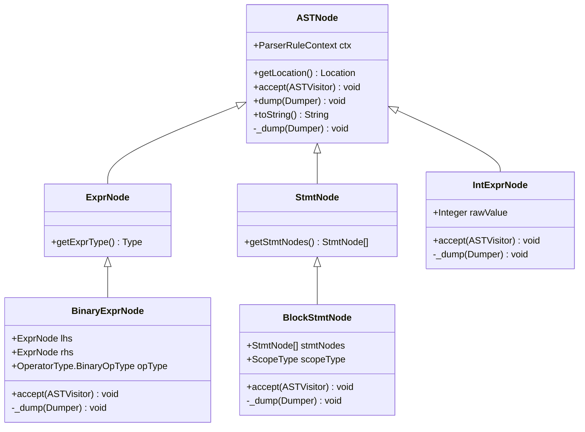
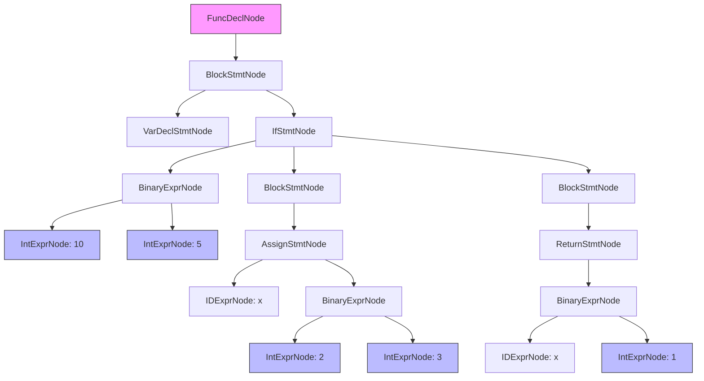

# Composite Pattern Implementation

<cite>
**Referenced Files in This Document**   
- [ASTNode.java](file://ep20/src/main/java/org/teachfx/antlr4/ep20/ast/ASTNode.java)
- [IntExprNode.java](file://ep20/src/main/java/org/teachfx/antlr4/ep20/ast/expr/IntExprNode.java)
- [BlockStmtNode.java](file://ep20/src/main/java/org/teachfx/antlr4/ep20/ast/stmt/BlockStmtNode.java)
- [BinaryExprNode.java](file://ep20/src/main/java/org/teachfx/antlr4/ep20/ast/expr/BinaryExprNode.java)
- [ExprNode.java](file://ep20/src/main/java/org/teachfx/antlr4/ep20/ast/expr/ExprNode.java)
- [StmtNode.java](file://ep20/src/main/java/org/teachfx/antlr4/ep20/ast/stmt/StmtNode.java)
</cite>

## Table of Contents
1. [Introduction](#introduction)
2. [Core Component Analysis](#core-component-analysis)
3. [Composite Pattern Implementation Details](#composite-pattern-implementation-details)
4. [Tree Traversal and Visitor Pattern Integration](#tree-traversal-and-visitor-pattern-integration)
5. [Sample AST Composition](#sample-ast-composition)
6. [Best Practices for Extending the Hierarchy](#best-practices-for-extending-the-hierarchy)
7. [Common Issues and Solutions](#common-issues-and-solutions)

## Introduction
The Composite pattern is implemented in the AST hierarchy to provide a uniform interface for both leaf and composite nodes, enabling recursive tree operations across the entire syntax tree. This design allows tree traversal algorithms to treat individual nodes and node collections uniformly, simplifying compiler construction tasks such as code generation, optimization, and analysis. The ASTNode class serves as the component interface, with leaf nodes (e.g., IntExprNode) and composite nodes (e.g., BlockStmtNode, BinaryExprNode) implementing the same interface methods.

## Core Component Analysis

The AST hierarchy is built around the ASTNode abstract class, which defines the common interface for all node types in the abstract syntax tree. This base class provides essential methods for location tracking, visitor pattern integration, and debugging output. Leaf nodes represent terminal elements of the syntax tree (such as literals and identifiers), while composite nodes contain references to child nodes and represent syntactic constructs (such as expressions and statements).

**Section sources**
- [ASTNode.java](file://ep20/src/main/java/org/teachfx/antlr4/ep20/ast/ASTNode.java#L8-L46)
- [IntExprNode.java](file://ep20/src/main/java/org/teachfx/antlr4/ep20/ast/expr/IntExprNode.java#L1-L27)
- [BlockStmtNode.java](file://ep20/src/main/java/org/teachfx/antlr4/ep20/ast/stmt/BlockStmtNode.java#L1-L47)

## Composite Pattern Implementation Details

### Component Interface Methods
The ASTNode class defines several key methods that are implemented consistently across all node types:

- **accept(ASTVisitor visitor)**: Enables the visitor pattern for tree traversal
- **getLocation()**: Returns source code location information for error reporting
- **getText()**: Retrieves the original source text represented by the node
- **dump(Dumper d)**: Supports debugging by printing node structure

Leaf nodes like IntExprNode implement these methods without maintaining child references, while composite nodes like BlockStmtNode and BinaryExprNode maintain references to their children and may process them during method execution.

### Leaf and Composite Node Differentiation
Leaf nodes such as IntExprNode extend appropriate intermediate classes (like LiteralNode) and store literal values without containing child nodes. Composite nodes like BlockStmtNode contain collections of child nodes (StmtNode objects) and implement methods to access and modify these children. BinaryExprNode represents binary operations with left and right operand expressions as its children.

**Diagram sources**
- [ASTNode.java](file://ep20/src/main/java/org/teachfx/antlr4/ep20/ast/ASTNode.java#L8-L46)
- [IntExprNode.java](file://ep20/src/main/java/org/teachfx/antlr4/ep20/ast/expr/IntExprNode.java#L1-L27)
- [BinaryExprNode.java](file://ep20/src/main/java/org/teachfx/antlr4/ep20/ast/expr/BinaryExprNode.java#L1-L96)
- [BlockStmtNode.java](file://ep20/src/main/java/org/teachfx/antlr4/ep20/ast/stmt/BlockStmtNode.java#L1-L47)

**Section sources**
- [ASTNode.java](file://ep20/src/main/java/org/teachfx/antlr4/ep20/ast/ASTNode.java#L8-L46)
- [IntExprNode.java](file://ep20/src/main/java/org/teachfx/antlr4/ep20/ast/expr/IntExprNode.java#L1-L27)
- [BinaryExprNode.java](file://ep20/src/main/java/org/teachfx/antlr4/ep20/ast/expr/BinaryExprNode.java#L1-L96)
- [BlockStmtNode.java](file://ep20/src/main/java/org/teachfx/antlr4/ep20/ast/stmt/BlockStmtNode.java#L1-L47)

## Tree Traversal and Visitor Pattern Integration

The accept() method in ASTNode enables the visitor pattern, allowing algorithms to be separated from the object structure. When a visitor traverses the tree, it can perform operations on nodes without needing to know their specific types. This approach simplifies the addition of new operations on the AST without modifying the node classes.

For example, an evaluation visitor can traverse a BinaryExprNode and recursively evaluate its left and right operands before applying the operation. Similarly, a code generation visitor can traverse a BlockStmtNode and generate code for each statement in sequence. The uniform interface provided by the Composite pattern ensures that the visitor can process both individual statements and blocks of statements using the same method calls.

**Section sources**
- [ASTNode.java](file://ep20/src/main/java/org/teachfx/antlr4/ep20/ast/ASTNode.java#L8-L46)
- [BinaryExprNode.java](file://ep20/src/main/java/org/teachfx/antlr4/ep20/ast/expr/BinaryExprNode.java#L1-L96)
- [BlockStmtNode.java](file://ep20/src/main/java/org/teachfx/antlr4/ep20/ast/stmt/BlockStmtNode.java#L1-L47)

## Sample AST Composition

The following diagram illustrates the composition of a sample Cymbol function with nested expressions and statements:

**Diagram sources**
- [ASTNode.java](file://ep20/src/main/java/org/teachfx/antlr4/ep20/ast/ASTNode.java#L8-L46)
- [IntExprNode.java](file://ep20/src/main/java/org/teachfx/antlr4/ep20/ast/expr/IntExprNode.java#L1-L27)
- [BinaryExprNode.java](file://ep20/src/main/java/org/teachfx/antlr4/ep20/ast/expr/BinaryExprNode.java#L1-L96)
- [BlockStmtNode.java](file://ep20/src/main/java/org/teachfx/antlr4/ep20/ast/stmt/BlockStmtNode.java#L1-L47)
- [StmtNode.java](file://ep20/src/main/java/org/teachfx/antlr4/ep20/ast/stmt/StmtNode.java#L1-L15)

## Best Practices for Extending the Hierarchy

When extending the composite hierarchy with new node types, follow these best practices:

1. Extend the appropriate base class (ExprNode for expressions, StmtNode for statements)
2. Implement the accept() method to enable visitor pattern integration
3. Override the _dump() method for debugging support
4. Maintain consistent field naming and access patterns
5. Ensure proper type safety through generics where applicable
6. Provide static factory methods for common node creation patterns

New node types should be designed to fit seamlessly into the existing hierarchy, maintaining the uniform interface that makes the Composite pattern effective.

**Section sources**
- [ASTNode.java](file://ep20/src/main/java/org/teachfx/antlr4/ep20/ast/ASTNode.java#L8-L46)
- [BinaryExprNode.java](file://ep20/src/main/java/org/teachfx/antlr4/ep20/ast/expr/BinaryExprNode.java#L1-L96)

## Common Issues and Solutions

### Determining Node Type at Runtime
A common issue when working with the Composite pattern is determining the specific type of a node at runtime. This can be addressed through:
- Using the visitor pattern to handle type-specific operations
- Implementing type query methods in the base class
- Using instanceof checks when necessary (though this breaks encapsulation)

### Memory Management
Composite nodes that maintain references to many children can create memory pressure. Solutions include:
- Using lazy initialization for child collections
- Implementing proper garbage collection patterns
- Optimizing data structures for child storage

### Performance Optimization
For large ASTs, traversal performance can become an issue. Optimizations include:
- Caching frequently accessed properties
- Implementing efficient iteration patterns
- Using batch operations when modifying multiple nodes

**Section sources**
- [ASTNode.java](file://ep20/src/main/java/org/teachfx/antlr4/ep20/ast/ASTNode.java#L8-L46)
- [BinaryExprNode.java](file://ep20/src/main/java/org/teachfx/antlr4/ep20/ast/expr/BinaryExprNode.java#L1-L96)
- [BlockStmtNode.java](file://ep20/src/main/java/org/teachfx/antlr4/ep20/ast/stmt/BlockStmtNode.java#L1-L47)