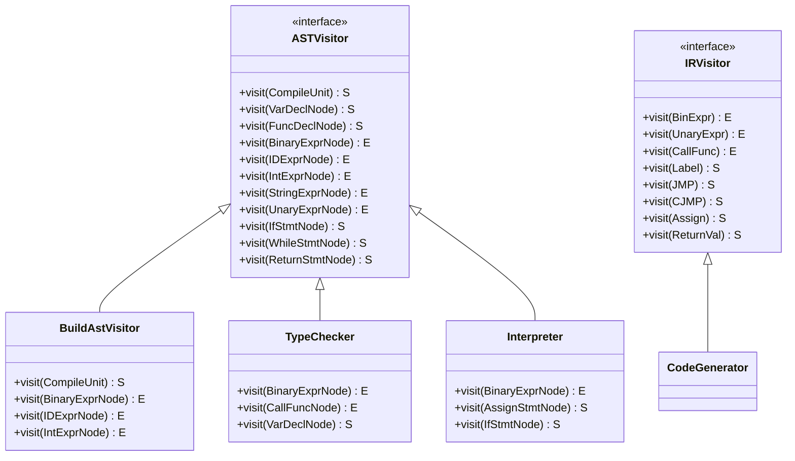
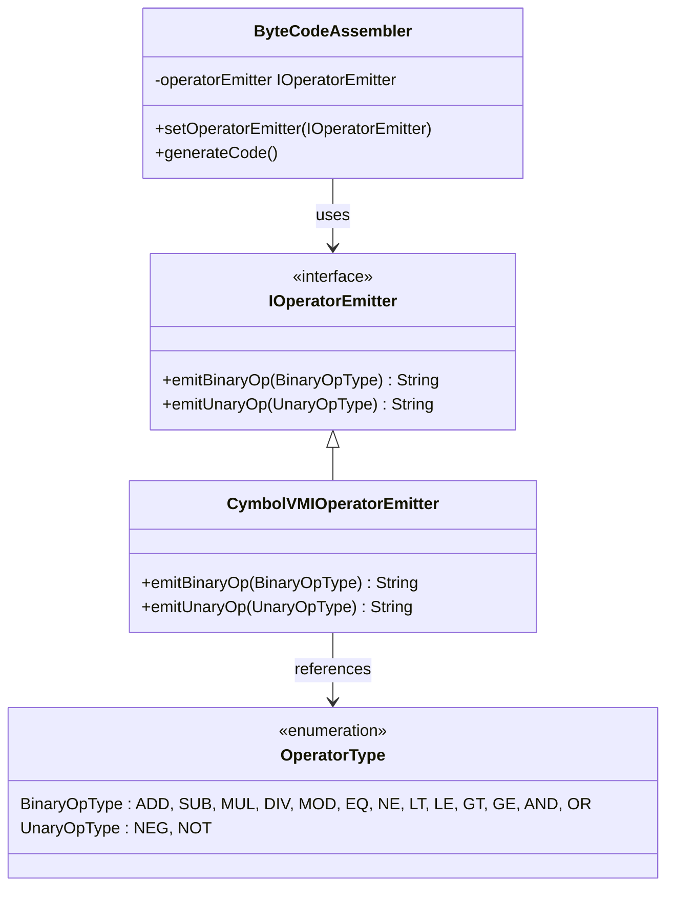
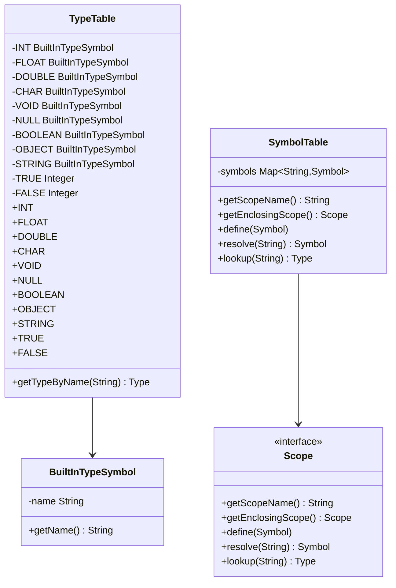
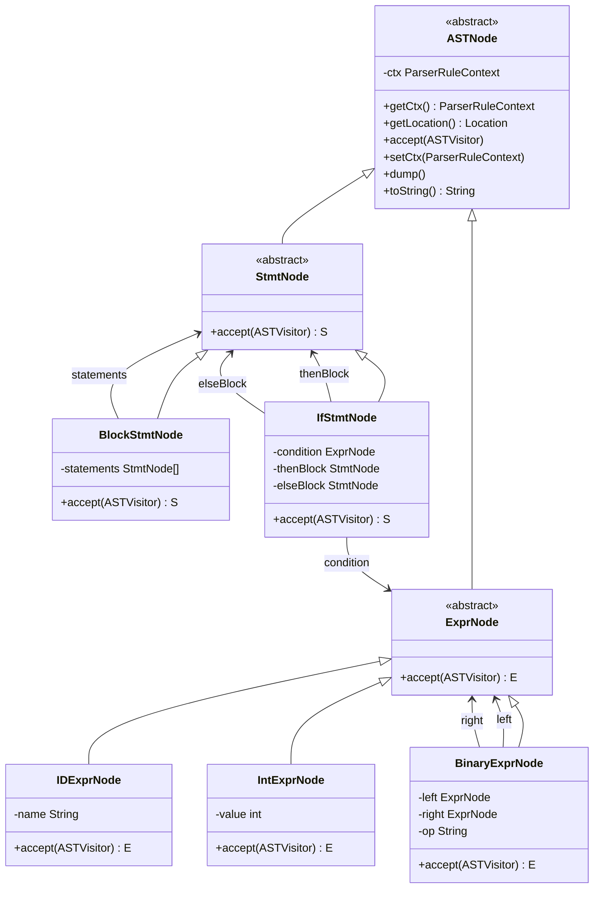

# Design Patterns Implementation

<cite>
**Referenced Files in This Document**   
- [ASTVisitor.java](file://ep11/src/main/java/org/teachfx/antlr4/ASTVisitor.java)
- [ASTVisitor.java](file://ep13/src/main/java/org/teachfx/antlr4/ASTVisitor.java)
- [ASTVisitor.java](file://ep12/src/main/java/org/teachfx/antlr4/ep12/visitor/ASTVisitor.java)
- [ASTVisitor.java](file://ep20/src/main/java/org/teachfx/antlr4/ep20/ast/ASTVisitor.java)
- [IRVisitor.java](file://ep20/src/main/java/org/teachfx/antlr4/ep20/ir/IRVisitor.java)
- [IOperatorEmitter.java](file://ep20/src/main/java/org/teachfx/antlr4/ep20/pass/codegen/IOperatorEmitter.java)
- [CymbolVMIOperatorEmitter.java](file://ep20/src/main/java/org/teachfx/antlr4/ep20/pass/codegen/CymbolVMIOperatorEmitter.java)
- [TypeTable.java](file://ep16/src/main/java/org/teachfx/antlr4/ep16/symtab/TypeTable.java)
- [SymbolTable.java](file://ep14/src/main/java/org/teachfx/antlr4/ep14/symtab/SymbolTable.java)
- [ASTNode.java](file://ep20/src/main/java/org/teachfx/antlr4/ep20/ast/ASTNode.java)
</cite>

## Table of Contents
1. [Introduction](#introduction)
2. [Visitor Pattern Implementation](#visitor-pattern-implementation)
3. [Strategy Pattern Implementation](#strategy-pattern-implementation)
4. [Singleton Pattern Implementation](#singleton-pattern-implementation)
5. [Composite Pattern Implementation](#composite-pattern-implementation)
6. [Pattern Benefits and Trade-offs](#pattern-benefits-and-trade-offs)
7. [Conclusion](#conclusion)

## Introduction
This document details the design patterns implemented in the compiler architecture across various episodes of the ANTLR4-based programming language implementation project. The analysis focuses on four key design patterns: Visitor, Strategy, Singleton, and Composite, which are fundamental to the compiler's structure and functionality. These patterns enable clean separation of concerns, extensibility, and maintainability in the compiler's various phases including parsing, semantic analysis, and code generation.

## Visitor Pattern Implementation

The Visitor pattern is implemented through the `ASTVisitor` and `IRVisitor` interfaces to enable separation of algorithms from the object structure they operate on. This pattern allows adding new operations to existing object structures without modifying those structures, which is particularly valuable in compiler design where multiple traversals (semantic analysis, code generation, optimization) need to be performed on the same AST and IR structures.

**Diagram sources**
- [ASTVisitor.java](file://ep20/src/main/java/org/teachfx/antlr4/ep20/ast/ASTVisitor.java)
- [IRVisitor.java](file://ep20/src/main/java/org/teachfx/antlr4/ep20/ir/IRVisitor.java)

**Section sources**
- [ASTVisitor.java](file://ep20/src/main/java/org/teachfx/antlr4/ep20/ast/ASTVisitor.java#L11-L122)
- [IRVisitor.java](file://ep20/src/main/java/org/teachfx/antlr4/ep20/ir/IRVisitor.java#L10-L40)

The `ASTVisitor` interface defines visit methods for each node type in the abstract syntax tree, allowing concrete visitor implementations to perform operations on specific node types. This enables multiple traversals of the AST for different purposes:

- **BuildAstVisitor**: Constructs the AST from parser output
- **TypeChecker**: Performs semantic analysis and type checking
- **Interpreter**: Executes the program logic directly
- **CymbolIRBuilder**: Transforms AST to intermediate representation

The dual-type parameter `<S,E>` in the visitor interface distinguishes between statement nodes (returning type `S`) and expression nodes (returning type `E`), providing type safety during traversal. Default implementations of the `visit()` method in the `ASTNode` class delegate to the appropriate visitor method, enabling the double-dispatch mechanism that is characteristic of the Visitor pattern.

## Strategy Pattern Implementation

The Strategy pattern is implemented through the `IOperatorEmitter` interface and its concrete implementations to provide pluggable code generation backends. This pattern enables the compiler to target different virtual machines by encapsulating algorithmic variations (instruction set mappings) behind a common interface.

**Diagram sources**
- [IOperatorEmitter.java](file://ep20/src/main/java/org/teachfx/antlr4/ep20/pass/codegen/IOperatorEmitter.java)
- [CymbolVMIOperatorEmitter.java](file://ep20/src/main/java/org/teachfx/antlr4/ep20/pass/codegen/CymbolVMIOperatorEmitter.java)

**Section sources**
- [IOperatorEmitter.java](file://ep20/src/main/java/org/teachfx/antlr4/ep20/pass/codegen/IOperatorEmitter.java#L4-L8)
- [CymbolVMIOperatorEmitter.java](file://ep20/src/main/java/org/teachfx/antlr4/ep20/pass/codegen/CymbolVMIOperatorEmitter.java#L4-L65)

The `IOperatorEmitter` interface defines the strategy contract with methods for emitting binary and unary operations. The `CymbolVMIOperatorEmitter` class provides a concrete implementation that maps high-level operations to StackVM bytecode instructions:

- Arithmetic operations (ADD, SUB, MUL, DIV) map to iadd, isub, imult, idiv
- Comparison operations (EQ, NE, LT, LE, GT, GE) map to ieq, ine, ilt, ile, igt, ige
- Logical operations (AND, OR) map to iand, ior
- Unary operations (NEG, NOT) map to ineg, inot

This design allows the compiler to easily support additional backends by implementing the same interface for different target architectures. The `ByteCodeAssembler` uses dependency injection to accept different emitter implementations, making the code generation process highly flexible and extensible.

## Singleton Pattern Implementation

The Singleton pattern is applied to `TypeTable` and `SymbolTable` classes to provide global access points to type and symbol information throughout the compilation process. This ensures that type definitions and symbol resolutions are consistent across all compilation phases.

**Diagram sources**
- [TypeTable.java](file://ep20/src/main/java/org/teachfx/antlr4/ep20/symtab/type/TypeTable.java)
- [SymbolTable.java](file://ep14/src/main/java/org/teachfx/antlr4/ep14/symtab/SymbolTable.java)

**Section sources**
- [TypeTable.java](file://ep20/src/main/java/org/teachfx/antlr4/ep20/symtab/type/TypeTable.java#L2-L19)
- [SymbolTable.java](file://ep14/src/main/java/org/teachfx/antlr4/ep14/symtab/SymbolTable.java#L5-L48)

The `TypeTable` class maintains static references to built-in types (int, float, bool, void, etc.) and boolean constants, providing a centralized repository for type information. This eliminates the need to instantiate type objects repeatedly and ensures type identity throughout the compilation process. The `getTypeByName()` method allows dynamic type resolution by name.

The `SymbolTable` implements the Scope interface and maintains a map of symbols (variables, functions, types) by name. It serves as the global scope in the compilation process, allowing all phases to register and resolve symbols consistently. The singleton nature of these tables ensures that symbol and type information remains coherent across different compilation stages.

## Composite Pattern Implementation

The Composite pattern is implemented in the AST node hierarchy where `ASTNode` serves as the component interface for both leaf and composite nodes. This pattern enables uniform treatment of individual objects and compositions of objects, which is essential for tree traversal operations in compiler design.

**Diagram sources**
- [ASTNode.java](file://ep20/src/main/java/org/teachfx/antlr4/ep20/ast/ASTNode.java)
- [ASTVisitor.java](file://ep20/src/main/java/org/teachfx/antlr4/ep20/ast/ASTVisitor.java)

**Section sources**
- [ASTNode.java](file://ep20/src/main/java/org/teachfx/antlr4/ep20/ast/ASTNode.java#L8-L46)
- [ASTVisitor.java](file://ep20/src/main/java/org/teachfx/antlr4/ep20/ast/ASTVisitor.java#L11-L122)

The `ASTNode` abstract class defines the common interface for all nodes in the abstract syntax tree. Concrete node classes inherit from this base class and implement the `accept()` method to support the Visitor pattern. The hierarchy distinguishes between expression nodes (returning values) and statement nodes (performing actions), with appropriate type parameters in the visitor interface.

Composite nodes like `BlockStmtNode` and `BinaryExprNode` contain references to child nodes, forming a tree structure. Leaf nodes like `IDExprNode` and `IntExprNode` contain literal values or identifiers without child nodes. This uniform interface allows tree traversal algorithms to treat all nodes consistently, regardless of whether they are composites or leaves.

## Pattern Benefits and Trade-offs

### Visitor Pattern
**Benefits:**
- Enables adding new operations without modifying node classes
- Centralizes related operations in visitor classes
- Makes it easy to add new visitor implementations for different purposes
- Provides type safety through generic parameters

**Trade-offs:**
- Adding new node types requires updating all visitor interfaces
- Can lead to large visitor classes with many methods
- Breaks encapsulation by requiring public access to node internals

### Strategy Pattern
**Benefits:**
- Enables runtime selection of code generation backends
- Simplifies adding support for new target architectures
- Promotes code reuse through common interface
- Facilitates testing of different code generation strategies

**Trade-offs:**
- Requires careful interface design to accommodate different backends
- May lead to conditional logic within strategy implementations
- Interface must anticipate all required operations

### Singleton Pattern
**Benefits:**
- Ensures global access to type and symbol information
- Prevents inconsistent type definitions
- Reduces memory usage by sharing type objects
- Simplifies symbol resolution across compilation phases

**Trade-offs:**
- Introduces global state that can complicate testing
- Creates tight coupling between components
- May hinder parallel compilation due to shared state
- Difficult to extend for multiple symbol tables

### Composite Pattern
**Benefits:**
- Provides uniform interface for individual and composite objects
- Simplifies client code that traverses the AST
- Makes it easy to add new node types
- Supports recursive tree processing naturally

**Trade-offs:**
- May force uniform interface on objects with different responsibilities
- Can make it difficult to restrict component types in composites
- Type safety requires careful generic design
- Memory overhead from uniform interface

## Conclusion
The compiler architecture effectively leverages design patterns to achieve separation of concerns, extensibility, and maintainability. The Visitor pattern enables multiple traversals of the AST and IR without modifying node classes, supporting semantic analysis, interpretation, and code generation. The Strategy pattern provides flexibility in code generation by allowing different backends to be plugged in through a common interface. The Singleton pattern ensures consistent access to type and symbol information across compilation phases. The Composite pattern enables uniform treatment of the hierarchical AST structure, simplifying tree traversal operations.

These patterns work together to create a robust compiler architecture that can be extended with new language features, analysis passes, and target backends while maintaining code quality and reducing coupling between components. The implementation demonstrates how classic design patterns can be effectively applied to solve common problems in compiler construction.