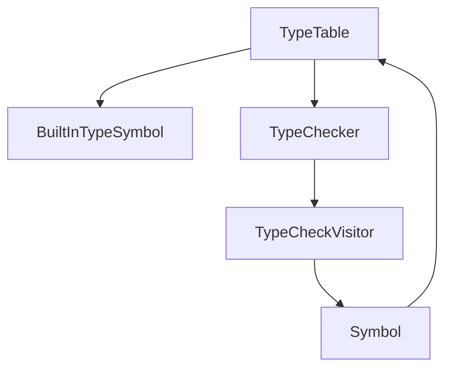
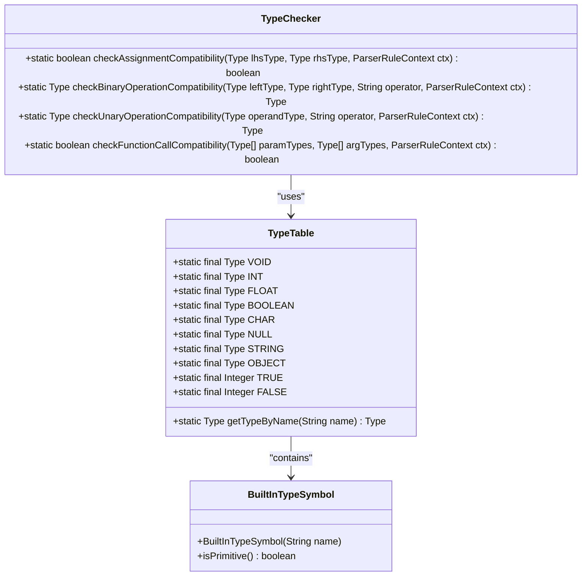
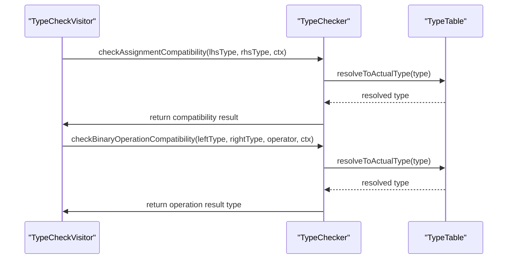
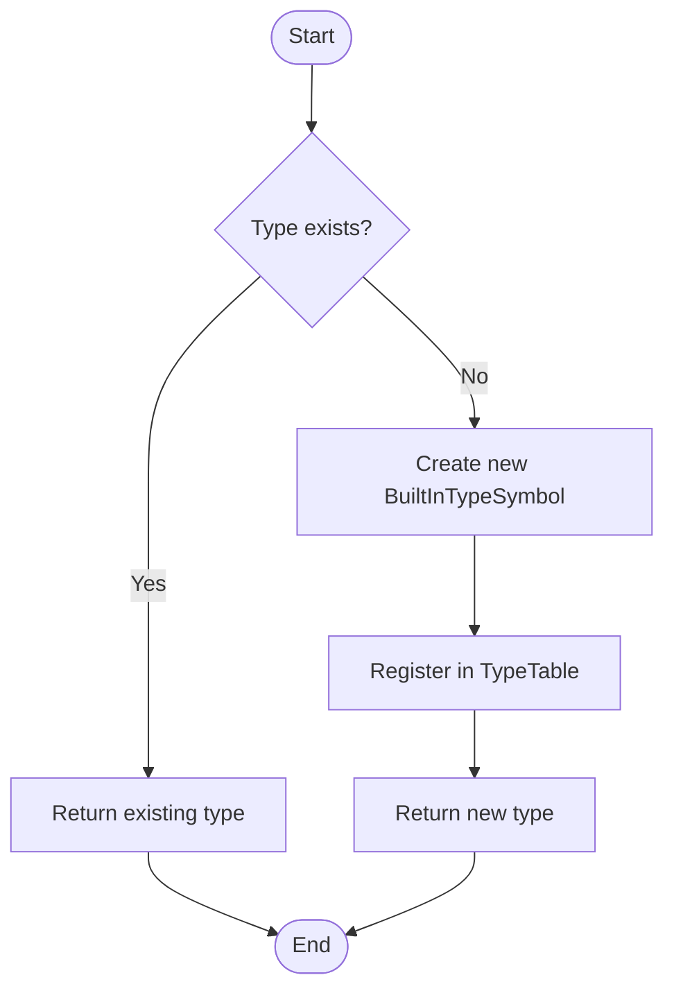
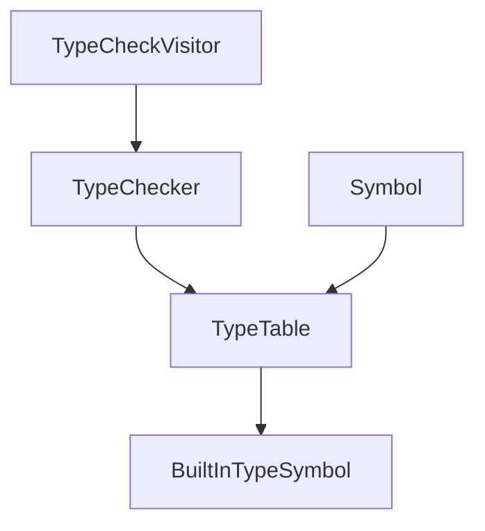

# Singleton Pattern Implementation

<cite>
**Referenced Files in This Document**   
- [TypeTable.java](file://ep19/src/main/java/org/teachfx/antlr4/ep19/symtab/TypeTable.java)
- [BuiltInTypeSymbol.java](file://ep19/src/main/java/org/teachfx/antlr4/ep19/symtab/symbol/BuiltInTypeSymbol.java)
- [TypeChecker.java](file://ep19/src/main/java/org/teachfx/antlr4/ep19/symtab/TypeChecker.java)
- [TypeCheckVisitor.java](file://ep19/src/main/java/org/teachfx/antlr4/ep19/pass/TypeCheckVisitor.java)
- [Symbol.java](file://ep19/src/main/java/org/teachfx/antlr4/ep19/symtab/symbol/Symbol.java)
</cite>

## Table of Contents
1. [Introduction](#introduction)
2. [Core Components](#core-components)
3. [Architecture Overview](#architecture-overview)
4. [Detailed Component Analysis](#detailed-component-analysis)
5. [Dependency Analysis](#dependency-analysis)
6. [Performance Considerations](#performance-considerations)
7. [Troubleshooting Guide](#troubleshooting-guide)
8. [Conclusion](#conclusion)

## Introduction
The Singleton pattern implementation in the compiler's global state management provides a centralized access point for built-in types and type registration across compilation phases. This document details how the TypeTable class ensures type consistency throughout the compilation process by maintaining a single instance of type definitions. The implementation guarantees that all compiler passes, such as the TypeChecker, can reliably access the same type information, preventing inconsistencies and ensuring uniform type resolution. The pattern also addresses thread-safety considerations and initialization processes critical for maintaining compiler integrity during concurrent operations.

## Core Components
The core components of the Singleton pattern implementation include the TypeTable class, which serves as the central repository for built-in types, and the BuiltInTypeSymbol class, which represents individual type definitions. These components work together to provide a consistent and accessible type system across the compiler. The TypeTable exposes static final instances of common types such as INT, FLOAT, BOOLEAN, and STRING, ensuring that these types are available throughout the compilation process without requiring instantiation. Additionally, the TypeTable provides utility methods like getTypeByName for dynamic type resolution based on string identifiers, facilitating flexible type management.

**Section sources**
- [TypeTable.java](file://ep19/src/main/java/org/teachfx/antlr4/ep19/symtab/TypeTable.java#L4-L32)
- [BuiltInTypeSymbol.java](file://ep19/src/main/java/org/teachfx/antlr4/ep19/symtab/symbol/BuiltInTypeSymbol.java#L4-L15)

## Architecture Overview
The architecture of the Singleton pattern implementation revolves around the TypeTable class, which maintains static references to built-in types. This design ensures that all parts of the compiler can access the same type definitions, promoting consistency and reducing redundancy. The TypeTable collaborates with other components such as the TypeChecker and TypeCheckVisitor to validate type compatibility during compilation. By providing a single point of access to type information, the architecture simplifies type resolution and enhances the reliability of the compilation process.

**Diagram sources **
- [TypeTable.java](file://ep19/src/main/java/org/teachfx/antlr4/ep19/symtab/TypeTable.java#L4-L32)
- [TypeChecker.java](file://ep19/src/main/java/org/teachfx/antlr4/ep19/symtab/TypeChecker.java#L11-L316)

## Detailed Component Analysis

### TypeTable Analysis
The TypeTable class implements the Singleton pattern by defining static final instances of built-in types, ensuring that these types are globally accessible and consistent across the compiler. Each built-in type is represented as a static field, such as INT, FLOAT, and BOOLEAN, initialized with corresponding BuiltInTypeSymbol instances. This approach eliminates the need for multiple instances of the same type, reducing memory overhead and ensuring type uniformity. The TypeTable also includes a getTypeByName method that allows dynamic resolution of types based on their names, enhancing flexibility in type management.

#### For Object-Oriented Components:

**Diagram sources **
- [TypeTable.java](file://ep19/src/main/java/org/teachfx/antlr4/ep19/symtab/TypeTable.java#L4-L32)
- [BuiltInTypeSymbol.java](file://ep19/src/main/java/org/teachfx/antlr4/ep19/symtab/symbol/BuiltInTypeSymbol.java#L4-L15)

### Type Resolution Process
The type resolution process involves multiple compiler passes accessing the global TypeTable to resolve type information. For example, the TypeCheckVisitor uses the TypeTable to verify type compatibility during expression evaluation. When encountering a variable declaration, the TypeCheckVisitor retrieves the corresponding type from the TypeTable and checks its compatibility with the assigned value. Similarly, during function calls, the TypeChecker validates parameter types against the expected types defined in the TypeTable, ensuring that all type references are consistent and valid.

#### For API/Service Components:

**Diagram sources **
- [TypeCheckVisitor.java](file://ep19/src/main/java/org/teachfx/antlr4/ep19/pass/TypeCheckVisitor.java#L0-L627)
- [TypeChecker.java](file://ep19/src/main/java/org/teachfx/antlr4/ep19/symtab/TypeChecker.java#L11-L316)

### Configuration and Extension
Configuring and extending the TypeTable involves registering custom types through the getTypeByName method. Developers can add new type definitions by modifying the switch statement within this method to include additional cases for custom type names. This approach allows for seamless integration of user-defined types into the existing type system without altering the core Singleton implementation. However, care must be taken to avoid initialization order dependencies, as adding types after the TypeTable has been accessed may lead to inconsistent behavior.

#### For Complex Logic Components:

**Diagram sources **
- [TypeTable.java](file://ep19/src/main/java/org/teachfx/antlr4/ep19/symtab/TypeTable.java#L20-L32)
- [BuiltInTypeSymbol.java](file://ep19/src/main/java/org/teachfx/antlr4/ep19/symtab/symbol/BuiltInTypeSymbol.java#L4-L15)

**Section sources**
- [TypeTable.java](file://ep19/src/main/java/org/teachfx/antlr4/ep19/symtab/TypeTable.java#L4-L32)
- [TypeCheckVisitor.java](file://ep19/src/main/java/org/teachfx/antlr4/ep19/pass/TypeCheckVisitor.java#L0-L627)

## Dependency Analysis
The dependency analysis reveals that the TypeTable is a central component with dependencies on the BuiltInTypeSymbol class for type representation and the TypeChecker for type validation. The TypeChecker, in turn, depends on the TypeTable for resolving type information during compatibility checks. This interdependence ensures that all type-related operations are coordinated through a single source of truth, minimizing the risk of type inconsistencies. The Symbol class also interacts with the TypeTable to retrieve type information for individual symbols, further reinforcing the Singleton pattern's role in maintaining global type consistency.

**Diagram sources **
- [TypeTable.java](file://ep19/src/main/java/org/teachfx/antlr4/ep19/symtab/TypeTable.java#L4-L32)
- [TypeChecker.java](file://ep19/src/main/java/org/teachfx/antlr4/ep19/symtab/TypeChecker.java#L11-L316)
- [Symbol.java](file://ep19/src/main/java/org/teachfx/antlr4/ep19/symtab/symbol/Symbol.java#L3-L3)

**Section sources**
- [TypeTable.java](file://ep19/src/main/java/org/teachfx/antlr4/ep19/symtab/TypeTable.java#L4-L32)
- [TypeChecker.java](file://ep19/src/main/java/org/teachfx/antlr4/ep19/symtab/TypeChecker.java#L11-L316)
- [Symbol.java](file://ep19/src/main/java/org/teachfx/antlr4/ep19/symtab/symbol/Symbol.java#L3-L3)

## Performance Considerations
The Singleton pattern implementation offers performance benefits by eliminating redundant type definitions and ensuring efficient type resolution. Since the TypeTable maintains static references to built-in types, there is no overhead associated with instantiating type objects during compilation. This design reduces memory usage and improves access speed, as type information can be retrieved directly from static fields. However, the reliance on static initialization may introduce initialization order dependencies, which could impact startup performance if not managed carefully.

## Troubleshooting Guide
Common issues with the Singleton pattern implementation include initialization order dependencies and type resolution failures. To address initialization order dependencies, ensure that all type definitions are registered before the TypeTable is accessed by other components. For type resolution failures, verify that the requested type name matches the case-sensitive identifiers defined in the TypeTable. Additionally, check that the TypeTable's getTypeByName method includes a case for the requested type, as missing cases will result in null returns and subsequent type resolution errors.

**Section sources**
- [TypeTable.java](file://ep19/src/main/java/org/teachfx/antlr4/ep19/symtab/TypeTable.java#L4-L32)
- [TypeChecker.java](file://ep19/src/main/java/org/teachfx/antlr4/ep19/symtab/TypeChecker.java#L11-L316)

## Conclusion
The Singleton pattern implementation in the compiler's global state management effectively provides a single point of access to built-in types and type registration. By ensuring type consistency across compilation phases, this approach enhances the reliability and efficiency of the compilation process. The TypeTable's design promotes maintainability and extensibility, allowing for easy integration of custom types while minimizing redundancy. Despite potential challenges such as hidden dependencies and testing difficulties, the benefits of centralized type management outweigh the drawbacks, making the Singleton pattern a suitable choice for managing shared compiler state.