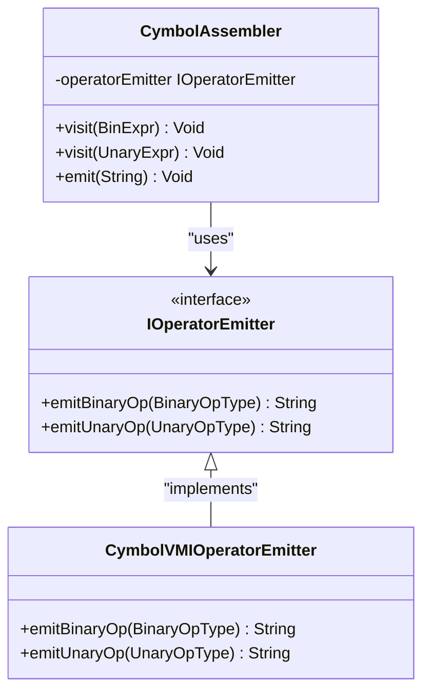
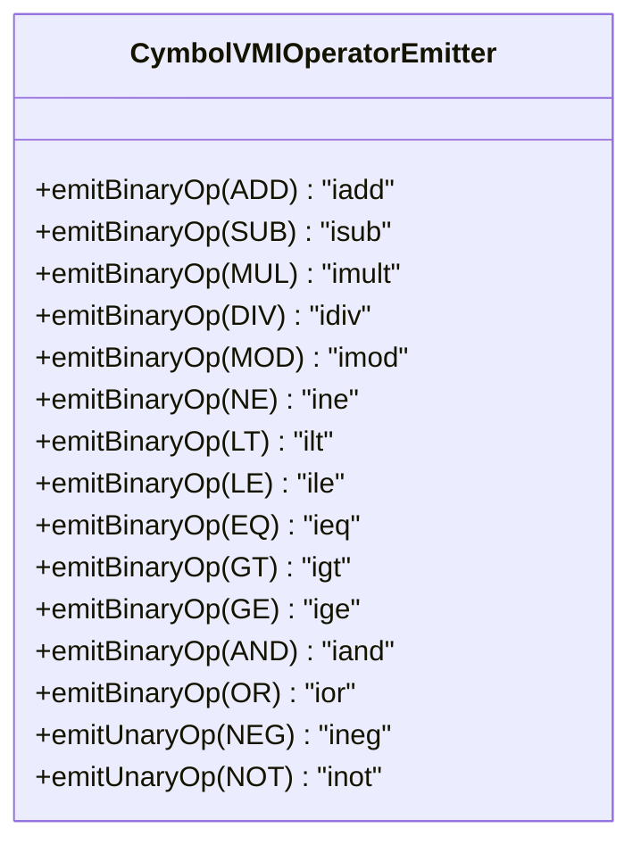
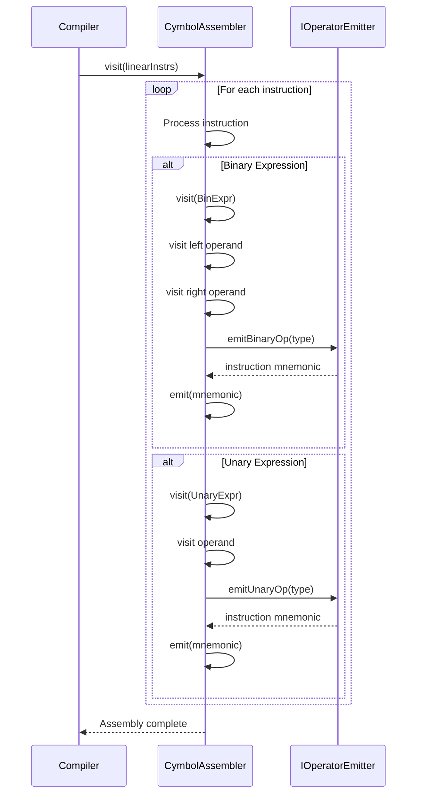

# Strategy Pattern Implementation

<cite>
**Referenced Files in This Document**   
- [IOperatorEmitter.java](file://ep20/src/main/java/org/teachfx/antlr4/ep20/pass/codegen/IOperatorEmitter.java)
- [CymbolAssembler.java](file://ep20/src/main/java/org/teachfx/antlr4/ep20/pass/codegen/CymbolAssembler.java)
- [CymbolVMIOperatorEmitter.java](file://ep20/src/main/java/org/teachfx/antlr4/ep20/pass/codegen/CymbolVMIOperatorEmitter.java)
- [OperatorType.java](file://ep20/src/main/java/org/teachfx/antlr4/ep20/symtab/type/OperatorType.java)
</cite>

## Table of Contents
1. [Introduction](#introduction)
2. [Strategy Pattern Overview](#strategy-pattern-overview)
3. [Core Components](#core-components)
4. [Contract Between CymbolAssembler and IOperatorEmitter](#contract-between-cymbolassembler-and-ioperatoremitter)
5. [Concrete Implementation Example](#concrete-implementation-example)
6. [Benefits of the Strategy Pattern](#benefits-of-the-strategy-pattern)
7. [Common Issues and Troubleshooting](#common-issues-and-troubleshooting)
8. [Sequence Diagram](#sequence-diagram)

## Introduction
The Strategy pattern is implemented in the code generation phase to enable pluggable backends for different virtual machines. This design allows the compiler to target various VM architectures without modifying the core assembly logic. The pattern is realized through the `IOperatorEmitter` interface, which defines a contract for instruction emission that can be implemented by different backend-specific emitters.

## Strategy Pattern Overview
The Strategy pattern enables selecting algorithms at runtime by encapsulating them behind a common interface. In this implementation, the pattern decouples the code generation logic in `CymbolAssembler` from the specific instruction sets of target virtual machines. This separation allows the compiler to support multiple backends through interchangeable emitter implementations.



**Diagram sources**
- [IOperatorEmitter.java](file://ep20/src/main/java/org/teachfx/antlr4/ep20/pass/codegen/IOperatorEmitter.java)
- [CymbolAssembler.java](file://ep20/src/main/java/org/teachfx/antlr4/ep20/pass/codegen/CymbolAssembler.java)
- [CymbolVMIOperatorEmitter.java](file://ep20/src/main/java/org/teachfx/antlr4/ep20/pass/codegen/CymbolVMIOperatorEmitter.java)

**Section sources**
- [IOperatorEmitter.java](file://ep20/src/main/java/org/teachfx/antlr4/ep20/pass/codegen/IOperatorEmitter.java)
- [CymbolAssembler.java](file://ep20/src/main/java/org/teachfx/antlr4/ep20/pass/codegen/CymbolAssembler.java)

## Core Components
The strategy pattern implementation consists of three key components: the strategy interface (`IOperatorEmitter`), the context class (`CymbolAssembler`), and concrete strategy implementations (`CymbolVMIOperatorEmitter`). The `IOperatorEmitter` interface defines the contract for instruction emission, while `CymbolAssembler` uses this interface to delegate operation-specific code generation. The concrete emitter implementations translate high-level operations into specific VM instructions.

**Section sources**
- [IOperatorEmitter.java](file://ep20/src/main/java/org/teachfx/antlr4/ep20/pass/codegen/IOperatorEmitter.java)
- [CymbolAssembler.java](file://ep20/src/main/java/org/teachfx/antlr4/ep20/pass/codegen/CymbolAssembler.java)
- [CymbolVMIOperatorEmitter.java](file://ep20/src/main/java/org/teachfx/antlr4/ep20/pass/codegen/CymbolVMIOperatorEmitter.java)

## Contract Between CymbolAssembler and IOperatorEmitter
The contract between `CymbolAssembler` and `IOperatorEmitter` is defined by method delegation for operation code generation. When processing binary and unary expressions, `CymbolAssembler` delegates to the emitter for instruction generation. The assembler first processes operands by visiting them recursively, then requests the appropriate instruction mnemonic from the emitter based on the operation type.

For binary operations, the `visit(BinExpr)` method in `CymbolAssembler` processes both left and right operands before calling `operatorEmitter.emitBinaryOp()`. Similarly, for unary operations, the operand is processed before calling `operatorEmitter.emitUnaryOp()`. This contract ensures that the core assembly logic remains independent of the target instruction set.

```mermaid
flowchart TD
A[Start visit(BinExpr)] --> B[Visit Left Operand]
B --> C[Visit Right Operand]
C --> D[Emit Binary Operation Instruction]
D --> E[Return]
F[Start visit(UnaryExpr)] --> G[Visit Operand]
G --> H[Emit Unary Operation Instruction]
H --> I[Return]
```

**Diagram sources**
- [CymbolAssembler.java](file://ep20/src/main/java/org/teachfx/antlr4/ep20/pass/codegen/CymbolAssembler.java)

**Section sources**
- [CymbolAssembler.java](file://ep20/src/main/java/org/teachfx/antlr4/ep20/pass/codegen/CymbolAssembler.java)

## Concrete Implementation Example
The `CymbolVMIOperatorEmitter` class provides a concrete implementation of `IOperatorEmitter` for a stack-based virtual machine. It translates high-level operations into specific instruction mnemonics according to the VM's instruction set architecture. For binary operations, it maps arithmetic, comparison, and logical operators to their corresponding VM instructions.

For example, the addition operator (`+`) is translated to `"iadd"`, subtraction to `"isub"`, and multiplication to `"imult"`. Comparison operators like less-than (`<`) become `"ilt"` and equality (`==`) becomes `"ieq"`. Unary operations are similarly translated, with negation (`-`) becoming `"ineg"` and logical NOT (`!`) becoming `"inot"`. This implementation demonstrates how the strategy pattern enables targeting a specific VM architecture while maintaining a clean separation from the assembly logic.



**Diagram sources**
- [CymbolVMIOperatorEmitter.java](file://ep20/src/main/java/org/teachfx/antlr4/ep20/pass/codegen/CymbolVMIOperatorEmitter.java)

**Section sources**
- [CymbolVMIOperatorEmitter.java](file://ep20/src/main/java/org/teachfx/antlr4/ep20/pass/codegen/CymbolVMIOperatorEmitter.java)

## Benefits of the Strategy Pattern
The Strategy pattern provides several key benefits for the code generation system. First, it enables extensibility by allowing new VM backends to be added without modifying the core assembler logic. Each new target VM requires only a new `IOperatorEmitter` implementation. Second, it facilitates testing by enabling the use of mock emitters that can verify the sequence of operations without generating actual instructions.

The pattern also improves maintainability by isolating instruction set knowledge in dedicated emitter classes. This separation makes it easier to modify or extend instruction mappings without affecting the assembly process. Additionally, the pattern supports runtime selection of code generation backends, allowing the compiler to target different VMs based on configuration or user preferences.

**Section sources**
- [IOperatorEmitter.java](file://ep20/src/main/java/org/teachfx/antlr4/ep20/pass/codegen/IOperatorEmitter.java)
- [CymbolAssembler.java](file://ep20/src/main/java/org/teachfx/antlr4/ep20/pass/codegen/CymbolAssembler.java)

## Common Issues and Troubleshooting
Common issues in this strategy implementation include handling new operator types and maintaining instruction set compatibility. When adding new operators to the language, both `OperatorType` enums and all concrete emitter implementations must be updated. Failure to update emitters results in `null` instruction mnemonics and potential runtime errors.

Emitter mismatches can occur when different emitters use inconsistent instruction mnemonics for the same operation. This can be prevented through comprehensive unit testing that verifies the output of each emitter implementation. Another issue is incomplete coverage of operator types in emitter implementations, which can be detected through code coverage analysis and exhaustive testing of all supported operations.

To troubleshoot emitter issues, verify that:
1. All operator types in `OperatorType` have corresponding cases in emitter switch statements
2. Instruction mnemonics match the target VM's specification
3. The assembler properly delegates to the emitter for all operation types
4. Error handling is implemented for unsupported operations

**Section sources**
- [OperatorType.java](file://ep20/src/main/java/org/teachfx/antlr4/ep20/symtab/type/OperatorType.java)
- [CymbolVMIOperatorEmitter.java](file://ep20/src/main/java/org/teachfx/antlr4/ep20/pass/codegen/CymbolVMIOperatorEmitter.java)

## Sequence Diagram
The interaction between the compiler components during code generation follows a clear sequence. The compilation process begins with the compiler invoking the assembler to process intermediate representation (IR) nodes. For each binary or unary expression, the assembler visits the operands and then delegates instruction generation to the configured emitter.



**Diagram sources**
- [CymbolAssembler.java](file://ep20/src/main/java/org/teachfx/antlr4/ep20/pass/codegen/CymbolAssembler.java)
- [IOperatorEmitter.java](file://ep20/src/main/java/org/teachfx/antlr4/ep20/pass/codegen/IOperatorEmitter.java)

**Section sources**
- [CymbolAssembler.java](file://ep20/src/main/java/org/teachfx/antlr4/ep20/pass/codegen/CymbolAssembler.java)