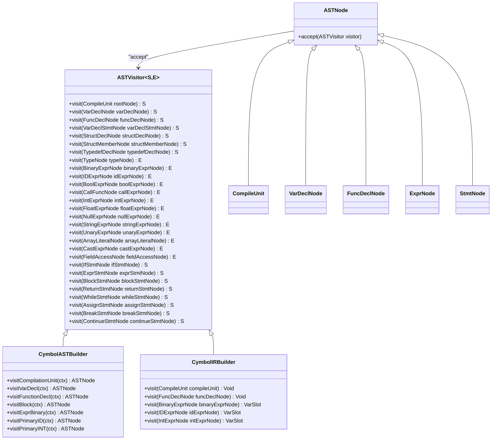

# Visitor Pattern Implementation

<cite>
**Referenced Files in This Document**   
- [ASTVisitor.java](file://ep20/src/main/java/org/teachfx/antlr4/ep20/ast/ASTVisitor.java)
- [IRVisitor.java](file://ep20/src/main/java/org/teachfx/antlr4/ep20/ir/IRVisitor.java)
- [ASTNode.java](file://ep20/src/main/java/org/teachfx/antlr4/ep20/ast/ASTNode.java)
- [IRNode.java](file://ep20/src/main/java/org/teachfx/antlr4/ep20/ir/IRNode.java)
- [CymbolASTBuilder.java](file://ep20/src/main/java/org/teachfx/antlr4/ep20/pass/ast/CymbolASTBuilder.java)
- [CymbolIRBuilder.java](file://ep20/src/main/java/org/teachfx/antlr4/ep20/pass/ir/CymbolIRBuilder.java)
</cite>

## Table of Contents
1. [Introduction](#introduction)
2. [Visitor Pattern Overview](#visitor-pattern-overview)
3. [Core Components](#core-components)
4. [Double Dispatch Mechanism](#double-dispatch-mechanism)
5. [Concrete Visitor Implementations](#concrete-visitor-implementations)
6. [Benefits for Compiler Development](#benefits-for-compiler-development)
7. [Common Issues and Troubleshooting](#common-issues-and-troubleshooting)
8. [UML Diagram](#uml-diagram)
9. [Conclusion](#conclusion)

## Introduction
The Visitor pattern is a behavioral design pattern that allows adding new operations to existing object structures without modifying the objects themselves. In compiler construction, this pattern is particularly valuable for separating traversal logic from data structures, enabling clean extension of functionality across Abstract Syntax Trees (AST) and Intermediate Representation (IR) nodes. This document explores the implementation of the Visitor pattern in the compiler framework, focusing on ASTVisitor and IRVisitor interfaces, their concrete implementations, and the double dispatch mechanism that enables flexible operation definition.

## Visitor Pattern Overview
The Visitor pattern enables separation of algorithms from the objects on which they operate. In the compiler context, this means operations like AST construction, semantic analysis, code generation, and optimization can be implemented independently of the node classes themselves. The pattern consists of two main components: the element classes (ASTNode and IRNode) that accept visitors, and the visitor interfaces (ASTVisitor and IRVisitor) that define operations for each node type. This separation allows new operations to be added without modifying existing node classes, promoting extensibility and maintainability in the compiler architecture.

**Section sources**
- [ASTVisitor.java](file://ep20/src/main/java/org/teachfx/antlr4/ep20/ast/ASTVisitor.java#L1-L123)
- [IRVisitor.java](file://ep20/src/main/java/org/teachfx/antlr4/ep20/ir/IRVisitor.java#L1-L41)

## Core Components

### ASTNode and IRNode Base Classes
The ASTNode and IRNode classes serve as the foundation for all tree nodes in the compiler. These abstract classes provide the accept() method that enables the double dispatch mechanism. The accept() method takes a visitor as a parameter and calls the appropriate visit() method on the visitor, allowing operations to be defined externally to the node classes. This design enables the addition of new operations without modifying the node hierarchy, supporting the Open/Closed Principle.

**Section sources**
- [ASTNode.java](file://ep20/src/main/java/org/teachfx/antlr4/ep20/ast/ASTNode.java#L1-L48)
- [IRNode.java](file://ep20/src/main/java/org/teachfx/antlr4/ep20/ir/IRNode.java#L1-L5)

### ASTVisitor and IRVisitor Interfaces
The ASTVisitor and IRVisitor interfaces define the contract for operations on AST and IR nodes respectively. These interfaces declare visit() methods for each concrete node type, enabling type-specific processing. The generic type parameters <S,E> allow visitors to return different types for statement nodes (S) and expression nodes (E), providing flexibility in visitor design. Default implementations for visit() methods on parent types (ExprNode, StmtNode) provide automatic delegation to specific node types, reducing boilerplate code in concrete visitors.

**Section sources**
- [ASTVisitor.java](file://ep20/src/main/java/org/teachfx/antlr4/ep20/ast/ASTVisitor.java#L1-L123)
- [IRVisitor.java](file://ep20/src/main/java/org/teachfx/antlr4/ep20/ir/IRVisitor.java#L1-L41)

## Double Dispatch Mechanism
The Visitor pattern relies on double dispatch to route operations to the appropriate method. The first dispatch occurs when client code calls accept() on a node object, which is resolved at runtime based on the actual node type. The second dispatch happens when the node's accept() method calls visit() on the visitor, which is resolved based on both the node type and visitor type. This two-step process ensures that the correct visit() method is called for the specific combination of node and visitor, enabling type-safe operation execution without reflection or instanceof checks.

**Section sources**
- [ASTNode.java](file://ep20/src/main/java/org/teachfx/antlr4/ep20/ast/ASTNode.java#L1-L48)
- [ASTVisitor.java](file://ep20/src/main/java/org/teachfx/antlr4/ep20/ast/ASTVisitor.java#L1-L123)

## Concrete Visitor Implementations

### CymbolASTBuilder for AST Construction
The CymbolASTBuilder class implements the ASTVisitor interface to construct the Abstract Syntax Tree from parser context objects. As an extension of CymbolBaseVisitor, it overrides visit methods for each grammar rule to create corresponding AST nodes. The builder traverses the parse tree and constructs AST nodes for declarations, expressions, and statements, maintaining parent-child relationships. This visitor separates the tree construction logic from the node classes, allowing the AST structure to evolve independently of the construction algorithm.

**Section sources**
- [CymbolASTBuilder.java](file://ep20/src/main/java/org/teachfx/antlr4/ep20/pass/ast/CymbolASTBuilder.java#L1-L318)

### CymbolIRBuilder for IR Generation
The CymbolIRBuilder class implements the ASTVisitor interface to generate Intermediate Representation from the AST. It traverses the AST and emits IR instructions for each node, building a linear sequence of three-address code. The builder maintains a stack of evaluation operands and manages control flow through basic blocks, generating appropriate jump instructions for conditional statements and loops. This visitor separates code generation logic from the AST structure, enabling different code generation strategies to be implemented without modifying the AST classes.

**Section sources**
- [CymbolIRBuilder.java](file://ep20/src/main/java/org/teachfx/antlr4/ep20/pass/ir/CymbolIRBuilder.java#L1-L473)

## Benefits for Compiler Development
The Visitor pattern provides several key benefits for compiler development. First, it enables easy addition of new operations without modifying existing node classes, supporting the Open/Closed Principle. Second, it improves code organization by grouping related operations in visitor classes rather than scattering them across node classes. Third, it facilitates separation of concerns, allowing different aspects of compilation (parsing, semantic analysis, code generation) to be implemented independently. Finally, it enhances type safety by eliminating the need for instanceof checks and casts, reducing the potential for runtime errors.

**Section sources**
- [ASTVisitor.java](file://ep20/src/main/java/org/teachfx/antlr4/ep20/ast/ASTVisitor.java#L1-L123)
- [CymbolASTBuilder.java](file://ep20/src/main/java/org/teachfx/antlr4/ep20/pass/ast/CymbolASTBuilder.java#L1-L318)
- [CymbolIRBuilder.java](file://ep20/src/main/java/org/teachfx/antlr4/ep20/pass/ir/CymbolIRBuilder.java#L1-L473)

## Common Issues and Troubleshooting
Maintaining visitor-method consistency when AST/IR nodes change is a common challenge. When new node types are added, all visitor implementations must be updated to include the corresponding visit() method, or they will not process the new nodes correctly. Dispatch errors can occur when the accept() method is not properly implemented in node classes or when visitor methods are not correctly overridden. To troubleshoot these issues, verify that all node classes properly implement the accept() method and that visitor classes override all required visit() methods. Using abstract base visitors with default implementations can help catch missing method overrides at compile time.

**Section sources**
- [ASTVisitor.java](file://ep20/src/main/java/org/teachfx/antlr4/ep20/ast/ASTVisitor.java#L1-L123)
- [ASTNode.java](file://ep20/src/main/java/org/teachfx/antlr4/ep20/ast/ASTNode.java#L1-L48)
- [CymbolASTBuilder.java](file://ep20/src/main/java/org/teachfx/antlr4/ep20/pass/ast/CymbolASTBuilder.java#L1-L318)

## UML Diagram
The following UML class diagram illustrates the relationship between ASTNode, ASTVisitor, and concrete visitor implementations in the compiler framework.

**Diagram sources**
- [ASTNode.java](file://ep20/src/main/java/org/teachfx/antlr4/ep20/ast/ASTNode.java#L1-L48)
- [ASTVisitor.java](file://ep20/src/main/java/org/teachfx/antlr4/ep20/ast/ASTVisitor.java#L1-L123)
- [CymbolASTBuilder.java](file://ep20/src/main/java/org/teachfx/antlr4/ep20/pass/ast/CymbolASTBuilder.java#L1-L318)
- [CymbolIRBuilder.java](file://ep20/src/main/java/org/teachfx/antlr4/ep20/pass/ir/CymbolIRBuilder.java#L1-L473)

## Conclusion
The Visitor pattern implementation in the compiler framework provides a robust mechanism for separating traversal logic from data structures. By defining operations in visitor classes rather than within node classes, the pattern enables extensibility, improves code organization, and facilitates the addition of new operations without modifying existing code. The double dispatch mechanism ensures type-safe method resolution, while concrete implementations like CymbolASTBuilder and CymbolIRBuilder demonstrate the pattern's effectiveness in compiler construction tasks. This design supports the development of maintainable and scalable compiler systems.