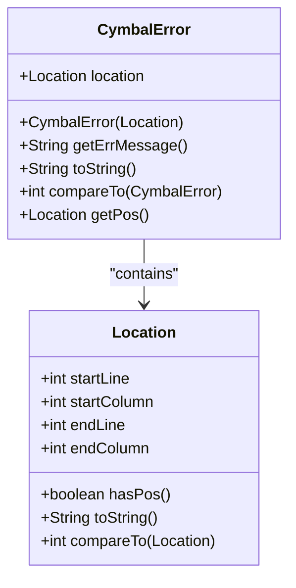
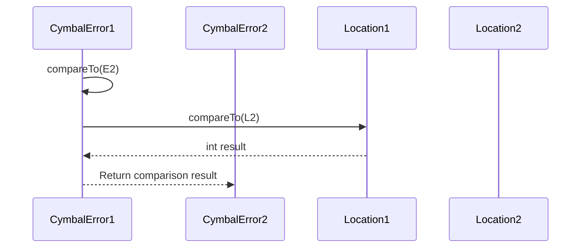
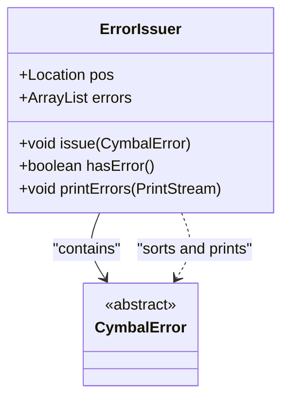

# CymbalError Class Hierarchy

<cite>
**Referenced Files in This Document**   
- [CymbalError.java](file://ep20/src/main/java/org/teachfx/antlr4/ep20/error/CymbalError.java)
- [Location.java](file://ep20/src/main/java/org/teachfx/antlr4/ep20/parser/Location.java)
- [ErrorIssuer.java](file://ep20/src/main/java/org/teachfx/antlr4/ep20/driver/ErrorIssuer.java)
</cite>

## Table of Contents
1. [Introduction](#introduction)
2. [Core Fields and Location Tracking](#core-fields-and-location-tracking)
3. [Abstract Method: getErrMessage()](#abstract-method-geterrmessage)
4. [Error Formatting with toString()](#error-formatting-with-tostring)
5. [Sorting Errors with compareTo()](#sorting-errors-with-compareto)
6. [Integration with ErrorIssuer](#integration-with-errorissuer)
7. [Example Subclass Implementation](#example-subclass-implementation)
8. [Best Practices for Extending CymbalError](#best-practices-for-extending-cymbalerror)
9. [Conclusion](#conclusion)

## Introduction
The `CymbalError` abstract class serves as the foundational base for all error types within the compiler framework. It provides a standardized structure for representing and managing compilation errors, ensuring consistent error reporting across different phases of the compilation process. By implementing the `Comparable` interface and integrating with source location tracking, this class enables ordered, context-rich error output that enhances debugging and user feedback.

**Section sources**
- [CymbalError.java](file://ep20/src/main/java/org/teachfx/antlr4/ep20/error/CymbalError.java#L6-L36)

## Core Fields and Location Tracking
The `CymbalError` class contains a single public field: `location`, which is an instance of the `Location` class. This field captures the positional context of the error within the source code, including start and end line numbers and column positions. The `Location` object is initialized during error construction and used throughout error formatting and sorting operations.

The `Location` class itself encapsulates four integer fields: `startLine`, `startColumn`, `endLine`, and `endColumn`. It includes a `hasPos()` method to determine whether valid position information is available, which is essential for handling cases where location data may be missing or undefined.



**Diagram sources**
- [CymbalError.java](file://ep20/src/main/java/org/teachfx/antlr4/ep20/error/CymbalError.java#L6-L36)
- [Location.java](file://ep20/src/main/java/org/teachfx/antlr4/ep20/parser/Location.java#L3-L30)

**Section sources**
- [CymbalError.java](file://ep20/src/main/java/org/teachfx/antlr4/ep20/error/CymbalError.java#L6-L36)
- [Location.java](file://ep20/src/main/java/org/teachfx/antlr4/ep20/parser/Location.java#L3-L30)

## Abstract Method: getErrMessage()
The `getErrMessage()` method is declared as abstract, requiring all concrete subclasses to provide a descriptive error message. This design enforces implementation-specific messaging while maintaining a uniform interface for error retrieval. The returned string should clearly describe the nature of the error in human-readable form, such as "Undefined variable referenced" or "Syntax error near token".

This method is called internally by `toString()` to generate the final error output, ensuring that every error instance provides meaningful diagnostic information.

**Section sources**
- [CymbalError.java](file://ep20/src/main/java/org/teachfx/antlr4/ep20/error/CymbalError.java#L10-L11)

## Error Formatting with toString()
The `toString()` method formats the complete error message for display, incorporating both positional context and the descriptive message from `getErrMessage()`. It checks whether valid location information exists using `location.hasPos()`. If no position is available, it outputs a generic error prefix: `*** Error: <message>`. Otherwise, it includes the formatted location: `*** Error at Line X:Y-Z: <message>`.

This consistent formatting ensures readability and supports integration with logging and reporting systems.

```mermaid
flowchart TD
Start([toString()]) --> CheckPos["Check location.hasPos()"]
CheckPos --> |False| FormatGeneric["Return '*** Error: ' + getErrMessage()"]
CheckPos --> |True| FormatWithPos["Return '*** Error at ' + location + ': ' + getErrMessage()"]
FormatGeneric --> End([Return])
FormatWithPos --> End
```

**Diagram sources**
- [CymbalError.java](file://ep20/src/main/java/org/teachfx/antlr4/ep20/error/CymbalError.java#L19-L27)

**Section sources**
- [CymbalError.java](file://ep20/src/main/java/org/teachfx/antlr4/ep20/error/CymbalError.java#L19-L27)

## Sorting Errors with compareTo()
The `compareTo()` method enables sorting of `CymbalError` instances based on their source code position. It delegates comparison to the underlying `Location` object's `compareTo()` implementation, which compares errors primarily by starting line number. This ordering ensures that errors are reported in the same sequence as they appear in the source file, improving usability during debugging.

By implementing `Comparable<CymbalError>`, the class integrates seamlessly with Java's sorting utilities, allowing collections of errors to be sorted efficiently.



**Diagram sources**
- [CymbalError.java](file://ep20/src/main/java/org/teachfx/antlr4/ep20/error/CymbalError.java#L30-L36)
- [Location.java](file://ep20/src/main/java/org/teachfx/antlr4/ep20/parser/Location.java#L24-L28)

**Section sources**
- [CymbalError.java](file://ep20/src/main/java/org/teachfx/antlr4/ep20/error/CymbalError.java#L30-L36)

## Integration with ErrorIssuer
The `ErrorIssuer` interface manages a collection of `CymbalError` instances and provides methods for issuing, checking, and printing errors. The `printErrors()` method sorts the error list using the natural ordering defined by `compareTo()` before outputting each error via `toString()`. This ensures that errors are displayed in source order, enhancing readability and debugging efficiency.

The `errors` list is maintained as an `ArrayList<CymbalError>`, supporting dynamic addition of errors during compilation phases.



**Diagram sources**
- [ErrorIssuer.java](file://ep20/src/main/java/org/teachfx/antlr4/ep20/driver/ErrorIssuer.java#L10-L43)
- [CymbalError.java](file://ep20/src/main/java/org/teachfx/antlr4/ep20/error/CymbalError.java#L6-L36)

**Section sources**
- [ErrorIssuer.java](file://ep20/src/main/java/org/teachfx/antlr4/ep20/driver/ErrorIssuer.java#L10-L43)

## Example Subclass Implementation
A concrete error subclass, such as `SyntaxError`, would extend `CymbalError` and implement `getErrMessage()` to return a specific description. For example:

```java
public class SyntaxError extends CymbalError {
    private final String token;

    public SyntaxError(Location loc, String token) {
        super(loc);
        this.token = token;
    }

    @Override
    public String getErrMessage() {
        return "Unexpected token '" + token + "' in input stream";
    }
}
```

This pattern allows for specialized error types while maintaining consistency through the base class.

**Section sources**
- [CymbalError.java](file://ep20/src/main/java/org/teachfx/antlr4/ep20/error/CymbalError.java#L10-L11)

## Best Practices for Extending CymbalError
When creating new error subclasses:
1. Always provide clear, actionable messages via `getErrMessage()`
2. Include relevant contextual information (e.g., token names, expected types)
3. Ensure location information is accurately passed from the parser or analyzer
4. Avoid duplicating error categories; prefer parameterized messages
5. Maintain consistent formatting and tone across all error messages
6. Leverage the sorting capability by ensuring location accuracy

These practices ensure that error reporting remains user-friendly and maintainable.

## Conclusion
The `CymbalError` class provides a robust foundation for error handling in the compiler, combining positional tracking, standardized formatting, and natural sorting. Its design promotes extensibility while enforcing consistency across error types. Integrated with the `ErrorIssuer` system, it enables coherent, ordered error reporting that significantly improves the developer experience during compilation and debugging.