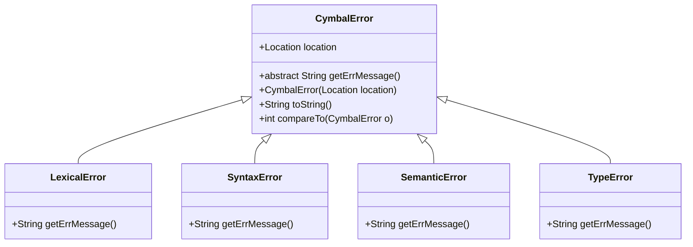
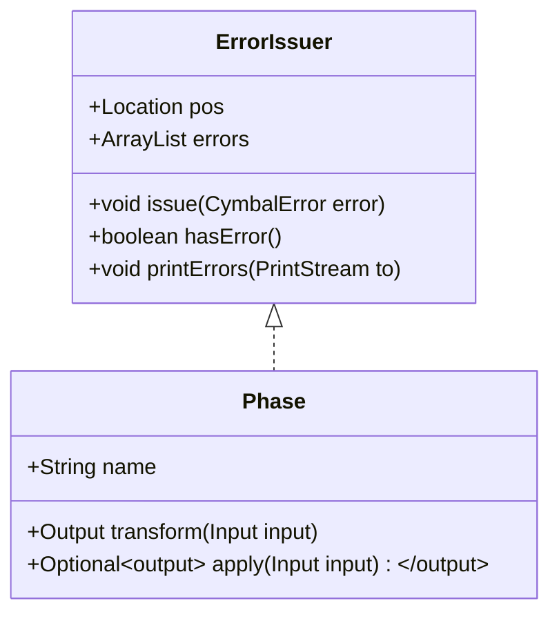
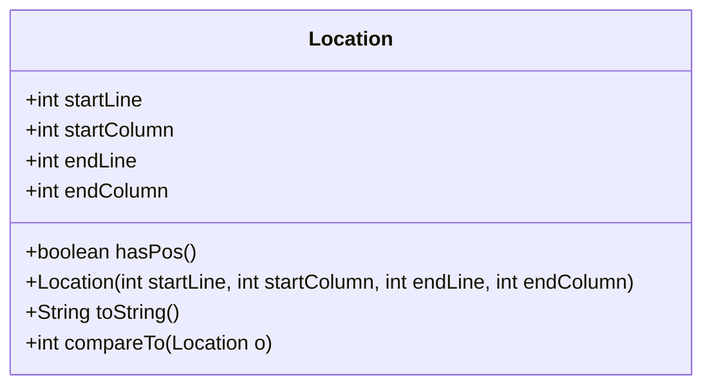
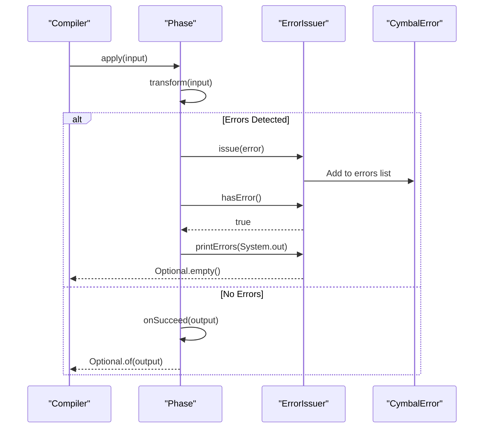
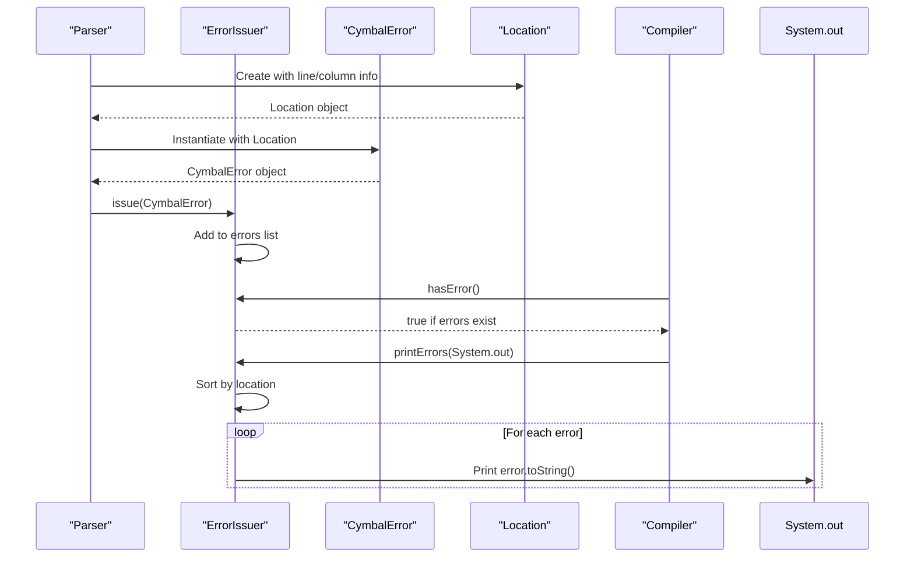
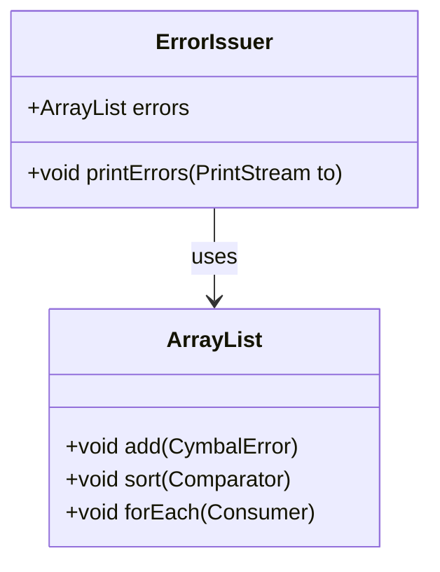

# Error Handling and Diagnostics Architecture

<cite>
**Referenced Files in This Document**   
- [CymbalError.java](file://ep20/src/main/java/org/teachfx/antlr4/ep20/error/CymbalError.java)
- [ErrorIssuer.java](file://ep20/src/main/java/org/teachfx/antlr4/ep20/driver/ErrorIssuer.java)
- [Location.java](file://ep20/src/main/java/org/teachfx/antlr4/ep20/parser/Location.java)
- [Phase.java](file://ep20/src/main/java/org/teachfx/antlr4/ep20/driver/Phase.java)
</cite>

## Table of Contents
1. [Introduction](#introduction)
2. [CymbalError Class Hierarchy](#cymbalerror-class-hierarchy)
3. [ErrorIssuer Component](#errorissuer-component)
4. [Location Tracking System](#location-tracking-system)
5. [Phase-Based Error Management](#phase-based-error-management)
6. [Error Recovery Mechanisms](#error-recovery-mechanisms)
7. [Error Reporting Flow](#error-reporting-flow)
8. [Error Message Formatting](#error-message-formatting)
9. [Batch Error Reporting](#batch-error-reporting)

## Introduction
The compiler's error handling system is designed to provide comprehensive diagnostics throughout the compilation process. This architecture ensures that developers receive clear, actionable feedback about issues in their code while allowing the compiler to continue processing to identify multiple errors in a single compilation run. The system is built around several key components: the CymbalError class hierarchy for categorizing errors, the ErrorIssuer interface for managing error collection, the Location class for tracking error positions, and the Phase class for integrating error handling into the compilation pipeline.

## CymbalError Class Hierarchy

The CymbalError class serves as the abstract base class for all compiler errors, providing a consistent interface for error reporting and management. It implements the Comparable interface to enable sorting of errors by their location in the source code.



**Diagram sources**
- [CymbalError.java](file://ep20/src/main/java/org/teachfx/antlr4/ep20/error/CymbalError.java#L6-L36)

**Section sources**
- [CymbalError.java](file://ep20/src/main/java/org/teachfx/antlr4/ep20/error/CymbalError.java#L6-L36)

## ErrorIssuer Component

The ErrorIssuer interface is responsible for collecting, managing, and reporting errors throughout the compilation process. It provides methods to issue new errors, check for existing errors, and print all collected errors in a sorted manner.



**Diagram sources**
- [ErrorIssuer.java](file://ep20/src/main/java/org/teachfx/antlr4/ep20/driver/ErrorIssuer.java#L9-L42)
- [Phase.java](file://ep20/src/main/java/org/teachfx/antlr4/ep20/driver/Phase.java#L4-L27)

**Section sources**
- [ErrorIssuer.java](file://ep20/src/main/java/org/teachfx/antlr4/ep20/driver/ErrorIssuer.java#L9-L42)

## Location Tracking System

The Location class is responsible for tracking the position of errors in the source code, including start and end line numbers and column positions. This information is crucial for providing developers with precise error locations.



**Diagram sources**
- [Location.java](file://ep20/src/main/java/org/teachfx/antlr4/ep20/parser/Location.java#L2-L29)

**Section sources**
- [Location.java](file://ep20/src/main/java/org/teachfx/antlr4/ep20/parser/Location.java#L2-L29)

## Phase-Based Error Management

The Phase class integrates error handling into each compilation phase, ensuring that errors are properly managed and reported at each stage of the compilation process. Each phase implements the ErrorIssuer interface, allowing it to collect and report errors specific to that phase.



**Diagram sources**
- [Phase.java](file://ep20/src/main/java/org/teachfx/antlr4/ep20/driver/Phase.java#L4-L27)
- [ErrorIssuer.java](file://ep20/src/main/java/org/teachfx/antlr4/ep20/driver/ErrorIssuer.java#L9-L42)

**Section sources**
- [Phase.java](file://ep20/src/main/java/org/teachfx/antlr4/ep20/driver/Phase.java#L4-L27)

## Error Recovery Mechanisms

The error recovery system allows the compiler to continue processing after encountering errors, enabling comprehensive error reporting. When errors are detected during a compilation phase, they are collected but do not immediately terminate the compilation process.

```mermaid
flowchart TD
Start([Compilation Phase Start]) --> Process[Process Input]
Process --> CheckErrors{Errors Detected?}
CheckErrors --> |Yes| CollectError[Collect Error via issue()]
CollectError --> ContinueProcessing[Continue Processing]
ContinueProcessing --> CheckErrors
CheckErrors --> |No| Complete[Complete Phase Successfully]
Complete --> Output[Return Output]
CollectError --> FinalCheck{Any Errors Collected?}
FinalCheck --> |Yes| ReportErrors[printErrors(System.out)]
ReportErrors --> ReturnEmpty[Return Optional.empty()]
FinalCheck --> |No| Output
```

**Diagram sources**
- [Phase.java](file://ep20/src/main/java/org/teachfx/antlr4/ep20/driver/Phase.java#L4-L27)
- [ErrorIssuer.java](file://ep20/src/main/java/org/teachfx/antlr4/ep20/driver/ErrorIssuer.java#L9-L42)

**Section sources**
- [Phase.java](file://ep20/src/main/java/org/teachfx/antlr4/ep20/driver/Phase.java#L4-L27)

## Error Reporting Flow

The error reporting flow illustrates how errors are created, issued, and ultimately reported to the user. This sequence ensures that all errors are properly tracked and presented in a consistent format.



**Diagram sources**
- [CymbalError.java](file://ep20/src/main/java/org/teachfx/antlr4/ep20/error/CymbalError.java#L6-L36)
- [ErrorIssuer.java](file://ep20/src/main/java/org/teachfx/antlr4/ep20/driver/ErrorIssuer.java#L9-L42)
- [Location.java](file://ep20/src/main/java/org/teachfx/antlr4/ep20/parser/Location.java#L2-L29)

**Section sources**
- [CymbalError.java](file://ep20/src/main/java/org/teachfx/antlr4/ep20/error/CymbalError.java#L6-L36)
- [ErrorIssuer.java](file://ep20/src/main/java/org/teachfx/antlr4/ep20/driver/ErrorIssuer.java#L9-L42)

## Error Message Formatting

Error messages are formatted to include both the error description and precise location information. The toString() method in the CymbalError class handles this formatting, ensuring consistency across all error types.

```mermaid
flowchart TD
A[CymbalError.toString()] --> B{Location.hasPos()?}
B --> |No| C[Return "*** Error: " + getErrMessage()]
B --> |Yes| D[Return "*** Error at " + location + ": " + getErrMessage()]
D --> E[Format location as "Line X:Y-Z"]
E --> F[Return formatted string]
C --> G[Return formatted string]
```

**Diagram sources**
- [CymbalError.java](file://ep20/src/main/java/org/teachfx/antlr4/ep20/error/CymbalError.java#L6-L36)
- [Location.java](file://ep20/src/main/java/org/teachfx/antlr4/ep20/parser/Location.java#L2-L29)

**Section sources**
- [CymbalError.java](file://ep20/src/main/java/org/teachfx/antlr4/ep20/error/CymbalError.java#L6-L36)

## Batch Error Reporting

The system supports batch error reporting by collecting all errors in an ArrayList and sorting them by location before output. This allows developers to see all errors in the order they appear in the source code.



**Diagram sources**
- [ErrorIssuer.java](file://ep20/src/main/java/org/teachfx/antlr4/ep20/driver/ErrorIssuer.java#L9-L42)

**Section sources**
- [ErrorIssuer.java](file://ep20/src/main/java/org/teachfx/antlr4/ep20/driver/ErrorIssuer.java#L13-L13)