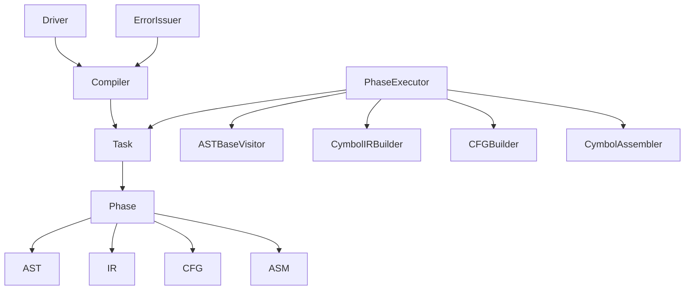
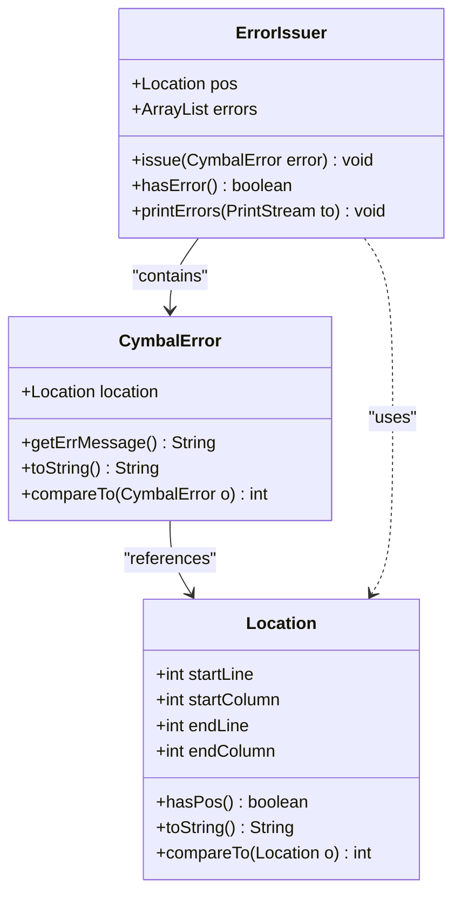
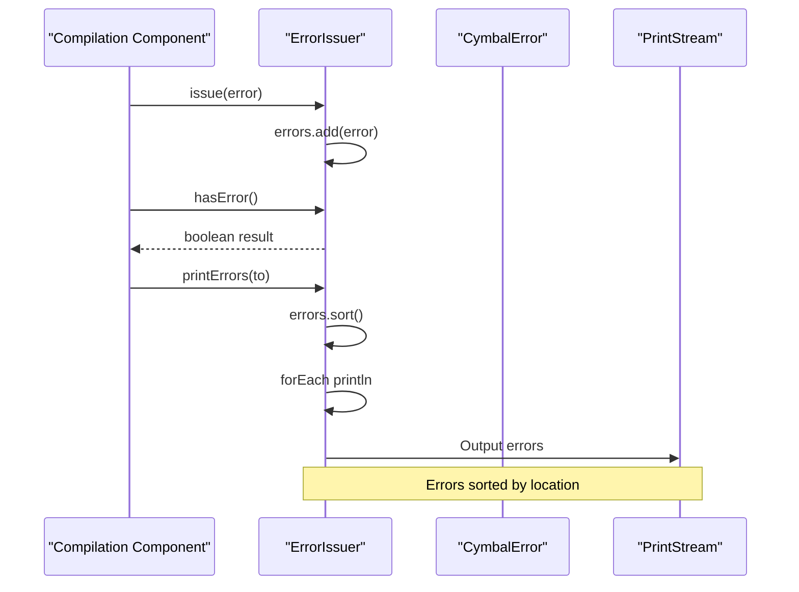
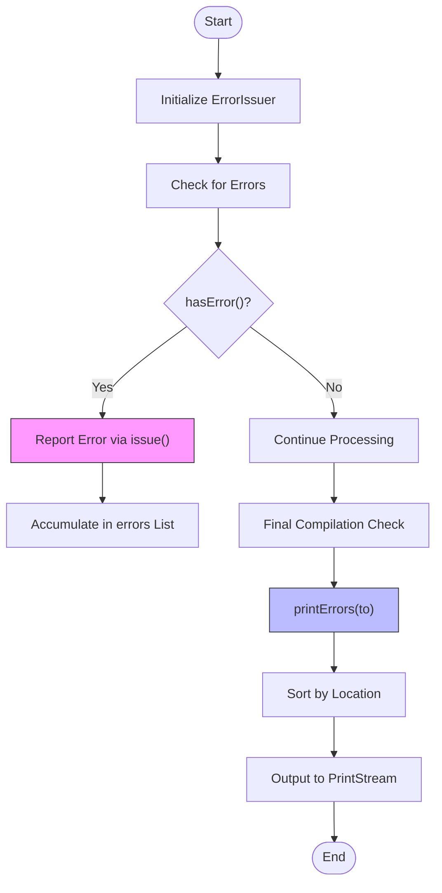
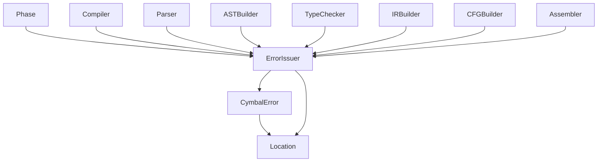

# ErrorIssuer Component

<cite>
**Referenced Files in This Document**   
- [ErrorIssuer.java](file://ep20/src/main/java/org/teachfx/antlr4/ep20/driver/ErrorIssuer.java)
- [CymbalError.java](file://ep20/src/main/java/org/teachfx/antlr4/ep20/error/CymbalError.java)
- [Location.java](file://ep20/src/main/java/org/teachfx/antlr4/ep20/parser/Location.java)
</cite>

## Table of Contents
1. [Introduction](#introduction)
2. [Core Components](#core-components)
3. [Architecture Overview](#architecture-overview)
4. [Detailed Component Analysis](#detailed-component-analysis)
5. [Dependency Analysis](#dependency-analysis)
6. [Conclusion](#conclusion)

## Introduction
The ErrorIssuer interface serves as a standardized error reporting mechanism across the compiler's various components. As a mixin interface, it enables any class involved in the compilation process to participate in error collection and reporting. This document details the design and implementation of the ErrorIssuer interface, its integration with the CymbalError class for error representation, and the Location class for positional tracking. The interface supports thread-safe error accumulation, status checking, and organized error output, forming a critical part of the compiler's diagnostic system.

## Core Components

[In-depth analysis of core components with code snippets and explanations]

**Section sources**
- [ErrorIssuer.java](file://ep20/src/main/java/org/teachfx/antlr4/ep20/driver/ErrorIssuer.java#L1-L43)
- [CymbalError.java](file://ep20/src/main/java/org/teachfx/antlr4/ep20/error/CymbalError.java#L1-L37)

## Architecture Overview

[Comprehensive visualization and explanation of the system architecture]

**Diagram sources **
- [ErrorIssuer.java](file://ep20/src/main/java/org/teachfx/antlr4/ep20/driver/ErrorIssuer.java#L1-L43)
- [module-interaction.md](file://ep20/docs/module-interaction.md#L246-L269)

## Detailed Component Analysis

[Thorough analysis of each key component with diagrams, code snippet paths, and explanations]

### ErrorIssuer Interface Analysis
The ErrorIssuer interface provides a standardized mechanism for error reporting throughout the compilation pipeline. Implemented as a mixin interface, it can be adopted by any component that needs to report or handle compilation errors.

#### Interface Structure and Error Collection

**Diagram sources **
- [ErrorIssuer.java](file://ep20/src/main/java/org/teachfx/antlr4/ep20/driver/ErrorIssuer.java#L1-L43)
- [CymbalError.java](file://ep20/src/main/java/org/teachfx/antlr4/ep20/error/CymbalError.java#L1-L37)
- [Location.java](file://ep20/src/main/java/org/teachfx/antlr4/ep20/parser/Location.java#L1-L31)

#### Error Reporting Workflow

**Diagram sources **
- [ErrorIssuer.java](file://ep20/src/main/java/org/teachfx/antlr4/ep20/driver/ErrorIssuer.java#L1-L43)
- [CymbalError.java](file://ep20/src/main/java/org/teachfx/antlr4/ep20/error/CymbalError.java#L1-L37)

#### Error Processing Flowchart

**Diagram sources **
- [ErrorIssuer.java](file://ep20/src/main/java/org/teachfx/antlr4/ep20/driver/ErrorIssuer.java#L1-L43)

**Section sources**
- [ErrorIssuer.java](file://ep20/src/main/java/org/teachfx/antlr4/ep20/driver/ErrorIssuer.java#L1-L43)
- [CymbalError.java](file://ep20/src/main/java/org/teachfx/antlr4/ep20/error/CymbalError.java#L1-L37)
- [Location.java](file://ep20/src/main/java/org/teachfx/antlr4/ep20/parser/Location.java#L1-L31)

## Dependency Analysis

[Analysis of dependencies between components with visualization]

**Diagram sources **
- [ErrorIssuer.java](file://ep20/src/main/java/org/teachfx/antlr4/ep20/driver/ErrorIssuer.java#L1-L43)
- [module-interaction.md](file://ep20/docs/module-interaction.md#L165-L247)

**Section sources**
- [ErrorIssuer.java](file://ep20/src/main/java/org/teachfx/antlr4/ep20/driver/ErrorIssuer.java#L1-L43)
- [module-interaction.md](file://ep20/docs/module-interaction.md#L165-L247)

## Conclusion

The ErrorIssuer interface provides a robust and standardized approach to error reporting in the compiler architecture. By implementing this mixin interface, various compilation phases can uniformly report errors through the issue() method, which adds CymbalError instances to a shared ArrayList. The thread-safe nature of the ArrayList ensures reliable error accumulation across different components. The hasError() method enables conditional flow control based on error status, while printErrors() provides organized output by sorting errors according to their source positions using Comparator.comparing() with method references to the location field. This design allows for contextual feedback to developers, with errors presented in the order they appear in the source code. The integration of Location objects provides precise positional information, enhancing the diagnostic value of error messages. This comprehensive error handling system supports the compiler's ability to detect, accumulate, and report issues throughout the compilation pipeline, from parsing to code generation phases.