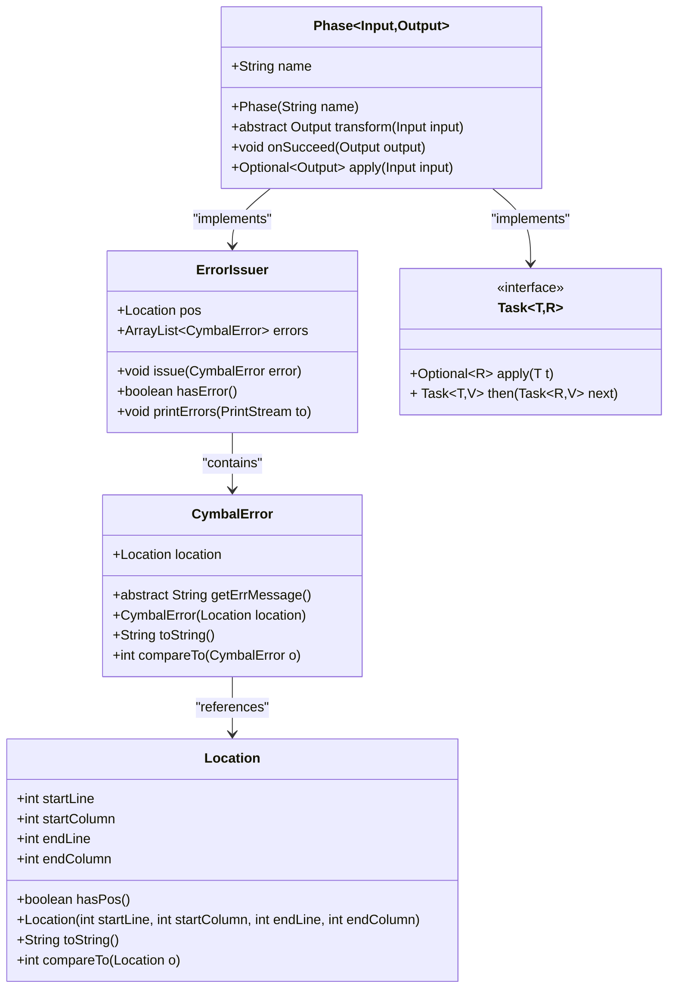
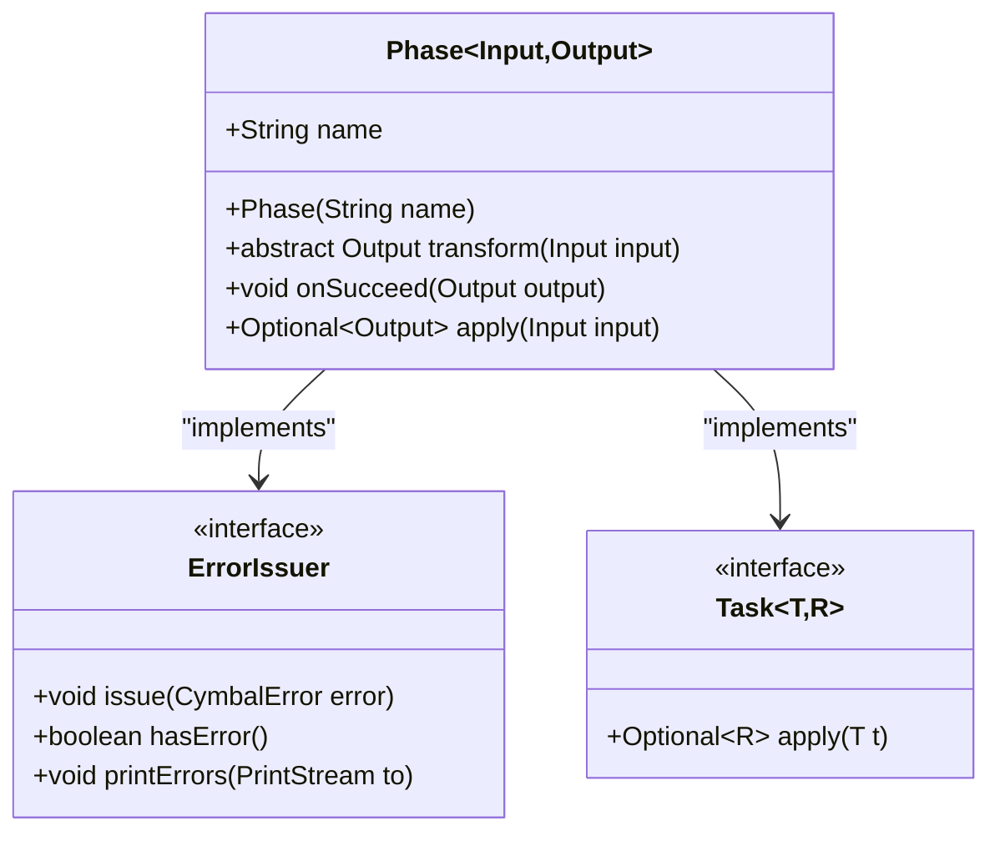
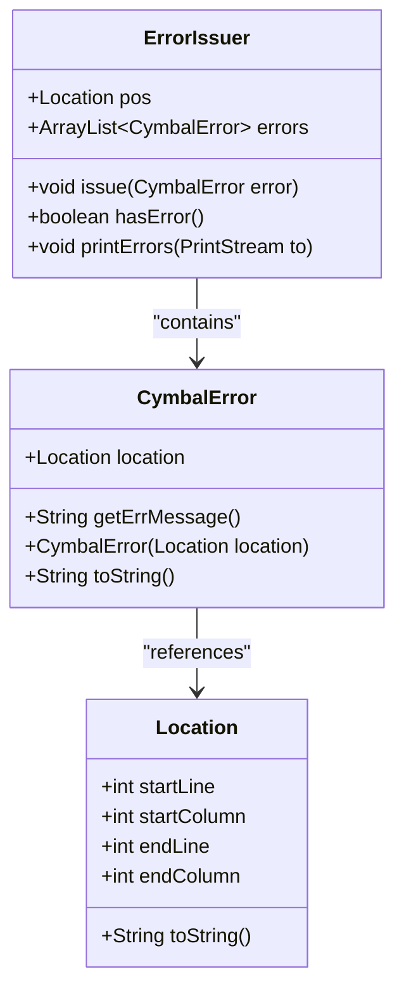

# Phase-Level Error Integration

<cite>
**Referenced Files in This Document**   
- [Phase.java](file://ep20/src/main/java/org/teachfx/antlr4/ep20/driver/Phase.java)
- [ErrorIssuer.java](file://ep20/src/main/java/org/teachfx/antlr4/ep20/driver/ErrorIssuer.java)
- [CymbalError.java](file://ep20/src/main/java/org/teachfx/antlr4/ep20/error/CymbalError.java)
- [Task.java](file://ep20/src/main/java/org/teachfx/antlr4/ep20/driver/Task.java)
- [Location.java](file://ep20/src/main/java/org/teachfx/antlr4/ep20/parser/Location.java)
</cite>

## Table of Contents
1. [Introduction](#introduction)
2. [Core Components](#core-components)
3. [Architecture Overview](#architecture-overview)
4. [Detailed Component Analysis](#detailed-component-analysis)
5. [Error Handling Workflow](#error-handling-workflow)
6. [Phase Execution and Error Propagation](#phase-execution-and-error-propagation)
7. [Example Phase Implementations](#example-phase-implementations)
8. [Conclusion](#conclusion)

## Introduction
The Phase abstract class serves as a foundational component in the compilation pipeline, providing a standardized mechanism for error handling across all compilation stages. By implementing the ErrorIssuer interface, each phase can uniformly report, accumulate, and manage errors during execution. This document details how the Phase class integrates error handling into the compilation process, ensuring robust and comprehensive error reporting while maintaining a fail-fast behavior that halts further processing upon detection of errors.

## Core Components

The core components involved in phase-level error integration include the Phase abstract class, the ErrorIssuer interface, the CymbalError class for representing individual errors, and the Location class for tracking error positions in source code. These components work together to provide a cohesive error management system throughout the compilation pipeline.

**Section sources**
- [Phase.java](file://ep20/src/main/java/org/teachfx/antlr4/ep20/driver/Phase.java#L1-L28)
- [ErrorIssuer.java](file://ep20/src/main/java/org/teachfx/antlr4/ep20/driver/ErrorIssuer.java#L1-L43)
- [CymbalError.java](file://ep20/src/main/java/org/teachfx/antlr4/ep20/error/CymbalError.java#L1-L36)

## Architecture Overview

The architecture of the phase-level error integration system is built around the Phase class inheriting error management capabilities from the ErrorIssuer interface. Each phase in the compilation pipeline extends Phase and automatically gains the ability to issue, track, and report errors. The system uses Optional<Output> to represent the result of phase execution, allowing for clean propagation of success or failure states through the pipeline.



**Diagram sources**
- [Phase.java](file://ep20/src/main/java/org/teachfx/antlr4/ep20/driver/Phase.java#L1-L28)
- [ErrorIssuer.java](file://ep20/src/main/java/org/teachfx/antlr4/ep20/driver/ErrorIssuer.java#L1-L43)
- [CymbalError.java](file://ep20/src/main/java/org/teachfx/antlr4/ep20/error/CymbalError.java#L1-L36)
- [Location.java](file://ep20/src/main/java/org/teachfx/antlr4/ep20/parser/Location.java#L1-L30)
- [Task.java](file://ep20/src/main/java/org/teachfx/antlr4/ep20/driver/Task.java#L1-L22)

## Detailed Component Analysis

### Phase Class Analysis
The Phase class is an abstract generic class parameterized by Input and Output types, representing the data transformation performed by each compilation phase. It implements both the Task interface for functional composition and the ErrorIssuer interface for error management. The class maintains a name field for identification and provides the core apply() method that orchestrates phase execution and error handling.

#### For Object-Oriented Components:


**Diagram sources**
- [Phase.java](file://ep20/src/main/java/org/teachfx/antlr4/ep20/driver/Phase.java#L1-L28)

**Section sources**
- [Phase.java](file://ep20/src/main/java/org/teachfx/antlr4/ep20/driver/Phase.java#L1-L28)

### ErrorIssuer Interface Analysis
The ErrorIssuer interface provides a standardized contract for error management across all components in the compilation system. It maintains a collection of CymbalError objects and provides methods to issue new errors, check for the presence of errors, and print all accumulated errors in a sorted manner. The interface uses default methods to provide concrete implementations, allowing any implementing class to immediately gain full error management capabilities.

#### For Object-Oriented Components:


**Diagram sources**
- [ErrorIssuer.java](file://ep20/src/main/java/org/teachfx/antlr4/ep20/driver/ErrorIssuer.java#L1-L43)
- [CymbalError.java](file://ep20/src/main/java/org/teachfx/antlr4/ep20/error/CymbalError.java#L1-L36)
- [Location.java](file://ep20/src/main/java/org/teachfx/antlr4/ep20/parser/Location.java#L1-L30)

**Section sources**
- [ErrorIssuer.java](file://ep20/src/main/java/org/teachfx/antlr4/ep20/driver/ErrorIssuer.java#L1-L43)

## Error Handling Workflow

The error handling workflow in the Phase class follows a structured pattern that ensures comprehensive error reporting while maintaining pipeline integrity. When a phase is executed through the apply() method, it first invokes the transform() method to perform the actual phase logic. After transformation, the method checks for errors using the hasError() method inherited from ErrorIssuer. If errors are detected, they are printed to System.out using printErrors(), and an empty Optional is returned to indicate failure. If no errors are present, the output is wrapped in an Optional and returned.

This workflow enables a fail-fast but comprehensive error reporting system. The phase continues its internal processing to collect multiple errors before termination, rather than stopping at the first error encountered. This approach provides developers with a complete picture of all issues in the source code, improving the debugging experience.

```mermaid
flowchart TD
Start([Phase.apply()]) --> Transform["Call transform(input)"]
Transform --> CheckError{"hasError()?"}
CheckError --> |Yes| PrintErrors["printErrors(System.out)"]
PrintErrors --> ReturnEmpty["Return Optional.empty()"]
CheckError --> |No| ReturnOutput["Return Optional.of(output)"]
ReturnEmpty --> End([Method Exit])
ReturnOutput --> End
```

**Diagram sources**
- [Phase.java](file://ep20/src/main/java/org/teachfx/antlr4/ep20/driver/Phase.java#L1-L28)

**Section sources**
- [Phase.java](file://ep20/src/main/java/org/teachfx/antlr4/ep20/driver/Phase.java#L1-L28)

## Phase Execution and Error Propagation

The use of Optional<Output> in the Phase class's apply() method signature is central to the error propagation mechanism in the compilation pipeline. Optional serves as a monadic container that explicitly represents the presence or absence of a successful result. When a phase completes successfully, it returns Optional.of(output) containing the transformed data. When errors are detected, it returns Optional.empty(), signaling failure to subsequent phases.

The Task interface's then() method enables Kleisli composition of phases, where each phase is chained to the next. This composition automatically handles error propagation: if any phase returns Optional.empty(), the entire chain short-circuits, preventing subsequent phases from executing. This creates a robust pipeline where error states are properly propagated without requiring explicit error checking at each stage.

The onSucceed() method provides a hook for phases to perform additional actions when execution completes successfully, such as logging or statistics collection, without interfering with the core error handling mechanism.

## Example Phase Implementations

Specific compilation phases leverage the error integration pattern in various ways:

### Type Checking Phase
A type checking phase would extend Phase and implement transform() to traverse the AST, verifying type correctness. When type mismatches are detected, it would create CymbalError instances with appropriate Location information and issue them through the inherited issue() method. The phase would continue checking the entire program to report all type errors, not just the first one encountered.

### Code Generation Phase
A code generation phase would use the same pattern, issuing errors for unsupported language features or invalid constructs. By accumulating all errors before failing, it can report multiple code generation issues simultaneously, helping developers fix several problems in one iteration.

### Syntax Analysis Phase
Even early phases like syntax analysis benefit from this pattern. While parser errors might be detected by ANTLR, semantic errors discovered during AST processing can be issued through the same interface, ensuring a consistent error reporting experience across all compilation stages.

In each case, the phase implementation focuses on its core logic in the transform() method, while the Phase superclass handles the uniform error management and result signaling through Optional.

## Conclusion
The Phase abstract class provides a robust foundation for error handling in the compilation pipeline by implementing the ErrorIssuer interface. This design enables every compilation phase to participate in a consistent error reporting system that collects multiple errors before termination while still halting the pipeline on failure. The use of Optional<Output> provides a clean mechanism for representing success or failure states, enabling functional composition of phases through the Task interface. This architecture creates a developer-friendly compilation experience that balances comprehensive error reporting with fail-fast behavior, making it easier to identify and fix issues in source code.