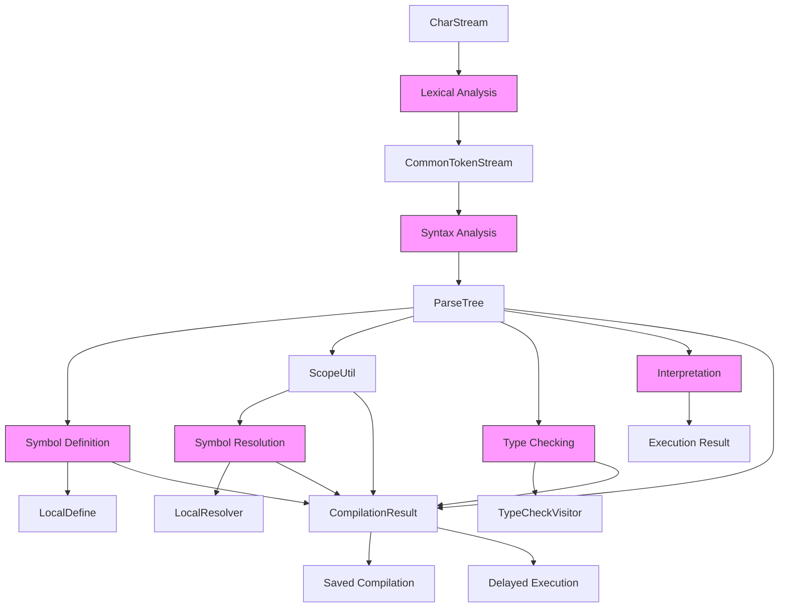
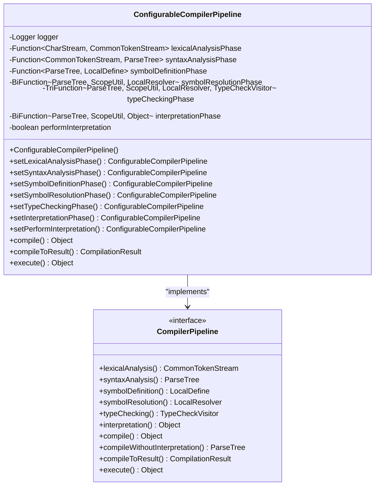
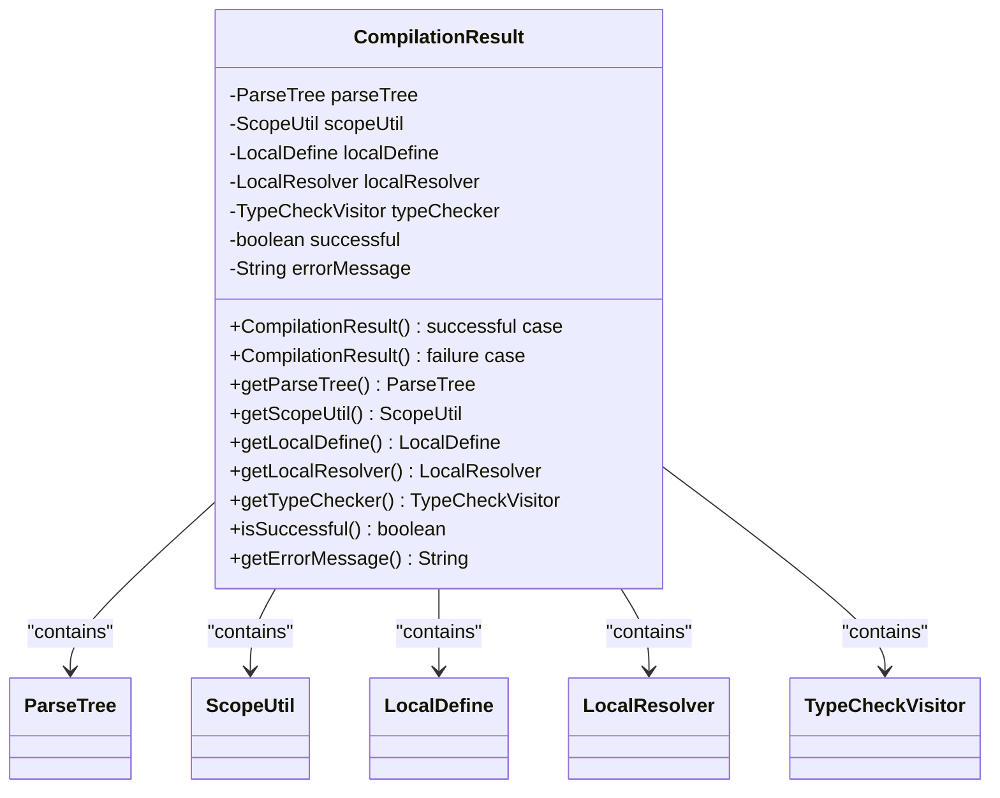
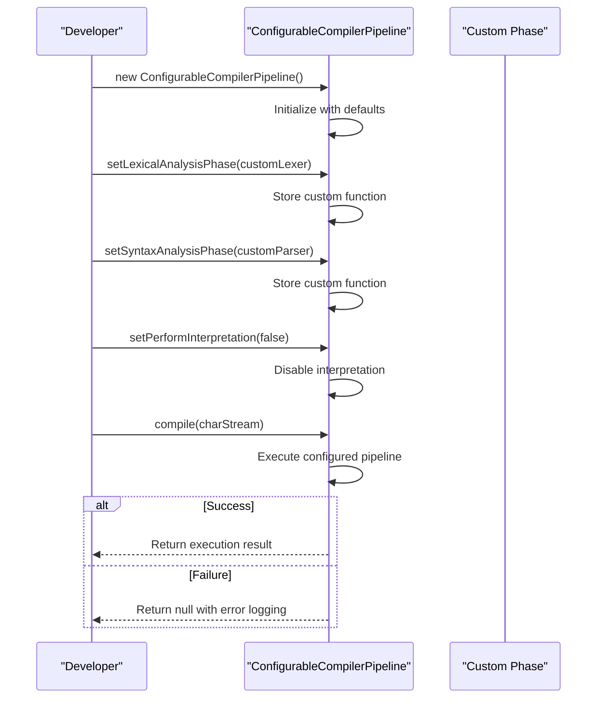
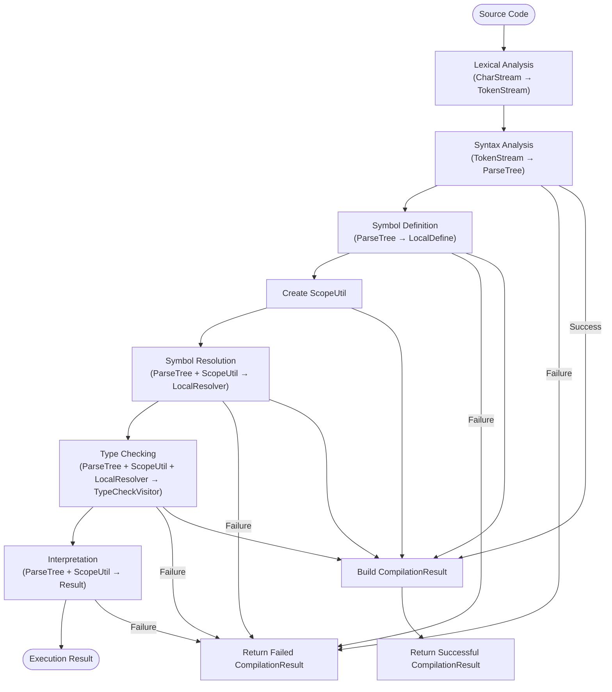
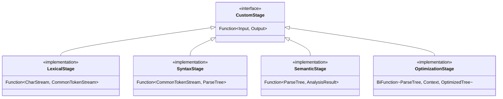
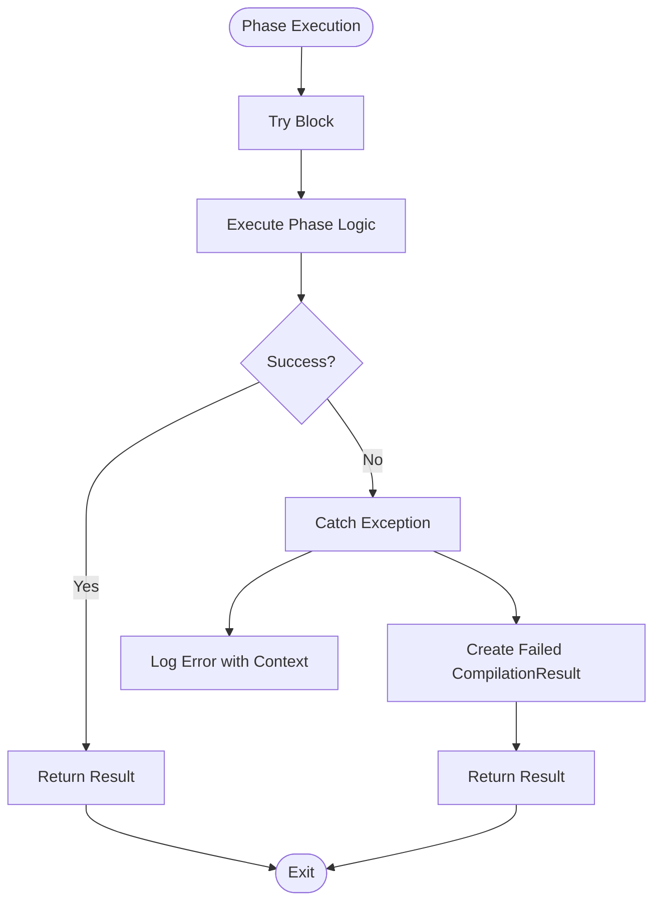

# Configurable Compilation Pipeline Architecture

<cite>
**Referenced Files in This Document**   
- [ConfigurableCompilerPipeline.java](file://ep19/src/main/java/org/teachfx/antlr4/ep19/pipeline/ConfigurableCompilerPipeline.java)
- [CompilerPipeline.java](file://ep19/src/main/java/org/teachfx/antlr4/ep19/pipeline/CompilerPipeline.java)
- [CompilationResult.java](file://ep19/src/main/java/org/teachfx/antlr4/ep19/pipeline/CompilationResult.java)
- [Compiler.java](file://ep19/src/main/java/org/teachfx/antlr4/ep19/Compiler.java)
</cite>

## Table of Contents
1. [Introduction](#introduction)
2. [Core Components](#core-components)
3. [Architecture Overview](#architecture-overview)
4. [Detailed Component Analysis](#detailed-component-analysis)
5. [Pipeline Configuration and Customization](#pipeline-configuration-and-customization)
6. [Data Flow and Result Management](#data-flow-and-result-management)
7. [Specialized Pipeline Examples](#specialized-pipeline-examples)
8. [Custom Stage Implementation](#custom-stage-implementation)
9. [Error Handling and Concurrency](#error-handling-and-concurrency)
10. [Conclusion](#conclusion)

## Introduction
The ConfigurableCompilerPipeline design pattern provides a flexible architecture for building customizable compilation workflows. This document details how the implementation in the Cymbol compiler allows developers to modify execution order, enable/disable phases, and inject custom processing stages. The architecture supports various compilation scenarios from debugging to production optimization while maintaining a clean separation of concerns through well-defined interfaces and data structures.

## Core Components

The configurable compilation pipeline is built around four key components that work together to provide a flexible compilation framework. The `ConfigurableCompilerPipeline` class implements the `CompilerPipeline` interface, allowing for method chaining configuration. The `CompilationResult` class encapsulates all intermediate artifacts for later execution. The pipeline supports phase replacement through functional interfaces, and the `Compiler` class demonstrates various usage patterns including static analysis and saved compilation results.

**Section sources**
- [ConfigurableCompilerPipeline.java](file://ep19/src/main/java/org/teachfx/antlr4/ep19/pipeline/ConfigurableCompilerPipeline.java#L1-L370)
- [CompilerPipeline.java](file://ep19/src/main/java/org/teachfx/antlr4/ep19/pipeline/CompilerPipeline.java#L1-L109)
- [CompilationResult.java](file://ep19/src/main/java/org/teachfx/antlr4/ep19/pipeline/CompilationResult.java#L1-L121)
- [Compiler.java](file://ep19/src/main/java/org/teachfx/antlr4/ep19/Compiler.java#L1-L250)

## Architecture Overview



**Diagram sources**
- [ConfigurableCompilerPipeline.java](file://ep19/src/main/java/org/teachfx/antlr4/ep19/pipeline/ConfigurableCompilerPipeline.java#L1-L370)
- [CompilationResult.java](file://ep19/src/main/java/org/teachfx/antlr4/ep19/pipeline/CompilationResult.java#L1-L121)

## Detailed Component Analysis

### ConfigurableCompilerPipeline Implementation

The `ConfigurableCompilerPipeline` class provides a fluent API for configuring the compilation workflow. Each compilation phase is represented as a functional interface, allowing for easy replacement of default implementations. The pipeline supports method chaining through return values of `this`, enabling clean configuration syntax. Phase execution follows a strict sequence from lexical analysis through to interpretation, with error handling at each stage.

#### Class Structure and Phase Management



**Diagram sources**
- [ConfigurableCompilerPipeline.java](file://ep19/src/main/java/org/teachfx/antlr4/ep19/pipeline/ConfigurableCompilerPipeline.java#L1-L370)
- [CompilerPipeline.java](file://ep19/src/main/java/org/teachfx/antlr4/ep19/pipeline/CompilerPipeline.java#L1-L109)

**Section sources**
- [ConfigurableCompilerPipeline.java](file://ep19/src/main/java/org/teachfx/antlr4/ep19/pipeline/ConfigurableCompilerPipeline.java#L1-L370)

### Compilation Result Management

The `CompilationResult` class serves as a container for all intermediate compilation artifacts, enabling delayed execution and serialization. It implements `Serializable` to support saving compiled code to disk. The class maintains references to the parse tree, scope information, and analysis results while providing a success/failure status mechanism.

#### Data Structure and State Management



**Diagram sources**
- [CompilationResult.java](file://ep19/src/main/java/org/teachfx/antlr4/ep19/pipeline/CompilationResult.java#L1-L121)

**Section sources**
- [CompilationResult.java](file://ep19/src/main/java/org/teachfx/antlr4/ep19/pipeline/CompilationResult.java#L1-L121)

## Pipeline Configuration and Customization

The configurable pipeline supports several customization patterns through its fluent interface. Users can replace any phase with custom implementations, disable interpretation for static analysis, or create specialized pipelines for different use cases. The `setPerformInterpretation` method allows toggling of the execution phase, while individual `set*` methods enable replacement of specific compilation stages.

### Configuration Patterns



**Diagram sources**
- [ConfigurableCompilerPipeline.java](file://ep19/src/main/java/org/teachfx/antlr4/ep19/pipeline/ConfigurableCompilerPipeline.java#L1-L370)

**Section sources**
- [ConfigurableCompilerPipeline.java](file://ep19/src/main/java/org/teachfx/antlr4/ep19/pipeline/ConfigurableCompilerPipeline.java#L1-L370)

## Data Flow and Result Management

The compilation pipeline follows a sequential data flow pattern where each phase consumes the output of the previous phase and produces artifacts for subsequent stages. The `CompilationResult` object collects all intermediate results, creating a complete snapshot of the compilation state that can be serialized and executed later.

### Data Flow Through Compilation Phases



**Diagram sources**
- [ConfigurableCompilerPipeline.java](file://ep19/src/main/java/org/teachfx/antlr4/ep19/pipeline/ConfigurableCompilerPipeline.java#L1-L370)
- [CompilationResult.java](file://ep19/src/main/java/org/teachfx/antlr4/ep19/pipeline/CompilationResult.java#L1-L121)

**Section sources**
- [ConfigurableCompilerPipeline.java](file://ep19/src/main/java/org/teachfx/antlr4/ep19/pipeline/ConfigurableCompilerPipeline.java#L1-L370)
- [CompilationResult.java](file://ep19/src/main/java/org/teachfx/antlr4/ep19/pipeline/CompilationResult.java#L1-L121)

## Specialized Pipeline Examples

### Debugging Pipeline with Verbose Output

For debugging scenarios, a specialized pipeline can be configured with enhanced logging and validation stages. This configuration enables detailed tracing of compilation phases and intermediate results.

```java
// Example configuration for debugging pipeline
ConfigurableCompilerPipeline debugPipeline = new ConfigurableCompilerPipeline();
debugPipeline.setLexicalAnalysisPhase(stream -> {
    logger.debug("Starting lexical analysis");
    CommonTokenStream tokens = new CymbolLexer(stream);
    logger.debug("Generated {} tokens", tokens.size());
    return tokens;
});
debugPipeline.setPerformInterpretation(true);
```

### Production Pipeline with Aggressive Optimization

For production use, the pipeline can be optimized by disabling interpretation and adding optimization phases. This configuration prioritizes compilation speed and output efficiency.

```java
// Example configuration for production pipeline
ConfigurableCompilerPipeline productionPipeline = new ConfigurableCompilerPipeline();
productionPipeline.setPerformInterpretation(false);
// Additional optimization phases would be injected here
```

**Section sources**
- [ConfigurableCompilerPipeline.java](file://ep19/src/main/java/org/teachfx/antlr4/ep19/pipeline/ConfigurableCompilerPipeline.java#L1-L370)
- [Compiler.java](file://ep19/src/main/java/org/teachfx/antlr4/ep19/Compiler.java#L1-L250)

## Custom Stage Implementation

Developers can create custom pipeline stages by implementing the appropriate functional interface and registering it with the pipeline. Custom stages can be injected at any point in the compilation workflow, allowing for specialized processing such as code transformation, optimization, or analysis.

### Creating Custom Pipeline Stages



**Section sources**
- [ConfigurableCompilerPipeline.java](file://ep19/src/main/java/org/teachfx/antlr4/ep19/pipeline/ConfigurableCompilerPipeline.java#L1-L370)

## Error Handling and Concurrency

The pipeline implements comprehensive error handling through try-catch blocks and status tracking in the `CompilationResult`. Each phase checks for success before proceeding, and errors are logged with contextual information. For concurrent compilation scenarios, the design supports thread safety through immutable intermediate results and thread-local storage patterns.

### Error Handling Flow



**Diagram sources**
- [ConfigurableCompilerPipeline.java](file://ep19/src/main/java/org/teachfx/antlr4/ep19/pipeline/ConfigurableCompilerPipeline.java#L1-L370)

**Section sources**
- [ConfigurableCompilerPipeline.java](file://ep19/src/main/java/org/teachfx/antlr4/ep19/pipeline/ConfigurableCompilerPipeline.java#L1-L370)

## Conclusion

The ConfigurableCompilerPipeline architecture provides a robust foundation for building flexible compilation systems. By exposing each phase as a configurable component, it enables customization for various use cases from debugging to production optimization. The design promotes separation of concerns through well-defined interfaces and supports advanced scenarios like saved compilation results and static analysis. The implementation demonstrates effective use of functional programming patterns in Java to create a fluent, extensible API for compiler construction.