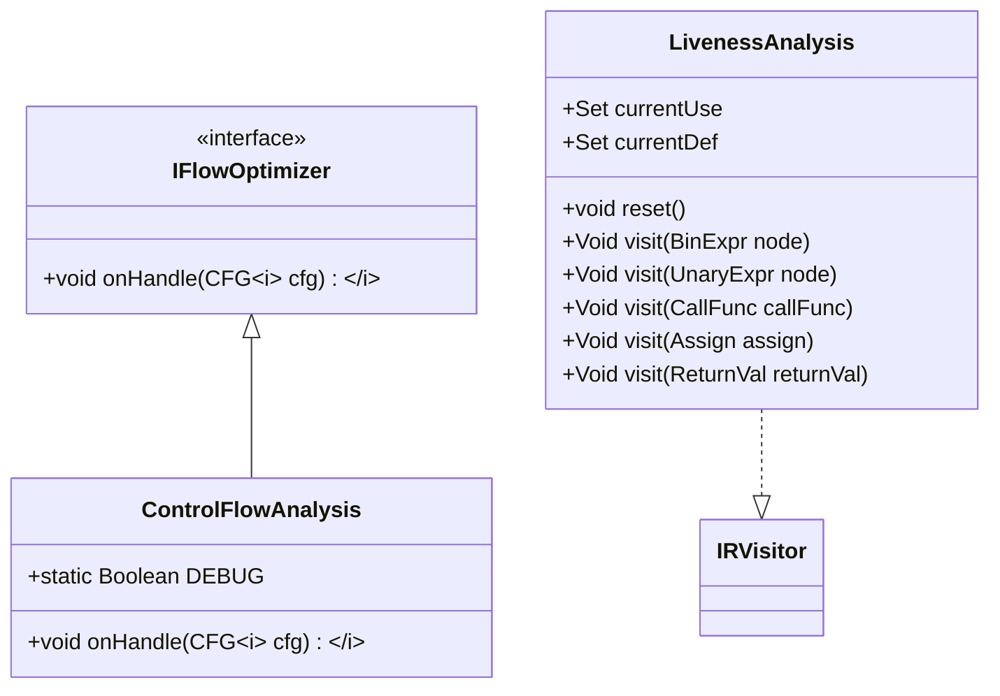
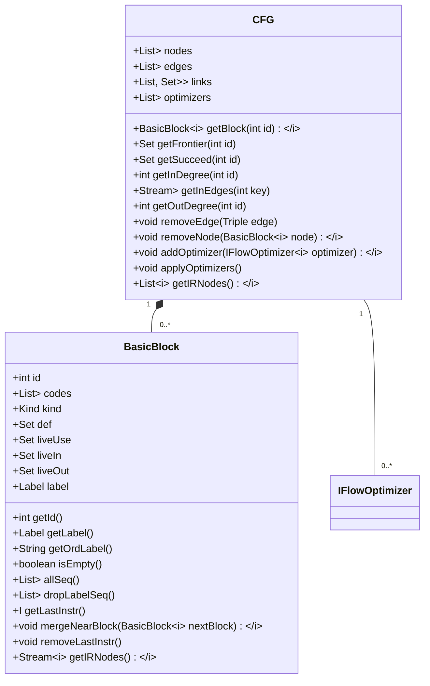
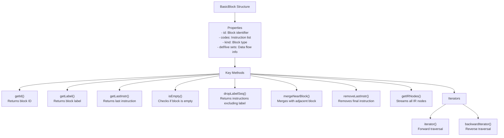
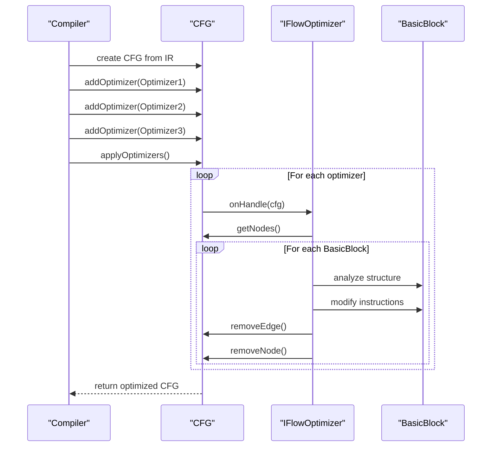
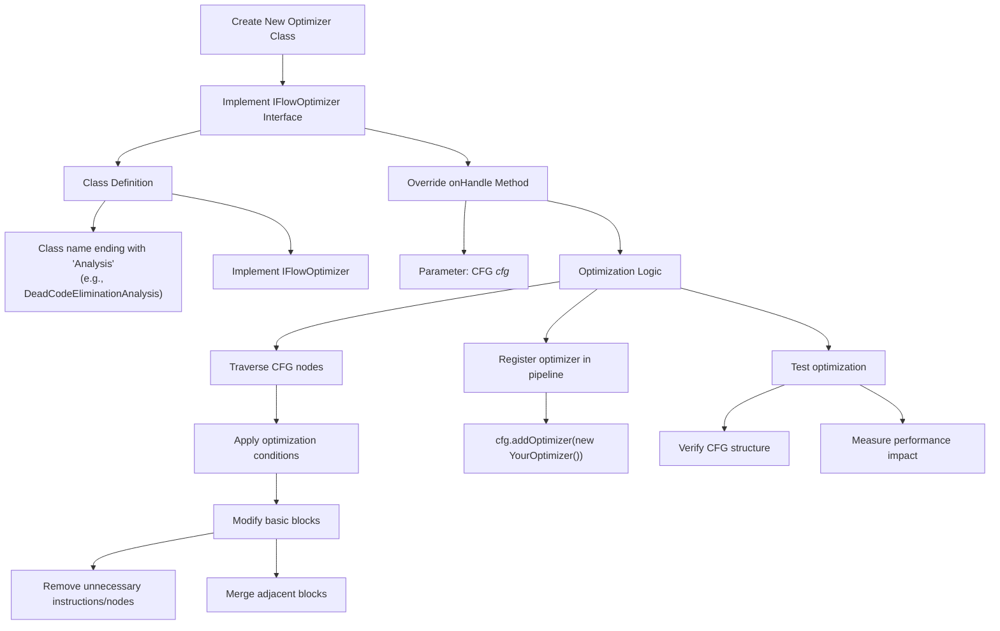
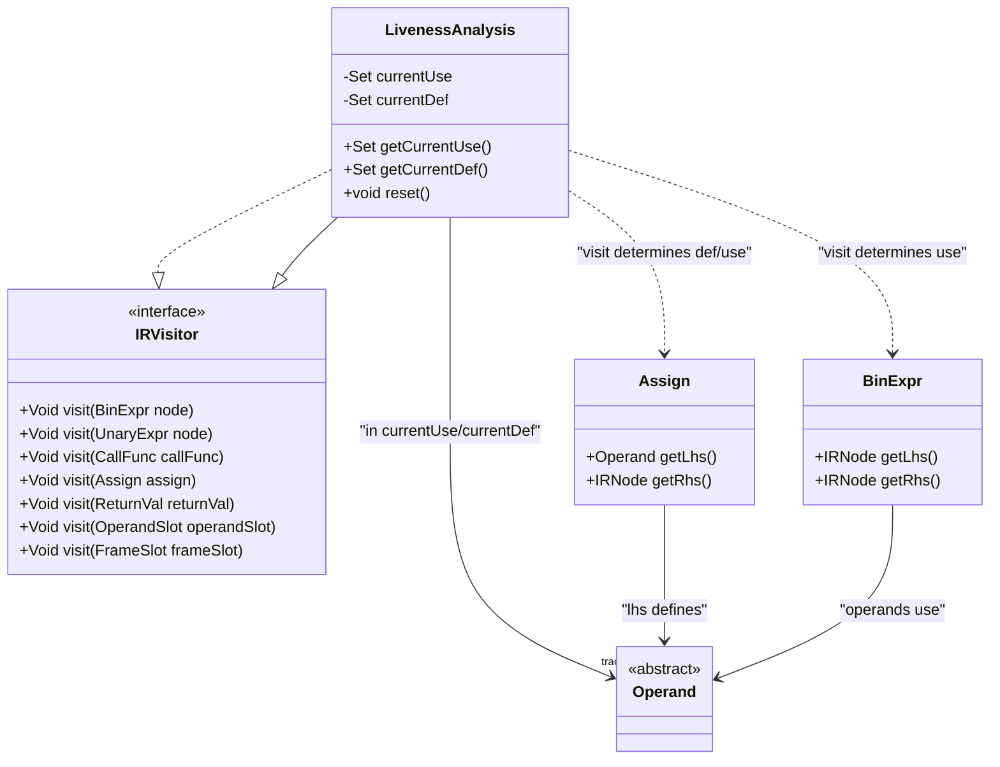
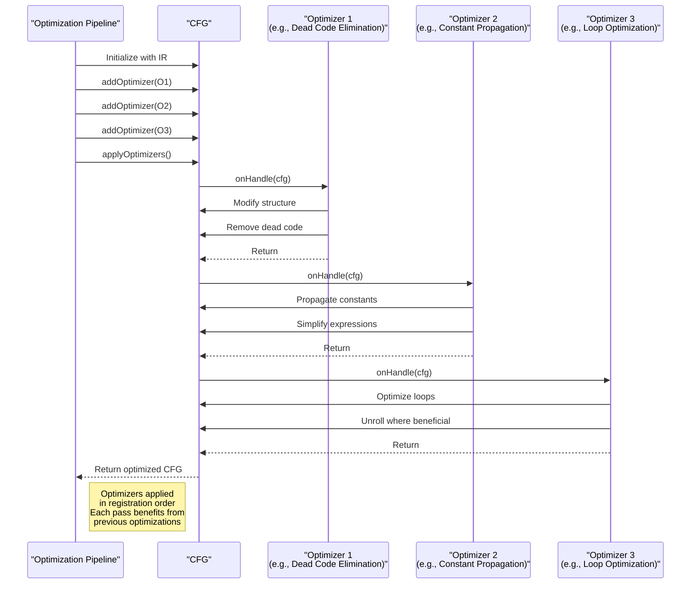

# Custom Optimization Passes with IFlowOptimizer

<cite>
**Referenced Files in This Document**   
- [IFlowOptimizer.java](file://ep20/src/main/java/org/teachfx/antlr4/ep20/pass/cfg/IFlowOptimizer.java)
- [ControlFlowAnalysis.java](file://ep20/src/main/java/org/teachfx/antlr4/ep20/pass/cfg/ControlFlowAnalysis.java)
- [LivenessAnalysis.java](file://ep20/src/main/java/org/teachfx/antlr4/ep20/pass/cfg/LivenessAnalysis.java)
- [CFG.java](file://ep20/src/main/java/org/teachfx/antlr4/ep20/pass/cfg/CFG.java)
- [BasicBlock.java](file://ep20/src/main/java/org/teachfx/antlr4/ep20/pass/cfg/BasicBlock.java)
- [IRNode.java](file://ep20/src/main/java/org/teachfx/antlr4/ep20/ir/IRNode.java)
</cite>

## Table of Contents
1. [Introduction](#introduction)
2. [IFlowOptimizer Interface](#iflowoptimizer-interface)
3. [Control Flow Graph (CFG) Data Structure](#control-flow-graph-cfg-data-structure)
4. [BasicBlock Structure and Traversal](#basicblock-structure-and-traversal)
5. [Integration in Compilation Pipeline](#integration-in-compilation-pipeline)
6. [Implementing Custom Optimization Passes](#implementing-custom-optimization-passes)
7. [Concrete Optimization Examples](#concrete-optimization-examples)
8. [Data Flow Analysis with LivenessAnalysis](#data-flow-analysis-with-livenessanalysis)
9. [Performance and Thread Safety Considerations](#performance-and-thread-safety-considerations)
10. [Chaining Multiple Optimizers](#chaining-multiple-optimizers)

## Introduction
The IFlowOptimizer interface provides a framework for implementing custom optimization passes in the compiler's intermediate representation (IR) processing pipeline. This document details how developers can leverage this interface to create optimization algorithms such as dead code elimination, constant propagation, and loop optimization. The optimization system operates on control flow graphs (CFG) composed of basic blocks, enabling structural and data flow optimizations during compilation.

**Section sources**
- [IFlowOptimizer.java](file://ep20/src/main/java/org/teachfx/antlr4/ep20/pass/cfg/IFlowOptimizer.java)
- [CFG.java](file://ep20/src/main/java/org/teachfx/antlr4/ep20/pass/cfg/CFG.java)

## IFlowOptimizer Interface
The IFlowOptimizer interface defines the contract for optimization passes that operate on control flow graphs. It serves as the foundation for implementing various optimization algorithms by providing a standardized way to process CFG structures.



**Diagram sources**
- [IFlowOptimizer.java](file://ep20/src/main/java/org/teachfx/antlr4/ep20/pass/cfg/IFlowOptimizer.java)
- [ControlFlowAnalysis.java](file://ep20/src/main/java/org/teachfx/antlr4/ep20/pass/cfg/ControlFlowAnalysis.java)
- [LivenessAnalysis.java](file://ep20/src/main/java/org/teachfx/antlr4/ep20/pass/cfg/LivenessAnalysis.java)

**Section sources**
- [IFlowOptimizer.java](file://ep20/src/main/java/org/teachfx/antlr4/ep20/pass/cfg/IFlowOptimizer.java)

## Control Flow Graph (CFG) Data Structure
The CFG class represents the control flow graph of a function, organizing basic blocks and their connections. It provides methods for graph manipulation, traversal, and optimization application.



**Diagram sources**
- [CFG.java](file://ep20/src/main/java/org/teachfx/antlr4/ep20/pass/cfg/CFG.java)
- [BasicBlock.java](file://ep20/src/main/java/org/teachfx/antlr4/ep20/pass/cfg/BasicBlock.java)

**Section sources**
- [CFG.java](file://ep20/src/main/java/org/teachfx/antlr4/ep20/pass/cfg/CFG.java)

## BasicBlock Structure and Traversal
BasicBlock represents a sequence of instructions with a single entry and exit point. It provides methods for instruction traversal, modification, and structural operations essential for optimization.



**Diagram sources**
- [BasicBlock.java](file://ep20/src/main/java/org/teachfx/antlr4/ep20/pass/cfg/BasicBlock.java)

**Section sources**
- [BasicBlock.java](file://ep20/src/main/java/org/teachfx/antlr4/ep20/pass/cfg/BasicBlock.java)

## Integration in Compilation Pipeline
The optimization system integrates into the compilation pipeline through the CFG's optimizer registration and application mechanism. Optimizers are registered and executed in sequence during the code generation phase.



**Diagram sources**
- [CFG.java](file://ep20/src/main/java/org/teachfx/antlr4/ep20/pass/cfg/CFG.java)
- [IFlowOptimizer.java](file://ep20/src/main/java/org/teachfx/antlr4/ep20/pass/cfg/IFlowOptimizer.java)

**Section sources**
- [CFG.java](file://ep20/src/main/java/org/teachfx/antlr4/ep20/pass/cfg/CFG.java)

## Implementing Custom Optimization Passes
Developers can implement custom optimization passes by creating classes that implement the IFlowOptimizer interface and overriding the onHandle method to define optimization logic.



**Section sources**
- [IFlowOptimizer.java](file://ep20/src/main/java/org/teachfx/antlr4/ep20/pass/cfg/IFlowOptimizer.java)
- [ControlFlowAnalysis.java](file://ep20/src/main/java/org/teachfx/antlr4/ep20/pass/cfg/ControlFlowAnalysis.java)

## Concrete Optimization Examples
The ControlFlowAnalysis class demonstrates concrete optimization patterns including basic block merging and redundant jump elimination.

```mermaid
flowchart TD
Start["ControlFlowAnalysis Optimization"] --> Step1["Step 1: Eliminate Redundant Jumps"]
Step1 --> Condition1["For each block with out-degree 1"]
Condition1 --> JumpCheck["Check if last instruction is JMP"]
JumpCheck --> TargetCheck["Verify JMP target matches successor"]
TargetCheck --> Remove["Remove JMP instruction and edge"]
Start --> Step2["Step 2: Merge Basic Blocks"]
Step2 --> InDegreeCheck["For each block with in-degree 1"]
InDegreeCheck --> SoloLink["Check single frontier and out-degree 1"]
SoloLink --> Merge["Merge with predecessor block"]
Merge --> Update["Update edges and remove node"]
Step2 --> Queue["Use removeQueue to safely remove nodes"]
Queue --> Process["Process all queued blocks"]
Step1 --> Benefits["Benefits"]
Step1 --> "Reduces instruction count"
Step1 --> "Eliminates unnecessary jumps"
Step1 --> "Improves cache performance"
Step2 --> Benefits2["Benefits"]
Step2 --> "Reduces block count"
Step2 --> "Improves branch prediction"
Step2 --> "Enables further optimizations"
```

**Diagram sources**
- [ControlFlowAnalysis.java](file://ep20/src/main/java/org/teachfx/antlr4/ep20/pass/cfg/ControlFlowAnalysis.java)

**Section sources**
- [ControlFlowAnalysis.java](file://ep20/src/main/java/org/teachfx/antlr4/ep20/pass/cfg/ControlFlowAnalysis.java)

## Data Flow Analysis with LivenessAnalysis
The LivenessAnalysis class implements data flow analysis to track variable usage and definition, essential for optimizations like dead code elimination and register allocation.



**Diagram sources**
- [LivenessAnalysis.java](file://ep20/src/main/java/org/teachfx/antlr4/ep20/pass/cfg/LivenessAnalysis.java)
- [IRVisitor.java](file://ep20/src/main/java/org/teachfx/antlr4/ep20/ir/IRVisitor.java)

**Section sources**
- [LivenessAnalysis.java](file://ep20/src/main/java/org/teachfx/antlr4/ep20/pass/cfg/LivenessAnalysis.java)

## Performance and Thread Safety Considerations
Optimization passes must consider performance implications and thread safety when modifying shared data structures.

```mermaid
flowchart TD
Performance["Performance Considerations"] --> Complexity["Time Complexity"]
Complexity --> "O(n) for CFG traversal"
Complexity --> "O(1) for edge/node operations"
Complexity --> "Minimize redundant traversals"
Performance --> Memory["Memory Usage"]
Memory --> "Avoid unnecessary object creation"
Memory --> "Reuse collections when possible"
Memory --> "Consider memory footprint of data flow sets"
ThreadSafety["Thread Safety"] --> SingleThread["Single-threaded assumption"]
SingleThread --> "No synchronization needed"
SingleThread --> "CFG modifications during traversal"
ThreadSafety --> Concurrent["Concurrent Execution"]
Concurrent --> "Not supported by current design"
Concurrent --> "Sequential application required"
Concurrent --> "Immutable CFG between passes"
BestPractices["Best Practices"] --> Efficient["Efficient Traversal"]
BestPractices --> "Use iterator() and backwardIterator()"
BestPractices --> "Cache frequently accessed properties"
BestPractices --> SafeModification["Safe Modification"]
BestPractices --> "Use removeQueue for node removal"
BestPractices --> "Update edges before removing nodes"
BestPractices --> "Validate CFG integrity after modifications"
```

**Section sources**
- [ControlFlowAnalysis.java](file://ep20/src/main/java/org/teachfx/antlr4/ep20/pass/cfg/ControlFlowAnalysis.java)
- [CFG.java](file://ep20/src/main/java/org/teachfx/antlr4/ep20/pass/cfg/CFG.java)

## Chaining Multiple Optimizers
Multiple optimizers can be chained together to perform comprehensive optimization, with each pass potentially enabling further optimizations in subsequent passes.



**Diagram sources**
- [CFG.java](file://ep20/src/main/java/org/teachfx/antlr4/ep20/pass/cfg/CFG.java)
- [IFlowOptimizer.java](file://ep20/src/main/java/org/teachfx/antlr4/ep20/pass/cfg/IFlowOptimizer.java)

**Section sources**
- [CFG.java](file://ep20/src/main/java/org/teachfx/antlr4/ep20/pass/cfg/CFG.java)