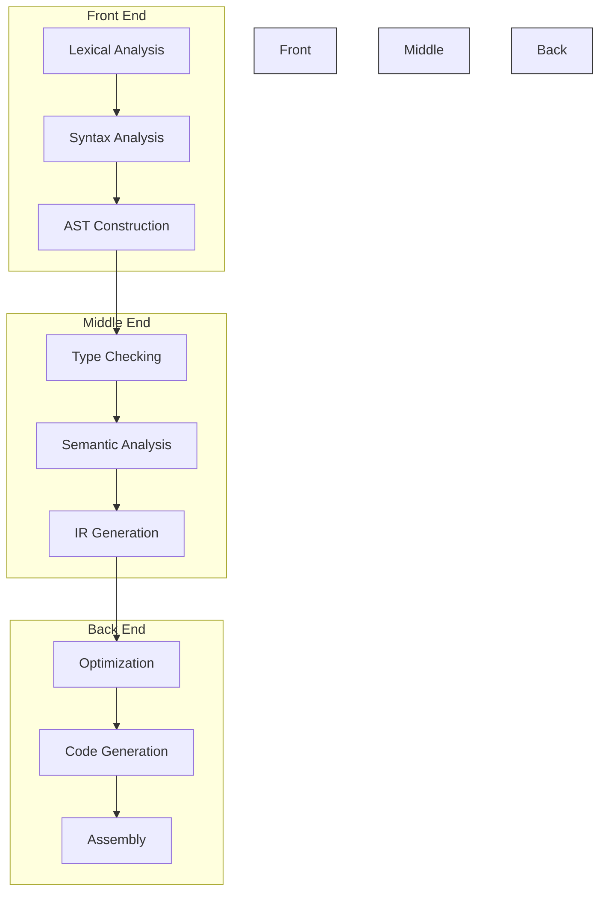
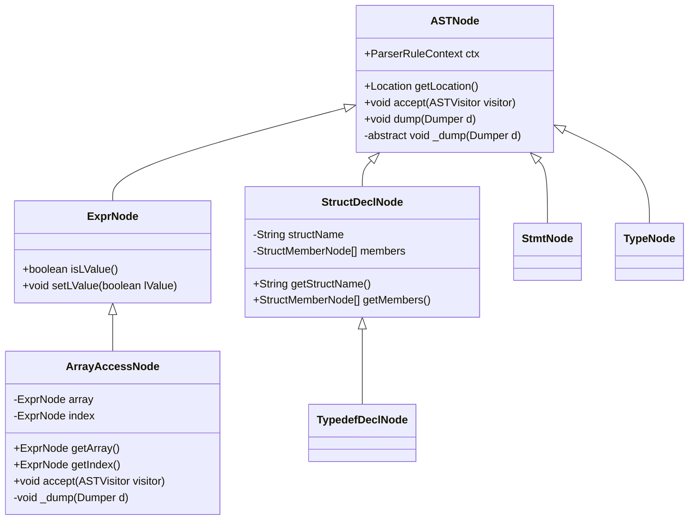
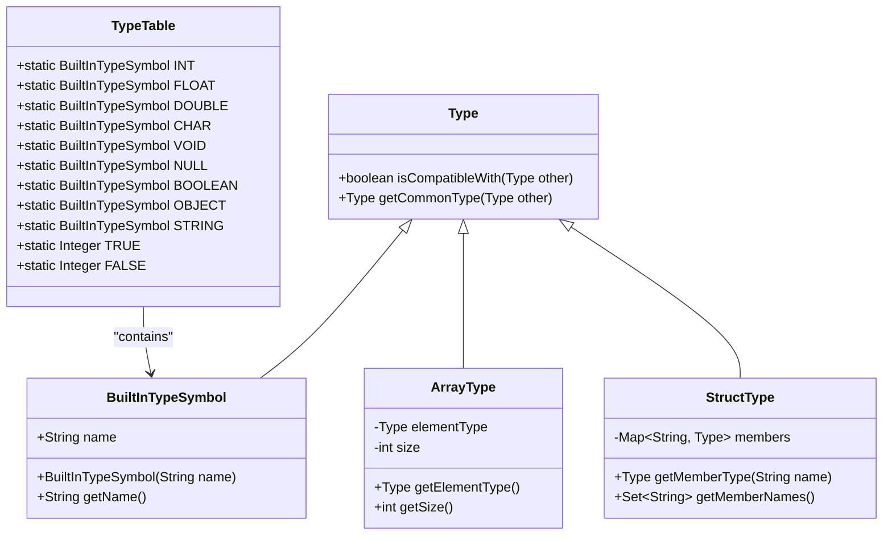
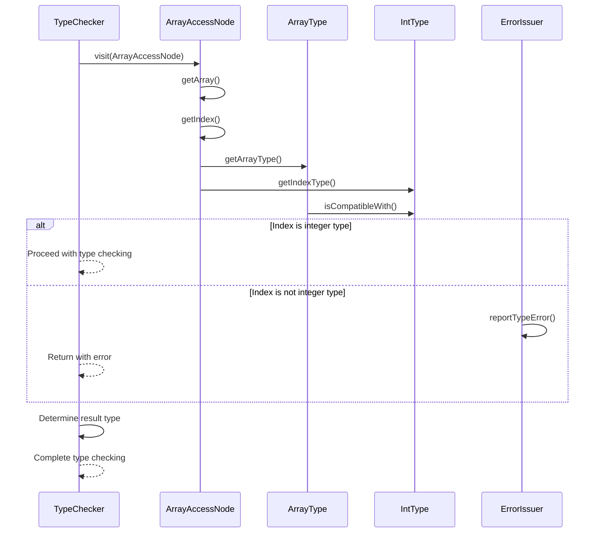
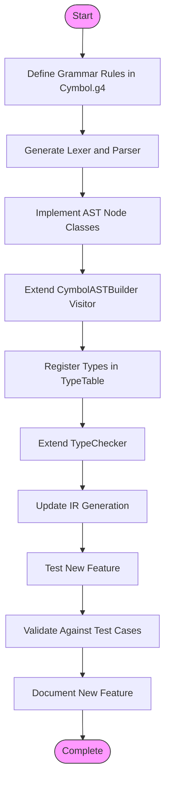
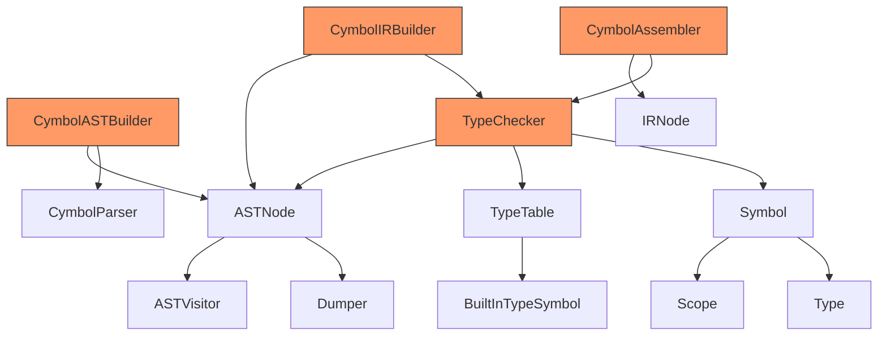

# Extending the Cymbol Language with Custom Features

<cite>
**Referenced Files in This Document**   
- [ASTNode.java](file://ep20/src/main/java/org/teachfx/antlr4/ep20/ast/ASTNode.java)
- [TypeTable.java](file://ep20/src/main/java/org/teachfx/antlr4/ep20/symtab/type/TypeTable.java)
- [TypeChecker.java](file://ep20/src/main/java/org/teachfx/antlr4/ep20/pass/sematic/TypeChecker.java)
- [Cymbol.g4](file://ep20/src/main/antlr4/org/teachfx/antlr4/ep20/parser/Cymbol.g4)
- [ArrayAccessNode.java](file://ep20/src/main/java/org/teachfx/antlr4/ep20/ast/expr/ArrayAccessNode.java)
- [CymbolASTBuilder.java](file://ep20/src/main/java/org/teachfx/antlr4/ep20/pass/ast/CymbolASTBuilder.java)
- [tasks.md](file://ep19/docs/tasks.md)
</cite>

## Table of Contents
1. [Introduction](#introduction)
2. [Project Structure](#project-structure)
3. [Core Components](#core-components)
4. [Architecture Overview](#architecture-overview)
5. [Detailed Component Analysis](#detailed-component-analysis)
6. [Dependency Analysis](#dependency-analysis)
7. [Performance Considerations](#performance-considerations)
8. [Troubleshooting Guide](#troubleshooting-guide)
9. [Conclusion](#conclusion)

## Introduction
This document provides comprehensive guidance on extending the Cymbol programming language with new syntactic and semantic features. It details the process of adding custom Abstract Syntax Tree (AST) node types, registering new data types, extending the type checker, and modifying the grammar to support advanced language constructs such as arrays, structs, and generics. The documentation covers the complete extension workflow from syntax definition to semantic analysis and integration with downstream compilation phases.

## Project Structure
The Cymbol language implementation follows a modular architecture with distinct components for parsing, AST construction, semantic analysis, and code generation. The project is organized into packages that separate concerns and facilitate extensibility.

```mermaid
graph TD
subgraph "AST"
ASTNode[ASTNode]
ExprNode[ExprNode]
StmtNode[StmtNode]
TypeNode[TypeNode]
end
subgraph "Parser"
Lexer[CymbolLexer]
Parser[CymbolParser]
Grammar[Cymbol.g4]
end
subgraph "Semantic Analysis"
TypeTable[TypeTable]
TypeChecker[TypeChecker]
SymbolTable[Symbol Table]
end
subgraph "Code Generation"
IRBuilder[CymbolIRBuilder]
Assembler[CymbolAssembler]
end
subgraph "Visitor Pattern"
ASTVisitor[ASTVisitor]
CymbolASTBuilder[CymbolASTBuilder]
end
ASTNode --> ASTVisitor
ASTVisitor --> CymbolASTBuilder
CymbolASTBuilder --> Parser
Parser --> Lexer
CymbolASTBuilder --> ASTNode
TypeChecker --> ASTNode
TypeChecker --> TypeTable
IRBuilder --> ASTNode
Assembler --> IRBuilder
```

**Diagram sources**
- [ASTNode.java](file://ep20/src/main/java/org/teachfx/antlr4/ep20/ast/ASTNode.java)
- [Cymbol.g4](file://ep20/src/main/antlr4/org/teachfx/antlr4/ep20/parser/Cymbol.g4)
- [TypeTable.java](file://ep20/src/main/java/org/teachfx/antlr4/ep20/symtab/type/TypeTable.java)

**Section sources**
- [ASTNode.java](file://ep20/src/main/java/org/teachfx/antlr4/ep20/ast/ASTNode.java)
- [Cymbol.g4](file://ep20/src/main/antlr4/org/teachfx/antlr4/ep20/parser/Cymbol.g4)

## Core Components
The Cymbol language extension framework is built around several core components that enable the addition of new language features. These components include the AST node hierarchy, visitor pattern implementation, type system infrastructure, and grammar definition.

**Section sources**
- [ASTNode.java](file://ep20/src/main/java/org/teachfx/antlr4/ep20/ast/ASTNode.java)
- [TypeTable.java](file://ep20/src/main/java/org/teachfx/antlr4/ep20/symtab/type/TypeTable.java)
- [TypeChecker.java](file://ep20/src/main/java/org/teachfx/antlr4/ep20/pass/sematic/TypeChecker.java)

## Architecture Overview
The Cymbol compiler architecture follows a multi-phase approach to language processing, with well-defined interfaces between phases. This architecture enables modular extensions to the language without disrupting existing functionality.



**Diagram sources**
- [CymbolASTBuilder.java](file://ep20/src/main/java/org/teachfx/antlr4/ep20/pass/ast/CymbolASTBuilder.java)
- [TypeChecker.java](file://ep20/src/main/java/org/teachfx/antlr4/ep20/pass/sematic/TypeChecker.java)
- [Cymbol.g4](file://ep20/src/main/antlr4/org/teachfx/antlr4/ep20/parser/Cymbol.g4)

## Detailed Component Analysis

### AST Node Extension
To extend the Cymbol language with new syntactic features, developers must create custom AST node types by extending the base `ASTNode` class. Each new node type should implement appropriate visitor patterns to enable traversal and processing.



**Diagram sources**
- [ASTNode.java](file://ep20/src/main/java/org/teachfx/antlr4/ep20/ast/ASTNode.java)
- [ArrayAccessNode.java](file://ep20/src/main/java/org/teachfx/antlr4/ep20/ast/expr/ArrayAccessNode.java)

### Type System Extension
The Cymbol type system can be extended by registering new data types through the `TypeTable` class and defining type compatibility rules. This enables the language to support custom data structures and type relationships.



**Diagram sources**
- [TypeTable.java](file://ep20/src/main/java/org/teachfx/antlr4/ep20/symtab/type/TypeTable.java)
- [BuiltInTypeSymbol.java](file://ep20/src/main/java/org/teachfx/antlr4/ep20/symtab/type/BuiltInTypeSymbol.java)

### Type Checker Extension
The `TypeChecker` class can be extended to handle new operators or type inference rules by overriding the appropriate visitor methods. This enables semantic analysis of new language features.



**Diagram sources**
- [TypeChecker.java](file://ep20/src/main/java/org/teachfx/antlr4/ep20/pass/sematic/TypeChecker.java)
- [ArrayAccessNode.java](file://ep20/src/main/java/org/teachfx/antlr4/ep20/ast/expr/ArrayAccessNode.java)

### Grammar Extension Process
Extending the Cymbol grammar involves modifying the ANTLR4 grammar file (Cymbol.g4) to include new syntactic constructs, then implementing corresponding AST nodes and visitor methods.



**Diagram sources**
- [Cymbol.g4](file://ep20/src/main/antlr4/org/teachfx/antlr4/ep20/parser/Cymbol.g4)
- [CymbolASTBuilder.java](file://ep20/src/main/java/org/teachfx/antlr4/ep20/pass/ast/CymbolASTBuilder.java)

**Section sources**
- [Cymbol.g4](file://ep20/src/main/antlr4/org/teachfx/antlr4/ep20/parser/Cymbol.g4)
- [CymbolASTBuilder.java](file://ep20/src/main/java/org/teachfx/antlr4/ep20/pass/ast/CymbolASTBuilder.java)

## Dependency Analysis
The Cymbol language extension components have well-defined dependencies that ensure modularity and maintainability. Understanding these dependencies is crucial for successful feature implementation.



**Diagram sources**
- [CymbolASTBuilder.java](file://ep20/src/main/java/org/teachfx/antlr4/ep20/pass/ast/CymbolASTBuilder.java)
- [TypeChecker.java](file://ep20/src/main/java/org/teachfx/antlr4/ep20/pass/sematic/TypeChecker.java)
- [ASTNode.java](file://ep20/src/main/java/org/teachfx/antlr4/ep20/ast/ASTNode.java)

**Section sources**
- [CymbolASTBuilder.java](file://ep20/src/main/java/org/teachfx/antlr4/ep20/pass/ast/CymbolASTBuilder.java)
- [TypeChecker.java](file://ep20/src/main/java/org/teachfx/antlr4/ep20/pass/sematic/TypeChecker.java)

## Performance Considerations
When extending the Cymbol language, consider the performance implications of new features on compilation time and runtime efficiency. The architecture supports optimization at multiple levels.

**Section sources**
- [CymbolIRBuilder.java](file://ep20/src/main/java/org/teachfx/antlr4/ep20/pass/ir/CymbolIRBuilder.java)
- [CymbolAssembler.java](file://ep20/src/main/java/org/teachfx/antlr4/ep20/pass/codegen/CymbolAssembler.java)

## Troubleshooting Guide
When implementing new language features, common issues include syntax errors, type checking failures, and incorrect code generation. The following guidance helps diagnose and resolve these issues.

**Section sources**
- [TypeChecker.java](file://ep20/src/main/java/org/teachfx/antlr4/ep20/pass/sematic/TypeChecker.java)
- [CymbolASTBuilder.java](file://ep20/src/main/java/org/teachfx/antlr4/ep20/pass/ast/CymbolASTBuilder.java)
- [tasks.md](file://ep19/docs/tasks.md)

## Conclusion
Extending the Cymbol language with custom features requires a systematic approach that integrates syntax definition, AST construction, semantic analysis, and code generation. By following the patterns established in the existing codebase, developers can successfully add new language constructs such as arrays, structs, and generics while maintaining backward compatibility and ensuring proper error reporting. The modular architecture and visitor pattern implementation provide a robust foundation for language extension and evolution.