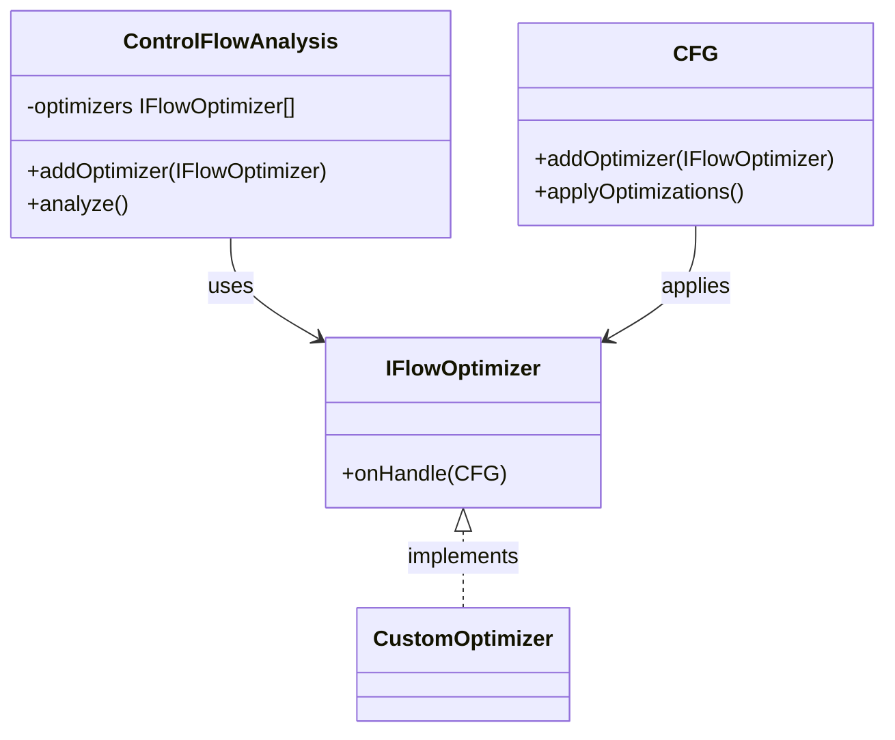
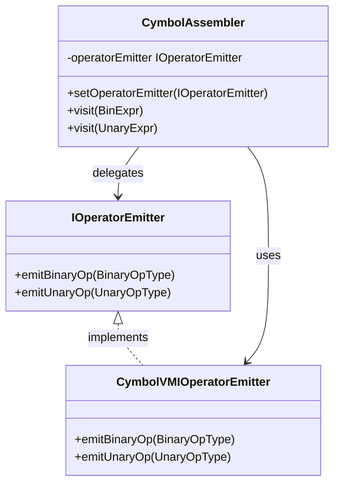
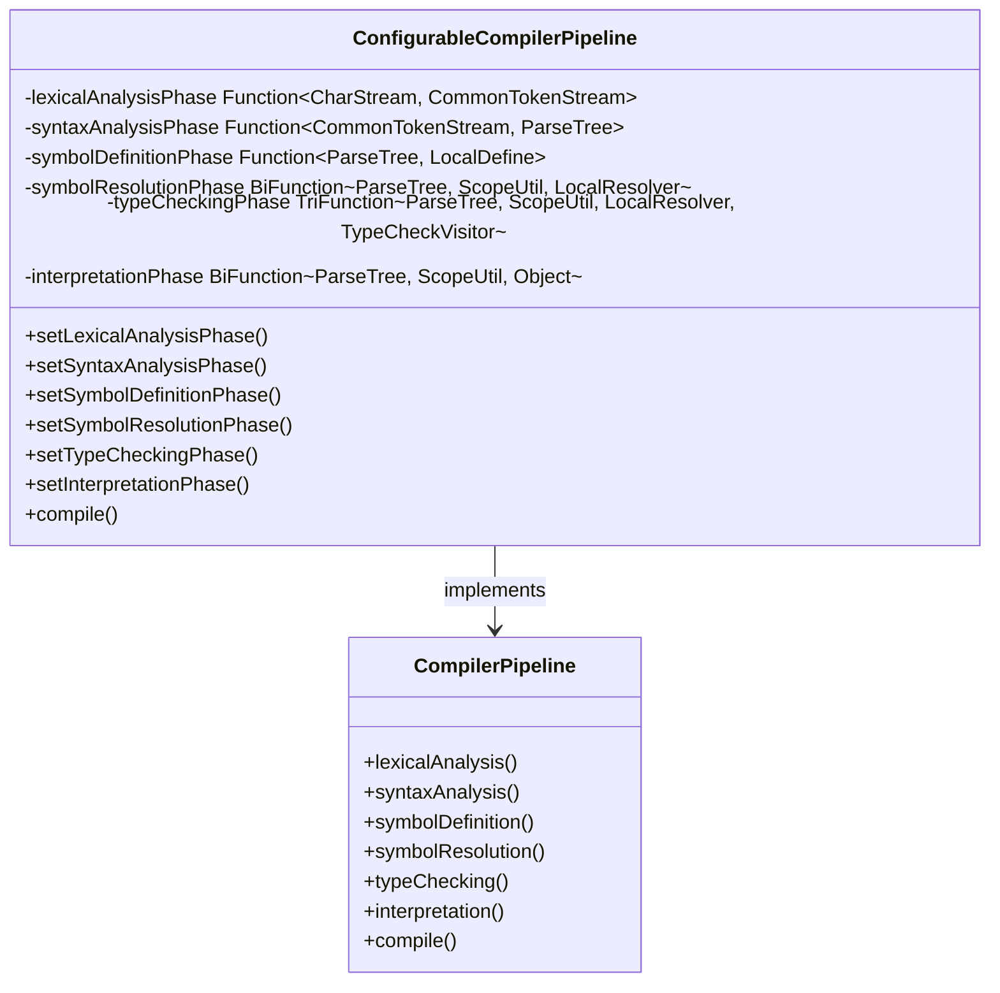

# Extensibility and Plugin Architecture

<cite>
**Referenced Files in This Document**   
- [IFlowOptimizer.java](file://ep20/src/main/java/org/teachfx/antlr4/ep20/pass/cfg/IFlowOptimizer.java)
- [IOperatorEmitter.java](file://ep20/src/main/java/org/teachfx/antlr4/ep20/pass/codegen/IOperatorEmitter.java)
- [ConfigurableCompilerPipeline.java](file://ep19/src/main/java/org/teachfx/antlr4/ep19/pipeline/ConfigurableCompilerPipeline.java)
- [CymbolAssembler.java](file://ep20/src/main/java/org/teachfx/antlr4/ep20/pass/codegen/CymbolAssembler.java)
- [ControlFlowAnalysis.java](file://ep20/src/main/java/org/teachfx/antlr4/ep20/pass/cfg/ControlFlowAnalysis.java)
- [CFG.java](file://ep20/src/main/java/org/teachfx/antlr4/ep20/pass/cfg/CFG.java)
- [CymbolVMIOperatorEmitter.java](file://ep20/src/main/java/org/teachfx/antlr4/ep20/pass/codegen/CymbolVMIOperatorEmitter.java)
</cite>

## Table of Contents
1. [Introduction](#introduction)
2. [Plugin Architecture for Optimization Passes](#plugin-architecture-for-optimization-passes)
3. [Code Generation Backend Abstraction](#code-generation-backend-abstraction)
4. [Configurable Compilation Pipeline](#configurable-compilation-pipeline)
5. [Extension Points for Language Features](#extension-points-for-language-features)
6. [Implementation Examples](#implementation-examples)
7. [Design Principles for Extensibility](#design-principles-for-extensibility)
8. [Conclusion](#conclusion)

## Introduction
This document details the extensibility mechanisms implemented in the compiler architecture, focusing on plugin interfaces that enable customization of optimization passes, code generation backends, and compilation pipeline configuration. The system is designed to support modular extension while maintaining core stability and performance. Key extension points include the `IFlowOptimizer` interface for control flow optimizations, the `IOperatorEmitter` abstraction for target-specific code generation, and the `ConfigurableCompilerPipeline` class that enables flexible phase orchestration. These mechanisms collectively provide a robust foundation for extending the compiler's capabilities without modifying its core components.

## Plugin Architecture for Optimization Passes

The compiler implements a plugin architecture for custom optimization passes through the `IFlowOptimizer` interface. This interface defines a contract for optimization modules that operate on control flow graphs (CFGs), enabling developers to implement domain-specific optimizations that can be seamlessly integrated into the compilation process. Each optimizer receives a CFG as input and can modify its structure according to specific optimization rules.

**Diagram sources**
- [IFlowOptimizer.java](file://ep20/src/main/java/org/teachfx/antlr4/ep20/pass/cfg/IFlowOptimizer.java#L4-L6)
- [ControlFlowAnalysis.java](file://ep20/src/main/java/org/teachfx/antlr4/ep20/pass/cfg/ControlFlowAnalysis.java#L15-L30)
- [CFG.java](file://ep20/src/main/java/org/teachfx/antlr4/ep20/pass/cfg/CFG.java#L25-L40)

The optimization framework follows a visitor pattern where multiple optimizers can be registered with the control flow analysis component. During compilation, the framework iterates through all registered optimizers, applying their transformations to the CFG. This design supports optimization chaining, where the output of one optimization pass serves as input to subsequent passes, enabling complex optimization sequences.

**Section sources**
- [IFlowOptimizer.java](file://ep20/src/main/java/org/teachfx/antlr4/ep20/pass/cfg/IFlowOptimizer.java#L4-L6)
- [ControlFlowAnalysis.java](file://ep20/src/main/java/org/teachfx/antlr4/ep20/pass/cfg/ControlFlowAnalysis.java#L15-L50)
- [CFG.java](file://ep20/src/main/java/org/teachfx/antlr4/ep20/pass/cfg/CFG.java#L25-L60)

## Code Generation Backend Abstraction

The compiler abstracts code generation through the `IOperatorEmitter` interface, which decouples the intermediate representation processing from target-specific instruction emission. This abstraction enables the development of alternative code generators for different target architectures by implementing the operator emission logic for each supported operation type.

**Diagram sources**
- [IOperatorEmitter.java](file://ep20/src/main/java/org/teachfx/antlr4/ep20/pass/codegen/IOperatorEmitter.java#L4-L8)
- [CymbolAssembler.java](file://ep20/src/main/java/org/teachfx/antlr4/ep20/pass/codegen/CymbolAssembler.java#L35-L50)
- [CymbolVMIOperatorEmitter.java](file://ep20/src/main/java/org/teachfx/antlr4/ep20/pass/codegen/CymbolVMIOperatorEmitter.java#L10-L25)

The `IOperatorEmitter` interface defines methods for emitting instructions for binary and unary operations, with operation types enumerated in the `OperatorType` class. The `CymbolAssembler` class uses dependency injection to receive an `IOperatorEmitter` implementation, allowing runtime selection of code generation backends. This design supports multiple target architectures from a single compilation pipeline by simply swapping the emitter implementation.

**Section sources**
- [IOperatorEmitter.java](file://ep20/src/main/java/org/teachfx/antlr4/ep20/pass/codegen/IOperatorEmitter.java#L4-L8)
- [CymbolAssembler.java](file://ep20/src/main/java/org/teachfx/antlr4/ep20/pass/codegen/CymbolAssembler.java#L35-L75)
- [CymbolVMIOperatorEmitter.java](file://ep20/src/main/java/org/teachfx/antlr4/ep20/pass/codegen/CymbolVMIOperatorEmitter.java#L10-L30)

## Configurable Compilation Pipeline

The `ConfigurableCompilerPipeline` class provides a flexible framework for customizing the compilation process by allowing developers to configure the execution order and selection of compilation phases. This implementation uses functional programming concepts, representing each phase as a function that can be replaced or modified.

**Diagram sources**
- [ConfigurableCompilerPipeline.java](file://ep19/src/main/java/org/teachfx/antlr4/ep19/pipeline/ConfigurableCompilerPipeline.java#L24-L80)
- [CompilerPipeline.java](file://ep19/src/main/java/org/teachfx/antlr4/ep19/pipeline/CompilerPipeline.java#L10-L25)

The pipeline supports method chaining for fluent configuration, allowing developers to construct customized compilation workflows through a series of setter methods. Each phase is represented as a functional interface, enabling lambda expressions or method references to be used for phase implementation. The pipeline also includes a flag to control whether interpretation is performed, allowing compilation to stop at intermediate stages for analysis or debugging purposes.

**Section sources**
- [ConfigurableCompilerPipeline.java](file://ep19/src/main/java/org/teachfx/antlr4/ep19/pipeline/ConfigurableCompilerPipeline.java#L24-L369)

## Extension Points for Language Features

The compiler architecture provides multiple extension points for adding new language features, including custom AST node types and semantic analysis rules. The AST visitor pattern, implemented through the `ASTVisitor` interface, allows new node types to be processed without modifying existing visitor implementations. New language constructs can be added by extending the grammar definition and implementing corresponding visitor methods.

The symbol table system, based on the `Scope` and `Symbol` classes, supports extensible semantic analysis through pluggable visitors. Developers can implement custom analysis passes by creating new visitor classes that traverse the AST and enforce domain-specific rules. The type system, centered around the `TypeTable` and `TypeChecker` classes, can be extended to support new data types and type relationships.

These extension mechanisms follow the Open/Closed Principle, allowing the compiler to be extended without modifying existing code. New features are implemented as separate components that integrate with the core system through well-defined interfaces, minimizing the risk of introducing regressions in established functionality.

## Implementation Examples

To implement a new optimization pass, developers create a class that implements the `IFlowOptimizer` interface and override the `onHandle` method to define the optimization logic. The optimizer can be registered with the control flow analysis component using the `addOptimizer` method. For example, a dead code elimination pass would analyze the CFG to identify unreachable basic blocks and remove them from the graph.

To develop a new code generation backend, developers implement the `IOperatorEmitter` interface, providing concrete implementations for `emitBinaryOp` and `emitUnaryOp` methods that generate instructions for the target architecture. The new emitter can be injected into the `CymbolAssembler` class using the `setOperatorEmitter` method, replacing the default implementation.

Custom compilation pipelines can be configured by instantiating `ConfigurableCompilerPipeline` and using the fluent API to set specific phase implementations. For example, a pipeline for static analysis might disable the interpretation phase and replace the type checking phase with a more comprehensive analysis pass.

## Design Principles for Extensibility

The compiler's extensibility architecture is guided by several key design principles that balance flexibility with stability. The Interface Segregation Principle is applied through focused interfaces like `IFlowOptimizer` and `IOperatorEmitter`, which define minimal contracts for specific extension points. This prevents plugins from being forced to implement irrelevant methods and reduces coupling between components.

Dependency inversion is used extensively, with high-level components depending on abstractions rather than concrete implementations. This allows alternative implementations to be substituted without modifying the components that use them. The strategy pattern is employed for compilation phases, treating each phase as a replaceable algorithm.

The system follows the Single Responsibility Principle, with each component having a well-defined purpose. This modularity enables extensions to be developed and tested in isolation. Performance is maintained through careful design of the extension mechanisms, ensuring that plugin invocation overhead is minimized and that the core compilation process remains efficient.

## Conclusion
The compiler's extensibility mechanisms provide a comprehensive framework for customizing and extending its functionality. Through well-defined interfaces for optimization passes, code generation backends, and pipeline configuration, developers can adapt the compiler to specific requirements without compromising its core stability. The architecture demonstrates effective application of object-oriented design principles, creating a flexible system that can evolve to support new languages, targets, and optimization techniques. These extensibility features make the compiler suitable for both academic research and industrial applications where customization and adaptation are essential.