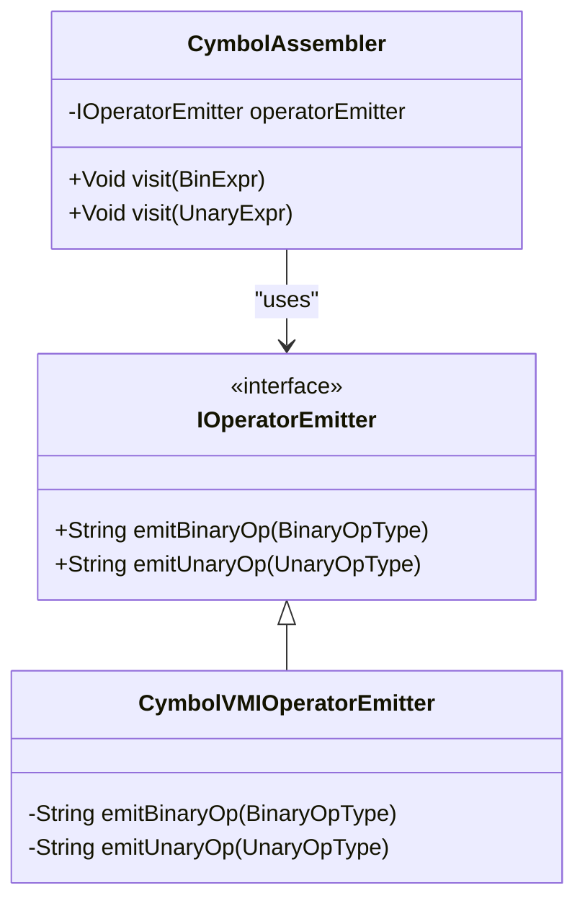
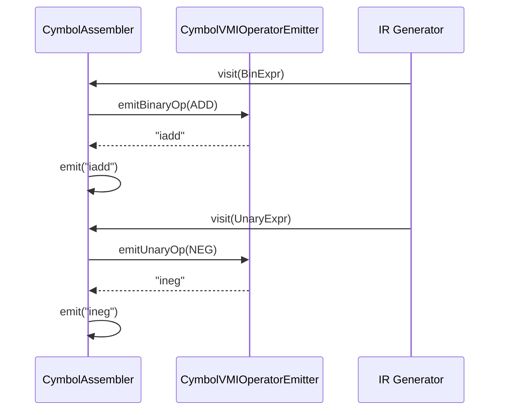
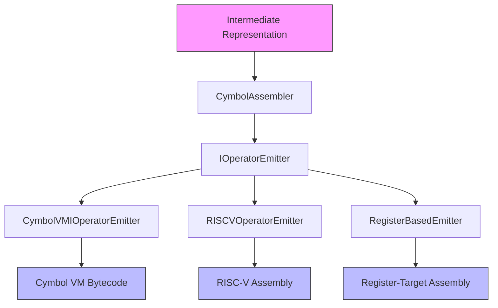

# Target-Independent Code Generation via IOperatorEmitter

<cite>
**Referenced Files in This Document**   
- [IOperatorEmitter.java](file://ep20/src/main/java/org/teachfx/antlr4/ep20/pass/codegen/IOperatorEmitter.java)
- [CymbolVMIOperatorEmitter.java](file://ep20/src/main/java/org/teachfx/antlr4/ep20/pass/codegen/CymbolVMIOperatorEmitter.java)
- [CymbolAssembler.java](file://ep20/src/main/java/org/teachfx/antlr4/ep20/pass/codegen/CymbolAssembler.java)
- [OperatorType.java](file://ep20/src/main/java/org/teachfx/antlr4/ep20/symtab/type/OperatorType.java)
</cite>

## Table of Contents
1. [Introduction](#introduction)
2. [IOperatorEmitter Interface Design](#ioperatoremitter-interface-design)
3. [Method Specifications](#method-specifications)
4. [CymbolVMIOperatorEmitter Implementation](#cymbolvmioperatoremitter-implementation)
5. [CymbolAssembler Integration](#cymbolassembler-integration)
6. [Implementing New Emitters](#implementing-new-emitters)
7. [Architecture Diagram](#architecture-diagram)
8. [Performance Optimization Tips](#performance-optimization-tips)
9. [Conclusion](#conclusion)

## Introduction
The IOperatorEmitter interface provides a target-independent abstraction for code generation in the Cymbol compiler framework. This design enables the compiler to support multiple backend architectures by decoupling the intermediate representation processing from specific instruction set architectures. The interface serves as a bridge between the compiler's three-address code representation and various target platforms, allowing for flexible backend development and easy extension to new architectures.

**Section sources**
- [IOperatorEmitter.java](file://ep20/src/main/java/org/teachfx/antlr4/ep20/pass/codegen/IOperatorEmitter.java)

## IOperatorEmitter Interface Design
The IOperatorEmitter interface defines a clean contract for instruction emission that abstracts away target-specific details. This interface is central to the compiler's backend abstraction, enabling the generation of architecture-specific instructions from a common intermediate representation. By providing a standardized way to emit operations, the interface allows the compiler to maintain a single codebase for optimization and analysis while supporting multiple output formats.

The interface design follows the dependency inversion principle, where high-level modules (code generation) depend on abstractions rather than concrete implementations. This approach facilitates dependency injection in the CymbolAssembler class, which can be configured with different emitter implementations at runtime based on the target architecture.



**Diagram sources**
- [IOperatorEmitter.java](file://ep20/src/main/java/org/teachfx/antlr4/ep20/pass/codegen/IOperatorEmitter.java)
- [CymbolVMIOperatorEmitter.java](file://ep20/src/main/java/org/teachfx/antlr4/ep20/pass/codegen/CymbolVMIOperatorEmitter.java)
- [CymbolAssembler.java](file://ep20/src/main/java/org/teachfx/antlr4/ep20/pass/codegen/CymbolAssembler.java)

**Section sources**
- [IOperatorEmitter.java](file://ep20/src/main/java/org/teachfx/antlr4/ep20/pass/codegen/IOperatorEmitter.java)

## Method Specifications
The IOperatorEmitter interface defines two primary methods for handling different types of operations in the intermediate representation.

### emitBinaryOp Method
The emitBinaryOp method translates binary operations from the intermediate representation to target-specific assembly instructions. It accepts a BinaryOpType enum parameter that represents various arithmetic, comparison, and logical operations. The method returns a string representing the corresponding assembly instruction for the target architecture.

**Parameters:**
- `binaryOpType`: An enum value from OperatorType.BinaryOpType representing the operation to emit

**Supported Operations:**
- Arithmetic: ADD, SUB, MUL, DIV, MOD
- Comparison: EQ, NE, LT, LE, GT, GE
- Logical: AND, OR

### emitUnaryOp Method
The emitUnaryOp method handles unary operations in the intermediate representation. It takes a UnaryOpType enum parameter and returns the appropriate assembly instruction string for the target platform.

**Parameters:**
- `unaryOpType`: An enum value from OperatorType.UnaryOpType representing the unary operation

**Supported Operations:**
- NEG (arithmetic negation)
- NOT (logical negation)

These methods provide a complete interface for handling all primitive operations in the Cymbol language, enabling the generation of assembly code for complex expressions through composition.

**Section sources**
- [IOperatorEmitter.java](file://ep20/src/main/java/org/teachfx/antlr4/ep20/pass/codegen/IOperatorEmitter.java)
- [OperatorType.java](file://ep20/src/main/java/org/teachfx/antlr4/ep20/symtab/type/OperatorType.java)

## CymbolVMIOperatorEmitter Implementation
The CymbolVMIOperatorEmitter class provides a concrete implementation of the IOperatorEmitter interface for the Cymbol virtual machine target. This implementation maps intermediate representation operations to stack-based bytecode instructions used by the Cymbol VM.

The implementation uses switch expressions to efficiently map each operation type to its corresponding instruction mnemonic. For binary operations, it returns instructions prefixed with "i" (indicating integer operations) followed by the operation name (e.g., "iadd" for addition). Unary operations follow a similar pattern with "ineg" for negation and "inot" for logical negation.

The implementation demonstrates how target-specific considerations are encapsulated within the emitter. For example, the stack-based nature of the Cymbol VM means that operations implicitly work with values on the stack, requiring no explicit operand specification in the generated instructions.



**Diagram sources**
- [CymbolVMIOperatorEmitter.java](file://ep20/src/main/java/org/teachfx/antlr4/ep20/pass/codegen/CymbolVMIOperatorEmitter.java)
- [CymbolAssembler.java](file://ep20/src/main/java/org/teachfx/antlr4/ep20/pass/codegen/CymbolAssembler.java)

**Section sources**
- [CymbolVMIOperatorEmitter.java](file://ep20/src/main/java/org/teachfx/antlr4/ep20/pass/codegen/CymbolVMIOperatorEmitter.java)

## CymbolAssembler Integration
The CymbolAssembler class integrates the IOperatorEmitter interface through dependency injection, demonstrating the flexibility of the abstraction. The assembler maintains a reference to an IOperatorEmitter instance, which defaults to CymbolVMIOperatorEmitter but can be replaced with other implementations.

During the code generation process, when the assembler encounters binary or unary expressions in the intermediate representation, it delegates to the appropriate emitter method. This delegation pattern ensures that the core assembly logic remains independent of target-specific details.

The integration also handles instruction formatting and buffering. After obtaining the instruction mnemonic from the emitter, the assembler adds it to a command buffer with appropriate indentation, maintaining the structure of the generated assembly code.

**Section sources**
- [CymbolAssembler.java](file://ep20/src/main/java/org/teachfx/antlr4/ep20/pass/codegen/CymbolAssembler.java)

## Implementing New Emitters
To implement a new emitter for a hypothetical register-based or RISC-V target, follow these steps:

### Step 1: Create Emitter Class
Create a new class that implements the IOperatorEmitter interface:
```java
public class RISCVOperatorEmitter implements IOperatorEmitter { ... }
```

### Step 2: Implement Binary Operations
Map binary operations to RISC-V instructions:
- ADD → "add"
- SUB → "sub" 
- MUL → "mul"
- DIV → "div"
- MOD → "rem"
- Comparison operations → "slt", "seqz", etc.

### Step 3: Implement Unary Operations
Handle unary operations appropriately:
- NEG → "neg" or sequence of "sub x0, src"
- NOT → "xori" with immediate -1

### Step 4: Handle Register Allocation
For register-based targets, extend the emitter to manage register allocation:
- Track available registers
- Handle register spilling to memory when necessary
- Optimize register usage based on operand liveness

### Step 5: Integration Testing
Test the new emitter by:
1. Creating a simple Cymbol program
2. Configuring CymbolAssembler with the new emitter
3. Verifying generated assembly correctness
4. Testing edge cases and error conditions

The abstraction ensures that no changes to the core compiler architecture are needed when adding new backends.

**Section sources**
- [IOperatorEmitter.java](file://ep20/src/main/java/org/teachfx/antlr4/ep20/pass/codegen/IOperatorEmitter.java)
- [CymbolAssembler.java](file://ep20/src/main/java/org/teachfx/antlr4/ep20/pass/codegen/CymbolAssembler.java)

## Architecture Diagram


**Diagram sources**
- [IOperatorEmitter.java](file://ep20/src/main/java/org/teachfx/antlr4/ep20/pass/codegen/IOperatorEmitter.java)
- [CymbolAssembler.java](file://ep20/src/main/java/org/teachfx/antlr4/ep20/pass/codegen/CymbolAssembler.java)

## Performance Optimization Tips
When implementing backend emitters, consider these optimization strategies:

### Instruction Selection
- Use specialized instructions when available (e.g., "addi" for immediate addition)
- Combine operations when possible to reduce instruction count
- Leverage target-specific addressing modes

### Register Utilization
- Implement efficient register allocation algorithms
- Minimize register spilling through careful liveness analysis
- Use callee-saved vs caller-saved registers appropriately

### Code Density
- Prefer compressed instruction encodings when available
- Align frequently executed code on cache line boundaries
- Minimize branch distances through code layout optimization

### Pipeline Optimization
- Avoid pipeline hazards through instruction scheduling
- Utilize target-specific branch prediction hints
- Optimize memory access patterns for cache efficiency

These optimizations should be implemented within the emitter while maintaining the interface contract, allowing performance improvements without affecting the compiler's overall architecture.

**Section sources**
- [CymbolVMIOperatorEmitter.java](file://ep20/src/main/java/org/teachfx/antlr4/ep20/pass/codegen/CymbolVMIOperatorEmitter.java)

## Conclusion
The IOperatorEmitter interface provides a robust foundation for target-independent code generation in the Cymbol compiler. By abstracting instruction emission behind a clean interface, the compiler can support multiple backends while maintaining a single, coherent codebase. The interface effectively decouples the compilation logic from specific instruction sets, enabling extensibility and maintainability. The CymbolVMIOperatorEmitter implementation demonstrates how concrete backends can be developed by mapping intermediate operations to target-specific instructions. This architecture facilitates the addition of new targets, such as register-based architectures or RISC-V, through straightforward implementation of the interface contract.