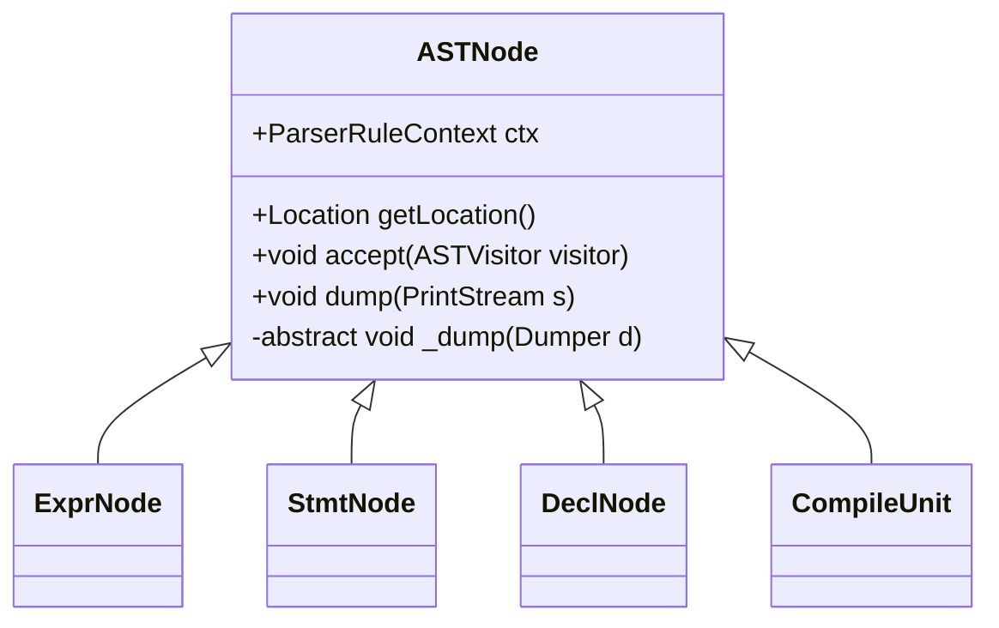
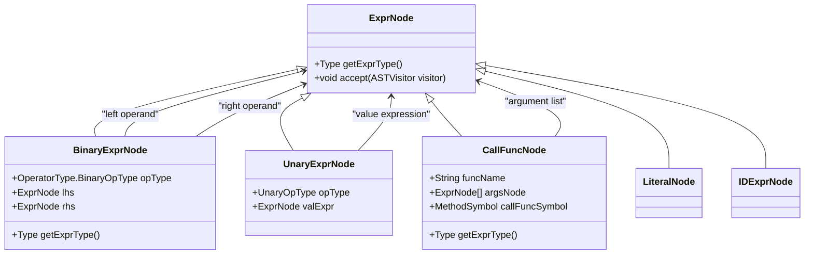
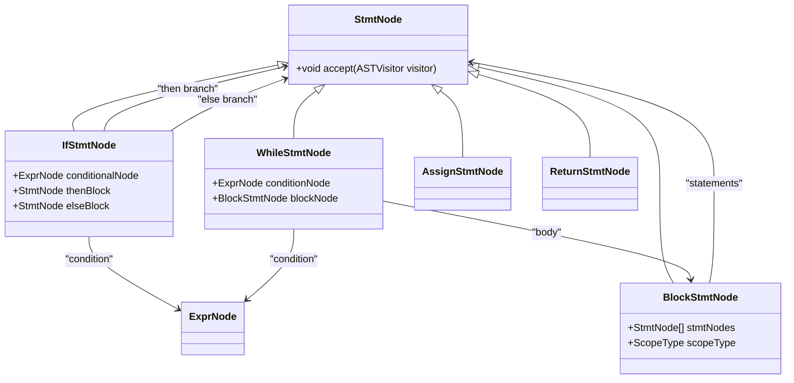
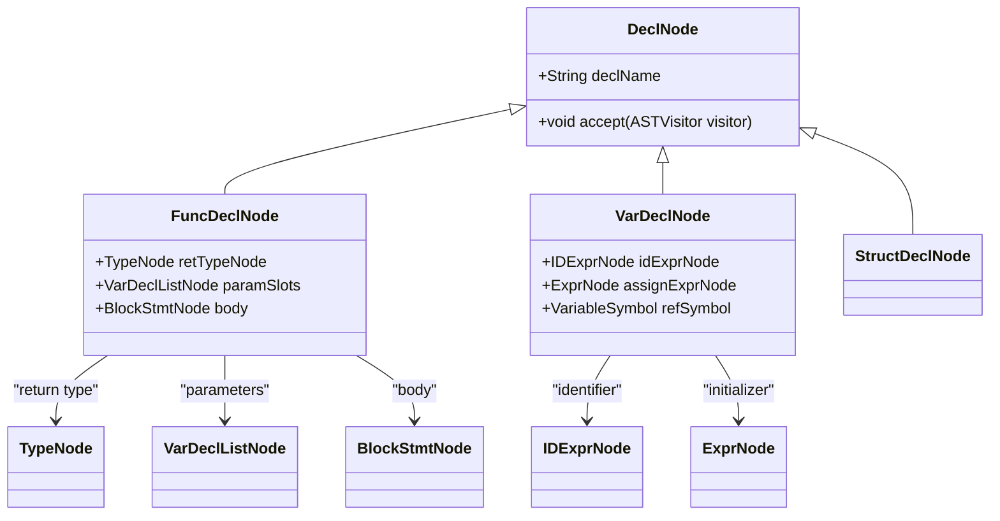
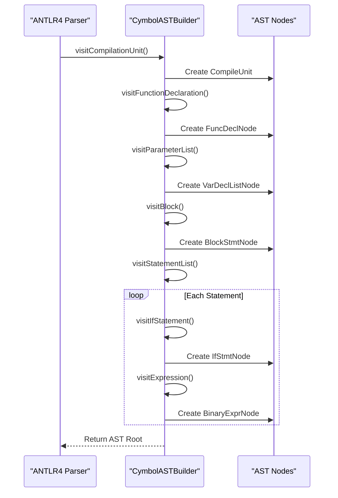
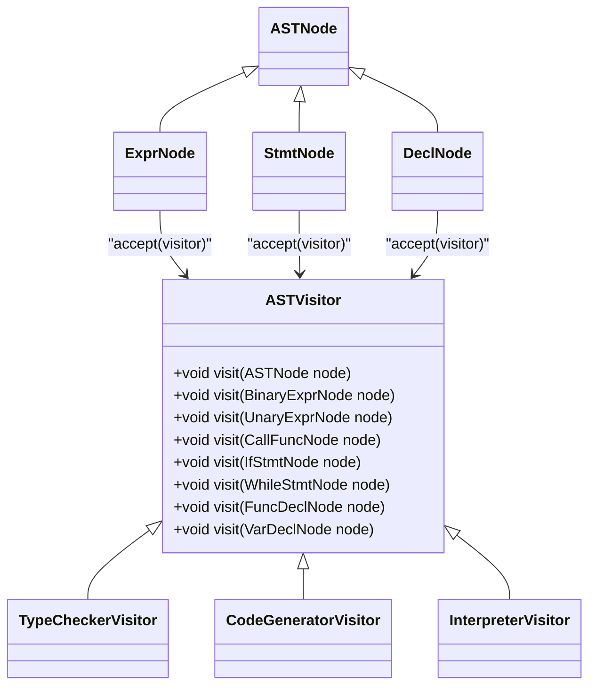
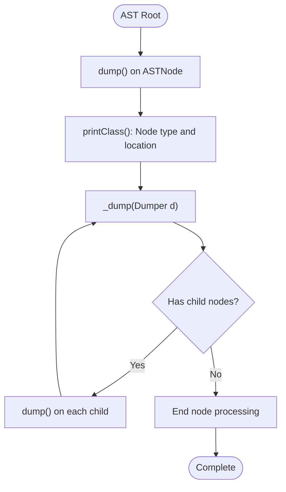

# Abstract Syntax Tree (AST) Hierarchy

<cite>
**Referenced Files in This Document**   
- [ASTNode.java](file://ep20/src/main/java/org/teachfx/antlr4/ep20/ast/ASTNode.java)
- [BinaryExprNode.java](file://ep20/src/main/java/org/teachfx/antlr4/ep20/ast/expr/BinaryExprNode.java)
- [UnaryExprNode.java](file://ep20/src/main/java/org/teachfx/antlr4/ep20/ast/expr/UnaryExprNode.java)
- [CallFuncNode.java](file://ep20/src/main/java/org/teachfx/antlr4/ep20/ast/expr/CallFuncNode.java)
- [IfStmtNode.java](file://ep20/src/main/java/org/teachfx/antlr4/ep20/ast/stmt/IfStmtNode.java)
- [WhileStmtNode.java](file://ep20/src/main/java/org/teachfx/antlr4/ep20/ast/stmt/WhileStmtNode.java)
- [BlockStmtNode.java](file://ep20/src/main/java/org/teachfx/antlr4/ep20/ast/stmt/BlockStmtNode.java)
- [FuncDeclNode.java](file://ep20/src/main/java/org/teachfx/antlr4/ep20/ast/decl/FuncDeclNode.java)
- [VarDeclNode.java](file://ep20/src/main/java/org/teachfx/antlr4/ep20/ast/decl/VarDeclNode.java)
- [ASTVisitor.java](file://ep20/src/main/java/org/teachfx/antlr4/ep20/ast/ASTVisitor.java)
- [CymbolASTBuilder.java](file://ep20/src/main/java/org/teachfx/antlr4/ep20/pass/ast/CymbolASTBuilder.java)
- [Dumper.java](file://ep20/src/main/java/org/teachfx/antlr4/ep20/debugger/ast/Dumper.java)
</cite>

## Table of Contents
1. [Introduction](#introduction)
2. [Core Components](#core-components)
3. [ASTNode Base Class and Composite Pattern](#astnode-base-class-and-composite-pattern)
4. [Expression Node Hierarchy](#expression-node-hierarchy)
5. [Statement Node Hierarchy](#statement-node-hierarchy)
6. [Declaration Node Hierarchy](#declaration-node-hierarchy)
7. [AST Construction with CymbolASTBuilder](#ast-construction-with-cymbolastbuilder)
8. [AST Traversal with ASTVisitor](#ast-traversal-with-astvisitor)
9. [AST Visualization and Debugging](#ast-visualization-and-debugging)
10. [Common Issues in AST Construction](#common-issues-in-ast-construction)

## Introduction
This document provides a comprehensive analysis of the Abstract Syntax Tree (AST) hierarchy implementation in the Cymbol compiler. The AST serves as the central data structure for representing program structure after parsing, enabling subsequent compilation phases such as semantic analysis, optimization, and code generation. The implementation leverages object-oriented design patterns including the composite pattern for hierarchical structure representation and the visitor pattern for tree traversal.

**Section sources**
- [ASTNode.java](file://ep20/src/main/java/org/teachfx/antlr4/ep20/ast/ASTNode.java#L1-L48)

## Core Components
The AST implementation consists of several key components organized in a hierarchical class structure. At the foundation is the `ASTNode` base class, which defines common behavior for all AST nodes. Derived from this base are specialized node types for expressions, statements, and declarations, each representing different syntactic constructs in the source language. The `ASTVisitor` interface enables uniform traversal of the tree, while the `CymbolASTBuilder` constructs the AST from ANTLR4's parse tree.

**Section sources**
- [ASTNode.java](file://ep20/src/main/java/org/teachfx/antlr4/ep20/ast/ASTNode.java#L1-L48)
- [ASTVisitor.java](file://ep20/src/main/java/org/teachfx/antlr4/ep20/ast/ASTVisitor.java#L1-L20)
- [CymbolASTBuilder.java](file://ep20/src/main/java/org/teachfx/antlr4/ep20/pass/ast/CymbolASTBuilder.java#L1-L100)

## ASTNode Base Class and Composite Pattern
The `ASTNode` class serves as the abstract base for all node types in the AST hierarchy, implementing the composite design pattern to represent the hierarchical structure of programs. This pattern allows treating individual nodes and compositions of nodes uniformly, enabling recursive tree operations.

**Diagram sources**
- [ASTNode.java](file://ep20/src/main/java/org/teachfx/antlr4/ep20/ast/ASTNode.java#L1-L48)

**Section sources**
- [ASTNode.java](file://ep20/src/main/java/org/teachfx/antlr4/ep20/ast/ASTNode.java#L1-L48)

## Expression Node Hierarchy
The expression node hierarchy extends from `ExprNode` (which inherits from `ASTNode`) and represents computational expressions in the source code. Key implementations include `BinaryExprNode` for arithmetic and logical operations, `UnaryExprNode` for negation and other unary operations, and `CallFuncNode` for function invocations.

**Diagram sources**
- [BinaryExprNode.java](file://ep20/src/main/java/org/teachfx/antlr4/ep20/ast/expr/BinaryExprNode.java#L1-L97)
- [UnaryExprNode.java](file://ep20/src/main/java/org/teachfx/antlr4/ep20/ast/expr/UnaryExprNode.java#L1-L57)
- [CallFuncNode.java](file://ep20/src/main/java/org/teachfx/antlr4/ep20/ast/expr/CallFuncNode.java#L1-L77)

**Section sources**
- [BinaryExprNode.java](file://ep20/src/main/java/org/teachfx/antlr4/ep20/ast/expr/BinaryExprNode.java#L1-L97)
- [UnaryExprNode.java](file://ep20/src/main/java/org/teachfx/antlr4/ep20/ast/expr/UnaryExprNode.java#L1-L57)
- [CallFuncNode.java](file://ep20/src/main/java/org/teachfx/antlr4/ep20/ast/expr/CallFuncNode.java#L1-L77)

## Statement Node Hierarchy
Statement nodes represent executable constructs in the language and inherit from the `StmtNode` base class. The hierarchy includes control flow statements such as `IfStmtNode` and `WhileStmtNode`, as well as `BlockStmtNode` for compound statements and scoping.

**Diagram sources**
- [IfStmtNode.java](file://ep20/src/main/java/org/teachfx/antlr4/ep20/ast/stmt/IfStmtNode.java#L1-L61)
- [WhileStmtNode.java](file://ep20/src/main/java/org/teachfx/antlr4/ep20/ast/stmt/WhileStmtNode.java#L1-L47)
- [BlockStmtNode.java](file://ep20/src/main/java/org/teachfx/antlr4/ep20/ast/stmt/BlockStmtNode.java#L1-L48)

**Section sources**
- [IfStmtNode.java](file://ep20/src/main/java/org/teachfx/antlr4/ep20/ast/stmt/IfStmtNode.java#L1-L61)
- [WhileStmtNode.java](file://ep20/src/main/java/org/teachfx/antlr4/ep20/ast/stmt/WhileStmtNode.java#L1-L47)
- [BlockStmtNode.java](file://ep20/src/main/java/org/teachfx/antlr4/ep20/ast/stmt/BlockStmtNode.java#L1-L48)

## Declaration Node Hierarchy
Declaration nodes represent program entities such as variables and functions. The hierarchy includes `FuncDeclNode` for function declarations and `VarDeclNode` for variable declarations, both inheriting from the `DeclNode` base class.

**Diagram sources**
- [FuncDeclNode.java](file://ep20/src/main/java/org/teachfx/antlr4/ep20/ast/decl/FuncDeclNode.java#L1-L64)
- [VarDeclNode.java](file://ep20/src/main/java/org/teachfx/antlr4/ep20/ast/decl/VarDeclNode.java#L1-L68)

**Section sources**
- [FuncDeclNode.java](file://ep20/src/main/java/org/teachfx/antlr4/ep20/ast/decl/FuncDeclNode.java#L1-L64)
- [VarDeclNode.java](file://ep20/src/main/java/org/teachfx/antlr4/ep20/ast/decl/VarDeclNode.java#L1-L68)

## AST Construction with CymbolASTBuilder
The `CymbolASTBuilder` class implements the visitor pattern to construct the AST from ANTLR4's parse tree. It traverses the parse tree generated by the parser and creates corresponding AST nodes, maintaining the hierarchical structure of the source program.

**Diagram sources**
- [CymbolASTBuilder.java](file://ep20/src/main/java/org/teachfx/antlr4/ep20/pass/ast/CymbolASTBuilder.java#L1-L100)

**Section sources**
- [CymbolASTBuilder.java](file://ep20/src/main/java/org/teachfx/antlr4/ep20/pass/ast/CymbolASTBuilder.java#L1-L100)

## AST Traversal with ASTVisitor
The `ASTVisitor` interface enables the visitor pattern for traversing and processing the AST. This design allows separation of algorithms from the object structure, making it easy to implement new operations on the AST without modifying the node classes.

**Diagram sources**
- [ASTVisitor.java](file://ep20/src/main/java/org/teachfx/antlr4/ep20/ast/ASTVisitor.java#L1-L20)

**Section sources**
- [ASTVisitor.java](file://ep20/src/main/java/org/teachfx/antlr4/ep20/ast/ASTVisitor.java#L1-L20)

## AST Visualization and Debugging
The `Dumper` class provides visualization capabilities for debugging the AST structure. It recursively traverses the tree and produces a textual representation of the node hierarchy, including node types, member values, and source location information.

**Diagram sources**
- [Dumper.java](file://ep20/src/main/java/org/teachfx/antlr4/ep20/debugger/ast/Dumper.java#L1-L50)
- [ASTNode.java](file://ep20/src/main/java/org/teachfx/antlr4/ep20/ast/ASTNode.java#L1-L48)

**Section sources**
- [Dumper.java](file://ep20/src/main/java/org/teachfx/antlr4/ep20/debugger/ast/Dumper.java#L1-L50)
- [ASTNode.java](file://ep20/src/main/java/org/teachfx/antlr4/ep20/ast/ASTNode.java#L1-L48)

## Common Issues in AST Construction
Several common issues can arise during AST construction, including incorrect parent-child relationships, missing node types, and improper type information propagation. The visitor pattern implementation in `CymbolASTBuilder` must carefully handle all grammar rules to ensure complete and accurate tree construction.

**Section sources**
- [CymbolASTBuilder.java](file://ep20/src/main/java/org/teachfx/antlr4/ep20/pass/ast/CymbolASTBuilder.java#L1-L100)
- [ASTNode.java](file://ep20/src/main/java/org/teachfx/antlr4/ep20/ast/ASTNode.java#L1-L48)