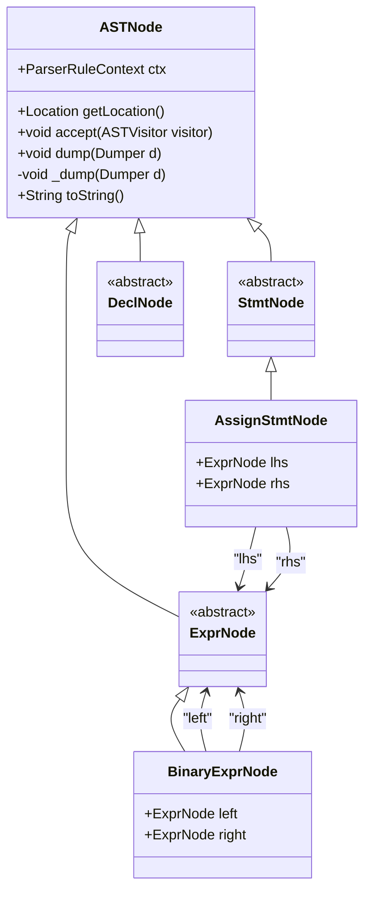
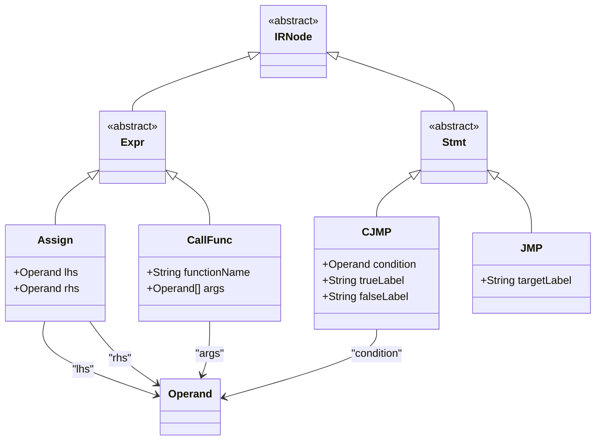
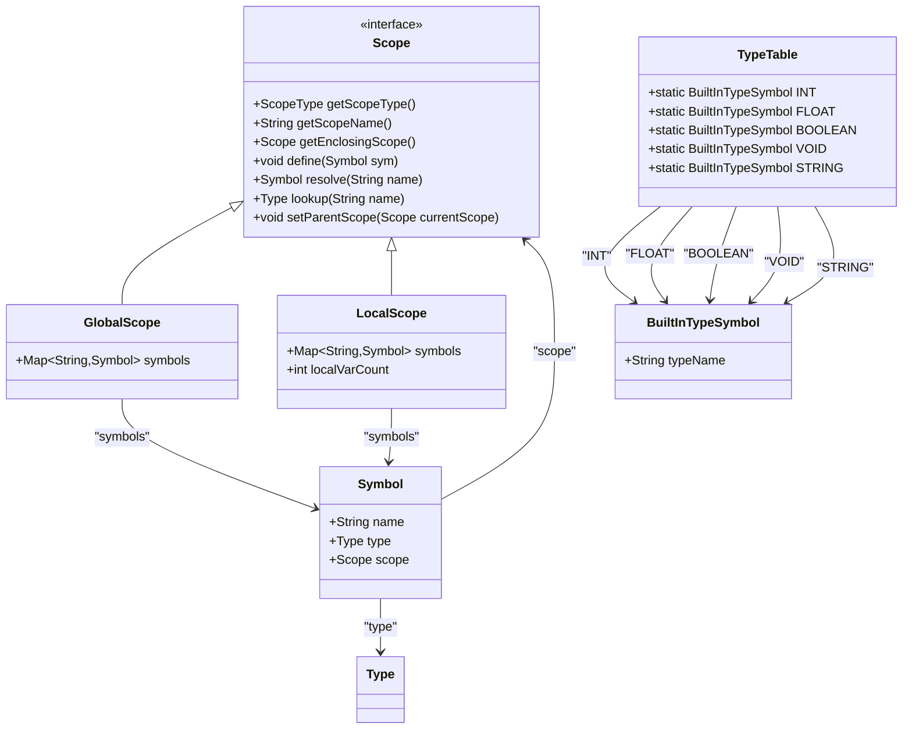
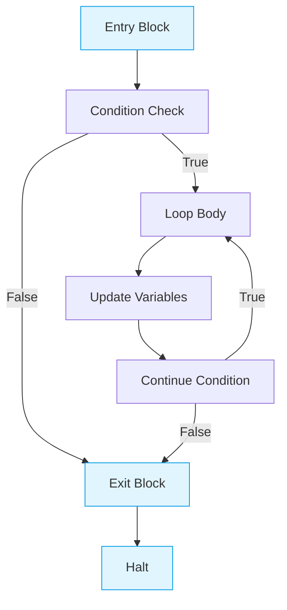
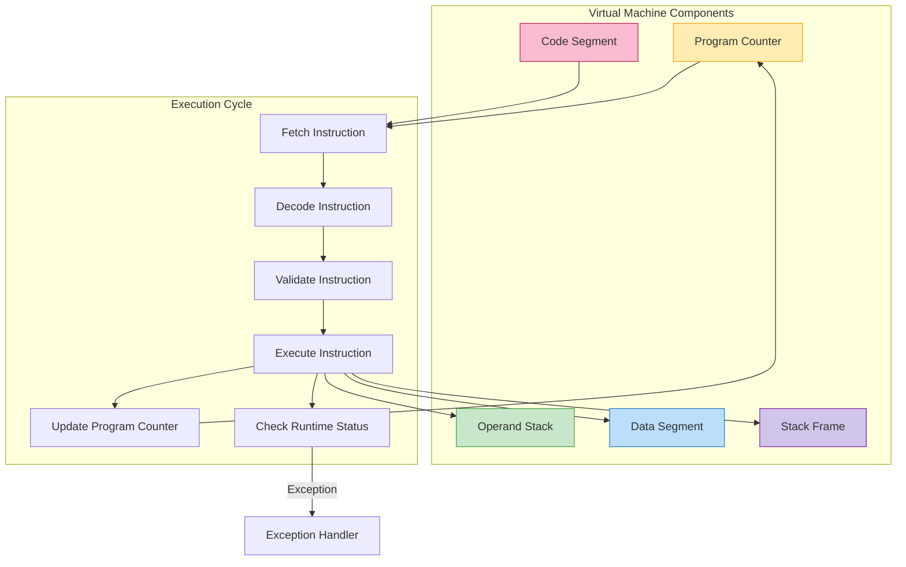

# Core Compiler Concepts

<cite>
**Referenced Files in This Document**   
- [ASTNode.java](file://ep20/src/main/java/org/teachfx/antlr4/ep20/ast/ASTNode.java)
- [IRNode.java](file://ep20/src/main/java/org/teachfx/antlr4/ep20/ir/IRNode.java)
- [Scope.java](file://ep20/src/main/java/org/teachfx/antlr4/ep20/symtab/scope/Scope.java)
- [TypeTable.java](file://ep20/src/main/java/org/teachfx/antlr4/ep20/symtab/type/TypeTable.java)
- [VM_Design.md](file://ep18/VM_Design.md)
</cite>

## Table of Contents
1. [Abstract Syntax Trees](#abstract-syntax-trees)
2. [Intermediate Representation](#intermediate-representation)
3. [Symbol Table Management](#symbol-table-management)
4. [Control Flow Graphs](#control-flow-graphs)
5. [Stack-Based Virtual Machine](#stack-based-virtual-machine)

## Abstract Syntax Trees

The Abstract Syntax Tree (AST) implementation in the compiler framework is centered around the `ASTNode.java` base class, which serves as the foundation for representing the hierarchical structure of source code. The AST employs the composite design pattern, enabling uniform treatment of both individual nodes and complex tree structures through recursive composition.

Each AST node extends the abstract `ASTNode` class and inherits core functionality including parser context tracking (`ParserRuleContext`), source location information via the `Location` class, and visitor pattern support through the `accept()` method. The composite pattern is implemented by allowing AST nodes to contain references to child nodes, forming a tree structure that mirrors the syntactic hierarchy of the original source code.

The AST framework supports debugging and visualization through the `Dumpable` interface and `Dumper` utility, enabling developers to inspect the tree structure during compilation. Nodes implement the `_dump()` method to provide custom visualization of their internal state and relationships. This hierarchical representation allows the compiler to perform syntax-directed translation, semantic analysis, and code generation by traversing the tree structure.

**Diagram sources**
- [ASTNode.java](file://ep20/src/main/java/org/teachfx/antlr4/ep20/ast/ASTNode.java#L1-L48)
- [ast/expr/BinaryExprNode.java](file://ep20/src/main/java/org/teachfx/antlr4/ep20/ast/expr/BinaryExprNode.java)
- [ast/stmt/AssignStmtNode.java](file://ep20/src/main/java/org/teachfx/antlr4/ep20/ast/stmt/AssignStmtNode.java)

**Section sources**
- [ASTNode.java](file://ep20/src/main/java/org/teachfx/antlr4/ep20/ast/ASTNode.java#L1-L48)

## Intermediate Representation

The Intermediate Representation (IR) system is built upon the `IRNode.java` base class, providing a foundation for three-address code generation and optimization. The IR serves as a crucial abstraction layer between high-level source code and target-specific machine code, enabling platform-independent optimizations and transformations.

Three-address code is implemented through various IR node types that represent operations with at most three operands, typically in the form `x = y op z`. This representation simplifies complex expressions into a sequence of basic operations that are easier to analyze and optimize. The IR framework supports common operations including arithmetic expressions, control flow instructions, and memory access patterns.

The IR structure facilitates various compiler optimizations such as constant folding, dead code elimination, and register allocation. By breaking down complex expressions into simpler operations, the IR enables precise data flow analysis and transformation. The hierarchical nature of the IR allows for both local optimizations within basic blocks and global optimizations across function boundaries.

**Diagram sources**
- [IRNode.java](file://ep20/src/main/java/org/teachfx/antlr4/ep20/ir/IRNode.java#L1-L6)
- [ir/expr/Expr.java](file://ep20/src/main/java/org/teachfx/antlr4/ep20/ir/expr/Expr.java)
- [ir/stmt/Stmt.java](file://ep20/src/main/java/org/teachfx/antlr4/ep20/ir/stmt/Stmt.java)

**Section sources**
- [IRNode.java](file://ep20/src/main/java/org/teachfx/antlr4/ep20/ir/IRNode.java#L1-L6)

## Symbol Table Management

Symbol table management in the compiler framework is implemented through the `Scope.java` interface and `TypeTable.java` class, providing hierarchical scoping, symbol resolution, and type checking mechanisms. The scope system creates a nested hierarchy of symbol tables that reflect the lexical structure of the source program.

The `Scope` interface defines methods for managing symbol visibility and resolution within different program contexts. Each scope maintains references to its enclosing scope, enabling lexical scoping rules where inner scopes can access symbols from outer scopes. The system supports various scope types through the `ScopeType` enumeration, distinguishing between global, local, function, and block-level scopes.

Symbol resolution follows a hierarchical lookup process, starting from the current scope and traversing up through enclosing scopes until the symbol is found or the global scope is reached. The `define()` method adds new symbols to the current scope, while `resolve()` performs name lookup according to scoping rules. Type information is managed through the `TypeTable` class, which maintains references to built-in types and supports type checking during semantic analysis.

**Diagram sources**
- [Scope.java](file://ep20/src/main/java/org/teachfx/antlr4/ep20/symtab/scope/Scope.java#L1-L35)
- [TypeTable.java](file://ep20/src/main/java/org/teachfx/antlr4/ep20/symtab/type/TypeTable.java#L1-L20)
- [symtab/symbol/Symbol.java](file://ep20/src/main/java/org/teachfx/antlr4/ep20/symtab/symbol/Symbol.java)
- [symtab/type/BuiltInTypeSymbol.java](file://ep20/src/main/java/org/teachfx/antlr4/ep20/symtab/type/BuiltInTypeSymbol.java)

**Section sources**
- [Scope.java](file://ep20/src/main/java/org/teachfx/antlr4/ep20/symtab/scope/Scope.java#L1-L35)
- [TypeTable.java](file://ep20/src/main/java/org/teachfx/antlr4/ep20/symtab/type/TypeTable.java#L1-L20)

## Control Flow Graphs

Control Flow Graphs (CFGs) are constructed from the Intermediate Representation to enable advanced program analysis and optimization. The CFG represents the flow of execution through a program as a directed graph where nodes represent basic blocks of code and edges represent possible control flow transitions.

Basic blocks are maximal sequences of instructions with a single entry point and single exit point, typically ending with a control flow instruction such as a conditional jump or function return. The CFG construction process analyzes the linear sequence of IR instructions and partitions them into basic blocks based on control flow boundaries.

The CFG enables various data flow analyses including liveness analysis, reaching definitions, and available expressions. These analyses provide information about variable usage and dependencies across different paths of execution, supporting optimizations such as dead code elimination, constant propagation, and register allocation. The graph structure also facilitates loop detection and optimization by identifying back edges and dominator relationships.

**Diagram sources**
- [pass/cfg/CFG.java](file://ep20/src/main/java/org/teachfx/antlr4/ep20/pass/cfg/CFG.java)
- [pass/cfg/BasicBlock.java](file://ep20/src/main/java/org/teachfx/antlr4/ep20/pass/cfg/BasicBlock.java)
- [ir/stmt/CJMP.java](file://ep20/src/main/java/org/teachfx/antlr4/ep20/ir/stmt/CJMP.java)

## Stack-Based Virtual Machine

The stack-based virtual machine architecture, detailed in `VM_Design.md`, implements a runtime environment for executing compiled bytecode. The VM follows a stack-oriented execution model where operations manipulate values on an operand stack rather than using explicit registers.

The instruction set includes arithmetic operations (`iconst`, `iadd`, `imul`), control flow instructions (`call`, `ret`, `halt`), and memory access operations (`load`). Each instruction operates on the top elements of the operand stack, with results pushed back onto the stack. This design simplifies instruction decoding and enables efficient implementation of nested expressions.

The VM execution engine follows a fetch-decode-execute cycle, with a program counter tracking the current instruction address. Function calls are managed through stack frames that contain parameter areas, local variable storage, and return addresses. When a function is called, a new stack frame is allocated and pushed onto the call stack; upon return, the frame is popped and control resumes at the return address.

Memory organization divides the runtime space into code, data, and stack regions. The code region stores compiled bytecode, the data region holds global variables, and the stack region manages function calls and local variables. Runtime checks prevent common errors such as stack overflow, division by zero, and invalid memory access.

**Diagram sources**
- [VM_Design.md](file://ep18/VM_Design.md#L1-L129)
- [stackvm/CymbolStackVM.java](file://ep18/src/main/java/org/teachfx/antlr4/ep18/stackvm/CymbolStackVM.java)
- [stackvm/StackFrame.java](file://ep18/src/main/java/org/teachfx/antlr4/ep18/stackvm/StackFrame.java)