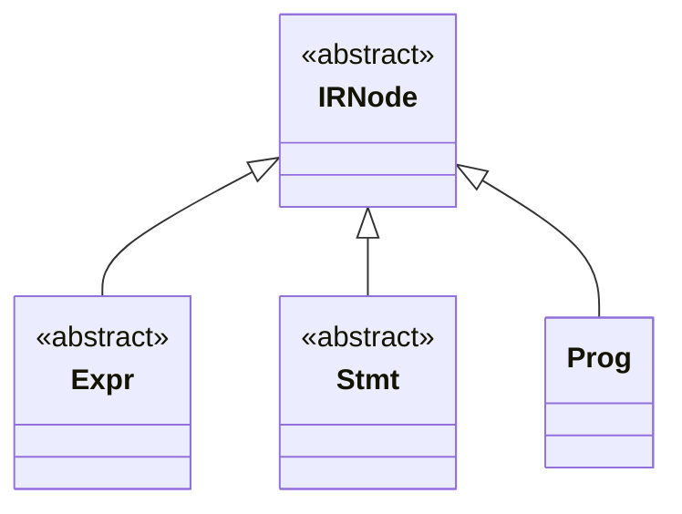
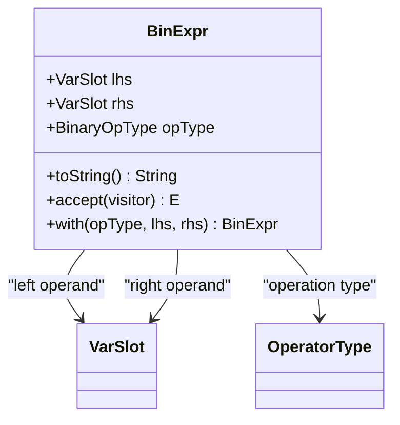
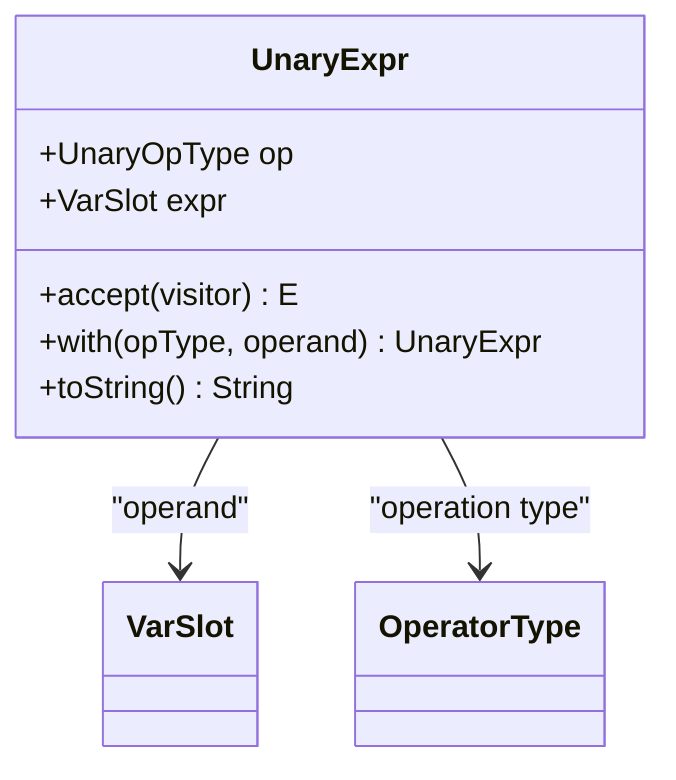
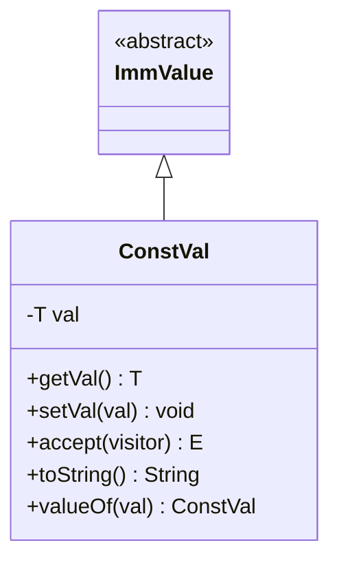
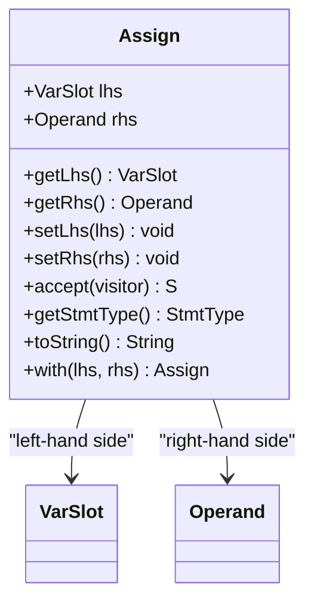
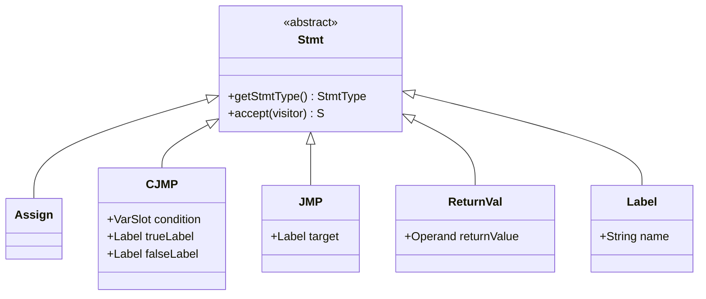
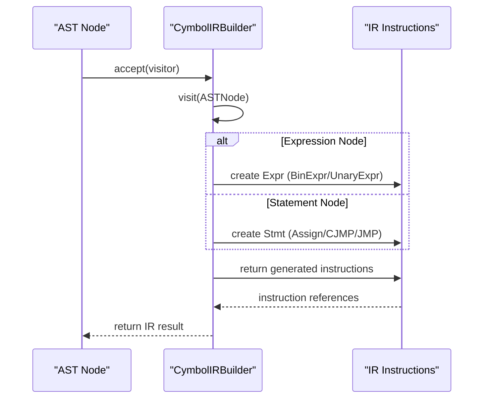
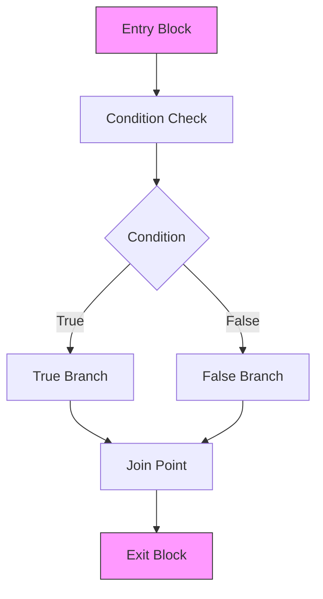
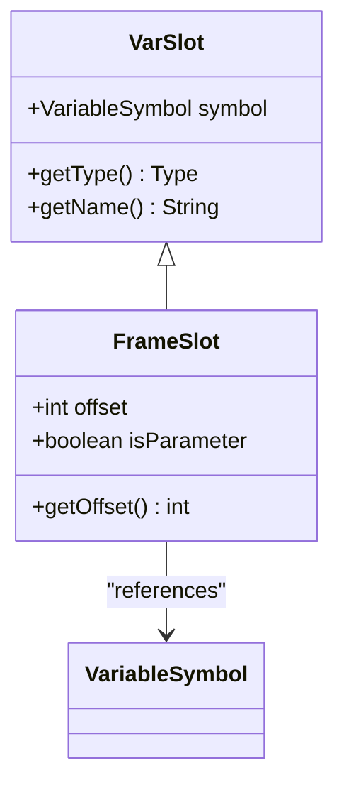

# Intermediate Representation (IR) Structure

<cite>
**Referenced Files in This Document**   
- [IRNode.java](file://ep20/src/main/java/org/teachfx/antlr4/ep20/ir/IRNode.java)
- [BinExpr.java](file://ep20/src/main/java/org/teachfx/antlr4/ep20/ir/expr/arith/BinExpr.java)
- [UnaryExpr.java](file://ep20/src/main/java/org/teachfx/antlr4/ep20/ir/expr/arith/UnaryExpr.java)
- [ConstVal.java](file://ep20/src/main/java/org/teachfx/antlr4/ep20/ir/expr/val/ConstVal.java)
- [Assign.java](file://ep20/src/main/java/org/teachfx/antlr4/ep20/ir/stmt/Assign.java)
- [CJMP.java](file://ep20/src/main/java/org/teachfx/antlr4/ep20/ir/stmt/CJMP.java)
- [JMP.java](file://ep20/src/main/java/org/teachfx/antlr4/ep20/ir/stmt/JMP.java)
- [ReturnVal.java](file://ep20/src/main/java/org/teachfx/antlr4/ep20/ir/stmt/ReturnVal.java)
- [VarSlot.java](file://ep20/src/main/java/org/teachfx/antlr4/ep20/ir/expr/VarSlot.java)
- [FrameSlot.java](file://ep20/src/main/java/org/teachfx/antlr4/ep20/ir/expr/addr/FrameSlot.java)
- [CymbolIRBuilder.java](file://ep20/src/main/java/org/teachfx/antlr4/ep20/pass/ir/CymbolIRBuilder.java)
- [BasicBlock.java](file://ep20/src/main/java/org/teachfx/antlr4/ep20/pass/cfg/BasicBlock.java)
- [CFGBuilder.java](file://ep20/src/main/java/org/teachfx/antlr4/ep20/pass/cfg/CFGBuilder.java)
</cite>

## Table of Contents
1. [Introduction](#introduction)
2. [IRNode Base Class](#irnode-base-class)
3. [Expression Nodes](#expression-nodes)
4. [Statement Nodes](#statement-nodes)
5. [IR Generation Process](#ir-generation-process)
6. [Basic Block Formation and Control Flow](#basic-block-formation-and-control-flow)
7. [Variable Addressing Mechanisms](#variable-addressing-mechanisms)
8. [IR Generation Examples](#ir-generation-examples)
9. [Debugging and Optimization Readiness](#debugging-and-optimization-readiness)
10. [Conclusion](#conclusion)

## Introduction
The Intermediate Representation (IR) serves as a crucial abstraction layer between the Abstract Syntax Tree (AST) and target code generation in the Cymbol compiler framework. This document details the IR structure implemented in the ep20 phase of the Antlr4-based compiler project, focusing on three-address code representation, node hierarchy, translation mechanisms, and control flow modeling. The IR enables platform-independent optimizations and simplifies code generation through a uniform instruction set.

## IRNode Base Class
The `IRNode` class serves as the foundational abstract class for all IR components, establishing a common interface for node traversal and visitor pattern implementation. As the root of the IR inheritance hierarchy, it enables polymorphic processing of all IR elements through the `IRVisitor` interface.



**Diagram sources**
- [IRNode.java](file://ep20/src/main/java/org/teachfx/antlr4/ep20/ir/IRNode.java#L1-L6)

**Section sources**
- [IRNode.java](file://ep20/src/main/java/org/teachfx/antlr4/ep20/ir/IRNode.java#L1-L6)

## Expression Nodes
The IR expression hierarchy implements three-address code principles through specialized node types for arithmetic operations and value representation. These nodes facilitate straightforward translation of complex expressions into simple, linear instructions.

### Binary Expressions
The `BinExpr` class represents binary operations in three-address code format, capturing arithmetic, logical, and relational operations between two operands. Each binary expression explicitly defines its operation type and left/right operands using variable slots.



**Diagram sources**
- [BinExpr.java](file://ep20/src/main/java/org/teachfx/antlr4/ep20/ir/expr/arith/BinExpr.java#L1-L60)

**Section sources**
- [BinExpr.java](file://ep20/src/main/java/org/teachfx/antlr4/ep20/ir/expr/arith/BinExpr.java#L1-L60)

### Unary Expressions
The `UnaryExpr` class handles unary operations such as negation, logical NOT, and address-of operations. It encapsulates the operation type and single operand, maintaining consistency with the three-address code paradigm.



**Diagram sources**
- [UnaryExpr.java](file://ep20/src/main/java/org/teachfx/antlr4/ep20/ir/expr/arith/UnaryExpr.java#L1-L32)

**Section sources**
- [UnaryExpr.java](file://ep20/src/main/java/org/teachfx/antlr4/ep20/ir/expr/arith/UnaryExpr.java#L1-L32)

### Constant Values
The `ConstVal` class provides type-safe representation of constant values in the IR, supporting various primitive types including integers, booleans, and strings. It implements the visitor pattern for uniform processing across the IR tree.



**Diagram sources**
- [ConstVal.java](file://ep20/src/main/java/org/teachfx/antlr4/ep20/ir/expr/val/ConstVal.java#L1-L43)

**Section sources**
- [ConstVal.java](file://ep20/src/main/java/org/teachfx/antlr4/ep20/ir/expr/val/ConstVal.java#L1-L43)

## Statement Nodes
The IR statement hierarchy translates high-level programming constructs into low-level instructions suitable for code generation and optimization.

### Assignment Statements
The `Assign` class represents variable assignment operations, mapping a destination variable slot to a source operand. It supports both variable-to-variable and variable-to-expression assignments through its flexible operand typing.



**Diagram sources**
- [Assign.java](file://ep20/src/main/java/org/teachfx/antlr4/ep20/ir/stmt/Assign.java#L1-L66)

**Section sources**
- [Assign.java](file://ep20/src/main/java/org/teachfx/antlr4/ep20/ir/stmt/Assign.java#L1-L66)

### Control Flow Statements
The IR includes specialized nodes for control flow management:
- `CJMP`: Conditional jump based on a boolean expression
- `JMP`: Unconditional jump to a target label
- `ReturnVal`: Function return with optional value
- `Label`: Target marker for jump instructions

These nodes enable precise representation of branching logic and function boundaries in the intermediate code.



**Section sources**
- [CJMP.java](file://ep20/src/main/java/org/teachfx/antlr4/ep20/ir/stmt/CJMP.java)
- [JMP.java](file://ep20/src/main/java/org/teachfx/antlr4/ep20/ir/stmt/JMP.java)
- [ReturnVal.java](file://ep20/src/main/java/org/teachfx/antlr4/ep20/ir/stmt/ReturnVal.java)
- [Label.java](file://ep20/src/main/java/org/teachfx/antlr4/ep20/ir/stmt/Label.java)

## IR Generation Process
The `CymbolIRBuilder` class orchestrates the translation from AST nodes to IR instructions, traversing the abstract syntax tree and generating corresponding three-address code. This process involves:

1. **Expression Translation**: Converting AST expression nodes into IR expression trees
2. **Statement Processing**: Transforming control flow constructs into labeled basic blocks
3. **Temporary Management**: Allocating virtual registers for intermediate calculations
4. **Type Preservation**: Maintaining type information throughout translation

The builder follows the visitor pattern, systematically visiting each AST node and emitting appropriate IR instructions while managing symbol table context and scope information.



**Section sources**
- [CymbolIRBuilder.java](file://ep20/src/main/java/org/teachfx/antlr4/ep20/pass/ir/CymbolIRBuilder.java)

## Basic Block Formation and Control Flow
The IR representation employs basic blocks as fundamental units of control flow, where each block contains a sequence of instructions with a single entry and exit point. The `BasicBlock` class and `CFGBuilder` work together to:

1. **Identify Leaders**: Determine instruction positions that begin new basic blocks
2. **Construct Blocks**: Group consecutive instructions between leaders
3. **Build CFG**: Create a Control Flow Graph connecting blocks via jump edges
4. **Analyze Flow**: Enable data flow and liveness analysis for optimization

This structured approach facilitates advanced optimizations such as dead code elimination, constant propagation, and loop invariant detection.



**Section sources**
- [BasicBlock.java](file://ep20/src/main/java/org/teachfx/antlr4/ep20/pass/cfg/BasicBlock.java)
- [CFGBuilder.java](file://ep20/src/main/java/org/teachfx/antlr4/ep20/pass/cfg/CFGBuilder.java)

## Variable Addressing Mechanisms
The IR employs two primary addressing mechanisms for variable access:

### VarSlot
The `VarSlot` class represents a variable location in the IR, serving as a handle for both local variables and temporaries. It maintains references to the underlying symbol and provides type information for semantic checking.

### FrameSlot
The `FrameSlot` class extends addressing capabilities by representing variables relative to the stack frame, enabling proper handling of function parameters and local variables in nested scopes. This mechanism supports both direct and indirect memory access patterns.



**Diagram sources**
- [VarSlot.java](file://ep20/src/main/java/org/teachfx/antlr4/ep20/ir/expr/VarSlot.java)
- [FrameSlot.java](file://ep20/src/main/java/org/teachfx/antlr4/ep20/ir/expr/addr/FrameSlot.java)

**Section sources**
- [VarSlot.java](file://ep20/src/main/java/org/teachfx/antlr4/ep20/ir/expr/VarSlot.java)
- [FrameSlot.java](file://ep20/src/main/java/org/teachfx/antlr4/ep20/ir/expr/addr/FrameSlot.java)

## IR Generation Examples
The following examples illustrate the transformation from source code to three-address IR:

### Arithmetic Expression
For the expression `a = b + c * d`, the IR generation produces:
```
t1 = c * d
t2 = b + t1
a = t2
```

### Conditional Statement
For `if (x > 0) y = 1; else y = -1;`, the IR creates:
```
if x > 0 goto L1
y = -1
goto L2
L1: y = 1
L2:
```

### Loop Structure
For `while (i < 10) i = i + 1;`, the IR generates:
```
L1: if i >= 10 goto L2
i = i + 1
goto L1
L2:
```

These examples demonstrate how complex constructs are decomposed into simple, linear instructions suitable for optimization and code generation.

**Section sources**
- [CymbolIRBuilder.java](file://ep20/src/main/java/org/teachfx/antlr4/ep20/pass/ir/CymbolIRBuilder.java)
- [CFGBuilder.java](file://ep20/src/main/java/org/teachfx/antlr4/ep20/pass/cfg/CFGBuilder.java)

## Debugging and Optimization Readiness
The IR structure supports comprehensive debugging and optimization through several key features:

1. **Visitor Pattern**: Enables traversal for analysis, transformation, and debugging
2. **Textual Representation**: `toString()` methods provide human-readable IR dumps
3. **Type Safety**: Preserved type information prevents invalid operations
4. **Modular Design**: Separation of concerns facilitates targeted optimizations

Debugging techniques include:
- IR dumping at various compilation stages
- Control flow graph visualization
- Liveness analysis verification
- Instruction counting and profiling

The design prepares the IR for optimizations such as:
- Constant folding and propagation
- Common subexpression elimination
- Dead code removal
- Register allocation

**Section sources**
- [IRNode.java](file://ep20/src/main/java/org/teachfx/antlr4/ep20/ir/IRNode.java)
- [IRVisitor.java](file://ep20/src/main/java/org/teachfx/antlr4/ep20/ir/IRVisitor.java)
- [LivenessAnalysis.java](file://ep20/src/main/java/org/teachfx/antlr4/ep20/pass/cfg/LivenessAnalysis.java)

## Conclusion
The Intermediate Representation in the Cymbol compiler provides a robust foundation for code generation and optimization. By implementing three-address code principles through a well-structured hierarchy of expression and statement nodes, the IR effectively bridges the gap between high-level source code and low-level machine instructions. The combination of `IRNode` inheritance, visitor pattern traversal, and systematic basic block formation enables sophisticated analysis and transformation capabilities essential for modern compiler design.