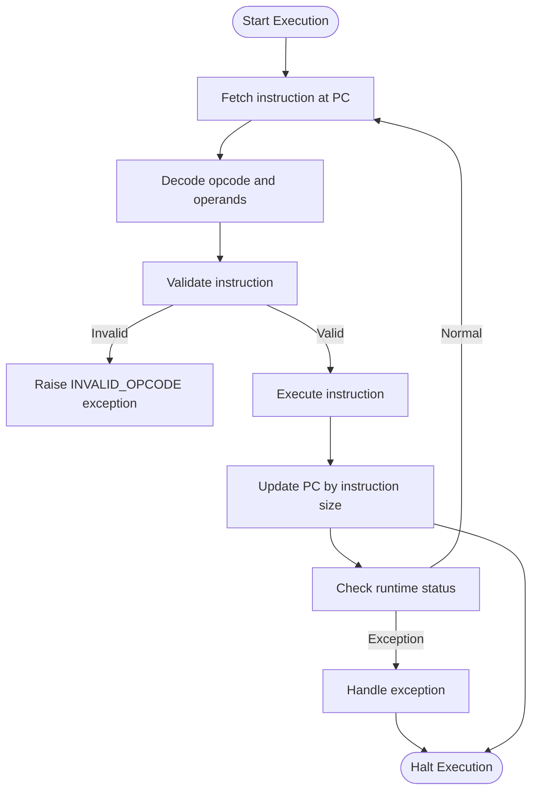
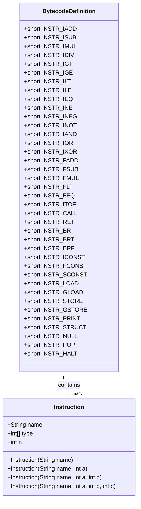
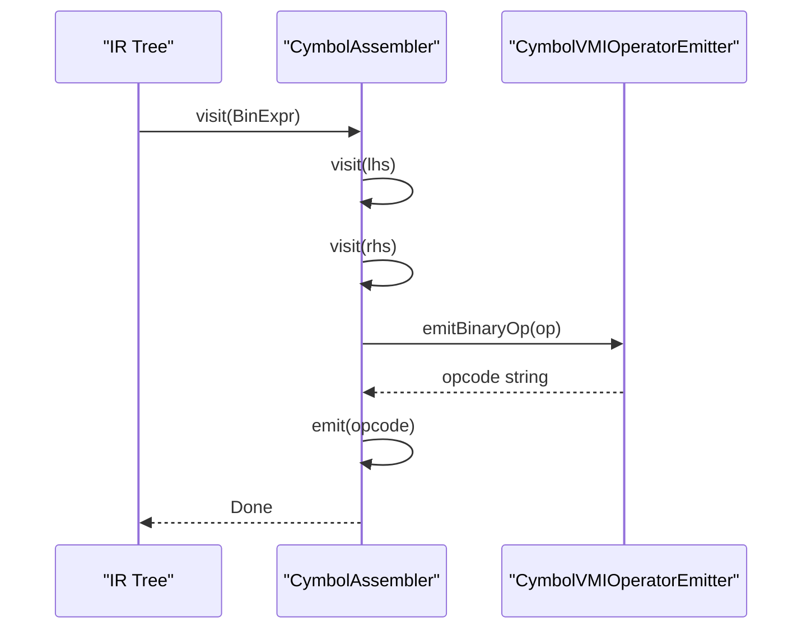
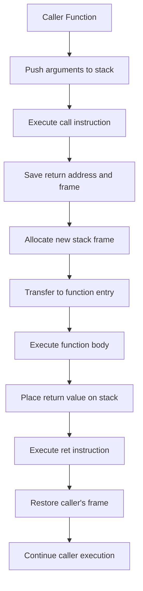

# Stack-Based Virtual Machine Architecture

<cite>
**Referenced Files in This Document**   
- [VM_Design.md](file://ep18/VM_Design.md)
- [BytecodeDefinition.java](file://ep18/src/main/java/org/teachfx/antlr4/ep18/stackvm/BytecodeDefinition.java)
- [CymbolAssembler.java](file://ep20/src/main/java/org/teachfx/antlr4/ep20/pass/codegen/CymbolAssembler.java)
- [CymbolVMIOperatorEmitter.java](file://ep20/src/main/java/org/teachfx/antlr4/ep20/pass/codegen/CymbolVMIOperatorEmitter.java)
- [CymbolStackVM.java](file://ep18/src/main/java/org/teachfx/antlr4/ep18/stackvm/CymbolStackVM.java)
</cite>

## Table of Contents
1. [Introduction](#introduction)
2. [Execution Model](#execution-model)
3. [Bytecode Instruction Set](#bytecode-instruction-set)
4. [Instruction Encoding and Emission](#instruction-encoding-and-emission)
5. [Function Call Mechanics](#function-call-mechanics)
6. [Example Instructions](#example-instructions)
7. [Performance Considerations](#performance-considerations)
8. [Debugging Techniques](#debugging-techniques)

## Introduction
This document provides a comprehensive analysis of the stack-based virtual machine architecture implemented in the Cymbol language compiler. The virtual machine follows a stack-oriented execution model with explicit instruction dispatch, frame management, and bytecode interpretation. The design enables efficient compilation of high-level language constructs into executable instructions while maintaining simplicity in implementation and execution.

**Section sources**
- [VM_Design.md](file://ep18/VM_Design.md#L1-L130)

## Execution Model

### Stack Organization
The virtual machine employs a last-in-first-out (LIFO) stack for operand storage and computation. All arithmetic, logical, and data movement operations consume operands from the stack and push results back onto it. The stack grows upward in memory, with the top element accessible via the stack pointer.

### Frame Management
Each function invocation creates a new stack frame containing:
- Parameter area for incoming arguments
- Local variable storage space
- Return address to caller
- Operand stack for intermediate calculations

Frame boundaries are maintained by the frame pointer, which is updated during function entry and exit.

### Instruction Dispatch
The execution engine follows a fetch-decode-execute cycle:
1. Fetch the next instruction using the program counter (PC)
2. Decode the opcode and operands
3. Validate instruction legality
4. Execute the corresponding operation
5. Update PC to next instruction
6. Check runtime status flags

The dispatch loop continues until a halt instruction is encountered or an exception occurs.



**Diagram sources**
- [VM_Design.md](file://ep18/VM_Design.md#L40-L65)
- [CymbolStackVM.java](file://ep18/src/main/java/org/teachfx/antlr4/ep18/stackvm/CymbolStackVM.java)

**Section sources**
- [VM_Design.md](file://ep18/VM_Design.md#L30-L75)

## Bytecode Instruction Set

The virtual machine implements a comprehensive instruction set for arithmetic operations, control flow, memory access, and I/O operations. Each instruction is represented by a 16-bit opcode with associated operand types.

### Arithmetic Instructions
- Integer operations: iadd, isub, imul, idiv
- Floating-point operations: fadd, fsub, fmul
- Comparison operations: ilt, ile, igt, ige, ieq, ine
- Logical operations: iand, ior, ixor, inot
- Type conversion: itof

### Control Flow Instructions
- Unconditional branch: br
- Conditional branches: brt (branch if true), brf (branch if false)
- Function call: call
- Return: ret
- Termination: halt

### Memory Access Instructions
- Local variable access: load, store
- Global variable access: gload, gstore
- Constant loading: iconst, fconst, sconst, cconst
- Stack manipulation: pop

### I/O and Special Instructions
- Output: print
- Object creation: struct
- Null reference: null



**Diagram sources**
- [BytecodeDefinition.java](file://ep18/src/main/java/org/teachfx/antlr4/ep18/stackvm/BytecodeDefinition.java#L1-L137)

**Section sources**
- [BytecodeDefinition.java](file://ep18/src/main/java/org/teachfx/antlr4/ep18/stackvm/BytecodeDefinition.java#L1-L137)
- [VM_Design.md](file://ep18/VM_Design.md#L5-L20)

## Instruction Encoding and Emission

### CymbolAssembler Implementation
The `CymbolAssembler` class traverses the intermediate representation (IR) tree and generates corresponding VM instructions. It implements the visitor pattern to handle different IR node types:

- Binary expressions emit operand loading followed by operation
- Unary expressions emit operand loading followed by operation
- Assignments emit value computation and store instruction
- Function calls emit call instruction with function name
- Control flow statements emit conditional/unconditional branches



**Diagram sources**
- [CymbolAssembler.java](file://ep20/src/main/java/org/teachfx/antlr4/ep20/pass/codegen/CymbolAssembler.java#L1-L155)
- [CymbolVMIOperatorEmitter.java](file://ep20/src/main/java/org/teachfx/antlr4/ep20/pass/codegen/CymbolVMIOperatorEmitter.java#L1-L65)

**Section sources**
- [CymbolAssembler.java](file://ep20/src/main/java/org/teachfx/antlr4/ep20/pass/codegen/CymbolAssembler.java#L1-L155)

## Function Call Mechanics

### Call Sequence
1. Caller pushes arguments onto the stack
2. Caller executes call instruction with target function name
3. VM saves return address and current frame state
4. New stack frame is allocated with specified locals
5. Control transfers to function entry point
6. Function executes using its local frame
7. Return value (if any) is placed on stack
8. ret instruction restores caller's frame and PC

### Return Value Handling
Functions return values by leaving them on the operand stack before executing ret. The caller then accesses this value for further computation or storage. Main function terminates with halt instead of ret.



**Diagram sources**
- [VM_Design.md](file://ep18/VM_Design.md#L90-L115)
- [CymbolAssembler.java](file://ep20/src/main/java/org/teachfx/antlr4/ep20/pass/codegen/CymbolAssembler.java#L100-L120)

**Section sources**
- [VM_Design.md](file://ep18/VM_Design.md#L80-L115)
- [CymbolAssembler.java](file://ep20/src/main/java/org/teachfx/antlr4/ep20/pass/codegen/CymbolAssembler.java#L80-L130)

## Example Instructions

### Arithmetic Example
```java
// Source: 5 + 3
iconst 5
iconst 3
iadd
```

### Control Flow Example
```java
// Source: if (x > 0) { ... }
load 0        // load x
iconst 0
igt           // compare x > 0
brf else_label // branch if false
...           // then block
br end_label
else_label:
...           // else block
end_label:
```

### Memory Access Example
```java
// Source: x = 10
iconst 10
store 0       // store to local variable 0
```

**Section sources**
- [VM_Design.md](file://ep18/VM_Design.md#L120-L130)
- [BytecodeDefinition.java](file://ep18/src/main/java/org/teachfx/antlr4/ep18/stackvm/BytecodeDefinition.java#L50-L80)

## Performance Considerations

### Optimization Opportunities
- Instruction pipelining in the dispatch loop
- Stack caching to reduce memory accesses
- Inline expansion of frequently called functions
- Constant folding during code generation
- Dead code elimination in control flow

### Runtime Checks
The VM performs essential runtime checks:
- Stack overflow/underflow detection
- Array bounds checking
- Type safety verification
- Division by zero prevention
- Null pointer dereference protection

These checks ensure program correctness at the cost of some performance overhead.

**Section sources**
- [VM_Design.md](file://ep18/VM_Design.md#L70-L75)
- [CymbolStackVM.java](file://ep18/src/main/java/org/teachfx/antlr4/ep18/stackvm/CymbolStackVM.java)

## Debugging Techniques

### Debugging Support
The virtual machine architecture supports debugging through:
- Symbolic instruction representation
- Line number tracking in bytecode
- Stack trace generation on exceptions
- Variable name preservation in debug builds
- Step-by-step execution mode

### Diagnostic Tools
- Disassembler for converting bytecode to readable assembly
- Memory dump utilities for inspecting stack frames
- Execution trace logging
- Performance profiling hooks
- Exception breakpoint handling

**Section sources**
- [VM_Design.md](file://ep18/VM_Design.md#L70-L75)
- [CymbolStackVM.java](file://ep18/src/main/java/org/teachfx/antlr4/ep18/stackvm/CymbolStackVM.java)
- [DisAssembler.java](file://ep18/src/main/java/org/teachfx/antlr4/ep18/stackvm/DisAssembler.java)