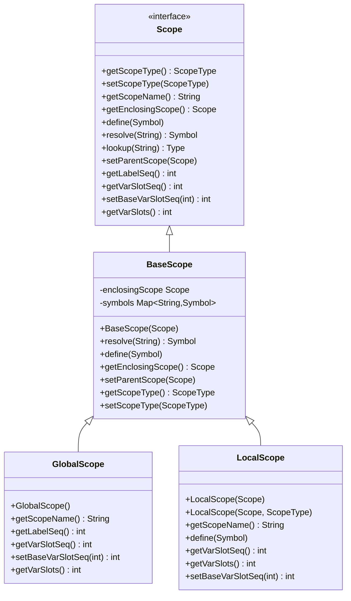
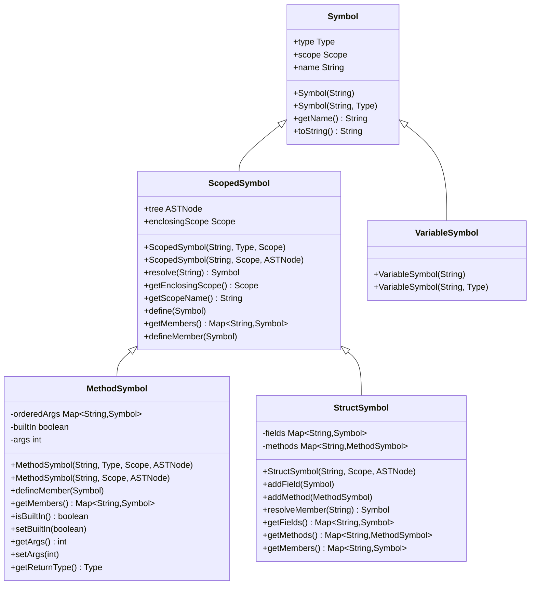
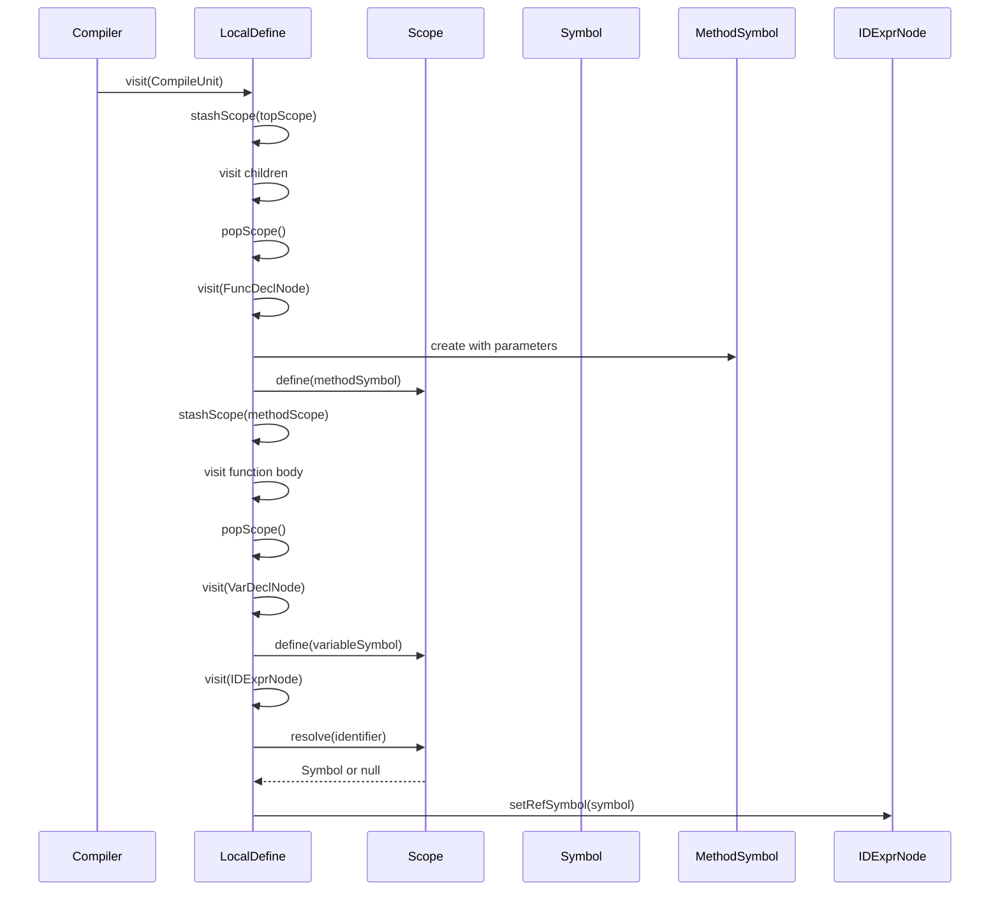
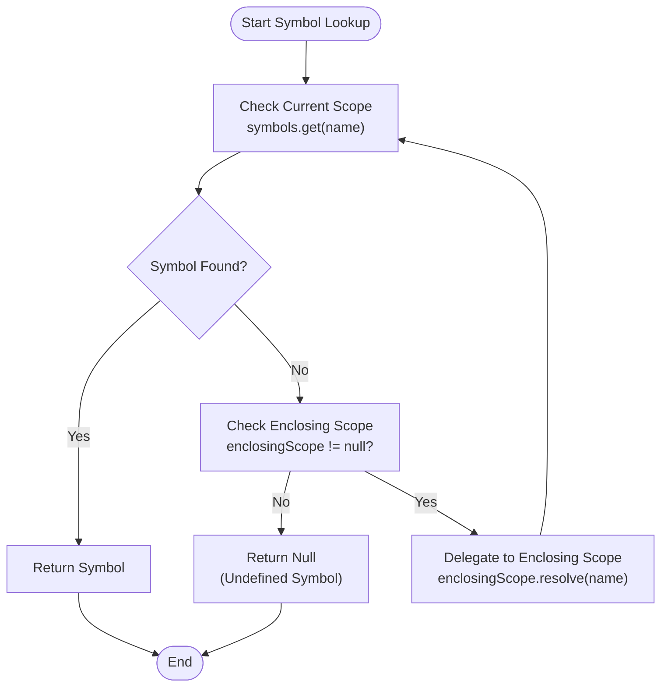

# Symbol Table and Scope Management

<cite>
**Referenced Files in This Document**   
- [Scope.java](file://ep20/src/main/java/org/teachfx/antlr4/ep20/symtab/scope/Scope.java)
- [BaseScope.java](file://ep20/src/main/java/org/teachfx/antlr4/ep20/symtab/scope/BaseScope.java)
- [GlobalScope.java](file://ep20/src/main/java/org/teachfx/antlr4/ep20/symtab/scope/GlobalScope.java)
- [LocalScope.java](file://ep20/src/main/java/org/teachfx/antlr4/ep20/symtab/scope/LocalScope.java)
- [Symbol.java](file://ep20/src/main/java/org/teachfx/antlr4/ep20/symtab/symbol/Symbol.java)
- [VariableSymbol.java](file://ep20/src/main/java/org/teachfx/antlr4/ep20/symtab/symbol/VariableSymbol.java)
- [MethodSymbol.java](file://ep20/src/main/java/org/teachfx/antlr4/ep20/symtab/symbol/MethodSymbol.java)
- [StructSymbol.java](file://ep20/src/main/java/org/teachfx/antlr4/ep20/symtab/symbol/StructSymbol.java)
- [LocalDefine.java](file://ep20/src/main/java/org/teachfx/antlr4/ep20/pass/symtab/LocalDefine.java)
</cite>

## Table of Contents
1. [Introduction](#introduction)
2. [Scope Hierarchy System](#scope-hierarchy-system)
3. [Symbol Inheritance Hierarchy](#symbol-inheritance-hierarchy)
4. [Symbol Collection and Resolution Process](#symbol-collection-and-resolution-process)
5. [Scope Chain Traversal and Symbol Lookup](#scope-chain-traversal-and-symbol-lookup)
6. [Handling Variable Shadowing and Function Parameters](#handling-variable-shadowing-and-function-parameters)
7. [Debugging Symbol Resolution Issues](#debugging-symbol-resolution-issues)
8. [Extending the Symbol System](#extending-the-symbol-system)
9. [Conclusion](#conclusion)

## Introduction
This document provides comprehensive documentation on the symbol table and scope management system implemented in the Antlr4-based programming language compiler. The system enables proper variable and function resolution through a hierarchical scope structure and symbol inheritance hierarchy. The implementation supports nested scopes, symbol collection during semantic analysis, and efficient symbol lookup with proper handling of shadowing and function parameters.

**Section sources**
- [Scope.java](file://ep20/src/main/java/org/teachfx/antlr4/ep20/symtab/scope/Scope.java#L1-L35)
- [Symbol.java](file://ep20/src/main/java/org/teachfx/antlr4/ep20/symtab/symbol/Symbol.java#L1-L92)

## Scope Hierarchy System

The scope management system implements a hierarchical structure through three primary scope classes: Scope, BaseScope, GlobalScope, and LocalScope. The system follows the principle of lexical scoping where inner scopes can access symbols from outer scopes but not vice versa.



**Diagram sources**
- [Scope.java](file://ep20/src/main/java/org/teachfx/antlr4/ep20/symtab/scope/Scope.java#L1-L35)
- [BaseScope.java](file://ep20/src/main/java/org/teachfx/antlr4/ep20/symtab/scope/BaseScope.java#L1-L71)
- [GlobalScope.java](file://ep20/src/main/java/org/teachfx/antlr4/ep20/symtab/scope/GlobalScope.java#L1-L36)
- [LocalScope.java](file://ep20/src/main/java/org/teachfx/antlr4/ep20/symtab/scope/LocalScope.java#L1-L52)

### GlobalScope Implementation
The GlobalScope class represents the outermost scope in the system, serving as the root of the scope hierarchy. It is initialized with built-in types (INT, FLOAT, VOID, BOOLEAN) and predefined functions like "print". The GlobalScope constructor takes a null parent, establishing it as the top-level scope.

### LocalScope Implementation
The LocalScope class represents nested scopes created within functions, loops, and blocks. It inherits from BaseScope and maintains its own symbol table while preserving a reference to its enclosing scope. When a LocalScope is created, it initializes its variable slot sequence based on the parent scope's current slot count, ensuring proper memory allocation.

### Scope Resolution Mechanism
The scope resolution mechanism follows a recursive pattern where symbol lookup first checks the current scope and then delegates to the enclosing scope if the symbol is not found. This creates a scope chain that enables proper variable resolution according to lexical scoping rules.

**Section sources**
- [BaseScope.java](file://ep20/src/main/java/org/teachfx/antlr4/ep20/symtab/scope/BaseScope.java#L40-L70)
- [GlobalScope.java](file://ep20/src/main/java/org/teachfx/antlr4/ep20/symtab/scope/GlobalScope.java#L10-L35)
- [LocalScope.java](file://ep20/src/main/java/org/teachfx/antlr4/ep20/symtab/scope/LocalScope.java#L1-L52)

## Symbol Inheritance Hierarchy

The symbol system implements an inheritance hierarchy that categorizes different types of program entities. The base Symbol class provides common functionality, while specialized subclasses represent specific symbol types with additional attributes and behaviors.



**Diagram sources**
- [Symbol.java](file://ep20/src/main/java/org/teachfx/antlr4/ep20/symtab/symbol/Symbol.java#L1-L92)
- [ScopedSymbol.java](file://ep20/src/main/java/org/teachfx/antlr4/ep20/symtab/symbol/ScopedSymbol.java#L1-L69)
- [VariableSymbol.java](file://ep20/src/main/java/org/teachfx/antlr4/ep20/symtab/symbol/VariableSymbol.java#L1-L18)
- [MethodSymbol.java](file://ep20/src/main/java/org/teachfx/antlr4/ep20/symtab/symbol/MethodSymbol.java#L1-L148)
- [StructSymbol.java](file://ep20/src/main/java/org/teachfx/antlr4/ep20/symtab/symbol/StructSymbol.java#L1-L38)

### VariableSymbol
The VariableSymbol class represents variables in the program and inherits directly from the base Symbol class. It provides constructors for creating variables with or without explicit type specification. Variable symbols are stored in scope symbol tables and resolved during identifier lookup.

### MethodSymbol
The MethodSymbol class extends ScopedSymbol to represent functions and methods in the program. It maintains an ordered map of parameters (orderedArgs) and provides methods for managing function-specific attributes such as return type, parameter count, and built-in status. Method symbols can be defined as either language functions (with return type) or native functions.

### StructSymbol
The StructSymbol class represents user-defined composite types with fields and methods. It maintains separate maps for fields and methods while providing a unified interface through the getMembers() method. The struct symbol enables member access resolution through the resolveMember() method, which first checks fields and then methods.

**Section sources**
- [Symbol.java](file://ep20/src/main/java/org/teachfx/antlr4/ep20/symtab/symbol/Symbol.java#L1-L92)
- [VariableSymbol.java](file://ep20/src/main/java/org/teachfx/antlr4/ep20/symtab/symbol/VariableSymbol.java#L1-L18)
- [MethodSymbol.java](file://ep20/src/main/java/org/teachfx/antlr4/ep20/symtab/symbol/MethodSymbol.java#L1-L148)
- [StructSymbol.java](file://ep20/src/main/java/org/teachfx/antlr4/ep20/symtab/symbol/StructSymbol.java#L1-L38)

## Symbol Collection and Resolution Process

The LocalDefine class implements the symbol collection phase of semantic analysis, traversing the abstract syntax tree to identify and register symbols in appropriate scopes. This process occurs before type checking and code generation, establishing the symbol table structure.



**Diagram sources**
- [LocalDefine.java](file://ep20/src/main/java/org/teachfx/antlr4/ep20/pass/symtab/LocalDefine.java#L1-L170)
- [Scope.java](file://ep20/src/main/java/org/teachfx/antlr4/ep20/symtab/scope/Scope.java#L1-L35)

### Symbol Collection Workflow
The symbol collection process begins with the visit method on the CompileUnit node, which stashes the current top scope and processes all child nodes. For each function declaration, a new MethodSymbol is created and defined in the current scope, then a new scope is stashed for processing the function body. For variable declarations, the corresponding VariableSymbol is created and defined in the current scope.

### Identifier Resolution
When processing identifier expressions (IDExprNode), the LocalDefine visitor attempts to resolve the identifier in the current scope. If a symbol is found, it is attached to the AST node via setRefSymbol; otherwise, an "undefined symbol" error is reported. This resolution follows the scope chain from innermost to outermost scope.

### Scope Management
The LocalDefine class maintains a stack of scopes (scopeStack) to manage nested scope traversal. The stashScope method pushes a new scope onto the stack and makes it current, while popScope retrieves the previous scope. Special handling is provided for loop constructs through a separate loopStack to validate break and continue statements.

**Section sources**
- [LocalDefine.java](file://ep20/src/main/java/org/teachfx/antlr4/ep20/pass/symtab/LocalDefine.java#L1-L170)

## Scope Chain Traversal and Symbol Lookup

The scope chain traversal mechanism enables proper symbol resolution according to lexical scoping rules. When a symbol is requested, the system searches through the scope hierarchy from the current scope outward until the symbol is found or the global scope is exhausted.



**Diagram sources**
- [BaseScope.java](file://ep20/src/main/java/org/teachfx/antlr4/ep20/symtab/scope/BaseScope.java#L50-L60)
- [ScopedSymbol.java](file://ep20/src/main/java/org/teachfx/antlr4/ep20/symtab/symbol/ScopedSymbol.java#L40-L50)

### Lookup Algorithm
The symbol lookup algorithm follows these steps:
1. Attempt to find the symbol in the current scope's symbol table
2. If found, return the symbol immediately (no further searching)
3. If not found and an enclosing scope exists, delegate the lookup to the enclosing scope
4. If not found and no enclosing scope exists, return null (undefined symbol)

This algorithm ensures that the nearest declaration of a symbol is used, implementing proper lexical scoping with shadowing behavior.

### Performance Characteristics
The symbol lookup operation has O(n) time complexity in the worst case, where n is the depth of the scope hierarchy. However, in practice, most lookups are resolved in the current or immediate enclosing scope, making the average case much more efficient. The use of LinkedHashMap for symbol storage provides O(1) average-case lookup time within each scope.

**Section sources**
- [BaseScope.java](file://ep20/src/main/java/org/teachfx/antlr4/ep20/symtab/scope/BaseScope.java#L50-L60)
- [ScopedSymbol.java](file://ep20/src/main/java/org/teachfx/antlr4/ep20/symtab/symbol/ScopedSymbol.java#L40-L50)

## Handling Variable Shadowing and Function Parameters

The symbol system properly handles variable shadowing and function parameters through its scope hierarchy and symbol resolution mechanisms. Shadowing occurs when a variable in an inner scope has the same name as a variable in an outer scope, effectively hiding the outer variable within the inner scope.

### Variable Shadowing
Variable shadowing is naturally supported by the scope chain traversal mechanism. When a symbol lookup occurs, the system returns the first matching symbol found in the scope chain, which will be the innermost declaration. This means that a local variable can shadow a global variable with the same name, and a variable in a nested block can shadow a variable in an outer block.

```mermaid
classDiagram
class GlobalScope {
+x : int
+y : float
}
class FunctionScope {
+x : float
+z : boolean
}
class BlockScope {
+x : string
+w : int
}
GlobalScope <|-- FunctionScope
FunctionScope <|-- BlockScope
note right of BlockScope
In this scope :
- x refers to BlockScope.x (string)
- y refers to GlobalScope.y (float)
- z refers to FunctionScope.z (boolean)
- w refers to BlockScope.w (int)
end note
```

**Diagram sources**
- [LocalScope.java](file://ep20/src/main/java/org/teachfx/antlr4/ep20/symtab/scope/LocalScope.java#L1-L52)
- [BaseScope.java](file://ep20/src/main/java/org/teachfx/antlr4/ep20/symtab/scope/BaseScope.java#L1-L71)

### Function Parameters
Function parameters are handled as special local variables defined in the function's scope. When a function is declared, its parameters are added to the method symbol's orderedArgs map and defined in the function scope. This allows parameter access within the function body while maintaining proper scoping rules.

The MethodSymbol class maintains parameter information through its orderedArgs field, which preserves the order of parameter declaration using a LinkedHashMap. The setArgs method records the number of parameters, which is used during code generation and type checking.

**Section sources**
- [MethodSymbol.java](file://ep20/src/main/java/org/teachfx/antlr4/ep20/symtab/symbol/MethodSymbol.java#L1-L148)
- [LocalDefine.java](file://ep20/src/main/java/org/teachfx/antlr4/ep20/pass/symtab/LocalDefine.java#L80-L95)

## Debugging Symbol Resolution Issues

Debugging symbol resolution issues requires understanding the scope hierarchy and symbol lookup process. The system provides several mechanisms for diagnosing and resolving common problems.

### Common Issues and Solutions
1. **Undefined Symbol Errors**: These occur when a symbol cannot be resolved in any scope. Check that the symbol has been properly declared and that the declaration is visible from the current scope.

2. **Incorrect Symbol Resolution**: This happens when the wrong symbol is resolved due to shadowing. Use scope-aware debugging to verify which scope contains the expected symbol.

3. **Scope Management Errors**: These occur when scopes are not properly pushed or popped during AST traversal. Verify that stashScope and popScope calls are balanced.

### Debugging Techniques
- **Scope Chain Inspection**: Examine the scope chain from current to global scope to understand symbol visibility
- **Symbol Table Dumping**: Implement methods to print all symbols in a scope for verification
- **AST Node Annotation**: Ensure that resolved symbols are properly attached to AST nodes
- **Step-by-Step Traversal**: Trace the symbol collection process through the AST to identify where resolution fails

The system's design facilitates debugging through clear separation of concerns between scope management, symbol definition, and symbol resolution.

**Section sources**
- [LocalDefine.java](file://ep20/src/main/java/org/teachfx/antlr4/ep20/pass/symtab/LocalDefine.java#L40-L60)
- [BaseScope.java](file://ep20/src/main/java/org/teachfx/antlr4/ep20/symtab/scope/BaseScope.java#L50-L60)

## Extending the Symbol System

The symbol system is designed to be extensible for new language features. The modular architecture allows for adding new symbol types, scope types, and resolution rules without modifying existing core components.

### Adding New Symbol Types
To add a new symbol type, create a class that extends Symbol or ScopedSymbol and implement any additional attributes and methods required by the new feature. For example, to add a constant symbol type:

```java
public class ConstantSymbol extends Symbol {
    private final Object value;
    
    public ConstantSymbol(String name, Type type, Object value) {
        super(name, type);
        this.value = value;
    }
    
    public Object getValue() {
        return value;
    }
}
```

### Adding New Scope Types
New scope types can be implemented by extending BaseScope and overriding appropriate methods. For example, to add a class scope:

```java
public class ClassScope extends BaseScope {
    public ClassScope(Scope parent) {
        super(parent);
    }
    
    @Override
    public String getScopeName() {
        return "Class_" + getEnclosingScope().getScopeName();
    }
}
```

### Integration Points
Key integration points for extending the system include:
- **LocalDefine visitor**: Add visit methods for new AST nodes that introduce symbols
- **Scope interface**: Implement new scope types with appropriate behavior
- **Symbol hierarchy**: Extend with new symbol types for language features
- **Type system**: Integrate new symbol types with the type checker

The system's use of interfaces and abstract classes provides flexibility for extension while maintaining a consistent API.

**Section sources**
- [Symbol.java](file://ep20/src/main/java/org/teachfx/antlr4/ep20/symtab/symbol/Symbol.java#L1-L92)
- [BaseScope.java](file://ep20/src/main/java/org/teachfx/antlr4/ep20/symtab/scope/BaseScope.java#L1-L71)
- [LocalDefine.java](file://ep20/src/main/java/org/teachfx/antlr4/ep20/pass/symtab/LocalDefine.java#L1-L170)

## Conclusion
The symbol table and scope management system provides a robust foundation for semantic analysis in the Antlr4-based compiler. The hierarchical scope structure enables proper lexical scoping with support for nested scopes, while the symbol inheritance hierarchy categorizes different program entities. The LocalDefine class implements efficient symbol collection and resolution, handling variable shadowing, function parameters, and other language features. The system is designed to be extensible, allowing for the addition of new language features through well-defined integration points. This comprehensive approach ensures correct symbol resolution and provides a solid basis for subsequent compilation phases.