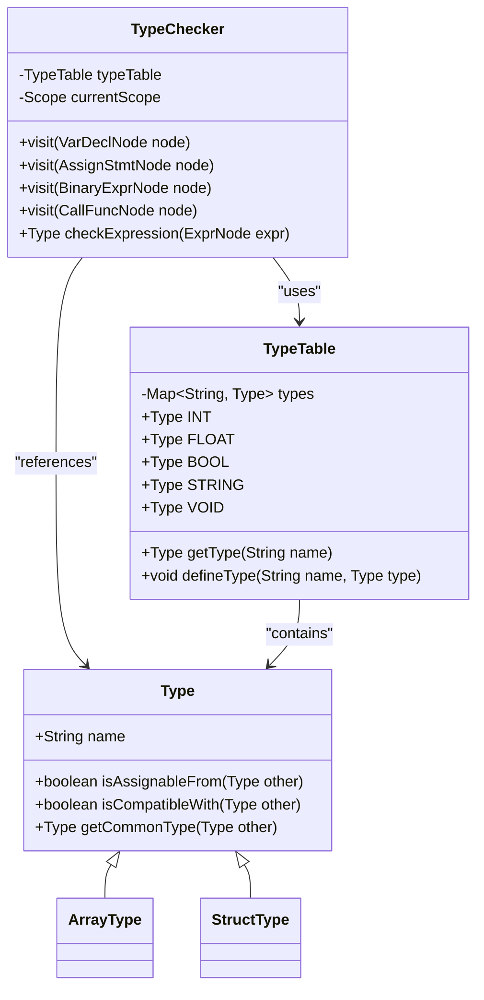
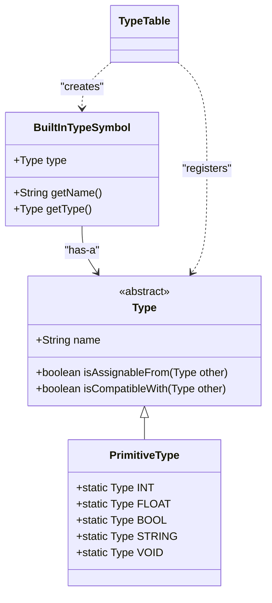
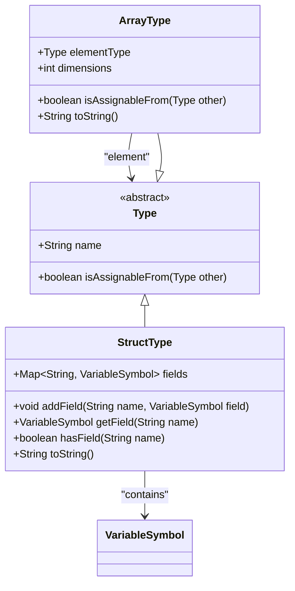
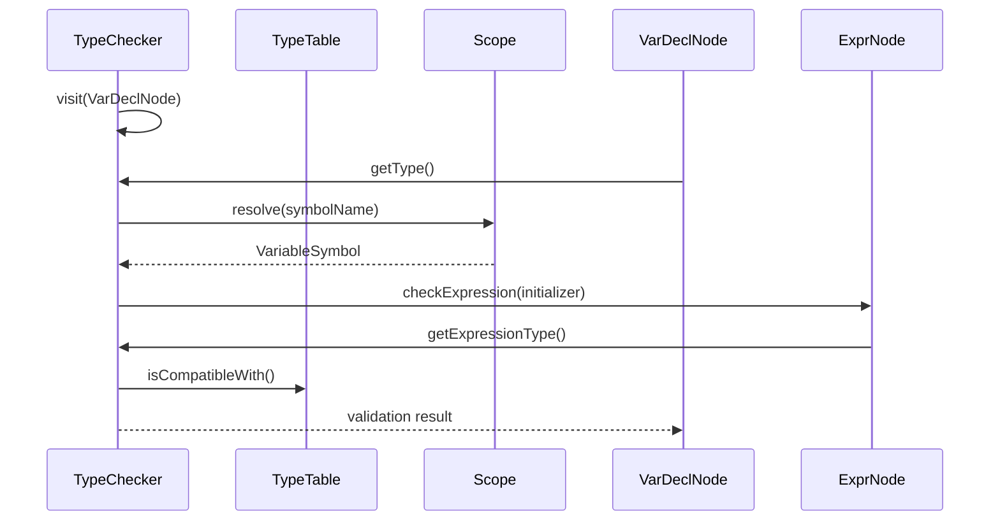
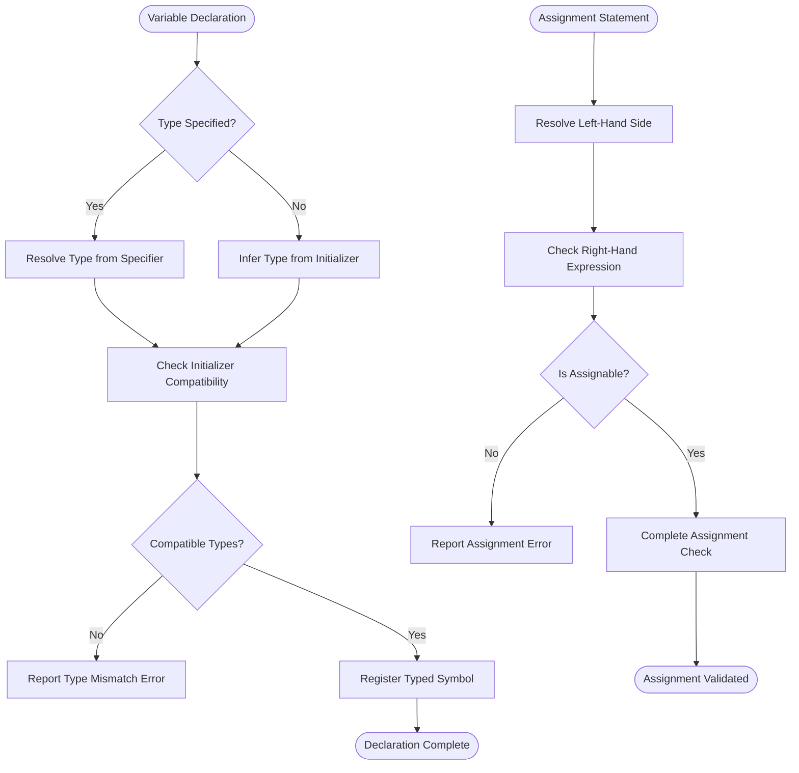
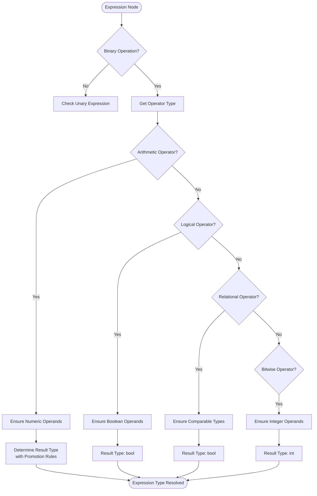
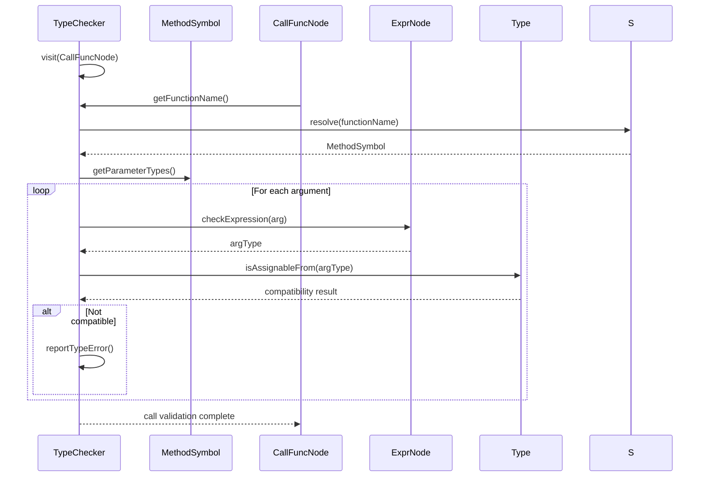
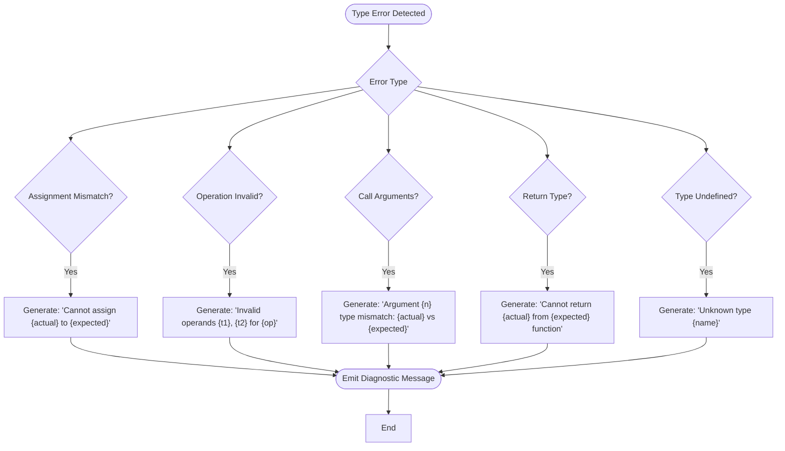
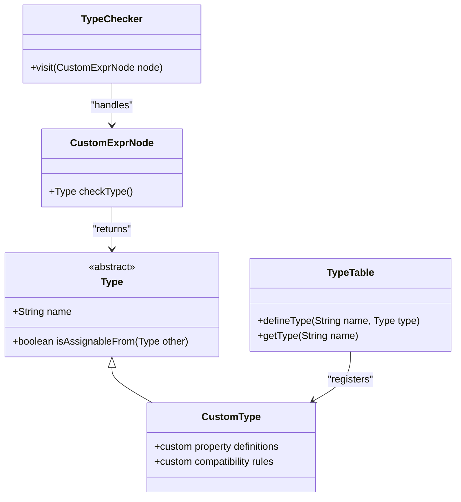

# Type System and Type Checking

<cite>
**Referenced Files in This Document**  
- [Type.java](file://ep19/src/main/java/org/teachfx/antlr4/ep19/symtab/type/Type.java)
- [TypeTable.java](file://ep19/src/main/java/org/teachfx/antlr4/ep19/symtab/TypeTable.java)
- [TypeChecker.java](file://ep19/src/main/java/org/teachfx/antlr4/ep19/pass/TypeCheckVisitor.java)
- [ArrayType.java](file://ep19/src/main/java/org/teachfx/antlr4/ep19/symtab/type/ArrayType.java)
- [StructType.java](file://ep19/src/main/java/org/teachfx/antlr4/ep19/symtab/type/StructType.java)
- [VariableSymbol.java](file://ep19/src/main/java/org/teachfx/antlr4/ep19/symtab/symbol/VariableSymbol.java)
- [MethodSymbol.java](file://ep19/src/main/java/org/teachfx/antlr4/ep19/symtab/symbol/MethodSymbol.java)
- [BuiltInTypeSymbol.java](file://ep19/src/main/java/org/teachfx/antlr4/ep19/symtab/symbol/BuiltInTypeSymbol.java)
</cite>

## Table of Contents
1. [Introduction](#introduction)
2. [Core Type System Components](#core-type-system-components)
3. [Type Hierarchy and Built-in Types](#type-hierarchy-and-built-in-types)
4. [Composite Types: Arrays and Structs](#composite-types-arrays-and-structs)
5. [Type Checking and Semantic Validation](#type-checking-and-semantic-validation)
6. [Type Resolution in Variable Declarations and Assignments](#type-resolution-in-variable-declarations-and-assignments)
7. [Expression and Operation Type Checking](#expression-and-operation-type-checking)
8. [Function Call Validation](#function-call-validation)
9. [Error Diagnostics and Common Type Errors](#error-diagnostics-and-common-type-errors)
10. [Extensibility and Custom Type Support](#extensibility-and-custom-type-support)

## Introduction
The type system in this compiler implementation provides a robust foundation for semantic analysis, ensuring type safety and correctness throughout the language. Built on ANTLR4's parsing infrastructure, the system combines symbol table management with static type checking to enforce language rules during compilation. This document details the architecture and behavior of the core type system components, focusing on type representation, compatibility rules, and validation mechanisms.

## Core Type System Components

The type system is implemented through a set of interrelated classes that manage type definitions, symbol resolution, and type checking. At its core are `Type`, `TypeTable`, and `TypeChecker` classes, which work in conjunction with symbol table infrastructure to provide comprehensive type analysis.

**Diagram sources**  
- [Type.java](file://ep19/src/main/java/org/teachfx/antlr4/ep19/symtab/type/Type.java)
- [TypeTable.java](file://ep19/src/main/java/org/teachfx/antlr4/ep19/symtab/TypeTable.java)
- [TypeChecker.java](file://ep19/src/main/java/org/teachfx/antlr4/ep19/pass/TypeCheckVisitor.java)

**Section sources**  
- [Type.java](file://ep19/src/main/java/org/teachfx/antlr4/ep19/symtab/type/Type.java#L1-L50)
- [TypeTable.java](file://ep19/src/main/java/org/teachfx/antlr4/ep19/symtab/TypeTable.java#L1-L40)
- [TypeChecker.java](file://ep19/src/main/java/org/teachfx/antlr4/ep19/pass/TypeCheckVisitor.java#L1-L60)

## Type Hierarchy and Built-in Types

The type hierarchy is rooted in the abstract `Type` class, which defines the contract for all type operations including assignment compatibility, comparison, and type promotion. Built-in primitive types are managed by `TypeTable`, which acts as a registry for all known types in the system.

The implementation includes standard primitive types such as integer, floating-point, boolean, and string, each represented as singleton instances within `TypeTable`. These types are automatically initialized during compiler startup and are available for use in all compilation units.

**Diagram sources**  
- [Type.java](file://ep19/src/main/java/org/teachfx/antlr4/ep19/symtab/type/Type.java#L1-L100)
- [BuiltInTypeSymbol.java](file://ep19/src/main/java/org/teachfx/antlr4/ep19/symtab/symbol/BuiltInTypeSymbol.java#L1-L30)
- [TypeTable.java](file://ep19/src/main/java/org/teachfx/antlr4/ep19/symtab/TypeTable.java#L20-L80)

**Section sources**  
- [Type.java](file://ep19/src/main/java/org/teachfx/antlr4/ep19/symtab/type/Type.java#L1-L100)
- [TypeTable.java](file://ep19/src/main/java/org/teachfx/antlr4/ep19/symtab/TypeTable.java#L20-L80)
- [BuiltInTypeSymbol.java](file://ep19/src/main/java/org/teachfx/antlr4/ep19/symtab/symbol/BuiltInTypeSymbol.java#L1-L30)

## Composite Types: Arrays and Structs

Composite types extend the base `Type` class to support more complex data structures. `ArrayType` represents homogeneous collections with a specified element type and dimensionality, while `StructType` models user-defined record types with named fields.

`ArrayType` implements type compatibility rules that allow assignment between arrays of compatible element types, supporting covariant assignment where appropriate. The implementation tracks both the base element type and dimensionality, enabling multi-dimensional array support.

`StructType` maintains a field symbol table that maps field names to their respective types and offsets. It supports member access operations and enforces encapsulation rules defined by the language specification.

**Diagram sources**  
- [ArrayType.java](file://ep19/src/main/java/org/teachfx/antlr4/ep19/symtab/type/ArrayType.java#L1-L60)
- [StructType.java](file://ep19/src/main/java/org/teachfx/antlr4/ep19/symtab/type/StructType.java#L1-L70)
- [Type.java](file://ep19/src/main/java/org/teachfx/antlr4/ep19/symtab/type/Type.java#L1-L50)

**Section sources**  
- [ArrayType.java](file://ep19/src/main/java/org/teachfx/antlr4/ep19/symtab/type/ArrayType.java#L1-L100)
- [StructType.java](file://ep19/src/main/java/org/teachfx/antlr4/ep19/symtab/type/StructType.java#L1-L100)

## Type Checking and Semantic Validation

The `TypeChecker` class performs semantic validation through a visitor pattern implementation that traverses the abstract syntax tree. It verifies type correctness for all expressions, statements, and declarations, ensuring that operations are performed on compatible types.

Key responsibilities of the type checker include:
- Verifying variable declaration types against initializer expressions
- Ensuring assignment compatibility between left-hand and right-hand sides
- Validating function call arguments against parameter types
- Checking return type compatibility in function bodies
- Resolving expression types for arithmetic and logical operations

The type checker maintains a reference to the current scope to resolve symbol types and leverages the `TypeTable` for built-in type lookups.

**Diagram sources**  
- [TypeChecker.java](file://ep19/src/main/java/org/teachfx/antlr4/ep19/pass/TypeCheckVisitor.java#L50-L150)
- [TypeTable.java](file://ep19/src/main/java/org/teachfx/antlr4/ep19/symtab/TypeTable.java#L30-L60)
- [Scope.java](file://ep19/src/main/java/org/teachfx/antlr4/ep19/symtab/scope/Scope.java#L20-L50)

**Section sources**  
- [TypeChecker.java](file://ep19/src/main/java/org/teachfx/antlr4/ep19/pass/TypeCheckVisitor.java#L50-L200)

## Type Resolution in Variable Declarations and Assignments

Type resolution during variable declarations follows a two-step process: first resolving the declared type from the type specifier, then verifying compatibility with the initializer expression. For assignments, the system checks that the right-hand side expression type is assignable to the left-hand side variable type.

The implementation supports type inference in cases where the variable type is not explicitly specified, deriving the type from the initializer expression. This feature enables more concise code while maintaining type safety.

When processing assignments, the type checker considers both exact type matches and implicit conversions allowed by the language specification, such as numeric promotions from integer to floating-point types.

**Diagram sources**  
- [TypeChecker.java](file://ep19/src/main/java/org/teachfx/antlr4/ep19/pass/TypeCheckVisitor.java#L100-L180)
- [VariableSymbol.java](file://ep19/src/main/java/org/teachfx/antlr4/ep19/symtab/symbol/VariableSymbol.java#L1-L40)

**Section sources**  
- [TypeChecker.java](file://ep19/src/main/java/org/teachfx/antlr4/ep19/pass/TypeCheckVisitor.java#L100-L200)
- [VariableSymbol.java](file://ep19/src/main/java/org/teachfx/antlr4/ep19/symtab/symbol/VariableSymbol.java#L1-L50)

## Expression and Operation Type Checking

Expression type checking determines the resulting type of operations based on operand types and operator semantics. The system implements a hierarchy of expression type rules for arithmetic, logical, relational, and bitwise operations.

For arithmetic operations, the type checker applies standard promotion rules, with the result type being the more general of the operand types (e.g., int + float → float). Logical operations require boolean operands and produce boolean results. Relational operations between compatible types produce boolean results.

The implementation includes special handling for mixed-type expressions, applying implicit conversion rules where appropriate while flagging invalid combinations that could lead to data loss or undefined behavior.

**Diagram sources**  
- [TypeChecker.java](file://ep19/src/main/java/org/teachfx/antlr4/ep19/pass/TypeCheckVisitor.java#L200-L300)
- [BinaryExprNode.java](file://ep20/src/main/java/org/teachfx/antlr4/ep20/ast/expr/BinaryExprNode.java#L1-L20)

**Section sources**  
- [TypeChecker.java](file://ep19/src/main/java/org/teachfx/antlr4/ep19/pass/TypeCheckVisitor.java#L200-L350)

## Function Call Validation

Function call validation ensures that arguments match the expected parameter types in number, order, and compatibility. The type checker resolves the function symbol, retrieves its parameter type signature, and verifies each argument against the corresponding parameter type.

The system supports implicit type conversions for function arguments when they are safe and well-defined, such as numeric promotions. However, it rejects calls with incorrect argument counts or incompatible types that cannot be safely converted.

Return type validation occurs within function bodies, ensuring that all return statements provide values compatible with the function's declared return type. The checker also verifies that non-void functions have appropriate return paths.

**Diagram sources**  
- [TypeChecker.java](file://ep19/src/main/java/org/teachfx/antlr4/ep19/pass/TypeCheckVisitor.java#L300-L400)
- [MethodSymbol.java](file://ep19/src/main/java/org/teachfx/antlr4/ep19/symtab/symbol/MethodSymbol.java#L1-L50)
- [CallFuncNode.java](file://ep20/src/main/java/org/teachfx/antlr4/ep20/ast/expr/CallFuncNode.java#L1-L30)

**Section sources**  
- [TypeChecker.java](file://ep19/src/main/java/org/teachfx/antlr4/ep19/pass/TypeCheckVisitor.java#L300-L450)
- [MethodSymbol.java](file://ep19/src/main/java/org/teachfx/antlr4/ep19/symtab/symbol/MethodSymbol.java#L1-L60)

## Error Diagnostics and Common Type Errors

The type system generates descriptive error messages for common type mismatches, aiding developers in identifying and correcting issues. Common error conditions include:

- **Type mismatch in assignment**: When the right-hand side type cannot be assigned to the left-hand side
- **Invalid operation**: When an operator is applied to incompatible operand types
- **Function argument mismatch**: When function calls provide incorrect argument types or counts
- **Incompatible return type**: When a return statement provides a value incompatible with the function's return type
- **Undefined type reference**: When a type name cannot be resolved in the current scope

Error messages include the source location, expected type, actual type, and a descriptive explanation of the mismatch, enabling quick diagnosis and correction.

**Diagram sources**  
- [TypeChecker.java](file://ep19/src/main/java/org/teachfx/antlr4/ep19/pass/TypeCheckVisitor.java#L400-L500)
- [CymbalError.java](file://ep20/src/main/java/org/teachfx/antlr4/ep20/error/CymbalError.java#L1-L30)

**Section sources**  
- [TypeChecker.java](file://ep19/src/main/java/org/teachfx/antlr4/ep19/pass/TypeCheckVisitor.java#L400-L550)
- [CymbalError.java](file://ep20/src/main/java/org/teachfx/antlr4/ep20/error/CymbalError.java#L1-L40)

## Extensibility and Custom Type Support

The type system is designed with extensibility in mind, allowing for the addition of new types and operators through well-defined extension points. Custom types can be implemented by extending the `Type` class and registering them with the `TypeTable`.

New operators can be added by extending the expression node hierarchy and implementing corresponding type checking rules in the `TypeChecker`. The visitor pattern enables clean separation of concerns, allowing new type checking logic to be added without modifying existing code.

The symbol table architecture supports user-defined types through the `StructSymbol` and `TypedefSymbol` classes, enabling language features such as type aliases and composite data structures. This modular design facilitates the evolution of the language while maintaining type safety.

**Diagram sources**  
- [Type.java](file://ep19/src/main/java/org/teachfx/antlr4/ep19/symtab/type/Type.java#L50-L80)
- [TypeTable.java](file://ep19/src/main/java/org/teachfx/antlr4/ep19/symtab/TypeTable.java#L60-L90)
- [TypeChecker.java](file://ep19/src/main/java/org/teachfx/antlr4/ep19/pass/TypeCheckVisitor.java#L450-L500)

**Section sources**  
- [Type.java](file://ep19/src/main/java/org/teachfx/antlr4/ep19/symtab/type/Type.java#L50-L100)
- [TypeTable.java](file://ep19/src/main/java/org/teachfx/antlr4/ep19/symtab/TypeTable.java#L60-L100)
- [TypeChecker.java](file://ep19/src/main/java/org/teachfx/antlr4/ep19/pass/TypeCheckVisitor.java#L450-L600)