# Control Structures

<cite>
**Referenced Files in This Document**   
- [IfStmtNode.java](file://ep20/src/main/java/org/teachfx/antlr4/ep20/ast/stmt/IfStmtNode.java)
- [WhileStmtNode.java](file://ep20/src/main/java/org/teachfx/antlr4/ep20/ast/stmt/WhileStmtNode.java)
- [BreakStmtNode.java](file://ep20/src/main/java/org/teachfx/antlr4/ep20/ast/stmt/BreakStmtNode.java)
- [ContinueStmtNode.java](file://ep20/src/main/java/org/teachfx/antlr4/ep20/ast/stmt/ContinueStmtNode.java)
- [CymbolIRBuilder.java](file://ep20/src/main/java/org/teachfx/antlr4/ep20/pass/ir/CymbolIRBuilder.java)
- [CFGBuilder.java](file://ep20/src/main/java/org/teachfx/antlr4/ep20/pass/cfg/CFGBuilder.java)
</cite>

## Table of Contents
1. [Introduction](#introduction)
2. [Control Flow Constructs Overview](#control-flow-constructs-overview)
3. [AST Node Implementations](#ast-node-implementations)
4. [Intermediate Representation Translation](#intermediate-representation-translation)
5. [Control Flow Graph Construction](#control-flow-graph-construction)
6. [Code Examples and Edge Cases](#code-examples-and-edge-cases)
7. [Common Programming Errors](#common-programming-errors)
8. [Conclusion](#conclusion)

## Introduction
This document provides a comprehensive analysis of control flow constructs in the Cymbol programming language implementation. It details the architecture and behavior of if, while, break, and continue statements through their corresponding Abstract Syntax Tree (AST) node classes. The document explains how these constructs are translated into intermediate representation (IR) and how they influence control flow graph (CFG) construction during compilation.

**Section sources**
- [IfStmtNode.java](file://ep20/src/main/java/org/teachfx/antlr4/ep20/ast/stmt/IfStmtNode.java#L1-L61)
- [WhileStmtNode.java](file://ep20/src/main/java/org/teachfx/antlr4/ep20/ast/stmt/WhileStmtNode.java#L1-L47)

## Control Flow Constructs Overview
Cymbol implements standard imperative control flow constructs including conditional branching with if statements, iterative execution with while loops, and loop control with break and continue statements. These constructs enable programmers to express complex program logic through conditional evaluation and repeated execution patterns. The language follows conventional semantics where conditions are evaluated to boolean values, and control transfers based on the evaluation result.

The implementation follows a structured approach where each control construct is represented as a distinct AST node type, allowing for specialized processing during semantic analysis and code generation phases. This modular design facilitates clear separation of concerns and enables targeted optimization strategies for different control flow patterns.

## AST Node Implementations

### If Statement Implementation
The `IfStmtNode` class represents conditional branching constructs in Cymbol. It encapsulates a condition expression, a then-block, and an optional else-block. The node structure maintains references to these components, enabling traversal and evaluation during code generation. The implementation supports both if-then and if-then-else patterns through the optional nature of the else-block.

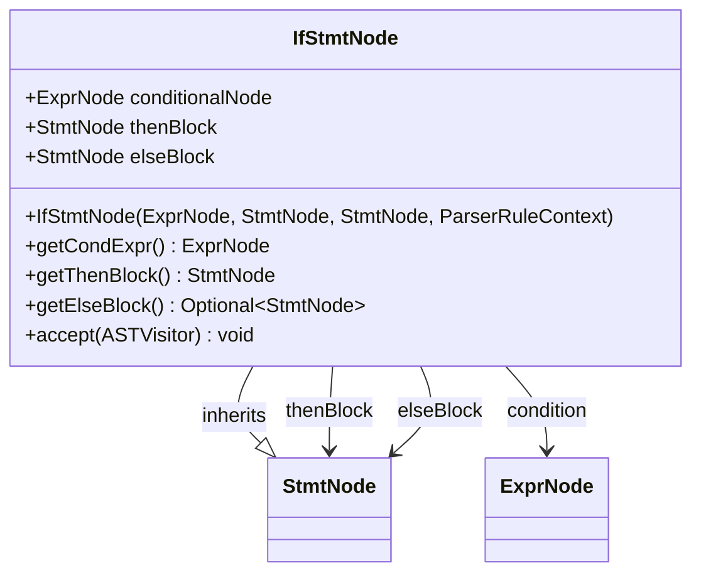

**Diagram sources**
- [IfStmtNode.java](file://ep20/src/main/java/org/teachfx/antlr4/ep20/ast/stmt/IfStmtNode.java#L1-L61)

**Section sources**
- [IfStmtNode.java](file://ep20/src/main/java/org/teachfx/antlr4/ep20/ast/stmt/IfStmtNode.java#L1-L61)

### While Loop Implementation
The `WhileStmtNode` class implements iterative execution through while loops. It contains a condition expression and a block statement representing the loop body. The node structure enables repeated evaluation of the condition followed by execution of the body when the condition evaluates to true. The implementation ensures proper scoping and control transfer between loop components.

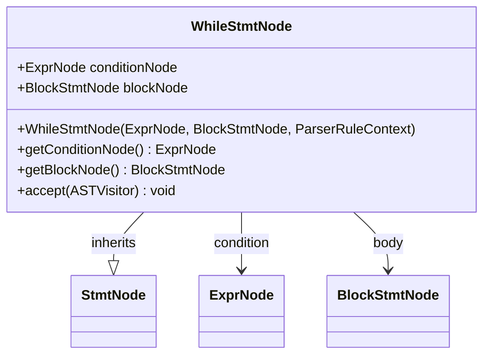

**Diagram sources**
- [WhileStmtNode.java](file://ep20/src/main/java/org/teachfx/antlr4/ep20/ast/stmt/WhileStmtNode.java#L1-L47)

**Section sources**
- [WhileStmtNode.java](file://ep20/src/main/java/org/teachfx/antlr4/ep20/ast/stmt/WhileStmtNode.java#L1-L47)

### Break and Continue Statements
The `BreakStmtNode` and `ContinueStmtNode` classes provide loop control mechanisms. Both inherit from the base `StmtNode` class and represent unconditional transfers of control. The break statement exits the enclosing loop entirely, while the continue statement skips to the next iteration. These nodes contain minimal state, primarily serving as markers for control flow redirection during code generation.

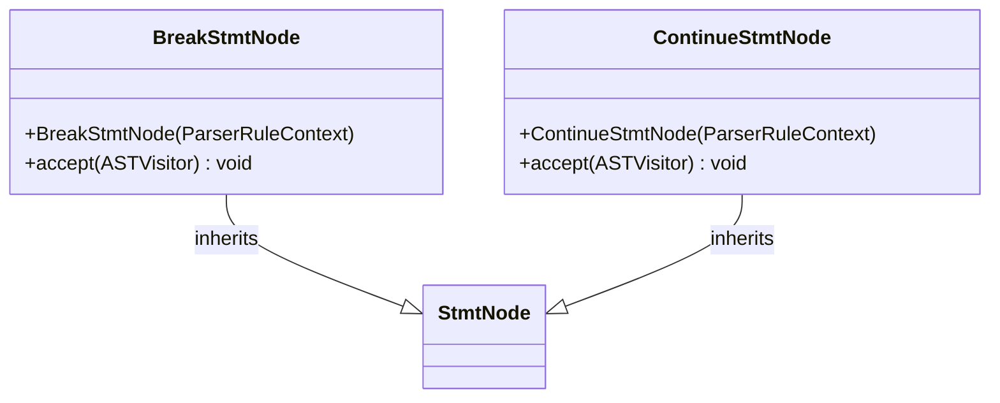

**Diagram sources**
- [BreakStmtNode.java](file://ep20/src/main/java/org/teachfx/antlr4/ep20/ast/stmt/BreakStmtNode.java#L1-L24)
- [ContinueStmtNode.java](file://ep20/src/main/java/org/teachfx/antlr4/ep20/ast/stmt/ContinueStmtNode.java#L1-L21)

**Section sources**
- [BreakStmtNode.java](file://ep20/src/main/java/org/teachfx/antlr4/ep20/ast/stmt/BreakStmtNode.java#L1-L24)
- [ContinueStmtNode.java](file://ep20/src/main/java/org/teachfx/antlr4/ep20/ast/stmt/ContinueStmtNode.java#L1-L21)

## Intermediate Representation Translation

### IR Generation Process
The translation of control flow constructs into intermediate representation occurs in the `CymbolIRBuilder` class, which implements the `ASTVisitor` interface. This visitor pattern enables systematic traversal of the AST and generation of corresponding IR instructions. The process involves creating basic blocks, emitting control flow instructions, and managing evaluation stacks.

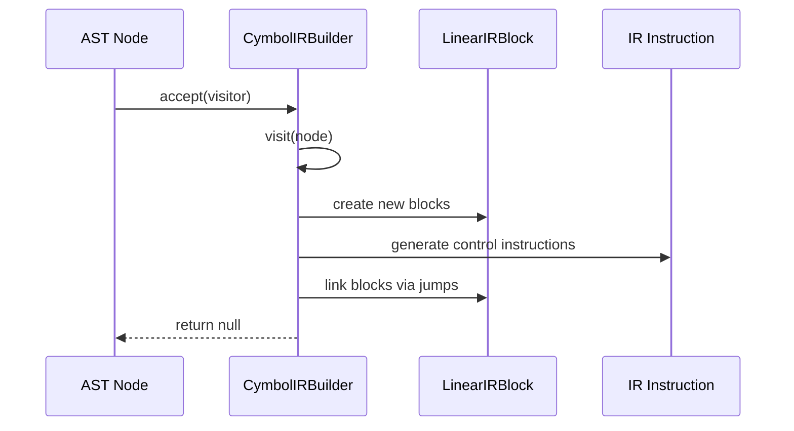

**Diagram sources**
- [CymbolIRBuilder.java](file://ep20/src/main/java/org/teachfx/antlr4/ep20/pass/ir/CymbolIRBuilder.java#L1-L474)

**Section sources**
- [CymbolIRBuilder.java](file://ep20/src/main/java/org/teachfx/antlr4/ep20/pass/ir/CymbolIRBuilder.java#L1-L474)

### If Statement Translation
The translation of if statements involves creating three basic blocks: one for the condition evaluation, one for the then-branch, and one for the continuation point after the if statement. When an else-branch exists, a fourth block is created. The process begins with evaluating the condition expression, followed by a conditional jump (CJMP) that directs control to the appropriate branch based on the condition's value.

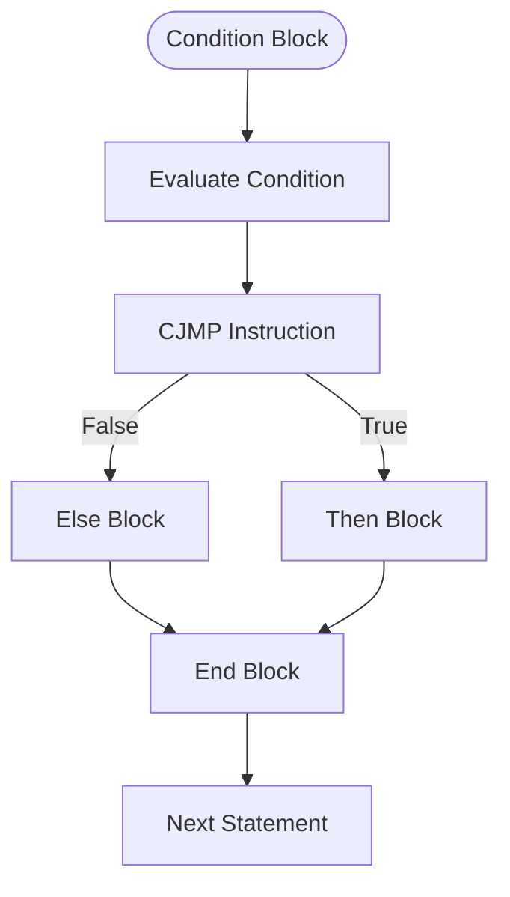

**Diagram sources**
- [CymbolIRBuilder.java](file://ep20/src/main/java/org/teachfx/antlr4/ep20/pass/ir/CymbolIRBuilder.java#L271-L315)

### While Loop Translation
While loop translation creates four basic blocks: condition, loop body, continuation, and an implicit back-edge. The process starts with an unconditional jump to the condition block. After condition evaluation, a conditional jump determines whether to execute the loop body or exit the loop. The loop body ends with an unconditional jump back to the condition block, creating the iteration cycle.

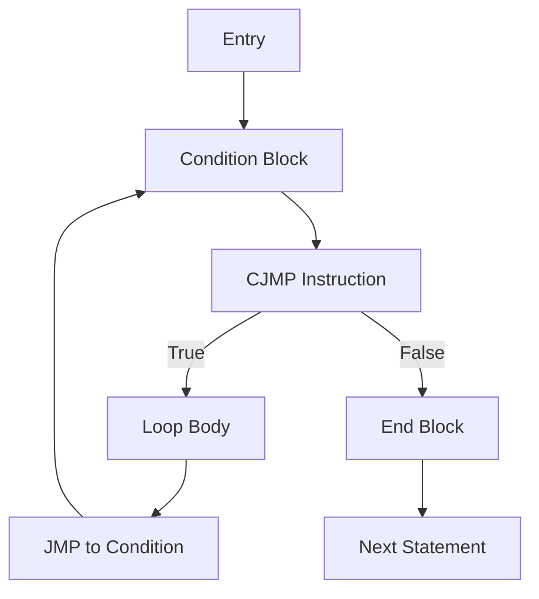

**Diagram sources**
- [CymbolIRBuilder.java](file://ep20/src/main/java/org/teachfx/antlr4/ep20/pass/ir/CymbolIRBuilder.java#L228-L273)

### Break and Continue Translation
Break and continue statements are translated using stack-based management of target blocks. The `CymbolIRBuilder` maintains separate stacks for break and continue targets, which are updated when entering and exiting loop constructs. A break statement generates an unconditional jump (JMP) to the top of the break stack, while a continue statement jumps to the top of the continue stack.

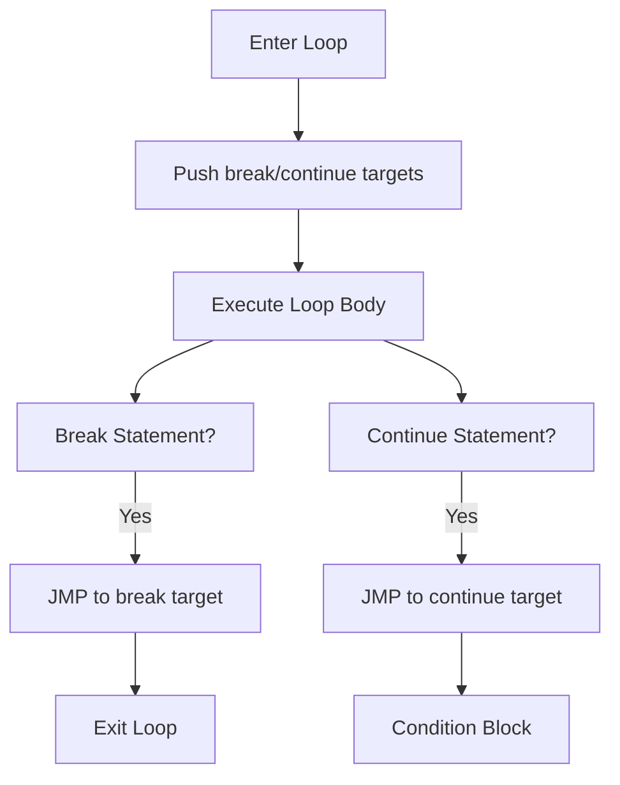

**Diagram sources**
- [CymbolIRBuilder.java](file://ep20/src/main/java/org/teachfx/antlr4/ep20/pass/ir/CymbolIRBuilder.java#L271-L315)

## Control Flow Graph Construction

### CFG Builder Implementation
The control flow graph is constructed from the linear IR blocks generated during the translation phase. The `CFGBuilder` class processes the linked structure of `LinearIRBlock` instances, creating a graph representation where nodes are basic blocks and edges represent control flow transfers. The builder handles both unconditional jumps (JMP) and conditional jumps (CJMP) to establish the complete control flow structure.

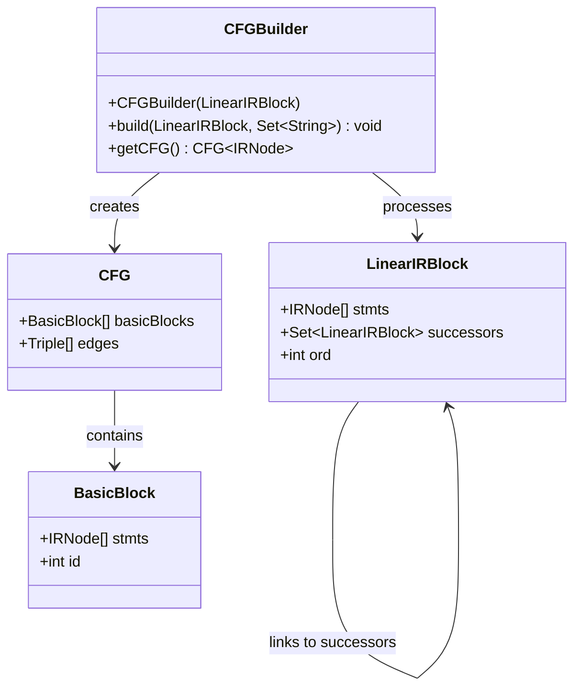

**Diagram sources**
- [CFGBuilder.java](file://ep20/src/main/java/org/teachfx/antlr4/ep20/pass/cfg/CFGBuilder.java#L1-L64)

**Section sources**
- [CFGBuilder.java](file://ep20/src/main/java/org/teachfx/antlr4/ep20/pass/cfg/CFGBuilder.java#L1-L64)

### Edge Construction Logic
The CFG construction algorithm recursively traverses the linked IR blocks, creating graph edges based on the final instruction in each block. Unconditional jumps (JMP) create single edges to the target block, while conditional jumps (CJMP) create two edges: one for the false/else branch and one for the true/then branch. Successor links established during IR generation guide the traversal process.

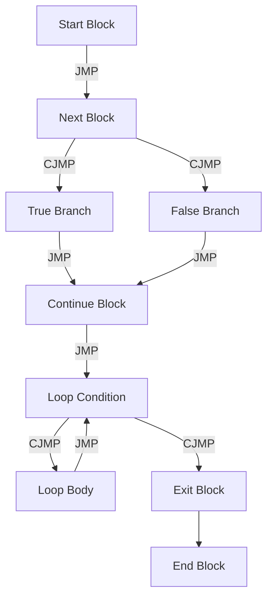

**Diagram sources**
- [CFGBuilder.java](file://ep20/src/main/java/org/teachfx/antlr4/ep20/pass/cfg/CFGBuilder.java#L1-L64)

## Code Examples and Edge Cases

### Nested Control Structures
Cymbol supports arbitrary nesting of control structures, allowing complex logic patterns. The IR generation process handles nested constructs through proper scoping and stack management. Each nested loop or conditional creates its own context for break and continue targets, ensuring correct control flow redirection.

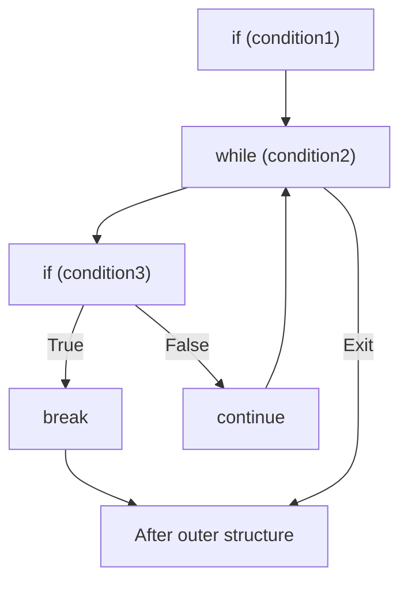

**Section sources**
- [CymbolIRBuilder.java](file://ep20/src/main/java/org/teachfx/antlr4/ep20/pass/ir/CymbolIRBuilder.java#L228-L315)

### Edge Case Scenarios
Several edge cases require special handling in the control flow implementation:
- Empty loop bodies
- Constant condition expressions
- Deeply nested break/continue statements
- Unreachable code after unconditional transfers

The compiler detects some of these cases during semantic analysis and may issue warnings or optimize the generated code accordingly.

## Common Programming Errors

### Infinite Loops
Infinite loops occur when the while loop condition never evaluates to false. This can happen with constant true conditions or when loop variables are not properly updated within the loop body. The compiler cannot always detect infinite loops statically due to the halting problem, but it may identify obvious cases of constant true conditions.

### Unreachable Code
Unreachable code typically follows unconditional control transfers like break or return statements. The control flow analysis can detect such code by identifying basic blocks that have no incoming edges in the CFG. While not always an error, unreachable code often indicates logic flaws and should be reviewed.

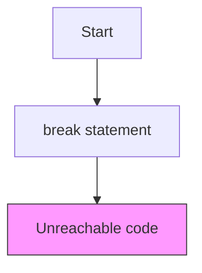

**Section sources**
- [CymbolIRBuilder.java](file://ep20/src/main/java/org/teachfx/antlr4/ep20/pass/ir/CymbolIRBuilder.java#L271-L315)

## Conclusion
The control flow implementation in Cymbol demonstrates a well-structured approach to handling imperative programming constructs. By representing each control structure as a dedicated AST node and systematically translating them into intermediate representation, the compiler ensures correct execution semantics. The use of basic blocks and explicit control flow instructions enables effective optimization and analysis in subsequent compilation phases. The stack-based management of break and continue targets provides a clean solution for nested loop handling, while the CFG construction process creates a comprehensive representation of program flow for advanced analyses.