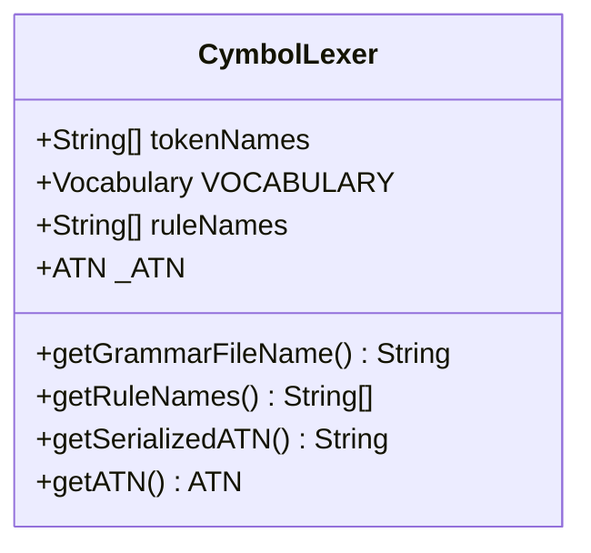
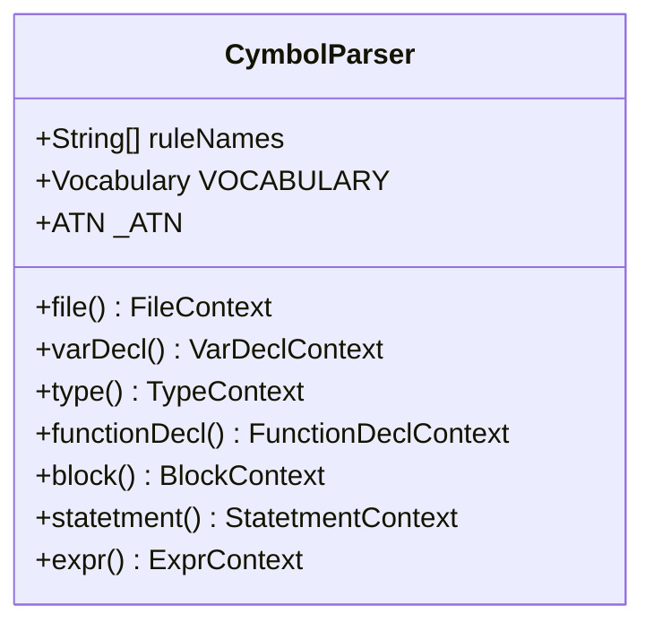
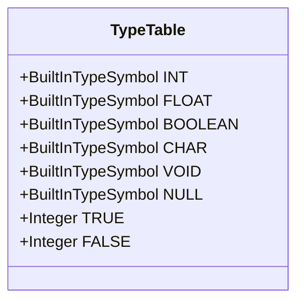
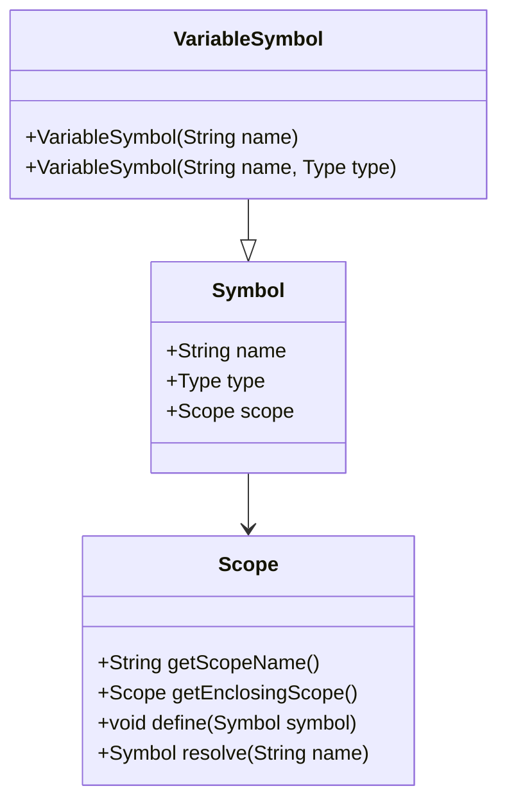
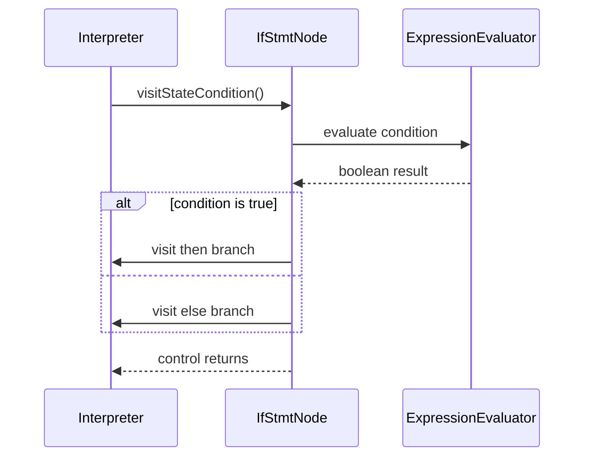
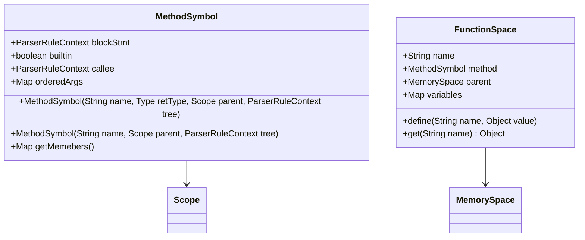
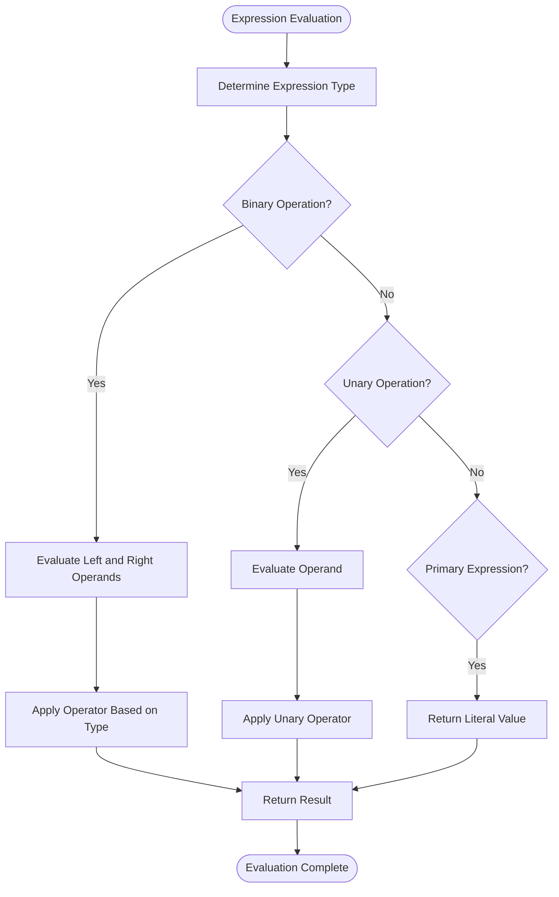
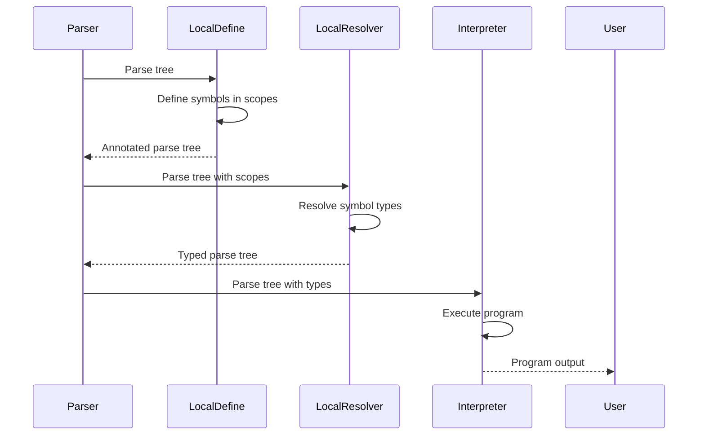
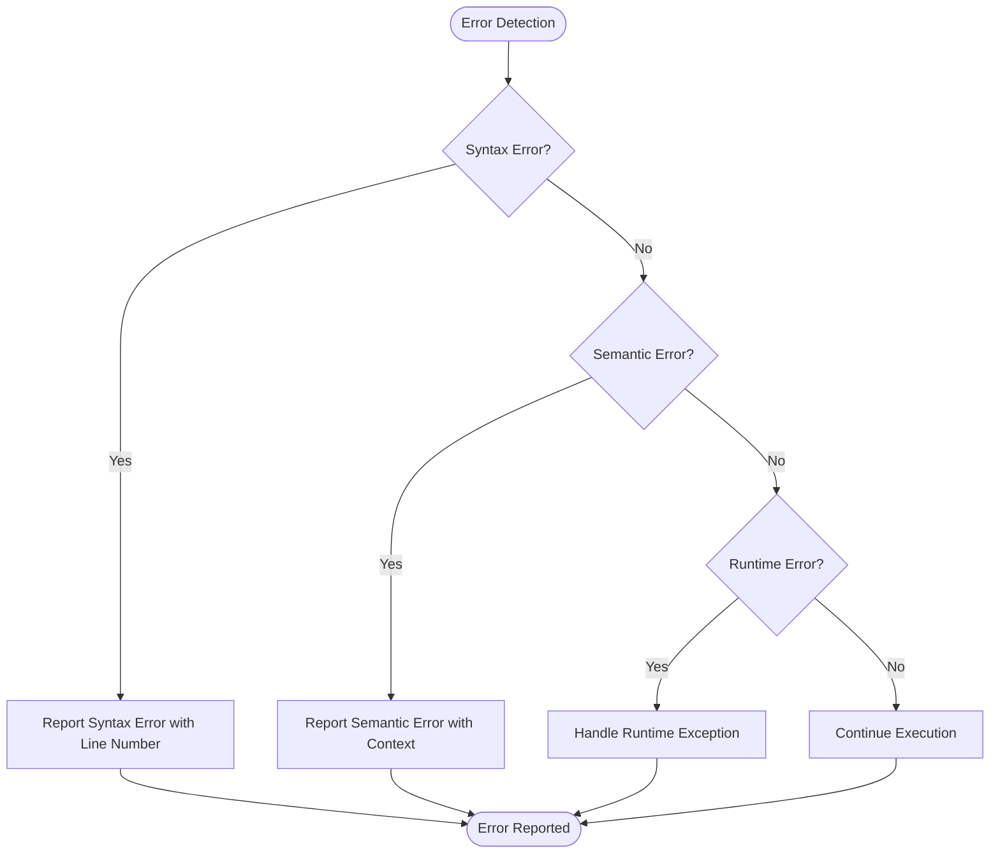

# Cymbol Language Specification

<cite>
**Referenced Files in This Document**   
- [CymbolLexer.java](file://ep16/src/main/java/org/teachfx/antlr4/ep16/parser/CymbolLexer.java)
- [CymbolParser.java](file://ep16/src/main/java/org/teachfx/antlr4/ep16/parser/CymbolParser.java)
- [BinaryExprNode.java](file://ep20/src/main/java/org/teachfx/antlr4/ep20/ast/expr/BinaryExprNode.java)
- [IfStmtNode.java](file://ep20/src/main/java/org/teachfx/antlr4/ep20/ast/stmt/IfStmtNode.java)
- [Interpreter.java](file://ep16/src/main/java/org/teachfx/antlr4/ep16/visitor/Interpreter.java)
- [LocalDefine.java](file://ep16/src/main/java/org/teachfx/antlr4/ep16/visitor/LocalDefine.java)
- [LocalResolver.java](file://ep16/src/main/java/org/teachfx/antlr4/ep16/visitor/LocalResolver.java)
- [VariableSymbol.java](file://ep16/src/main/java/org/teachfx/antlr4/ep16/symtab/VariableSymbol.java)
- [MethodSymbol.java](file://ep16/src/main/java/org/teachfx/antlr4/ep16/symtab/MethodSymbol.java)
- [TypeTable.java](file://ep16/src/main/java/org/teachfx/antlr4/ep16/symtab/TypeTable.java)
</cite>

## Table of Contents
1. [Introduction](#introduction)
2. [Lexical Analysis](#lexical-analysis)
3. [Syntactic Analysis](#syntactic-analysis)
4. [Data Types and Literals](#data-types-and-literals)
5. [Variable Declarations and Scoping](#variable-declarations-and-scoping)
6. [Control Structures](#control-structures)
7. [Function Declarations and Calls](#function-declarations-and-calls)
8. [Expression Evaluation](#expression-evaluation)
9. [Semantic Analysis and Symbol Resolution](#semantic-analysis-and-symbol-resolution)
10. [Error Handling](#error-handling)
11. [Concrete Examples](#concrete-examples)

## Introduction
The Cymbol programming language is a simple imperative language implemented using ANTLR4 for lexical and syntactic analysis. This document provides a comprehensive specification of the Cymbol language, covering its syntax, semantics, and implementation details. The language supports basic data types, control structures, functions, and variable scoping, with a focus on demonstrating compiler construction techniques.

**Section sources**
- [CymbolLexer.java](file://ep16/src/main/java/org/teachfx/antlr4/ep16/parser/CymbolLexer.java#L1-L264)
- [CymbolParser.java](file://ep16/src/main/java/org/teachfx/antlr4/ep16/parser/CymbolParser.java#L1-L1567)

## Lexical Analysis
The lexical analysis of Cymbol is implemented in CymbolLexer.java, which defines the tokens recognized by the language. The lexer identifies keywords, identifiers, literals, and operators according to the following token definitions:

- Keywords: `int`, `float`, `void`, `return`, `if`, `else`, `while`
- Operators: `=`, `;`, `(`, `)`, `,`, `{`, `}`, `-`, `!`, `*`, `/`, `+`, `==`, `!=`, `>`, `>=`, `<`, `<=`
- Identifiers: sequences of letters and digits starting with a letter
- Literals: integer, floating-point, boolean, string, and null values

The lexer uses ANTLR4's automatic token recognition to generate the appropriate token types for the parser.



**Diagram sources**
- [CymbolLexer.java](file://ep16/src/main/java/org/teachfx/antlr4/ep16/parser/CymbolLexer.java#L1-L264)

**Section sources**
- [CymbolLexer.java](file://ep16/src/main/java/org/teachfx/antlr4/ep16/parser/CymbolLexer.java#L1-L264)

## Syntactic Analysis
The syntactic structure of Cymbol is defined in CymbolParser.java, which implements a context-free grammar for the language. The parser recognizes the following syntactic constructs:

- Program structure: sequences of variable declarations, function declarations, and statements
- Variable declarations: type followed by identifier and optional initialization
- Function declarations: return type, identifier, parameter list, and block
- Control structures: if-else, while loops
- Expressions: arithmetic, relational, logical, and assignment operations

The grammar rules are implemented as parsing methods that return context objects representing the parsed syntax tree.



**Diagram sources**
- [CymbolParser.java](file://ep16/src/main/java/org/teachfx/antlr4/ep16/parser/CymbolParser.java#L1-L1567)

**Section sources**
- [CymbolParser.java](file://ep16/src/main/java/org/teachfx/antlr4/ep16/parser/CymbolParser.java#L1-L1567)

## Data Types and Literals
Cymbol supports the following data types:

- **Integer**: 32-bit signed integers represented by the `int` keyword
- **Float**: 32-bit floating-point numbers represented by the `float` keyword
- **Boolean**: logical values `true` and `false`
- **String**: sequences of characters enclosed in double quotes
- **Void**: used for functions that do not return a value

Literal values are recognized by the lexer and converted to appropriate Java types during interpretation.



**Diagram sources**
- [TypeTable.java](file://ep16/src/main/java/org/teachfx/antlr4/ep16/symtab/TypeTable.java#L1-L19)

**Section sources**
- [TypeTable.java](file://ep16/src/main/java/org/teachfx/antlr4/ep16/symtab/TypeTable.java#L1-L19)
- [CymbolLexer.java](file://ep16/src/main/java/org/teachfx/antlr4/ep16/parser/CymbolLexer.java#L1-L264)

## Variable Declarations and Scoping
Variables in Cymbol are declared with a type and identifier, optionally initialized with an expression. The language implements lexical scoping with the following rules:

- Variables are declared in specific scopes (global, function, block)
- Inner scopes can shadow variables from outer scopes
- Variables must be declared before use
- Scope resolution follows the static nesting of blocks

The symbol table implementation tracks variable declarations and their types across different scopes.



**Diagram sources**
- [VariableSymbol.java](file://ep16/src/main/java/org/teachfx/antlr4/ep16/symtab/VariableSymbol.java#L1-L14)
- [MethodSymbol.java](file://ep16/src/main/java/org/teachfx/antlr4/ep16/symtab/MethodSymbol.java#L1-L32)
- [TypeTable.java](file://ep16/src/main/java/org/teachfx/antlr4/ep16/symtab/TypeTable.java#L1-L19)

**Section sources**
- [VariableSymbol.java](file://ep16/src/main/java/org/teachfx/antlr4/ep16/symtab/VariableSymbol.java#L1-L14)
- [MethodSymbol.java](file://ep16/src/main/java/org/teachfx/antlr4/ep16/symtab/MethodSymbol.java#L1-L32)
- [LocalDefine.java](file://ep16/src/main/java/org/teachfx/antlr4/ep16/visitor/LocalDefine.java#L1-L153)
- [LocalResolver.java](file://ep16/src/main/java/org/teachfx/antlr4/ep16/visitor/LocalResolver.java#L1-L213)

## Control Structures
Cymbol supports the following control structures:

- **If-else statements**: conditional execution based on boolean expressions
- **While loops**: repeated execution while a condition is true
- **Break and continue**: not explicitly implemented in the current version

The control flow is implemented through AST nodes that evaluate conditions and execute appropriate branches.



**Diagram sources**
- [IfStmtNode.java](file://ep20/src/main/java/org/teachfx/antlr4/ep20/ast/stmt/IfStmtNode.java)
- [Interpreter.java](file://ep16/src/main/java/org/teachfx/antlr4/ep16/visitor/Interpreter.java#L1-L267)

**Section sources**
- [CymbolParser.java](file://ep16/src/main/java/org/teachfx/antlr4/ep16/parser/CymbolParser.java#L1-L1567)
- [Interpreter.java](file://ep16/src/main/java/org/teachfx/antlr4/ep16/visitor/Interpreter.java#L1-L267)

## Function Declarations and Calls
Functions in Cymbol are declared with a return type, identifier, parameter list, and body block. Key features include:

- Functions can return values using the `return` statement
- Parameters are passed by value
- Functions can call other functions, including themselves (recursion)
- Built-in functions like `print` are supported

Function calls are resolved through symbol table lookup and executed in their own scope.



**Diagram sources**
- [MethodSymbol.java](file://ep16/src/main/java/org/teachfx/antlr4/ep16/symtab/MethodSymbol.java#L1-L32)
- [Interpreter.java](file://ep16/src/main/java/org/teachfx/antlr4/ep16/visitor/Interpreter.java#L1-L267)

**Section sources**
- [MethodSymbol.java](file://ep16/src/main/java/org/teachfx/antlr4/ep16/symtab/MethodSymbol.java#L1-L32)
- [Interpreter.java](file://ep16/src/main/java/org/teachfx/antlr4/ep16/visitor/Interpreter.java#L1-L267)
- [CymbolParser.java](file://ep16/src/main/java/org/teachfx/antlr4/ep16/parser/CymbolParser.java#L1-L1567)

## Expression Evaluation
Cymbol supports various types of expressions, evaluated according to standard precedence and associativity rules:

- **Arithmetic expressions**: addition, subtraction, multiplication, division
- **Relational expressions**: equality, inequality, comparison operators
- **Logical expressions**: negation
- **Assignment expressions**: variable assignment

Expression evaluation is implemented through recursive descent in the interpreter.



**Diagram sources**
- [BinaryExprNode.java](file://ep20/src/main/java/org/teachfx/antlr4/ep20/ast/expr/BinaryExprNode.java)
- [Interpreter.java](file://ep16/src/main/java/org/teachfx/antlr4/ep16/visitor/Interpreter.java#L1-L267)

**Section sources**
- [Interpreter.java](file://ep16/src/main/java/org/teachfx/antlr4/ep16/visitor/Interpreter.java#L1-L267)
- [CymbolParser.java](file://ep16/src/main/java/org/teachfx/antlr4/ep16/parser/CymbolParser.java#L1-L1567)

## Semantic Analysis and Symbol Resolution
Semantic analysis in Cymbol involves type checking and symbol resolution, implemented through visitor patterns:

- **Symbol definition**: Variables and functions are registered in appropriate scopes
- **Symbol resolution**: Identifiers are resolved to their declarations
- **Type checking**: Expressions are checked for type compatibility
- **Scope management**: Nested scopes are properly established and maintained

The analysis is performed in multiple passes using specialized visitors.



**Diagram sources**
- [LocalDefine.java](file://ep16/src/main/java/org/teachfx/antlr4/ep16/visitor/LocalDefine.java#L1-L153)
- [LocalResolver.java](file://ep16/src/main/java/org/teachfx/antlr4/ep16/visitor/LocalResolver.java#L1-L213)
- [Interpreter.java](file://ep16/src/main/java/org/teachfx/antlr4/ep16/visitor/Interpreter.java#L1-L267)

**Section sources**
- [LocalDefine.java](file://ep16/src/main/java/org/teachfx/antlr4/ep16/visitor/LocalDefine.java#L1-L153)
- [LocalResolver.java](file://ep16/src/main/java/org/teachfx/antlr4/ep16/visitor/LocalResolver.java#L1-L213)
- [Interpreter.java](file://ep16/src/main/java/org/teachfx/antlr4/ep16/visitor/Interpreter.java#L1-L267)

## Error Handling
Cymbol implements error handling for both syntactic and semantic violations:

- **Syntax errors**: Invalid token sequences detected by the parser
- **Semantic errors**: Undefined variables, type mismatches, invalid operations
- **Runtime errors**: Division by zero, null pointer access

Errors are reported with location information to aid debugging.



**Diagram sources**
- [LocalResolver.java](file://ep16/src/main/java/org/teachfx/antlr4/ep16/visitor/LocalResolver.java#L1-L213)
- [Interpreter.java](file://ep16/src/main/java/org/teachfx/antlr4/ep16/visitor/Interpreter.java#L1-L267)

**Section sources**
- [LocalResolver.java](file://ep16/src/main/java/org/teachfx/antlr4/ep16/visitor/LocalResolver.java#L1-L213)
- [Interpreter.java](file://ep16/src/main/java/org/teachfx/antlr4/ep16/visitor/Interpreter.java#L1-L267)
- [CymbolParser.java](file://ep16/src/main/java/org/teachfx/antlr4/ep16/parser/CymbolParser.java#L1-L1567)

## Concrete Examples
The following examples demonstrate valid Cymbol programs:

**Example 1: Simple function with arithmetic**
```cymbol
int add(int a, int b) {
    return a + b;
}

int main() {
    int x = 5;
    int y = 3;
    int z = add(x, y);
    print(z);
    return 0;
}
```

**Example 2: Conditional and loop structure**
```cymbol
int factorial(int n) {
    int result = 1;
    int i = 1;
    while (i <= n) {
        result = result * i;
        i = i + 1;
    }
    return result;
}

int main() {
    int n = 5;
    if (n >= 0) {
        int fact = factorial(n);
        print(fact);
    } else {
        print(1);
    }
    return 0;
}
```

**Example 3: Floating-point operations**
```cymbol
float average(float a, float b) {
    return (a + b) / 2.0;
}

int main() {
    float x = 3.5;
    float y = 4.5;
    float avg = average(x, y);
    print(avg);
    return 0;
}
```

These examples illustrate the core features of Cymbol, including variable declarations, function definitions, control structures, and expression evaluation.

**Section sources**
- [CymbolParser.java](file://ep16/src/main/java/org/teachfx/antlr4/ep16/parser/CymbolParser.java#L1-L1567)
- [Interpreter.java](file://ep16/src/main/java/org/teachfx/antlr4/ep16/visitor/Interpreter.java#L1-L267)
- [LocalDefine.java](file://ep16/src/main/java/org/teachfx/antlr4/ep16/visitor/LocalDefine.java#L1-L153)
- [LocalResolver.java](file://ep16/src/main/java/org/teachfx/antlr4/ep16/visitor/LocalResolver.java#L1-L213)