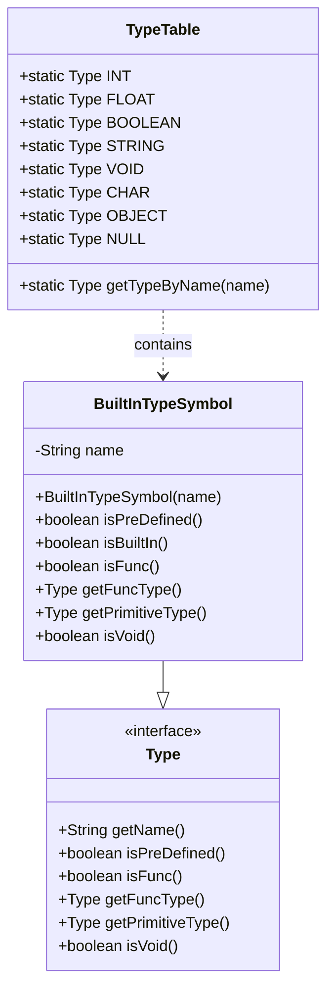
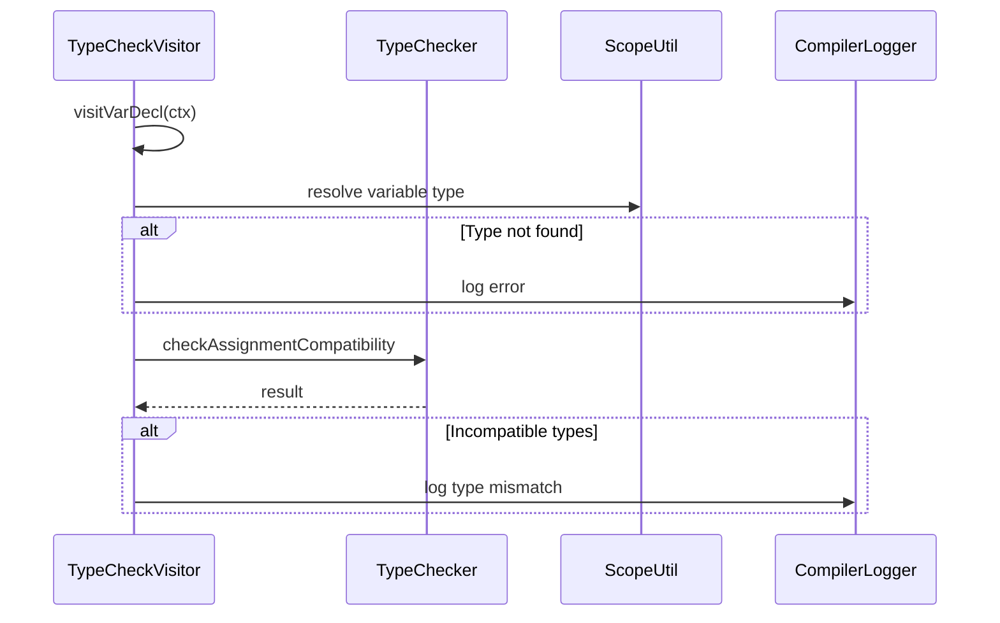

# Data Types

<cite>
**Referenced Files in This Document**   
- [Type.java](file://ep19/src/main/java/org/teachfx/antlr4/ep19/symtab/Type.java)
- [TypeTable.java](file://ep19/src/main/java/org/teachfx/antlr4/ep19/symtab/TypeTable.java)
- [TypeNode.java](file://ep20/src/main/java/org/teachfx/antlr4/ep20/ast/type/TypeNode.java)
- [BuiltInTypeSymbol.java](file://ep20/src/main/java/org/teachfx/antlr4/ep20/symtab/type/BuiltInTypeSymbol.java)
- [TypeCheckVisitor.java](file://ep19/src/main/java/org/teachfx/antlr4/ep19/pass/TypeCheckVisitor.java)
- [PrimitiveType.java](file://ep19/src/main/java/org/teachfx/antlr4/ep19/symtab/symbol/PrimitiveType.java)
</cite>

## Table of Contents
1. [Primitive Data Types](#primitive-data-types)
2. [Type System Architecture](#type-system-architecture)
3. [AST Type Nodes](#ast-type-nodes)
4. [Type Checking and Resolution](#type-checking-and-resolution)
5. [Variable Declarations and Type Inference](#variable-declarations-and-type-inference)
6. [Type Compatibility and Coercion](#type-compatibility-and-coercion)
7. [Error Reporting for Type Mismatches](#error-reporting-for-type-mismatches)

## Primitive Data Types

Cymbol supports the following primitive data types: `int`, `float`, `bool`, `string`, and `void`. These types are defined as built-in types within the compiler's type system. The `int` type represents integer values, `float` represents floating-point numbers, `bool` represents boolean values (`true` or `false`), `string` represents character strings, and `void` is used for functions that do not return a value.

**Section sources**
- [TypeTable.java](file://ep19/src/main/java/org/teachfx/antlr4/ep19/symtab/TypeTable.java#L4-L32)
- [PrimitiveType.java](file://ep19/src/main/java/org/teachfx/antlr4/ep19/symtab/symbol/PrimitiveType.java#L1-L22)

## Type System Architecture

The type system in Cymbol is implemented using the `Type` interface and the `TypeTable` class. The `Type` interface defines core type operations such as retrieving the type name and checking if a type is predefined or void. The `TypeTable` class maintains static references to all built-in types, including `INT`, `FLOAT`, `BOOLEAN`, `STRING`, `CHAR`, `VOID`, and `OBJECT`. These types are instantiated as `PrimitiveType` objects and stored as constants for consistent access throughout the compiler.

The `BuiltInTypeSymbol` class implements the `Type` interface and represents built-in types with methods to verify their predefined nature and retrieve their primitive type equivalents. This architecture ensures that type definitions are centralized and consistently managed across the compilation process.

**Diagram sources**
- [Type.java](file://ep19/src/main/java/org/teachfx/antlr4/ep19/symtab/Type.java#L2-L5)
- [BuiltInTypeSymbol.java](file://ep20/src/main/java/org/teachfx/antlr4/ep20/symtab/type/BuiltInTypeSymbol.java#L1-L39)
- [TypeTable.java](file://ep19/src/main/java/org/teachfx/antlr4/ep19/symtab/TypeTable.java#L4-L32)

**Section sources**
- [Type.java](file://ep19/src/main/java/org/teachfx/antlr4/ep19/symtab/Type.java#L2-L5)
- [BuiltInTypeSymbol.java](file://ep20/src/main/java/org/teachfx/antlr4/ep20/symtab/type/BuiltInTypeSymbol.java#L1-L39)
- [TypeTable.java](file://ep19/src/main/java/org/teachfx/antlr4/ep19/symtab/TypeTable.java#L4-L32)

## AST Type Nodes

Type information in the Abstract Syntax Tree (AST) is represented by the `TypeNode` class. This class encapsulates a `Type` object and dimension information for array types. The `TypeNode` provides methods to get and set the base type and dimension count. Static instances of `TypeNode` are provided for common types such as `IntNode`, `VoidNode`, `StrNode`, `ObjNode`, and `BoolNode`, which are initialized with their corresponding types from `TypeTable`.

The `TypeNode` class also includes methods for type equality comparison and AST traversal via the `accept` method, which enables integration with the visitor pattern for semantic analysis.

**Section sources**
- [TypeNode.java](file://ep20/src/main/java/org/teachfx/antlr4/ep20/ast/type/TypeNode.java#L1-L70)

## Type Checking and Resolution

Type checking is performed during semantic analysis using the `TypeCheckVisitor` class, which traverses the AST and validates type compatibility for various operations. The visitor checks assignments, binary operations, function calls, and control flow statements to ensure type safety. For example, in binary operations, the `TypeChecker` utility verifies that operand types are compatible with the operator, and for assignments, it ensures that the right-hand side type can be assigned to the left-hand side type.

Function calls are validated by checking that the argument types match the parameter types of the called function. The `TypeCheckVisitor` also handles special cases such as the built-in `print` function, which accepts arguments of any type.

**Diagram sources**
- [TypeCheckVisitor.java](file://ep19/src/main/java/org/teachfx/antlr4/ep19/pass/TypeCheckVisitor.java#L1-L627)
- [TypeChecker.java](file://ep19/src/main/java/org/teachfx/antlr4/ep19/symtab/TypeChecker.java)

**Section sources**
- [TypeCheckVisitor.java](file://ep19/src/main/java/org/teachfx/antlr4/ep19/pass/TypeCheckVisitor.java#L1-L627)

## Variable Declarations and Type Inference

Variable declarations in Cymbol require explicit type specification, such as `int x = 5;` or `bool flag = true;`. The type is extracted from the declaration context and associated with the variable symbol in the symbol table. While Cymbol does not support full type inference, the type of literals is automatically determined: integer literals are typed as `INT`, floating-point literals as `FLOAT`, string literals as `STRING`, and boolean literals (`true`/`false`) as `BOOLEAN`.

During semantic analysis, the declared type is checked against the initializer expression's type to ensure compatibility. If the types are incompatible, an error is reported.

**Section sources**
- [TypeCheckVisitor.java](file://ep19/src/main/java/org/teachfx/antlr4/ep19/pass/TypeCheckVisitor.java#L70-L100)
- [TypeTable.java](file://ep19/src/main/java/org/teachfx/antlr4/ep19/symtab/TypeTable.java#L4-L32)

## Type Compatibility and Coercion

Cymbol enforces strict type compatibility with limited coercion rules. Assignment compatibility is checked by the `TypeChecker`, which ensures that the source type can be safely assigned to the target type. Currently, no implicit type coercion is performed between different primitive types (e.g., `int` to `float`), requiring explicit casting if needed.

Binary operations have specific compatibility requirements: arithmetic operations (`+`, `-`, `*`, `/`) require both operands to be numeric (`int` or `float`), while the modulo operator (`%`) requires both operands to be `int`. Logical operations (`&&`, `||`) require boolean operands, and comparison operations return `bool` and accept compatible operand types.

**Section sources**
- [TypeCheckVisitor.java](file://ep19/src/main/java/org/teachfx/antlr4/ep19/pass/TypeCheckVisitor.java#L150-L250)
- [TypeChecker.java](file://ep19/src/main/java/org/teachfx/antlr4/ep19/symtab/TypeChecker.java)

## Error Reporting for Type Mismatches

Type mismatches are reported using the `CompilerLogger` utility, which generates error messages with source location information. Common type errors include incompatible assignment types, mismatched function call arguments, invalid operations on non-numeric types, and boolean expressions in non-conditional contexts. Errors are logged during the type checking phase, and the compilation process continues to report multiple errors where possible.

For example, assigning a `float` value to an `int` variable or calling a function with incorrect argument types will trigger a type mismatch error with details about the expected and actual types.

**Section sources**
- [TypeCheckVisitor.java](file://ep19/src/main/java/org/teachfx/antlr4/ep19/pass/TypeCheckVisitor.java#L70-L627)
- [CompilerLogger.java](file://ep19/src/main/java/org/teachfx/antlr4/ep19/misc/CompilerLogger.java)