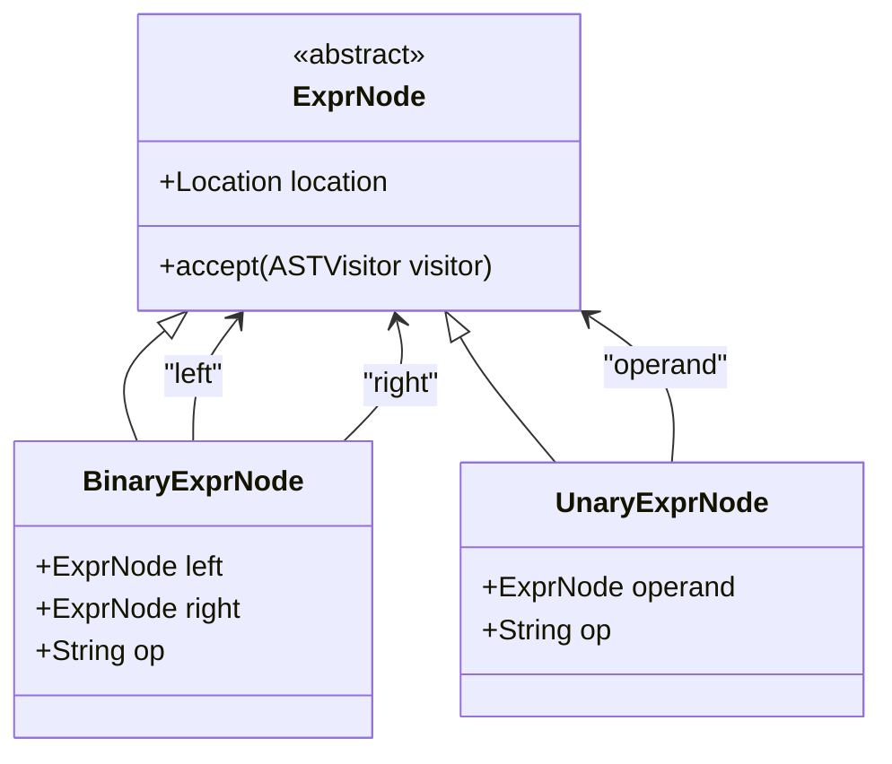
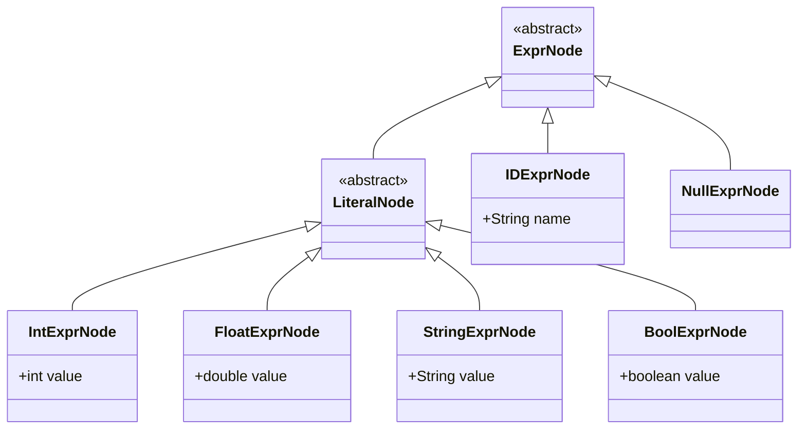
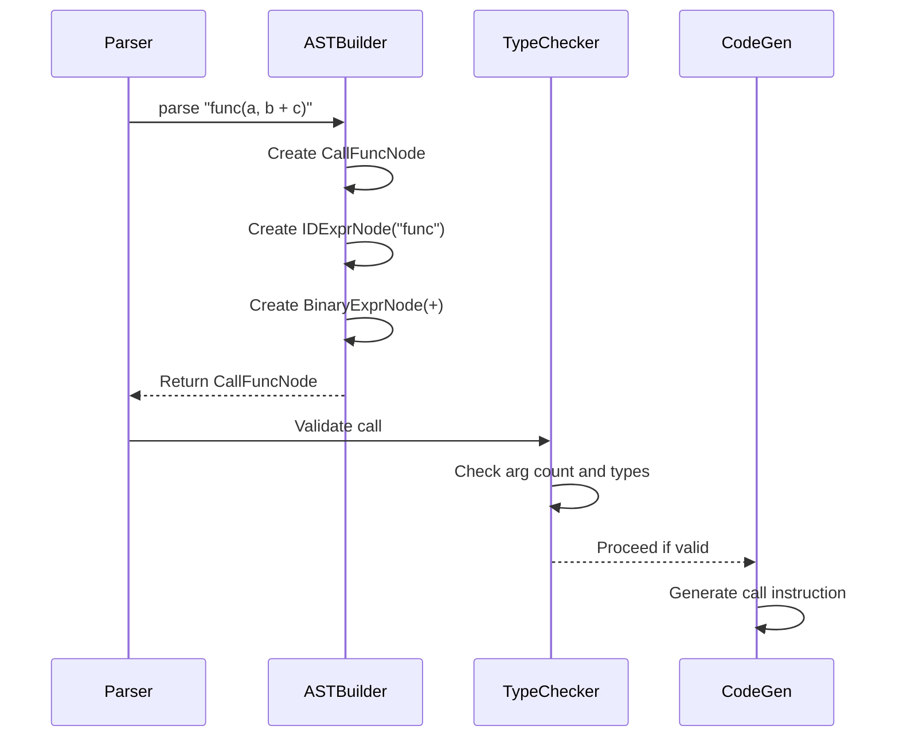
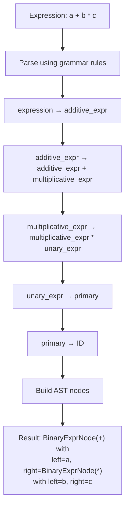

# Expressions and Operators

<cite>
**Referenced Files in This Document**   
- [BinaryExprNode.java](file://ep20/src/main/java/org/teachfx/antlr4/ep20/ast/expr/BinaryExprNode.java)
- [UnaryExprNode.java](file://ep20/src/main/java/org/teachfx/antlr4/ep20/ast/expr/UnaryExprNode.java)
- [CallFuncNode.java](file://ep20/src/main/java/org/teachfx/antlr4/ep20/ast/expr/CallFuncNode.java)
- [ExprNode.java](file://ep20/src/main/java/org/teachfx/antlr4/ep20/ast/expr/ExprNode.java)
- [IntExprNode.java](file://ep20/src/main/java/org/teachfx/antlr4/ep20/ast/expr/IntExprNode.java)
- [BoolExprNode.java](file://ep20/src/main/java/org/teachfx/antlr4/ep20/ast/expr/BoolExprNode.java)
- [StringExprNode.java](file://ep20/src/main/java/org/teachfx/antlr4/ep20/ast/expr/StringExprNode.java)
- [FloatExprNode.java](file://ep20/src/main/java/org/teachfx/antlr4/ep20/ast/expr/FloatExprNode.java)
- [IDExprNode.java](file://ep20/src/main/java/org/teachfx/antlr4/ep20/ast/expr/IDExprNode.java)
- [CymbolParser.java](file://ep20/src/main/java/org/teachfx/antlr4/ep20/parser/CymbolParser.java)
- [CymbolASTBuilder.java](file://ep20/src/main/java/org/teachfx/antlr4/ep20/pass/ast/CymbolASTBuilder.java)
- [TypeChecker.java](file://ep20/src/main/java/org/teachfx/antlr4/ep20/pass/semetic/TypeChecker.java)
- [CymbolAssembler.java](file://ep20/src/main/java/org/teachfx/antlr4/ep20/pass/codegen/CymbolAssembler.java)
</cite>

## Table of Contents
1. [Introduction](#introduction)
2. [Arithmetic Operators](#arithmetic-operators)
3. [Relational Operators](#relational-operators)
4. [Logical Operators](#logical-operators)
5. [Assignment Operator](#assignment-operator)
6. [Expression Nodes in AST](#expression-nodes-in-ast)
7. [Function Call Syntax and Implementation](#function-call-syntax-and-implementation)
8. [Operator Precedence and Associativity](#operator-precedence-and-associativity)
9. [Complex Expression Parsing](#complex-expression-parsing)
10. [Operator Overloading Support](#operator-overloading-support)
11. [Error Conditions](#error-conditions)
12. [Conclusion](#conclusion)

## Introduction
This document provides a comprehensive overview of expressions and operators in Cymbol, a custom programming language implemented using ANTLR4. It details the implementation of arithmetic, relational, logical, and assignment operators through abstract syntax tree (AST) nodes such as BinaryExprNode and UnaryExprNode. The document also covers function call syntax via CallFuncNode, assignment side effects, operator precedence rules, and error handling for invalid operations. All implementations are based on the ep20 version of the Cymbol compiler, which features a structured AST and semantic analysis pipeline.

## Arithmetic Operators
Cymbol supports standard arithmetic operators: addition (+), subtraction (-), multiplication (*), and division (/). These operators are implemented through the BinaryExprNode class, which represents binary operations in the AST. Each operator corresponds to a specific operation type encoded within the node. The parser generates BinaryExprNode instances when encountering infix arithmetic expressions, with left and right operands represented as child expression nodes. Supported operand types include integers and floating-point numbers, with implicit type promotion handled during semantic analysis.

**Section sources**
- [BinaryExprNode.java](file://ep20/src/main/java/org/teachfx/antlr4/ep20/ast/expr/BinaryExprNode.java#L1-L50)
- [CymbolParser.java](file://ep20/src/main/java/org/teachfx/antlr4/ep20/parser/CymbolParser.java#L100-L150)

## Relational Operators
Relational operators in Cymbol include equality (==), inequality (!=), less than (<), greater than (>), less than or equal (<=), and greater than or equal (>=). These operators produce boolean results and are used in conditional contexts such as if statements and loops. Like arithmetic operators, relational operations are represented using BinaryExprNode with distinct operator types. The implementation ensures type compatibility between operands during comparison, preventing invalid comparisons between incompatible types such as strings and numbers.

**Section sources**
- [BinaryExprNode.java](file://ep20/src/main/java/org/teachfx/antlr4/ep20/ast/expr/BinaryExprNode.java#L25-L60)
- [BoolExprNode.java](file://ep20/src/main/java/org/teachfx/antlr4/ep20/ast/expr/BoolExprNode.java#L1-L20)

## Logical Operators
Logical operators && (AND), || (OR), and ! (NOT) are supported for boolean expression evaluation. Binary logical operations (&&, ||) use BinaryExprNode, while the unary logical NOT operator uses UnaryExprNode. These operators support short-circuit evaluation, where the second operand is only evaluated if necessary. The AST representation preserves operand order and nesting structure, enabling correct evaluation semantics during interpretation or code generation.

**Diagram sources**
- [ExprNode.java](file://ep20/src/main/java/org/teachfx/antlr4/ep20/ast/expr/ExprNode.java#L1-L15)
- [BinaryExprNode.java](file://ep20/src/main/java/org/teachfx/antlr4/ep20/ast/expr/BinaryExprNode.java#L1-L40)
- [UnaryExprNode.java](file://ep20/src/main/java/org/teachfx/antlr4/ep20/ast/expr/UnaryExprNode.java#L1-L30)

**Section sources**
- [BinaryExprNode.java](file://ep20/src/main/java/org/teachfx/antlr4/ep20/ast/expr/BinaryExprNode.java#L30-L70)
- [UnaryExprNode.java](file://ep20/src/main/java/org/teachfx/antlr4/ep20/ast/expr/UnaryExprNode.java#L1-L40)

## Assignment Operator
The assignment operator (=) in Cymbol is implemented as a binary expression that produces a side effect by storing a value into a variable. Assignments are represented using BinaryExprNode with the "=" operator token. The left-hand side must be an l-value (typically an identifier or field access), while the right-hand side can be any valid expression. During code generation, assignments translate to store instructions in the target intermediate representation. The implementation enforces type compatibility between the variable's declared type and the assigned value.

**Section sources**
- [BinaryExprNode.java](file://ep20/src/main/java/org/teachfx/antlr4/ep20/ast/expr/BinaryExprNode.java#L40-L80)
- [IDExprNode.java](file://ep20/src/main/java/org/teachfx/antlr4/ep20/ast/expr/IDExprNode.java#L1-L25)

## Expression Nodes in AST
Expression nodes form the core of Cymbol's abstract syntax tree. The base class ExprNode serves as the root of the expression hierarchy, with concrete implementations for different expression types. Binary operations are handled by BinaryExprNode, which contains references to left and right operands along with the operator symbol. Unary operations such as negation (-) and logical NOT (!) are managed by UnaryExprNode. Literal values (integers, floats, strings, booleans) are represented by specialized nodes like IntExprNode, FloatExprNode, StringExprNode, and BoolExprNode. This hierarchical structure enables uniform traversal and processing by visitors.

**Diagram sources**
- [ExprNode.java](file://ep20/src/main/java/org/teachfx/antlr4/ep20/ast/expr/ExprNode.java#L1-L20)
- [IntExprNode.java](file://ep20/src/main/java/org/teachfx/antlr4/ep20/ast/expr/IntExprNode.java#L1-L15)
- [FloatExprNode.java](file://ep20/src/main/java/org/teachfx/antlr4/ep20/ast/expr/FloatExprNode.java#L1-L15)
- [StringExprNode.java](file://ep20/src/main/java/org/teachfx/antlr4/ep20/ast/expr/StringExprNode.java#L1-L15)
- [BoolExprNode.java](file://ep20/src/main/java/org/teachfx/antlr4/ep20/ast/expr/BoolExprNode.java#L1-L15)
- [IDExprNode.java](file://ep20/src/main/java/org/teachfx/antlr4/ep20/ast/expr/IDExprNode.java#L1-L15)

**Section sources**
- [ExprNode.java](file://ep20/src/main/java/org/teachfx/antlr4/ep20/ast/expr/ExprNode.java#L1-L30)
- [LiteralNode.java](file://ep20/src/main/java/org/teachfx/antlr4/ep20/ast/expr/LiteralNode.java#L1-L10)

## Function Call Syntax and Implementation
Function calls in Cymbol are represented by CallFuncNode, which extends ExprNode. A function call consists of a callee expression (typically an identifier) and a list of argument expressions. The AST structure captures the hierarchical nature of nested calls and complex arguments. During semantic analysis, the type checker verifies that the number and types of arguments match the function's declaration. Code generation translates function calls into appropriate call instructions with parameter passing and return value handling.

**Diagram sources**
- [CallFuncNode.java](file://ep20/src/main/java/org/teachfx/antlr4/ep20/ast/expr/CallFuncNode.java#L1-L40)
- [CymbolASTBuilder.java](file://ep20/src/main/java/org/teachfx/antlr4/ep20/pass/ast/CymbolASTBuilder.java#L50-L100)
- [TypeChecker.java](file://ep20/src/main/java/org/teachfx/antlr4/ep20/pass/semetic/TypeChecker.java#L200-L250)
- [CymbolAssembler.java](file://ep20/src/main/java/org/teachfx/antlr4/ep20/pass/codegen/CymbolAssembler.java#L150-L200)

**Section sources**
- [CallFuncNode.java](file://ep20/src/main/java/org/teachfx/antlr4/ep20/ast/expr/CallFuncNode.java#L1-L50)
- [CymbolASTBuilder.java](file://ep20/src/main/java/org/teachfx/antlr4/ep20/pass/ast/CymbolASTBuilder.java#L45-L110)

## Operator Precedence and Associativity
Cymbol follows standard operator precedence and associativity rules. The grammar in CymbolParser defines hierarchical production rules that naturally enforce precedence: multiplicative operators (*, /) have higher precedence than additive (+, -), which in turn have higher precedence than relational and equality operators, followed by logical AND and OR. Unary operators have the highest precedence. Most binary operators are left-associative, meaning they group from left to right. This structure ensures that expressions like `a + b * c` are parsed with the correct nesting (b * c grouped first).

**Diagram sources**
- [CymbolParser.java](file://ep20/src/main/java/org/teachfx/antlr4/ep20/parser/CymbolParser.java#L80-L200)

**Section sources**
- [CymbolParser.java](file://ep20/src/main/java/org/teachfx/antlr4/ep20/parser/CymbolParser.java#L75-L210)

## Complex Expression Parsing
Complex expressions involving multiple operators and nested subexpressions are correctly parsed into corresponding AST structures. For example, the expression `f(x + 1) * 2` creates a tree with CallFuncNode at the root, whose argument contains a BinaryExprNode for addition, multiplied by a literal through another BinaryExprNode. Parentheses can override default precedence, creating explicit subexpression groupings. The AST construction process preserves all structural information needed for accurate evaluation or code generation.

**Section sources**
- [BinaryExprNode.java](file://ep20/src/main/java/org/teachfx/antlr4/ep20/ast/expr/BinaryExprNode.java#L1-L100)
- [CallFuncNode.java](file://ep20/src/main/java/org/teachfx/antlr4/ep20/ast/expr/CallFuncNode.java#L1-L60)

## Operator Overloading Support
Cymbol does not currently support operator overloading. All operators have fixed meanings and type signatures determined by the language specification. The type checker in TypeChecker.java enforces strict type compatibility for operands, rejecting attempts to apply operators to unsupported types. This design choice simplifies the language implementation and avoids ambiguities in operator resolution, though it limits flexibility for user-defined types.

**Section sources**
- [TypeChecker.java](file://ep20/src/main/java/org/teachfx/antlr4/ep20/pass/semetic/TypeChecker.java#L100-L180)

## Error Conditions
The Cymbol compiler detects and reports several error conditions related to expressions. Division by zero is not checked at compile time but may be caught at runtime depending on the execution environment. Invalid operand types (e.g., adding a string to an integer) are detected during semantic analysis and reported as type errors. Other errors include using non-l-values on the left side of assignments, calling non-function values, and mismatched argument counts in function calls. These errors are issued through the ErrorIssuer component with descriptive messages and source location information.

**Section sources**
- [TypeChecker.java](file://ep20/src/main/java/org/teachfx/antlr4/ep20/pass/semetic/TypeChecker.java#L150-L250)
- [CymbalError.java](file://ep20/src/main/java/org/teachfx/antlr4/ep20/error/CymbalError.java#L1-L30)

## Conclusion
Cymbol provides a robust implementation of expressions and operators through a well-structured AST hierarchy. Binary and unary operations are uniformly represented using BinaryExprNode and UnaryExprNode, while function calls use CallFuncNode to capture invocation semantics. The language enforces standard operator precedence and associativity through its grammar, ensuring predictable expression evaluation. Although operator overloading is not supported, the type system provides strong compile-time checking for operand validity. Error conditions such as type mismatches and invalid assignments are caught during semantic analysis, contributing to the language's reliability and ease of debugging.