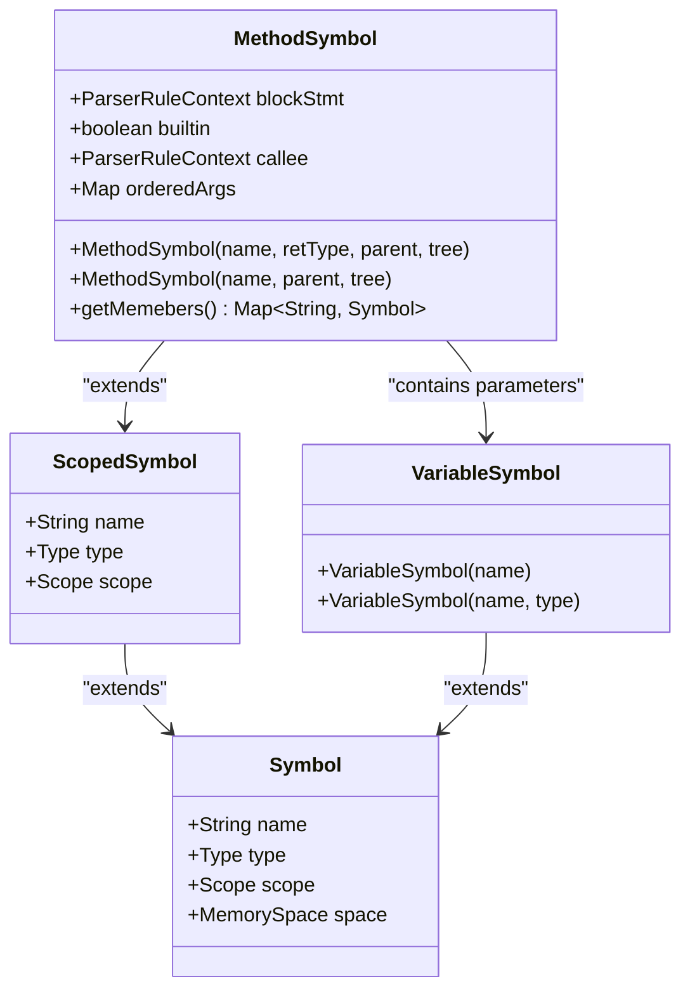
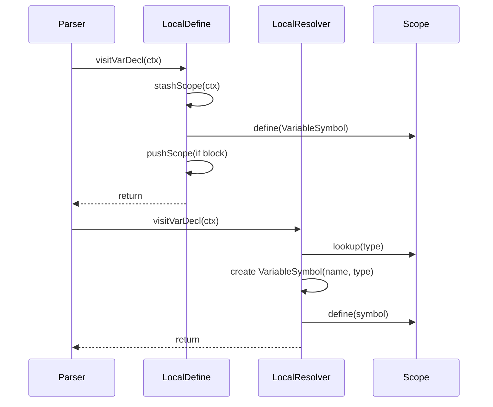
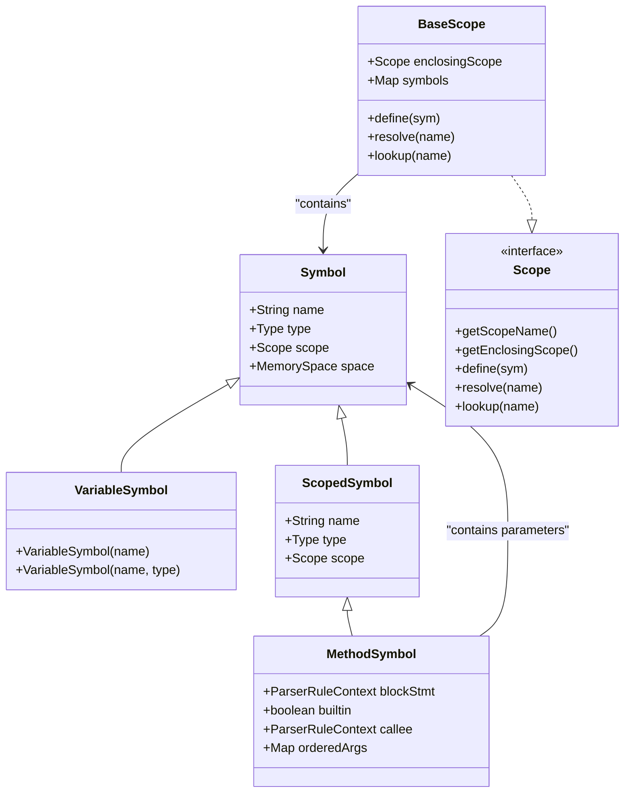
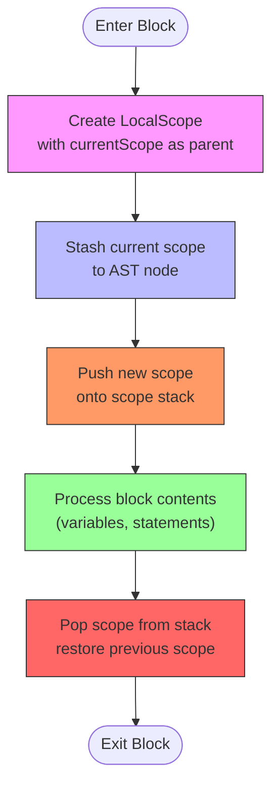

# Functions and Variables

<cite>
**Referenced Files in This Document**   
- [MethodSymbol.java](file://ep16/src/main/java/org/teachfx/antlr4/ep16/symtab/MethodSymbol.java)
- [VariableSymbol.java](file://ep16/src/main/java/org/teachfx/antlr4/ep16/symtab/VariableSymbol.java)
- [LocalScope.java](file://ep16/src/main/java/org/teachfx/antlr4/ep16/symtab/LocalScope.java)
- [Symbol.java](file://ep16/src/main/java/org/teachfx/antlr4/ep16/symtab/Symbol.java)
- [BaseScope.java](file://ep16/src/main/java/org/teachfx/antlr4/ep16/symtab/BaseScope.java)
- [Scope.java](file://ep16/src/main/java/org/teachfx/antlr4/ep16/symtab/Scope.java)
- [LocalDefine.java](file://ep16/src/main/java/org/teachfx/antlr4/ep16/visitor/LocalDefine.java)
- [LocalResolver.java](file://ep16/src/main/java/org/teachfx/antlr4/ep16/visitor/LocalResolver.java)
</cite>

## Table of Contents
1. [Introduction](#introduction)
2. [Function Declaration and Parameters](#function-declaration-and-parameters)
3. [Return Values and Built-in Functions](#return-values-and-built-in-functions)
4. [Variable Declaration and Initialization](#variable-declaration-and-initialization)
5. [Symbol Table Representation](#symbol-table-representation)
6. [Scope Management with LocalScope](#scope-management-with-localscope)
7. [Name Resolution and Shadowing](#name-resolution-and-shadowing)
8. [Error Handling in Symbol Processing](#error-handling-in-symbol-processing)
9. [Examples of Function Definitions](#examples-of-function-definitions)
10. [Conclusion](#conclusion)

## Introduction
This document provides a comprehensive overview of how functions and variables are handled in the Cymbol language implementation. It details the syntax and semantics of function declarations, parameter passing, return types, and variable scoping rules. The internal representation using symbol classes such as MethodSymbol and VariableSymbol is explained, along with the role of LocalScope in managing visibility and lifetime. The document also covers name resolution mechanisms, shadowing behavior, and error detection for invalid constructs like redeclarations or calls to undefined functions.

**Section sources**
- [MethodSymbol.java](file://ep16/src/main/java/org/teachfx/antlr4/ep16/symtab/MethodSymbol.java#L1-L32)
- [VariableSymbol.java](file://ep16/src/main/java/org/teachfx/antlr4/ep16/symtab/VariableSymbol.java#L1-L14)

## Function Declaration and Parameters
In Cymbol, function declarations are represented by the MethodSymbol class, which extends ScopedSymbol to support parameter management and return typing. A function declaration includes a name, return type, formal parameters, and an associated block context. The MethodSymbol constructor accepts these components and registers the function within the current scope.

Formal parameters are stored in an ordered LinkedHashMap called orderedArgs, preserving their declaration order. Each parameter is processed during parsing by the LocalDefine visitor, which creates VariableSymbol instances and adds them to the method's scope. The LocalResolver visitor later resolves the type of each parameter by looking up the type name in the enclosing scope.

Function declarations create a new scope for the function body, allowing local variables to be defined without affecting outer scopes. Parameters are treated as pre-defined local variables within this scope.



**Diagram sources**
- [MethodSymbol.java](file://ep16/src/main/java/org/teachfx/antlr4/ep16/symtab/MethodSymbol.java#L1-L32)
- [VariableSymbol.java](file://ep16/src/main/java/org/teachfx/antlr4/ep16/symtab/VariableSymbol.java#L1-L14)
- [Symbol.java](file://ep16/src/main/java/org/teachfx/antlr4/ep16/symtab/Symbol.java#L1-L39)

**Section sources**
- [MethodSymbol.java](file://ep16/src/main/java/org/teachfx/antlr4/ep16/symtab/MethodSymbol.java#L1-L32)
- [LocalDefine.java](file://ep16/src/main/java/org/teachfx/antlr4/ep16/visitor/LocalDefine.java#L50-L70)
- [LocalResolver.java](file://ep16/src/main/java/org/teachfx/antlr4/ep16/visitor/LocalResolver.java#L50-L60)

## Return Values and Built-in Functions
The MethodSymbol class supports return value typing through its inheritance from ScopedSymbol, where the type field represents the return type of the function. During function declaration processing in LocalResolver, the return type is resolved by looking up the type name in the enclosing scope and assigning it to the method symbol.

Built-in functions such as 'print' are handled specially during symbol table initialization. In the LocalDefine constructor, a global scope is created and populated with built-in types (int, float, void) and functions. The 'print' function is explicitly added as a built-in method with a single parameter named 'value' of type OBJECT.

The builtin flag in MethodSymbol distinguishes these predefined functions from user-defined ones, which can be important for code generation or optimization phases. Return statements in function bodies are expected to match the declared return type, though type checking enforcement would typically occur in a subsequent compilation phase.

**Section sources**
- [MethodSymbol.java](file://ep16/src/main/java/org/teachfx/antlr4/ep16/symtab/MethodSymbol.java#L1-L32)
- [LocalDefine.java](file://ep16/src/main/java/org/teachfx/antlr4/ep16/visitor/LocalDefine.java#L20-L30)
- [LocalResolver.java](file://ep16/src/main/java/org/teachfx/antlr4/ep16/visitor/LocalResolver.java#L70-L80)

## Variable Declaration and Initialization
Variables in Cymbol are represented by the VariableSymbol class, which extends the base Symbol class with constructors that support both named and typed declarations. Variable declarations can occur at global scope or within function bodies (local variables).

During parsing, variable declarations are processed by the LocalDefine visitor, which identifies declaration contexts and associates them with the current scope. The actual type resolution occurs in the LocalResolver visitor, which looks up the type name in the current or enclosing scopes and creates a properly typed VariableSymbol.

Local variables are defined within a LocalScope that is nested under the function's scope, while global variables reside directly in the GlobalScope. All variables are automatically initialized to default values based on their type, though explicit initialization expressions would be handled in later compilation stages.



**Diagram sources**
- [VariableSymbol.java](file://ep16/src/main/java/org/teachfx/antlr4/ep16/symtab/VariableSymbol.java#L1-L14)
- [LocalDefine.java](file://ep16/src/main/java/org/teachfx/antlr4/ep16/visitor/LocalDefine.java#L40-L50)
- [LocalResolver.java](file://ep16/src/main/java/org/teachfx/antlr4/ep16/visitor/LocalResolver.java#L50-L65)

**Section sources**
- [VariableSymbol.java](file://ep16/src/main/java/org/teachfx/antlr4/ep16/symtab/VariableSymbol.java#L1-L14)
- [LocalDefine.java](file://ep16/src/main/java/org/teachfx/antlr4/ep16/visitor/LocalDefine.java#L40-L50)
- [LocalResolver.java](file://ep16/src/main/java/org/teachfx/antlr4/ep16/visitor/LocalResolver.java#L50-L65)

## Symbol Table Representation
The symbol table in Cymbol is implemented through a hierarchy of classes that represent different kinds of symbols and scopes. At the core is the Symbol class, which contains fundamental attributes: name, type, scope, and memory space. This base class is extended by VariableSymbol for data variables and MethodSymbol for functions.

MethodSymbol inherits from ScopedSymbol, which allows it to contain other symbols (parameters) in its member map. The orderedArgs field maintains parameter order using a LinkedHashMap. Each symbol maintains a reference to its defining scope, enabling correct name resolution.

The symbol table structure supports both user-defined and built-in types. Built-in types (int, float, void, etc.) are pre-defined in the BaseScope constructor and made available to all scopes through inheritance. This ensures consistent type resolution throughout the program.



**Diagram sources**
- [Symbol.java](file://ep16/src/main/java/org/teachfx/antlr4/ep16/symtab/Symbol.java#L1-L39)
- [VariableSymbol.java](file://ep16/src/main/java/org/teachfx/antlr4/ep16/symtab/VariableSymbol.java#L1-L14)
- [MethodSymbol.java](file://ep16/src/main/java/org/teachfx/antlr4/ep16/symtab/MethodSymbol.java#L1-L32)
- [BaseScope.java](file://ep16/src/main/java/org/teachfx/antlr4/ep16/symtab/BaseScope.java#L1-L46)
- [Scope.java](file://ep16/src/main/java/org/teachfx/antlr4/ep16/symtab/Scope.java#L1-L17)

**Section sources**
- [Symbol.java](file://ep16/src/main/java/org/teachfx/antlr4/ep16/symtab/Symbol.java#L1-L39)
- [VariableSymbol.java](file://ep16/src/main/java/org/teachfx/antlr4/ep16/symtab/VariableSymbol.java#L1-L14)
- [MethodSymbol.java](file://ep16/src/main/java/org/teachfx/antlr4/ep16/symtab/MethodSymbol.java#L1-L32)

## Scope Management with LocalScope
Scoping in Cymbol is managed through a hierarchical system of scope objects that inherit from the BaseScope class. The LocalScope class represents function-local scopes and is created whenever a block (such as a function body or compound statement) is entered.

Each LocalScope has a reference to its enclosing scope, forming a chain that allows name resolution to proceed outward from the current scope to global scope. The BaseScope implementation provides the core functionality: symbol definition via define(), name resolution via resolve(), and type lookup via lookup().

When entering a function or block, the LocalDefine visitor creates a new LocalScope, stashes the current scope for the AST node, pushes the new scope onto the stack, processes the block contents, and then pops the scope upon exit. This ensures that local variables do not leak into outer scopes and that proper shadowing behavior is maintained.

The scope hierarchy enables Cymbol's scoping rules: variables are visible from their point of declaration to the end of their scope, and inner scopes can shadow variables with the same name in outer scopes.



**Diagram sources**
- [LocalScope.java](file://ep16/src/main/java/org/teachfx/antlr4/ep16/symtab/LocalScope.java#L1-L14)
- [BaseScope.java](file://ep16/src/main/java/org/teachfx/antlr4/ep16/symtab/BaseScope.java#L1-L46)
- [LocalDefine.java](file://ep16/src/main/java/org/teachfx/antlr4/ep16/visitor/LocalDefine.java#L100-L130)

**Section sources**
- [LocalScope.java](file://ep16/src/main/java/org/teachfx/antlr4/ep16/symtab/LocalScope.java#L1-L14)
- [BaseScope.java](file://ep16/src/main/java/org/teachfx/antlr4/ep16/symtab/BaseScope.java#L1-L46)
- [LocalDefine.java](file://ep16/src/main/java/org/teachfx/antlr4/ep16/visitor/LocalDefine.java#L100-L130)

## Name Resolution and Shadowing
Name resolution in Cymbol follows a hierarchical lookup pattern starting from the current scope and proceeding outward through enclosing scopes until the name is found or global scope is exhausted. This process is implemented in the BaseScope.resolve() method, which first checks the local symbol map and then delegates to the enclosing scope if the symbol is not found.

Shadowing occurs when a variable in an inner scope has the same name as a variable in an outer scope. Cymbol allows this behavior, with the inner variable taking precedence within its scope. The resolution process naturally supports shadowing because it checks the current scope first before looking outward.

The LocalResolver visitor performs name resolution for variable references by using the ScopeUtil to obtain the appropriate scope for each AST node and then calling resolve() to find the symbol. If no symbol is found, an error is reported. This ensures that all variable references are valid and properly typed.

The scope chain also enables proper handling of function calls, where the function name is resolved in the current or outer scopes, and parameter names are resolved within the function's parameter scope.

**Section sources**
- [BaseScope.java](file://ep16/src/main/java/org/teachfx/antlr4/ep16/symtab/BaseScope.java#L20-L30)
- [LocalResolver.java](file://ep16/src/main/java/org/teachfx/antlr4/ep16/visitor/LocalResolver.java#L150-L200)
- [Scope.java](file://ep16/src/main/java/org/teachfx/antlr4/ep16/symtab/Scope.java#L1-L17)

## Error Handling in Symbol Processing
The Cymbol implementation includes several mechanisms for detecting and reporting errors related to functions and variables. The LocalResolver visitor performs type checking during symbol resolution and reports errors when undefined types are encountered in variable or parameter declarations.

For example, when processing a variable declaration, LocalResolver attempts to look up the specified type in the current scope. If the type cannot be resolved (returns null), an error is logged using CompilerLogger.error(). This catches cases where users reference non-existent types.

Similarly, when resolving variable references in expressions, if a symbol cannot be found in the current or any enclosing scope, an error is reported. This detects attempts to use undeclared variables.

The system also prevents redeclarations by using the define() method in BaseScope, which overwrites symbols with the same name. While this currently allows redeclaration, a production compiler would typically check for existing symbols before defining new ones to prevent this error.

Built-in functions like 'print' are protected from redefinition by being marked with the builtin flag, though enforcement of this protection would require additional validation logic.

**Section sources**
- [LocalResolver.java](file://ep16/src/main/java/org/teachfx/antlr4/ep16/visitor/LocalResolver.java#L180-L200)
- [CompilerLogger.java](file://ep16/src/main/java/org/teachfx/antlr4/ep16/misc/CompilerLogger.java#L1-L20)
- [BaseScope.java](file://ep16/src/main/java/org/teachfx/antlr4/ep16/symtab/BaseScope.java#L35-L40)

## Examples of Function Definitions
The following examples illustrate valid function definitions in Cymbol:

A simple function with multiple parameters:
```c
int add(int a, float b) {
    int result = a + (int)b;
    return result;
}
```

A recursive function:
```c
int factorial(int n) {
    if (n <= 1) {
        return 1;
    }
    return n * factorial(n - 1);
}
```

A function with no parameters:
```c
void greet() {
    print("Hello, World!");
}
```

These functions would be represented internally as MethodSymbol instances with appropriate return types, parameter lists, and associated block contexts. The parameters would be stored in the orderedArgs map, and the function body would be processed within a LocalScope that inherits from the global scope.

Function calls are resolved by looking up the function name in the current scope hierarchy, ensuring that locally defined functions take precedence over global ones (shadowing at the function level).

**Section sources**
- [MethodSymbol.java](file://ep16/src/main/java/org/teachfx/antlr4/ep16/symtab/MethodSymbol.java#L1-L32)
- [LocalDefine.java](file://ep16/src/main/java/org/teachfx/antlr4/ep16/visitor/LocalDefine.java#L60-L70)
- [LocalResolver.java](file://ep16/src/main/java/org/teachfx/antlr4/ep16/visitor/LocalResolver.java#L70-L80)

## Conclusion
The Cymbol language implementation provides a robust system for handling functions and variables through a well-structured symbol table hierarchy. Functions are represented by MethodSymbol objects that encapsulate return types, parameters, and scoping information, while variables are managed as VariableSymbol instances within appropriate scopes.

The scope management system, built on BaseScope and LocalScope classes, enables proper name resolution, shadowing behavior, and lifetime management. The two-phase processing approach using LocalDefine and LocalResolver visitors separates scope establishment from type resolution, providing a clean separation of concerns.

Error detection is integrated throughout the symbol processing pipeline, catching common mistakes like undefined variables and unknown types. The system supports essential programming constructs including multi-parameter functions, recursion, and proper scoping rules, laying the foundation for a complete programming language implementation.