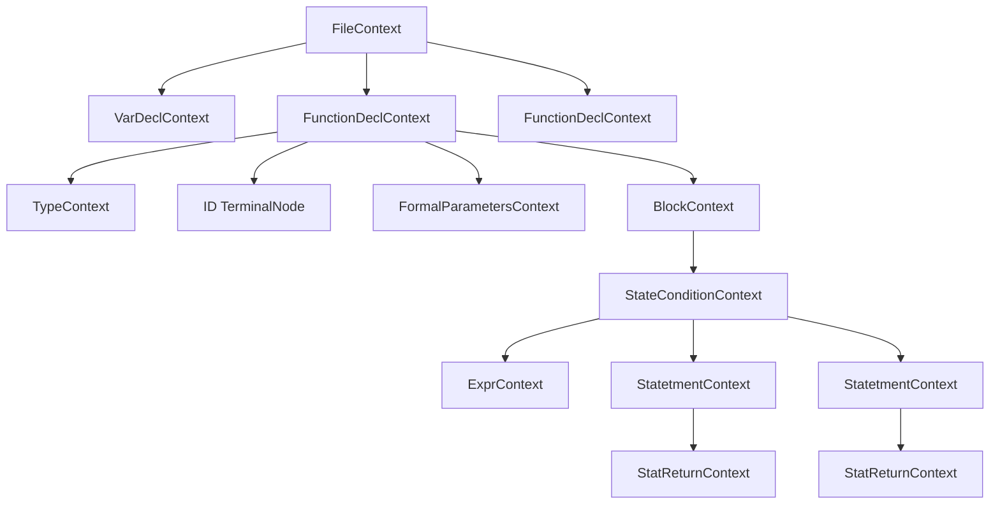

# Syntax Overview

<cite>
**Referenced Files in This Document**   
- [CymbolLexer.java](file://ep16/src/main/java/org/teachfx/antlr4/ep16/parser/CymbolLexer.java)
- [CymbolParser.java](file://ep16/src/main/java/org/teachfx/antlr4/ep16/parser/CymbolParser.java)
- [Compiler.java](file://ep16/src/main/java/org/teachfx/antlr4/ep16/Compiler.java)
</cite>

## Table of Contents
1. [Lexical Structure](#lexical-structure)  
2. [Grammar Rules](#grammar-rules)  
3. [Program Structure](#program-structure)  
4. [Declarations](#declarations)  
5. [Statements](#statements)  
6. [Expressions](#expressions)  
7. [Annotated Example](#annotated-example)  
8. [Parse Tree and Grammar Relationship](#parse-tree-and-grammar-relationship)  
9. [Common Syntax Errors](#common-syntax-errors)

## Lexical Structure

The lexical structure of the Cymbol language is defined in `CymbolLexer.java`, which specifies the token types recognized by the lexer. These tokens form the basic building blocks of the language and include keywords, operators, literals, identifiers, and whitespace.

### Keywords
The Cymbol language includes the following reserved keywords:
- `float`
- `int`
- `void`
- `return`
- `if`
- `else`
- `while`

These are defined as literal tokens in the lexer and are used in grammar rules to denote type declarations and control flow constructs.

### Operators
Cymbol supports a variety of operators for arithmetic, comparison, and logical operations:
- **Assignment**: `=`
- **Arithmetic**: `+`, `-`, `*`, `/`
- **Comparison**: `==`, `!=`, `<`, `<=`, `>`, `>=`
- **Logical**: `!`

These operators are defined as terminal symbols in the lexer and are used in expression grammar rules.

### Literals
The language supports several literal types:
- **Integer literals**: Matched by the `INT` token rule.
- **Floating-point literals**: Matched by the `FLOAT` token rule.
- **Boolean literals**: Represented by the `BOOLEAN` token (`true` or `false`).
- **String literals**: Enclosed in double quotes and matched by the `STRING` token.
- **Character literals**: Enclosed in single quotes and matched by the `CHAR` token.
- **Null literal**: Represented by the `NULL` token.

### Identifiers
Identifiers are defined by the `ID` token rule and follow standard naming conventions (letters, digits, underscore, starting with a letter or underscore). They are used for variable names, function names, and type names.

### Whitespace and Comments
- **Whitespace**: Handled by the `WS` token, which is skipped during lexing.
- **Single-line comments**: Start with `//` and are matched by the `SLCOMMENT` token, also skipped during parsing.

**Section sources**
- [CymbolLexer.java](file://ep16/src/main/java/org/teachfx/antlr4/ep16/parser/CymbolLexer.java#L26-L34)

## Grammar Rules

The grammar of the Cymbol language is defined in `CymbolParser.java` using ANTLR4 syntax. The grammar is expressed in Extended Backus-Naur Form (EBNF), with rules defining the hierarchical structure of valid programs.

### EBNF Notation
The grammar uses the following EBNF constructs:
- **Sequence**: `A B` means A followed by B.
- **Alternation**: `A | B` means A or B.
- **Optional**: `[A]` or `A?` means A may appear zero or one time.
- **Repetition**: `A*` means zero or more A; `A+` means one or more A.
- **Grouping**: `(A B)` groups elements.

### Core Grammar Rules
The main grammar rules are:

```
file            : (functionDecl | varDecl | statetment)* ;
varDecl         : type ID ('=' expr)? ';' ;
type            : primaryType | ID ;
primaryType     : 'int' | 'float' | 'void' ;
functionDecl    : type ID '(' formalParameters? ')' block ;
formalParameters: formalParameter (',' formalParameter)* ;
formalParameter : type ID ;
block           : '{' statetment* '}' ;
statetment      : statVarDecl
                | statAssign
                | statReturn
                | stateCondition
                | stateWhile
                | statBlock
                | expr ';'
                ;
expr            : expr ('*' | '/') expr
                | expr ('+' | '-') expr
                | expr ('==' | '!=' | '>' | '>=' | '<' | '<=') expr
                | '!' expr
                | '-' expr
                | primary
                | ID '(' exprList? ')'
                | ID
                ;
primary         : INT
                | FLOAT
                | STRING
                | CHAR
                | 'true'
                | 'false'
                | 'null'
                | '(' expr ')'
                ;
```

**Section sources**
- [CymbolParser.java](file://ep16/src/main/java/org/teachfx/antlr4/ep16/parser/CymbolParser.java#L50-L55)

## Program Structure

A Cymbol program consists of a sequence of top-level declarations and statements. The entry point is the `file` rule, which allows any combination of function declarations, variable declarations, and statements at the top level.

```ebnf
file : (functionDecl | varDecl | statetment)* ;
```

This structure allows for flexible program organization, supporting both procedural and script-like styles.

**Section sources**
- [CymbolParser.java](file://ep16/src/main/java/org/teachfx/antlr4/ep16/parser/CymbolParser.java#L20-L25)

## Declarations

### Variable Declarations
Variables are declared with a type, identifier, and optional initializer:
```ebnf
varDecl : type ID ('=' expr)? ';' ;
```
Example: `int x = 5;`

### Function Declarations
Functions are declared with a return type, name, parameter list, and body:
```ebnf
functionDecl : type ID '(' formalParameters? ')' block ;
```
Example:
```cymbol
int add(int a, int b) {
    return a + b;
}
```

### Type System
The type system includes:
- **Primitive types**: `int`, `float`, `void`
- **User-defined types**: Referenced by identifier (e.g., struct types)

```ebnf
type : primaryType | ID ;
```

**Section sources**
- [CymbolParser.java](file://ep16/src/main/java/org/teachfx/antlr4/ep16/parser/CymbolParser.java#L29-L41)

## Statements

Cymbol supports several statement types:

### Variable Declaration Statement
Declares a variable within a block:
```ebnf
statVarDecl : varDecl ;
```

### Assignment Statement
Assigns a value to a variable:
```ebnf
statAssign : expr '=' expr ';' ;
```

### Return Statement
Returns a value from a function:
```ebnf
statReturn : 'return' expr? ';' ;
```

### Conditional Statement
Supports `if-else` constructs:
```ebnf
stateCondition : 'if' '(' expr ')' statetment ('else' statetment)? ;
```

### Loop Statement
Supports `while` loops:
```ebnf
stateWhile : 'while' '(' expr ')' statetment ;
```

### Block Statement
Groups multiple statements:
```ebnf
statBlock : block ;
```

### Expression Statement
Any expression followed by semicolon:
```ebnf
exprStat : expr ';' ;
```

**Section sources**
- [CymbolParser.java](file://ep16/src/main/java/org/teachfx/antlr4/ep16/parser/CymbolParser.java#L63-L70)

## Expressions

Cymbol expressions follow standard operator precedence and associativity:

### Primary Expressions
```ebnf
primary : INT | FLOAT | STRING | CHAR | 'true' | 'false' | 'null' | '(' expr ')' | ID ;
```

### Binary Expressions
Supports arithmetic, comparison, and logical operations:
```ebnf
expr : expr ('*' | '/') expr
     | expr ('+' | '-') expr
     | expr ('==' | '!=' | '>' | '>=' | '<' | '<=') expr
     ;
```

### Unary Expressions
```ebnf
expr : '!' expr | '-' expr ;
```

### Function Call
```ebnf
expr : ID '(' exprList? ')' ;
```

Operator precedence (highest to lowest):
1. Parentheses and primary expressions
2. Unary operators (`!`, `-`)
3. Multiplication and division (`*`, `/`)
4. Addition and subtraction (`+`, `-`)
5. Comparison operators (`==`, `!=`, `<`, `<=`, `>`, `>=`)

**Section sources**
- [CymbolParser.java](file://ep16/src/main/java/org/teachfx/antlr4/ep16/parser/CymbolParser.java#L79-L90)

## Annotated Example

The following example demonstrates valid Cymbol syntax:

```cymbol
int global = 10;

int factorial(int n) {
    if (n <= 1) {
        return 1;
    }
    return n * factorial(n - 1);
}

void main() {
    int result = factorial(5);
    if (result > 0) {
        print(result);
    }
}
```

**Lexical Analysis**:
- `int`, `if`, `return`, `void` → keyword tokens
- `global`, `factorial`, `n`, `result`, `main`, `print` → ID tokens
- `10`, `1`, `5`, `0` → INT tokens
- `<=`, `*`, `-`, `>` → operator tokens
- `;`, `{`, `}`, `(`, `)` → punctuation tokens

**Syntactic Structure**:
- Top-level variable declaration
- Two function declarations with parameters and blocks
- Nested control flow with conditionals
- Recursive function call
- Expression evaluation with arithmetic operations

**Section sources**
- [CymbolLexer.java](file://ep16/src/main/java/org/teachfx/antlr4/ep16/parser/CymbolLexer.java)
- [CymbolParser.java](file://ep16/src/main/java/org/teachfx/antlr4/ep16/parser/CymbolParser.java)

## Parse Tree and Grammar Relationship

The ANTLR4-generated parser creates a parse tree where each node corresponds to a grammar rule invocation. The relationship between grammar rules and parse tree nodes is direct:



Each context class in `CymbolParser.java` (e.g., `VarDeclContext`, `FunctionDeclContext`) represents a parse tree node and contains methods to access child nodes. The visitor pattern (`CymbolVisitor`) allows traversal and processing of the parse tree.

**Diagram sources**
- [CymbolParser.java](file://ep16/src/main/java/org/teachfx/antlr4/ep16/parser/CymbolParser.java)

**Section sources**
- [CymbolParser.java](file://ep16/src/main/java/org/teachfx/antlr4/ep16/parser/CymbolParser.java)

## Common Syntax Errors

The parser detects and reports various syntax errors:

### Missing Semicolon
```cymbol
int x = 5  // Error: missing semicolon
```
Detected when the parser expects `';'` token but finds something else.

### Mismatched Parentheses
```cymbol
if (x > 5 {  // Error: missing closing parenthesis
```
Detected by the parser when the `')'` token is expected but not found.

### Invalid Assignment
```cymbol
5 = x;  // Error: left operand must be an l-value
```
Detected during semantic analysis (not syntax), but the syntax is valid.

### Undefined Identifier
```cymbol
print(y);  // Error if y not declared
```
Detected during symbol resolution, not parsing.

### Type Mismatch in Expression
```cymbol
int z = "hello";  // Error: string to int assignment
```
Detected during type checking phase.

The parser uses ANTLR4's default error recovery to continue parsing after syntax errors, allowing detection of multiple issues in a single pass.

**Section sources**
- [CymbolParser.java](file://ep16/src/main/java/org/teachfx/antlr4/ep16/parser/CymbolParser.java)
- [Compiler.java](file://ep16/src/main/java/org/teachfx/antlr4/ep16/Compiler.java)