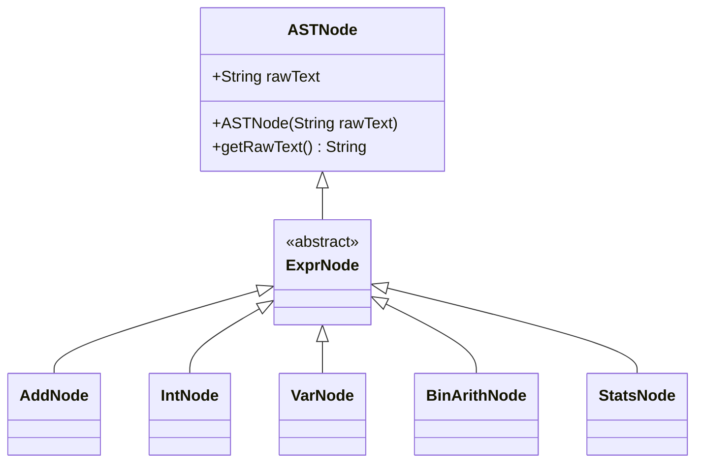
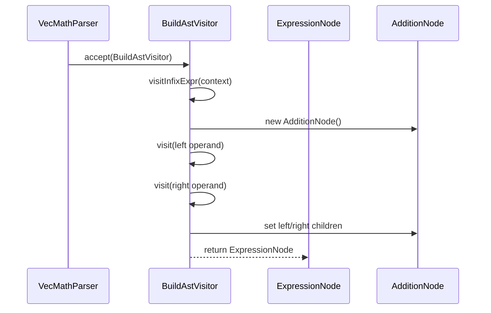
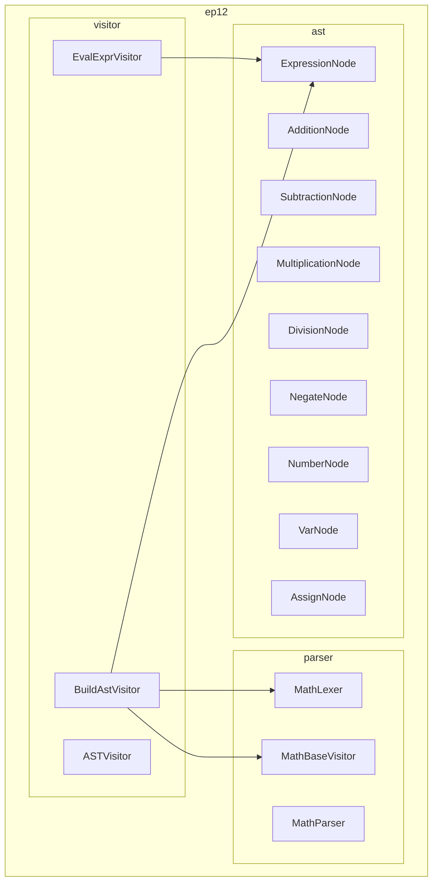
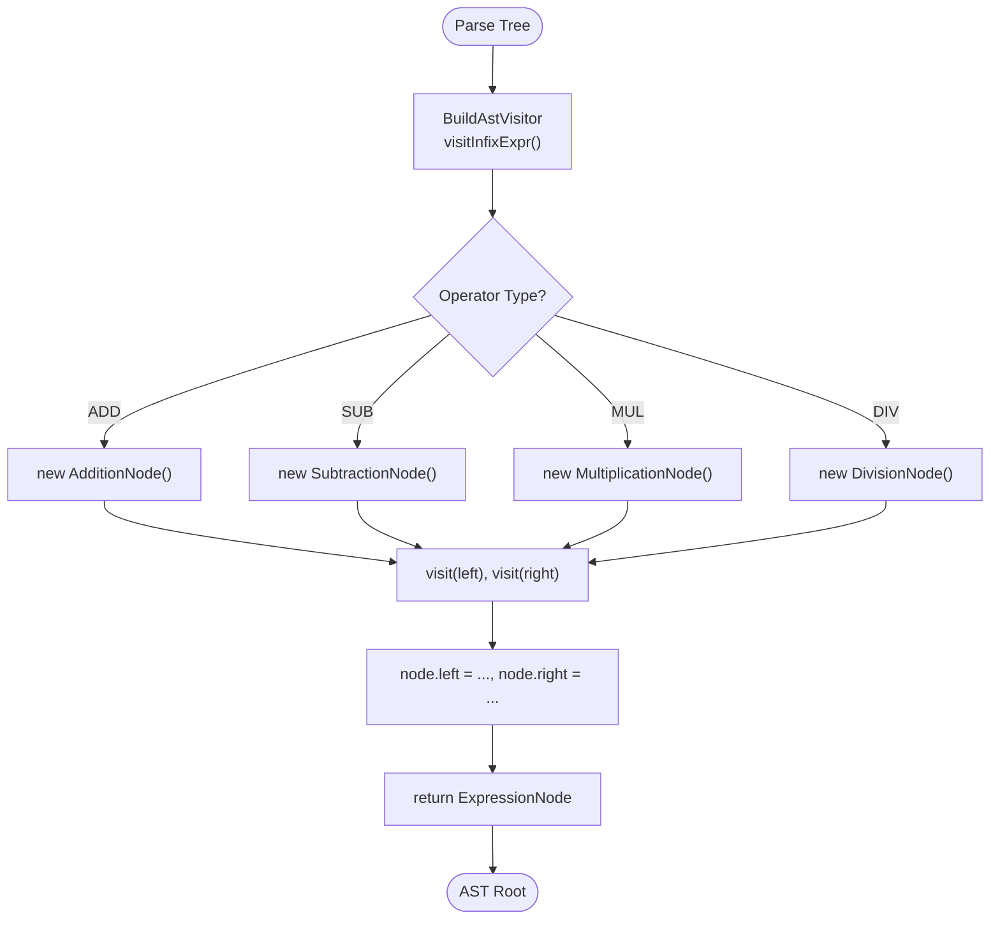

# Abstract Syntax Tree Construction

<cite>
**Referenced Files in This Document**   
- [ASTNode.java](file://ep8/src/main/java/org/teachfx/antlr4/ASTNode.java)
- [VecMathParser.java](file://ep8/src/main/java/org/teachfx/antlr4/VecMathParser.java)
- [BuildAstVisitor.java](file://ep11/src/main/java/org/teachfx/antlr4/BuildAstVisitor.java)
- [ExpressionNode.java](file://ep11/src/main/java/org/teachfx/antlr4/ExpressionNode.java)
- [ExpressionNode.java](file://ep12/src/main/java/org/teachfx/antlr4/ep12/ast/ExpressionNode.java)
- [BuildAstVisitor.java](file://ep12/src/main/java/org/teachfx/antlr4/ep12/visitor/BuildAstVisitor.java)
- [BuildAstVisitor.java](file://ep13/src/main/java/org/teachfx/antlr4/BuildAstVisitor.java)
</cite>

## Table of Contents
1. [Introduction](#introduction)
2. [AST Construction in ep8](#ast-construction-in-ep8)
3. [AST Transformation in ep11](#ast-transformation-in-ep11)
4. [Package Organization in ep12](#package-organization-in-ep12)
5. [Architectural Refinement in ep13](#architectural-refinement-in-ep13)
6. [Visitor Pattern Implementation](#visitor-pattern-implementation)
7. [AST Manipulation Examples](#ast-manipulation-examples)
8. [Debugging Techniques for Tree Construction](#debugging-techniques-for-tree-construction)
9. [Conclusion](#conclusion)

## Introduction
This document details the evolution of Abstract Syntax Tree (AST) construction across episodes 8 through 13 in the Antlr4-based language implementation tutorial series. It traces the progression from manual tree building to automated visitor-based transformation, highlighting key architectural improvements and design patterns used to create a robust, maintainable compiler infrastructure.

## AST Construction in ep8
Episode 8 introduces the foundational ASTNode hierarchy and demonstrates manual construction of abstract syntax trees for vector math expressions. The implementation begins with a base `ASTNode` class that stores raw text input, serving as the root of an inheritance tree for expression nodes such as `AddNode`, `IntNode`, and `VarNode`. These concrete node types extend the base class to represent specific syntactic constructs in the domain language.

The `VecMathParser.java` file contains the grammar rules and parse tree structure generated by ANTLR, which serves as the intermediate representation before AST construction. At this stage, tree building is performed manually by client code traversing the parse tree and instantiating corresponding AST nodes based on grammar rule applications.

**Diagram sources**
- [ASTNode.java](file://ep8/src/main/java/org/teachfx/antlr4/ASTNode.java#L1-L14)
- [VecMathParser.java](file://ep8/src/main/java/org/teachfx/antlr4/VecMathParser.java#L1-L463)

**Section sources**
- [ASTNode.java](file://ep8/src/main/java/org/teachfx/antlr4/ASTNode.java#L1-L14)
- [VecMathParser.java](file://ep8/src/main/java/org/teachfx/antlr4/VecMathParser.java#L1-L463)

## AST Transformation in ep11
Episode 11 implements the `BuildAstVisitor` class to automate the transformation from ANTLR-generated parse trees into typed AST nodes. This marks a significant shift from manual tree construction to a systematic, visitor-based approach. The visitor pattern enables clean separation between the traversal logic and the node creation logic.

The `ExpressionNode` class serves as the abstract base for all expression types in the AST hierarchy. Concrete implementations like `AdditionNode`, `SubtractionNode`, `MultiplicationNode`, and `DivisionNode` inherit from this base class and represent specific arithmetic operations. The `BuildAstVisitor` overrides methods corresponding to grammar rules (e.g., `visitInfixExpr`, `visitNumberExpr`) to create appropriate AST nodes during traversal.

Key improvements in this phase include:
- Automated conversion from parse tree to domain-specific AST
- Strong typing of AST nodes based on expression semantics
- Elimination of redundant text storage in favor of semantic data
- Support for unary operations via `NegateNode`

**Diagram sources**
- [BuildAstVisitor.java](file://ep11/src/main/java/org/teachfx/antlr4/BuildAstVisitor.java#L1-L97)
- [ExpressionNode.java](file://ep11/src/main/java/org/teachfx/antlr4/ExpressionNode.java#L1-L6)

**Section sources**
- [BuildAstVisitor.java](file://ep11/src/main/java/org/teachfx/antlr4/BuildAstVisitor.java#L1-L97)
- [ExpressionNode.java](file://ep11/src/main/java/org/teachfx/antlr4/ExpressionNode.java#L1-L6)

## Package Organization in ep12
Episode 12 refactors the AST components into dedicated packages to improve code organization and separation of concerns. The new structure groups related classes into logical modules:
- `ast` package contains all AST node implementations
- `parser` package houses ANTLR-generated lexer and parser classes
- `visitor` package includes visitor implementations for AST construction and evaluation

This modularization enhances maintainability by clearly delineating responsibilities and reducing coupling between components. The `BuildAstVisitor` is now located in the `visitor` package and imports AST node classes from the `ast` package, establishing a clean dependency flow from parsing infrastructure to semantic representation.

**Diagram sources**
- [BuildAstVisitor.java](file://ep12/src/main/java/org/teachfx/antlr4/ep12/visitor/BuildAstVisitor.java#L1-L70)
- [ExpressionNode.java](file://ep12/src/main/java/org/teachfx/antlr4/ep12/ast/ExpressionNode.java#L1-L6)

**Section sources**
- [BuildAstVisitor.java](file://ep12/src/main/java/org/teachfx/antlr4/ep12/visitor/BuildAstVisitor.java#L1-L70)
- [ExpressionNode.java](file://ep12/src/main/java/org/teachfx/antlr4/ep12/ast/ExpressionNode.java#L1-L6)

## Architectural Refinement in ep13
Episode 13 further refines the architecture by reorganizing package structure while maintaining the separation of concerns established in ep12. The AST node classes from ep12 are preserved but relocated under a different package hierarchy. This demonstrates how the core AST design can be maintained while allowing flexibility in packaging.

The `BuildAstVisitor` implementation remains functionally identical to ep12, confirming the stability of the visitor pattern approach. This consistency across episodes illustrates the robustness of the design - once the visitor-based transformation is properly established, it can withstand structural changes in the codebase without requiring modifications to the core logic.

Key architectural characteristics in ep13:
- Preservation of clean separation between parsing and AST layers
- Continued use of visitor pattern for tree transformation
- Stable API despite package reorganization
- Maintainability through consistent design patterns

**Diagram sources**
- [BuildAstVisitor.java](file://ep13/src/main/java/org/teachfx/antlr4/BuildAstVisitor.java#L1-L68)

**Section sources**
- [BuildAstVisitor.java](file://ep13/src/main/java/org/teachfx/antlr4/BuildAstVisitor.java#L1-L68)

## Visitor Pattern Implementation
The visitor pattern is central to AST traversal and manipulation in this implementation. Two primary visitors are used:
- `BuildAstVisitor`: Transforms parse trees into ASTs
- `EvalExprVisitor`: Interprets ASTs by evaluating expressions

The pattern enables double dispatch, allowing operations to be defined externally to the node classes themselves. This promotes extensibility - new operations can be added without modifying existing node classes. Each visitor extends a base visitor class generated by ANTLR (`MathBaseVisitor`) and overrides methods corresponding to grammar rules.

The `ExpressionNode` hierarchy supports visitor dispatch through accept methods, though explicit dispatch is handled by the visitor framework. This design allows multiple visitors to traverse the same tree structure for different purposes (construction, evaluation, optimization, etc.).

**Section sources**
- [BuildAstVisitor.java](file://ep11/src/main/java/org/teachfx/antlr4/BuildAstVisitor.java#L1-L97)
- [BuildAstVisitor.java](file://ep12/src/main/java/org/teachfx/antlr4/ep12/visitor/BuildAstVisitor.java#L1-L70)
- [BuildAstVisitor.java](file://ep13/src/main/java/org/teachfx/antlr4/BuildAstVisitor.java#L1-L68)

## AST Manipulation Examples
Common AST manipulations demonstrated in this series include:
- Expression evaluation through recursive traversal
- Variable assignment and lookup
- Unary operation handling (negation)
- Parentheses preservation for operator precedence
- Infix expression construction with proper left/right association

These operations are implemented through visitor methods that process nodes according to their type, leveraging polymorphism to handle different expression forms uniformly. The tree structure naturally reflects mathematical precedence and associativity rules.

**Section sources**
- [BuildAstVisitor.java](file://ep11/src/main/java/org/teachfx/antlr4/BuildAstVisitor.java#L1-L97)
- [BuildAstVisitor.java](file://ep12/src/main/java/org/teachfx/antlr4/ep12/visitor/BuildAstVisitor.java#L1-L70)

## Debugging Techniques for Tree Construction
Effective debugging of AST construction involves:
- Verifying parse tree structure before transformation
- Checking visitor method dispatch for expected rule applications
- Validating node creation with correct operand associations
- Ensuring proper handling of edge cases (unary operators, parentheses)
- Using consistent naming and type checking across visitor methods

Common issues include incorrect operator precedence, missing node instantiations, and improper child assignments. These are typically identified by examining the constructed tree structure and comparing it against expected mathematical semantics.

**Section sources**
- [BuildAstVisitor.java](file://ep11/src/main/java/org/teachfx/antlr4/BuildAstVisitor.java#L1-L97)
- [BuildAstVisitor.java](file://ep12/src/main/java/org/teachfx/antlr4/ep12/visitor/BuildAstVisitor.java#L1-L70)
- [BuildAstVisitor.java](file://ep13/src/main/java/org/teachfx/antlr4/BuildAstVisitor.java#L1-L68)

## Conclusion
The progression from ep8 to ep13 demonstrates a systematic approach to AST construction in compiler design. Starting with basic node hierarchies and manual tree building, the implementation evolves through automated visitor-based transformation, package organization, and architectural refinement. The consistent use of design patterns like the visitor pattern ensures maintainability and extensibility. This incremental development approach provides a clear roadmap for building robust language processing tools using ANTLR4.