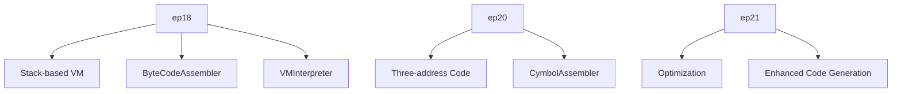
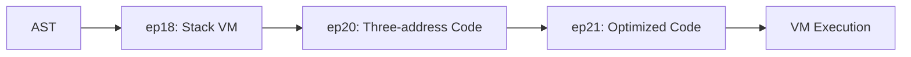
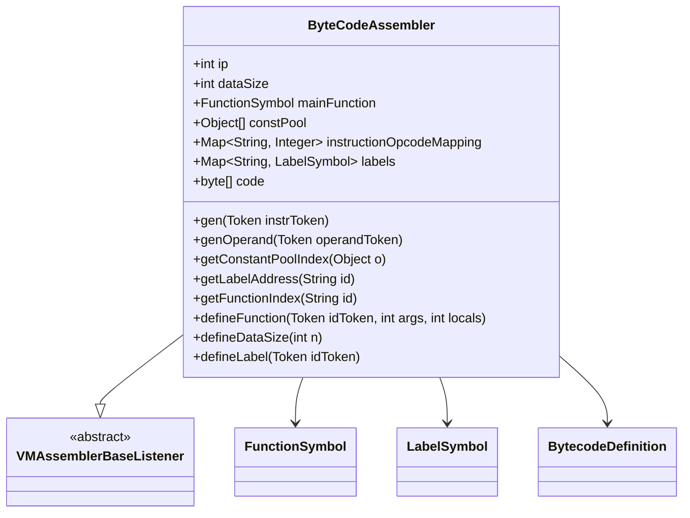
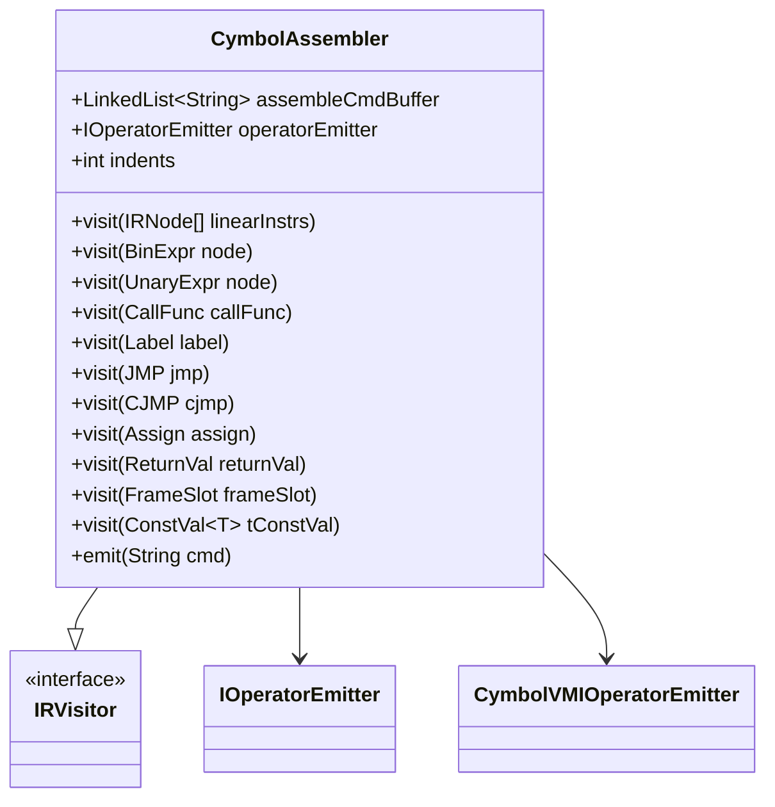
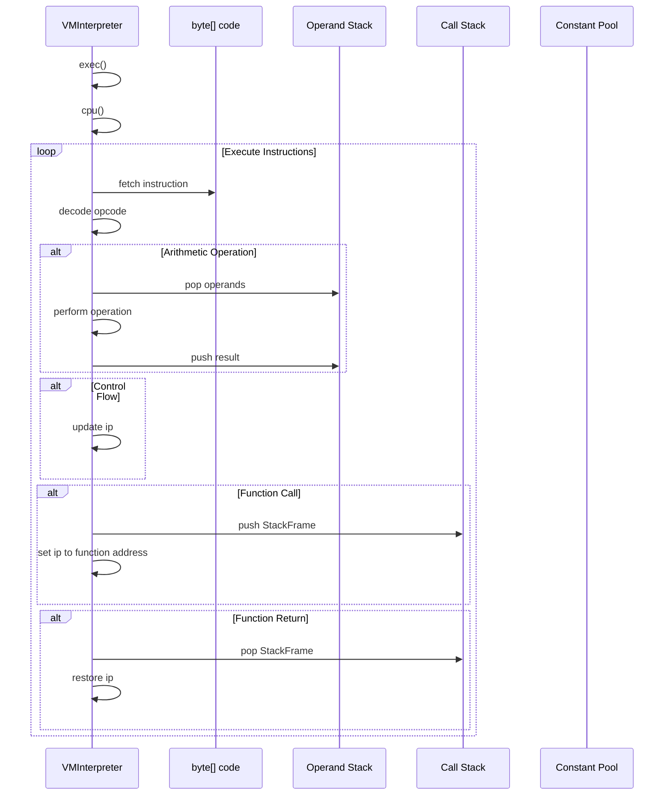
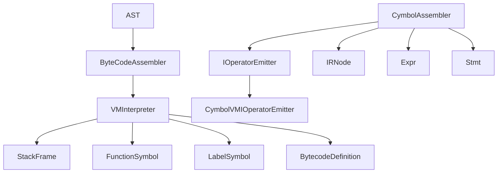

# Code Generation and Virtual Machine

<cite>
**Referenced Files in This Document**   
- [ByteCodeAssembler.java](file://ep18/src/main/java/org/teachfx/antlr4/ep18/stackvm/ByteCodeAssembler.java)
- [CymbolAssembler.java](file://ep20/src/main/java/org/teachfx/antlr4/ep20/pass/codegen/CymbolAssembler.java)
- [VMInterpreter.java](file://ep18/src/main/java/org/teachfx/antlr4/ep18/VMInterpreter.java)
- [BytecodeDefinition.java](file://ep18/src/main/java/org/teachfx/antlr4/ep18/stackvm/BytecodeDefinition.java)
- [StackFrame.java](file://ep18/src/main/java/org/teachfx/antlr4/ep18/stackvm/StackFrame.java)
- [CymbolVMIOperatorEmitter.java](file://ep20/src/main/java/org/teachfx/antlr4/ep20/pass/codegen/CymbolVMIOperatorEmitter.java)
</cite>

## Table of Contents
1. [Introduction](#introduction)
2. [Project Structure](#project-structure)
3. [Core Components](#core-components)
4. [Architecture Overview](#architecture-overview)
5. [Detailed Component Analysis](#detailed-component-analysis)
6. [Dependency Analysis](#dependency-analysis)
7. [Performance Considerations](#performance-considerations)
8. [Troubleshooting Guide](#troubleshooting-guide)
9. [Conclusion](#conclusion)

## Introduction
This document provides a comprehensive analysis of the code generation and virtual machine execution system implemented across ep18-ep21 in the Antlr4-based programming language implementation project. The documentation covers the evolution from a stack-based VM architecture in ep18, through three-address code generation in ep20, to advanced optimization capabilities in ep21. The focus is on the ByteCodeAssembler and CymbolAssembler components, the VM's instruction set, stack operations, execution model, and the translation of AST nodes to executable code.

## Project Structure
The code generation and VM execution components are organized across multiple episodes, with each episode building upon the previous implementation. The core VM components are located in ep18, while code generation enhancements are implemented in ep20 and ep21.

**Diagram sources**
- [ByteCodeAssembler.java](file://ep18/src/main/java/org/teachfx/antlr4/ep18/stackvm/ByteCodeAssembler.java)
- [CymbolAssembler.java](file://ep20/src/main/java/org/teachfx/antlr4/ep20/pass/codegen/CymbolAssembler.java)

**Section sources**
- [ByteCodeAssembler.java](file://ep18/src/main/java/org/teachfx/antlr4/ep18/stackvm/ByteCodeAssembler.java)
- [CymbolAssembler.java](file://ep20/src/main/java/org/teachfx/antlr4/ep20/pass/codegen/CymbolAssembler.java)

## Core Components
The code generation and VM execution system consists of several core components that work together to translate high-level language constructs into executable bytecode. The ByteCodeAssembler in ep18 implements a stack-based VM architecture, while the CymbolAssembler in ep20 implements three-address code generation. The VMInterpreter executes the generated bytecode using a stack-based execution model.

**Section sources**
- [ByteCodeAssembler.java](file://ep18/src/main/java/org/teachfx/antlr4/ep18/stackvm/ByteCodeAssembler.java)
- [CymbolAssembler.java](file://ep20/src/main/java/org/teachfx/antlr4/ep20/pass/codegen/CymbolAssembler.java)
- [VMInterpreter.java](file://ep18/src/main/java/org/teachfx/antlr4/ep18/VMInterpreter.java)

## Architecture Overview
The architecture follows a progressive enhancement pattern from ep18 to ep21, starting with a basic stack-based VM and evolving into a sophisticated code generation system with optimization capabilities.

**Diagram sources**
- [ByteCodeAssembler.java](file://ep18/src/main/java/org/teachfx/antlr4/ep18/stackvm/ByteCodeAssembler.java)
- [CymbolAssembler.java](file://ep20/src/main/java/org/teachfx/antlr4/ep20/pass/codegen/CymbolAssembler.java)

## Detailed Component Analysis

### ByteCodeAssembler Analysis
The ByteCodeAssembler in ep18 implements a stack-based VM architecture that translates high-level language constructs into bytecode instructions. It handles instruction selection and emission patterns for the VM's instruction set.

**Diagram sources**
- [ByteCodeAssembler.java](file://ep18/src/main/java/org/teachfx/antlr4/ep18/stackvm/ByteCodeAssembler.java)

**Section sources**
- [ByteCodeAssembler.java](file://ep18/src/main/java/org/teachfx/antlr4/ep18/stackvm/ByteCodeAssembler.java)

### CymbolAssembler Analysis
The CymbolAssembler in ep20 implements three-address code generation, translating AST nodes into intermediate representation (IR) instructions. It uses the IOperatorEmitter interface to emit VM-specific instructions.

**Diagram sources**
- [CymbolAssembler.java](file://ep20/src/main/java/org/teachfx/antlr4/ep20/pass/codegen/CymbolAssembler.java)
- [CymbolVMIOperatorEmitter.java](file://ep20/src/main/java/org/teachfx/antlr4/ep20/pass/codegen/CymbolVMIOperatorEmitter.java)

**Section sources**
- [CymbolAssembler.java](file://ep20/src/main/java/org/teachfx/antlr4/ep20/pass/codegen/CymbolAssembler.java)

### VMInterpreter Analysis
The VMInterpreter executes the generated bytecode using a stack-based execution model. It manages the operand stack, call stack, and program counter to execute the VM's instruction set.

**Diagram sources**
- [VMInterpreter.java](file://ep18/src/main/java/org/teachfx/antlr4/ep18/VMInterpreter.java)
- [StackFrame.java](file://ep18/src/main/java/org/teachfx/antlr4/ep18/stackvm/StackFrame.java)

**Section sources**
- [VMInterpreter.java](file://ep18/src/main/java/org/teachfx/antlr4/ep18/VMInterpreter.java)

## Dependency Analysis
The code generation and VM execution components have a clear dependency hierarchy, with each component building upon the previous implementation.

**Diagram sources**
- [ByteCodeAssembler.java](file://ep18/src/main/java/org/teachfx/antlr4/ep18/stackvm/ByteCodeAssembler.java)
- [CymbolAssembler.java](file://ep20/src/main/java/org/teachfx/antlr4/ep20/pass/codegen/CymbolAssembler.java)
- [VMInterpreter.java](file://ep18/src/main/java/org/teachfx/antlr4/ep18/VMInterpreter.java)

**Section sources**
- [ByteCodeAssembler.java](file://ep18/src/main/java/org/teachfx/antlr4/ep18/stackvm/ByteCodeAssembler.java)
- [CymbolAssembler.java](file://ep20/src/main/java/org/teachfx/antlr4/ep20/pass/codegen/CymbolAssembler.java)

## Performance Considerations
The stack-based VM architecture in ep18 provides a simple and efficient execution model, but may have performance limitations for complex programs. The three-address code generation in ep20 enables more sophisticated optimizations in ep21, potentially improving execution performance. The VM's instruction set is designed to be simple and efficient, with minimal overhead for instruction decoding and execution.

## Troubleshooting Guide
When debugging generated code, use the VMInterpreter's trace mode to monitor instruction execution and stack state. The disassemble and coredump features can help identify issues in the generated bytecode. For code generation issues, examine the CymbolAssembler's output to verify correct instruction selection and emission.

**Section sources**
- [VMInterpreter.java](file://ep18/src/main/java/org/teachfx/antlr4/ep18/VMInterpreter.java)
- [CymbolAssembler.java](file://ep20/src/main/java/org/teachfx/antlr4/ep20/pass/codegen/CymbolAssembler.java)

## Conclusion
The code generation and VM execution system implemented across ep18-ep21 demonstrates a progressive enhancement approach, starting with a basic stack-based VM and evolving into a sophisticated code generation system with optimization capabilities. The ByteCodeAssembler and CymbolAssembler components provide a solid foundation for translating high-level language constructs into executable bytecode, while the VMInterpreter provides a reliable execution environment. The architecture supports further enhancements, such as register allocation and advanced optimization techniques, in future episodes.