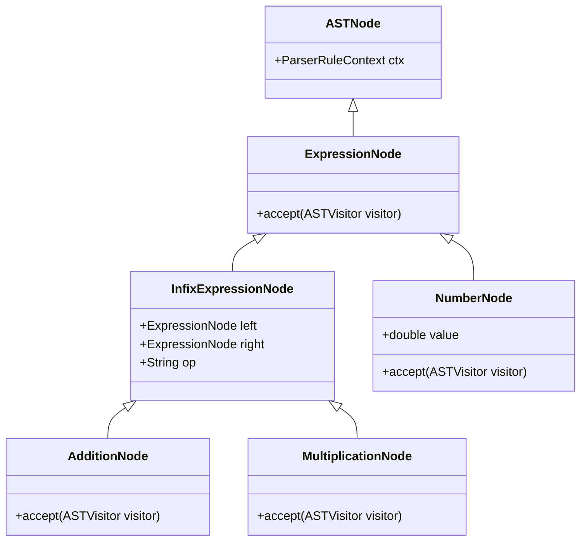
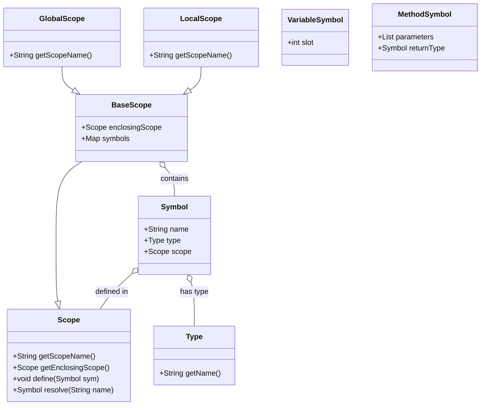
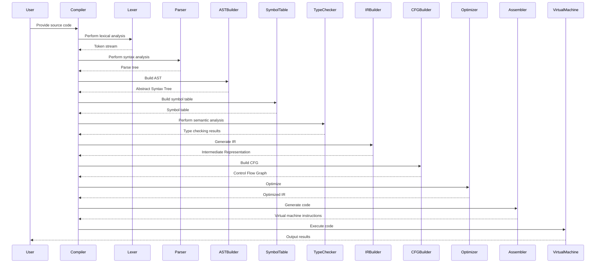

# Educational Structure and Progression

<cite>
**Referenced Files in This Document**   
- [Calc.java](file://ep4/src/main/java/org/teachfx/antlr4/Calc.java)
- [CSVReader.java](file://ep6/src/main/java/org/teachfx/antlr4/CSVReader.java)
- [VecMathParser.java](file://ep8/src/main/java/org/teachfx/antlr4/VecMathParser.java)
- [MathParser.java](file://ep11/src/main/java/org/teachfx/antlr4/MathParser.java)
- [BuildAstVisitor.java](file://ep11/src/main/java/org/teachfx/antlr4/BuildAstVisitor.java)
- [SymbolTable.java](file://ep14/src/main/java/org/teachfx/antlr4/ep14/symtab/SymbolTable.java)
- [Compiler.java](file://ep16/src/main/java/org/teachfx/antlr4/ep16/Compiler.java)
- [CymbolParser.java](file://ep20/src/main/java/org/teachfx/antlr4/ep20/parser/CymbolParser.java)
- [CymbolIRBuilder.java](file://ep20/src/main/java/org/teachfx/antlr4/ep20/pass/ir/CymbolIRBuilder.java)
- [CymbolAssembler.java](file://ep20/src/main/java/org/teachfx/antlr4/ep20/pass/codegen/CymbolAssembler.java)
- [VMRunner.java](file://ep18/src/main/java/org/teachfx/antlr4/ep18/VMRunner.java)
- [compilation-sequence.md](file://ep20/docs/compilation-sequence.md)
- [ep20-improvements-summary.md](file://ep20/docs/ep20-improvements-summary.md)
</cite>

## Table of Contents
1. [Introduction](#introduction)
2. [Foundational Phase: Lexer and Parser Generation (ep1-ep4)](#foundational-phase-lexer-and-parser-generation-ep1-ep4)
3. [AST Construction Phase (ep8-ep11)](#ast-construction-phase-ep8-ep11)
4. [Symbol Table and Scoping Implementation (ep14-ep16)](#symbol-table-and-scoping-implementation-ep14-ep16)
5. [Code Generation and Optimization Phase (ep18-ep21)](#code-generation-and-optimization-phase-ep18-ep21)
6. [Learning Challenges and Systematic Approach](#learning-challenges-and-systematic-approach)
7. [Conclusion](#conclusion)

## Introduction
The educational progression across episodes ep1-ep21 follows a carefully structured pedagogical approach to teaching programming language implementation using ANTLR4. This progression systematically builds complexity from basic lexer/parser generation to full compiler implementation with optimization. Each episode serves as a building block, introducing new concepts while reinforcing previous knowledge through practical implementation. The curriculum is designed to guide learners through the complete compilation pipeline, from source code analysis to executable code generation.

## Foundational Phase: Lexer and Parser Generation (ep1-ep4)

The initial episodes establish the foundation of language processing by focusing on lexical and syntactic analysis. Episode 1 introduces the basic project structure and build configuration through pom.xml, setting up the environment for ANTLR4-based language implementation. Episode 2 expands on this foundation by demonstrating lexer and parser generation for array initialization syntax, introducing learners to ANTLR4's listener and visitor patterns.

Episode 3 builds upon these concepts by exploring more complex grammars and parsing techniques, while Episode 4 marks a significant milestone with the implementation of the Calc.java example. This episode demonstrates recursive descent evaluation using visitor patterns, where the LabeledExprVisitor processes mathematical expressions through method dispatch. The CSVReader.java implementation in Episode 6 further reinforces these concepts by applying parsing techniques to comma-separated values, demonstrating how the same principles can be applied to different data formats.

The learning objectives of this phase include understanding regular expressions for token definition, context-free grammars for language specification, and the distinction between parse trees and abstract syntax trees. Learners gain hands-on experience with ANTLR4's code generation capabilities and learn how to traverse parse trees using listener and visitor patterns.

**Section sources**
- [pom.xml](file://ep1/pom.xml)
- [ArrayInitParser.java](file://ep2/src/main/java/ArrayInitParser.java)
- [Calc.java](file://ep4/src/main/java/org/teachfx/antlr4/Calc.java)
- [CSVReader.java](file://ep6/src/main/java/org/teachfx/antlr4/CSVReader.java)

## AST Construction Phase (ep8-ep11)

This phase transitions from parse tree traversal to abstract syntax tree (AST) construction, representing a significant conceptual leap in compiler design. Episode 8 introduces the VecMathParser.java implementation, which processes vector mathematics expressions and lays the groundwork for AST node hierarchy. The introduction of classes like AddNode, SubtractionNode, and ExpressionNode establishes the foundation for a typed AST structure.

Episode 9 refines this approach with a cleaner separation of concerns, while Episode 11 represents a major advancement with the implementation of a complete AST construction framework. The BuildAstVisitor.java class demonstrates how to transform a parse tree into a typed AST, with specific node types like AdditionNode, MultiplicationNode, and NumberNode. The EvalExprVisitor.java implementation shows how to evaluate these ASTs, separating the concerns of tree construction and interpretation.

The learning objectives of this phase include understanding the difference between concrete and abstract syntax trees, implementing visitor patterns for tree construction, and designing type hierarchies for AST nodes. Learners also gain experience with expression evaluation and the separation of parsing from semantic analysis. The progression from simple expression evaluation in ep4 to structured AST manipulation in ep11 illustrates the increasing sophistication of the implementation.

**Diagram sources**
- [ASTNode.java](file://ep11/src/main/java/org/teachfx/antlr4/ASTNode.java)
- [ExpressionNode.java](file://ep11/src/main/java/org/teachfx/antlr4/ExpressionNode.java)
- [AdditionNode.java](file://ep11/src/main/java/org/teachfx/antlr4/AdditionNode.java)
- [MultiplicationNode.java](file://ep11/src/main/java/org/teachfx/antlr4/MultiplicationNode.java)
- [NumberNode.java](file://ep11/src/main/java/org/teachfx/antlr4/NumberNode.java)

**Section sources**
- [VecMathParser.java](file://ep8/src/main/java/org/teachfx/antlr4/VecMathParser.java)
- [BuildAstVisitor.java](file://ep11/src/main/java/org/teachfx/antlr4/BuildAstVisitor.java)
- [EvalExprVisitor.java](file://ep11/src/main/java/org/teachfx/antlr4/EvalExprVisitor.java)

## Symbol Table and Scoping Implementation (ep14-ep16)

The middle episodes focus on semantic analysis through symbol table implementation and variable scoping. Episode 14 introduces the SymbolTable.java and related classes, establishing a framework for managing identifiers, their types, and scopes. The implementation includes BaseScope, Scope, and Symbol classes that form a hierarchical structure for name resolution.

Episode 15 continues this theme with enhanced scoping mechanisms, while Episode 16 represents a significant advancement with the integration of symbol resolution into a complete compiler framework. The Compiler.java implementation demonstrates how symbol collection and resolution are integrated into the compilation pipeline. The introduction of GlobalScope and LocalScope classes enables proper handling of nested scopes, while VariableSymbol and MethodSymbol classes provide type information for declared entities.

The learning objectives of this phase include understanding lexical vs. dynamic scoping, implementing symbol tables with hierarchical scopes, and performing name resolution across nested scopes. Learners also explore type checking fundamentals and the relationship between declaration and use sites. The progression from simple symbol storage in ep14 to sophisticated scope management in ep16 illustrates the increasing complexity of semantic analysis.

**Diagram sources**
- [SymbolTable.java](file://ep14/src/main/java/org/teachfx/antlr4/ep14/symtab/SymbolTable.java)
- [BaseScope.java](file://ep14/src/main/java/org/teachfx/antlr4/ep14/symtab/BaseScope.java)
- [Scope.java](file://ep14/src/main/java/org/teachfx/antlr4/ep14/symtab/Scope.java)
- [Symbol.java](file://ep14/src/main/java/org/teachfx/antlr4/ep14/symtab/Symbol.java)
- [VariableSymbol.java](file://ep14/src/main/java/org/teachfx/antlr4/ep14/symtab/VariableSymbol.java)

**Section sources**
- [SymbolTable.java](file://ep14/src/main/java/org/teachfx/antlr4/ep14/symtab/SymbolTable.java)
- [Compiler.java](file://ep16/src/main/java/org/teachfx/antlr4/ep16/Compiler.java)

## Code Generation and Optimization Phase (ep18-ep21)

The final episodes culminate in complete code generation and optimization, representing the most advanced stage of compiler implementation. Episode 18 introduces the virtual machine infrastructure through VMRunner.java and related classes, establishing the target execution environment. The implementation includes bytecode definition, stack frame management, and instruction dispatch mechanisms.

Episode 19 builds on this foundation with enhanced compilation pipelines, while Episode 20 represents the pinnacle of the educational progression with full intermediate representation (IR) generation and optimization. The compilation-sequence.md document details the complete compilation flow, from source code to optimized virtual machine instructions. The CymbolIRBuilder.java implementation demonstrates how to generate three-address code from ASTs, while the CFGBuilder.java class constructs control flow graphs for optimization.

Episode 21 refines these concepts with improved code generation and optimization techniques. The learning objectives of this phase include understanding intermediate representations, implementing control flow analysis, performing code optimization, and generating target-specific instructions. Learners explore advanced concepts like basic block construction, liveness analysis, and jump optimization, as detailed in the ep20-improvements-summary.md documentation.

**Diagram sources**
- [compilation-sequence.md](file://ep20/docs/compilation-sequence.md)
- [CymbolIRBuilder.java](file://ep20/src/main/java/org/teachfx/antlr4/ep20/pass/ir/CymbolIRBuilder.java)
- [CFGBuilder.java](file://ep20/src/main/java/org/teachfx/antlr4/ep20/pass/cfg/CFGBuilder.java)
- [CymbolAssembler.java](file://ep20/src/main/java/org/teachfx/antlr4/ep20/pass/codegen/CymbolAssembler.java)
- [VMRunner.java](file://ep18/src/main/java/org/teachfx/antlr4/ep18/VMRunner.java)

**Section sources**
- [VMRunner.java](file://ep18/src/main/java/org/teachfx/antlr4/ep18/VMRunner.java)
- [CymbolIRBuilder.java](file://ep20/src/main/java/org/teachfx/antlr4/ep20/pass/ir/CymbolIRBuilder.java)
- [CymbolAssembler.java](file://ep20/src/main/java/org/teachfx/antlr4/ep20/pass/codegen/CymbolAssembler.java)
- [compilation-sequence.md](file://ep20/docs/compilation-sequence.md)

## Learning Challenges and Systematic Approach

The progression through episodes presents several common learning challenges that learners must overcome. The initial challenge lies in understanding the separation between lexical, syntactic, and semantic analysis phases. Many learners struggle with the conceptual jump from parse trees to abstract syntax trees, particularly in understanding why ASTs are necessary for semantic analysis and code generation.

Another significant challenge is grasping the visitor pattern and its application in tree traversal. The dual use of visitors for both AST construction and evaluation can be confusing, requiring learners to understand how the same pattern serves different purposes at different stages. The introduction of symbol tables and scoping mechanisms presents additional complexity, particularly in understanding the relationship between declaration sites and use sites across nested scopes.

To approach this educational progression systematically, learners should follow a structured methodology. First, they should ensure complete understanding of each episode before moving to the next, verifying their implementation against the provided examples. Second, they should focus on understanding the data flow between components, tracing how information passes from lexer to parser to AST builder to symbol table and beyond.

Third, learners should practice extending the provided examples with small modifications, gradually increasing complexity. For instance, after mastering the Calc.java implementation, they might add new operators or data types. After understanding symbol tables, they might implement additional type checking rules. This incremental approach reinforces learning while building confidence.

Finally, learners should leverage the provided documentation and diagrams to visualize the compilation pipeline. The sequence diagrams in compilation-sequence.md and the class diagrams in the source code provide valuable insights into component relationships and data flow. By systematically working through each episode while addressing these challenges, learners can achieve a comprehensive understanding of compiler construction.

**Section sources**
- [tutorial.md](file://ep16/tutorial.md)
- [VM_Design.md](file://ep18/VM_Design.md)
- [ep20-improvements-summary.md](file://ep20/docs/ep20-improvements-summary.md)

## Conclusion
The educational progression from ep1 to ep21 represents a comprehensive journey through compiler construction, systematically building from basic lexer/parser generation to advanced code optimization. Each episode serves as a carefully designed stepping stone, introducing new concepts while reinforcing previous knowledge. The curriculum effectively demonstrates the complete compilation pipeline, from source code analysis through semantic validation to executable code generation.

The progression illustrates key compiler design principles, including the separation of concerns between compilation phases, the importance of intermediate representations, and the systematic application of optimization techniques. Through concrete examples like Calc.java, CSVReader.java, and VecMathParser.java, learners gain practical experience with fundamental concepts such as ANTLR4's listener/visitor patterns, recursive descent evaluation, abstract syntax tree construction, variable scoping, and three-address code generation.

This structured approach not only teaches the technical aspects of compiler implementation but also develops important software engineering skills, including modular design, incremental development, and systematic problem-solving. The culmination in episodes ep18-ep21 demonstrates how these individual components integrate into a complete compiler system, providing learners with a deep understanding of programming language implementation.