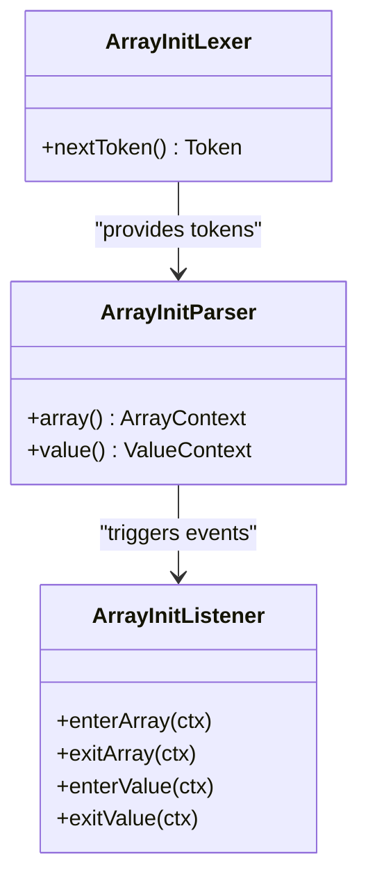
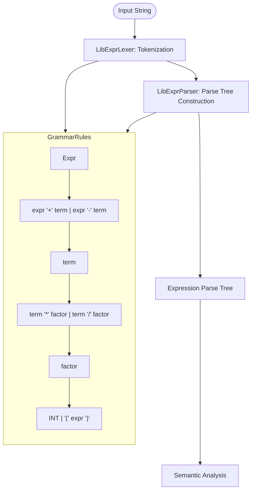
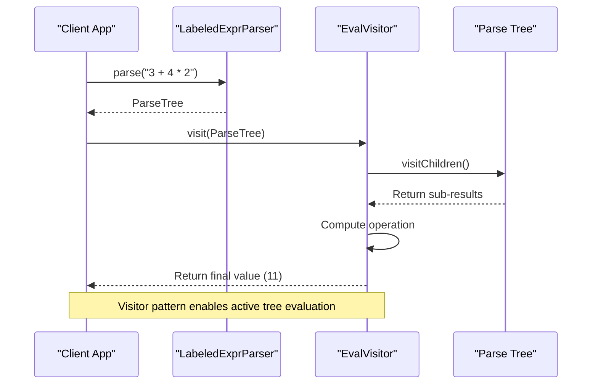
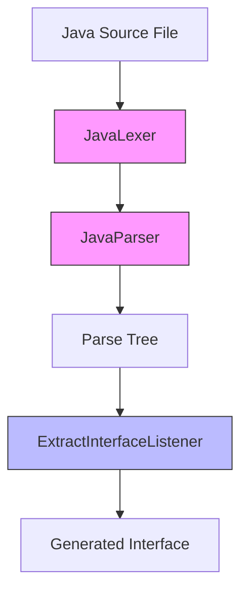
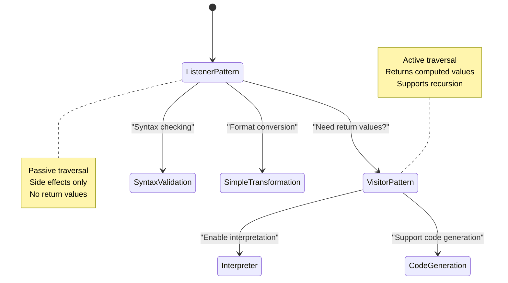

# Foundations: Lexical and Syntactic Analysis

<cite>
**Referenced Files in This Document**  
- [pom.xml](file://ep1/pom.xml)
- [ArrayInitLexer.java](file://ep2/src/main/java/org/teachfx/antlr4/ArrayInitLexer.java)
- [ArrayInitParser.java](file://ep2/src/main/java/org/teachfx/antlr4/ArrayInitParser.java)
- [ArrayInitListener.java](file://ep2/src/main/java/org/teachfx/antlr4/ArrayInitListener.java)
- [LibExprLexer.java](file://ep3/src/main/java/org/teachfx/antlr4/LibExprLexer.java)
- [LibExprParser.java](file://ep3/src/main/java/org/teachfx/antlr4/LibExprParser.java)
- [Calc.java](file://ep4/src/main/java/org/teachfx/antlr4/Calc.java)
- [EvalVisitor.java](file://ep4/src/main/java/org/teachfx/antlr4/EvalVisitor.java)
- [LabeledExprVisitor.java](file://ep4/src/main/java/org/teachfx/antlr4/LabeledExprVisitor.java)
- [JavaLexer.java](file://ep5/src/main/java/org/teachfx/antlr4/JavaLexer.java)
- [JavaParser.java](file://ep5/src/main/java/org/teachfx/antlr4/JavaParser.java)
- [ExtractInterfaceListener.java](file://ep5/src/main/java/org/teachfx/antlr4/ExtractInterfaceListener.java)
</cite>

## Table of Contents
1. [Introduction](#introduction)
2. [Episode 1: ANTLR4 Project Setup and Grammar Definition](#episode-1-antlr4-project-setup-and-grammar-definition)
3. [Episode 2: Listener-Based Tree Walking for Array Initialization](#episode-2-listener-based-tree-walking-for-array-initialization)
4. [Episode 3: Expression Parsing with Custom Lexer Rules](#episode-3-expression-parsing-with-custom-lexer-rules)
5. [Episode 4: Visitor-Based Evaluation of Arithmetic Expressions](#episode-4-visitor-based-evaluation-of-arithmetic-expressions)
6. [Episode 5: Real-World Java Code Analysis](#episode-5-real-world-java-code-analysis)
7. [Evolution from Listeners to Visitors](#evolution-from-listeners-to-visitors)
8. [Practical Guidance for ANTLR4 Development](#practical-guidance-for-antlr4-development)
9. [Common Pitfalls and Optimization Tips](#common-pitfalls-and-optimization-tips)
10. [Conclusion](#conclusion)

## Introduction
This document explores the foundational stages of compiler construction using ANTLR4, focusing on episodes 1 through 5. It details the progression from basic grammar setup to sophisticated code analysis, emphasizing the transition from passive listener-based processing to active visitor-based evaluation. The content provides practical insights into building lexical and syntactic analyzers, with real-world applications demonstrated through Java code analysis.

## Episode 1: ANTLR4 Project Setup and Grammar Definition
Episode 1 establishes the foundation for ANTLR4-based language processing by setting up a Maven project structure and defining initial grammar rules. The `pom.xml` file configures the ANTLR4 Maven plugin to automatically generate lexer and parser classes from grammar specifications during the build process. This episode emphasizes proper project configuration, including source directory layout and dependency management, enabling seamless integration of generated code into the development workflow.

**Section sources**
- [pom.xml](file://ep1/pom.xml)

## Episode 2: Listener-Based Tree Walking for Array Initialization
Episode 2 introduces listener-based tree walking using the `ArrayInitLexer` and `ArrayInitParser` classes to process array initialization syntax. The implementation demonstrates how ANTLR4 generates listener interfaces that respond to enter and exit events during parse tree traversal. This passive approach allows for simple syntax-directed translation, such as converting array initializations into a custom format. The `ArrayInitListener` interface enables traversal without modifying the tree structure, making it ideal for syntax validation and simple transformations.

**Diagram sources**
- [ArrayInitLexer.java](file://ep2/src/main/java/org/teachfx/antlr4/ArrayInitLexer.java)
- [ArrayInitParser.java](file://ep2/src/main/java/org/teachfx/antlr4/ArrayInitParser.java)
- [ArrayInitListener.java](file://ep2/src/main/java/org/teachfx/antlr4/ArrayInitListener.java)

**Section sources**
- [ArrayInitLexer.java](file://ep2/src/main/java/org/teachfx/antlr4/ArrayInitLexer.java)
- [ArrayInitParser.java](file://ep2/src/main/java/org/teachfx/antlr4/ArrayInitParser.java)
- [ArrayInitListener.java](file://ep2/src/main/java/org/teachfx/antlr4/ArrayInitListener.java)

## Episode 3: Expression Parsing with Custom Lexer Rules
Episode 3 expands parsing capabilities to handle arithmetic expressions using custom lexer rules defined in `LibExprLexer` and `LibExprParser`. This episode introduces grammar design for mathematical operations with proper operator precedence and associativity. The implementation showcases how lexer modes and custom token definitions enable robust expression parsing. The generated parser constructs a parse tree that accurately represents the hierarchical structure of nested expressions.

**Diagram sources**
- [LibExprLexer.java](file://ep3/src/main/java/org/teachfx/antlr4/LibExprLexer.java)
- [LibExprParser.java](file://ep3/src/main/java/org/teachfx/antlr4/LibExprParser.java)

**Section sources**
- [LibExprLexer.java](file://ep3/src/main/java/org/teachfx/antlr4/LibExprLexer.java)
- [LibExprParser.java](file://ep3/src/main/java/org/teachfx/antlr4/LibExprParser.java)

## Episode 4: Visitor-Based Evaluation of Arithmetic Expressions
Episode 4 implements visitor-based evaluation of arithmetic expressions using the `EvalVisitor` class to actively traverse and compute values from parse trees generated by `LabeledExprParser`. Unlike passive listeners, visitors return values from each visit method, enabling bottom-up evaluation of expression trees. The `Calc.java` example demonstrates how visitors can implement interpreters by recursively evaluating child nodes and combining results according to operator semantics.

**Diagram sources**
- [Calc.java](file://ep4/src/main/java/org/teachfx/antlr4/Calc.java)
- [EvalVisitor.java](file://ep4/src/main/java/org/teachfx/antlr4/EvalVisitor.java)
- [LabeledExprParser.java](file://ep4/src/main/java/org/teachfx/antlr4/LabeledExprParser.java)

**Section sources**
- [Calc.java](file://ep4/src/main/java/org/teachfx/antlr4/Calc.java)
- [EvalVisitor.java](file://ep4/src/main/java/org/teachfx/antlr4/EvalVisitor.java)
- [LabeledExprParser.java](file://ep4/src/main/java/org/teachfx/antlr4/LabeledExprParser.java)

## Episode 5: Real-World Java Code Analysis
Episode 5 applies ANTLR4 concepts to real-world Java code analysis using `JavaLexer`, `JavaParser`, and `ExtractInterfaceListener`. This episode demonstrates how to parse actual Java source files and extract meaningful information, such as identifying class members to generate interface definitions. The `ExtractInterfaceTool` shows practical application of listener patterns for source code transformation, highlighting ANTLR4's capability to process complex, real-world grammars.

**Diagram sources**
- [JavaLexer.java](file://ep5/src/main/java/org/teachfx/antlr4/JavaLexer.java)
- [JavaParser.java](file://ep5/src/main/java/org/teachfx/antlr4/JavaParser.java)
- [ExtractInterfaceListener.java](file://ep5/src/main/java/org/teachfx/antlr4/ExtractInterfaceListener.java)

**Section sources**
- [JavaLexer.java](file://ep5/src/main/java/org/teachfx/antlr4/JavaLexer.java)
- [JavaParser.java](file://ep5/src/main/java/org/teachfx/antlr4/JavaParser.java)
- [ExtractInterfaceListener.java](file://ep5/src/main/java/org/teachfx/antlr4/ExtractInterfaceListener.java)

## Evolution from Listeners to Visitors
The progression from episodes 2 to 4 illustrates the evolution from passive listeners to active visitors in ANTLR4 tree processing. Listeners provide a convenient mechanism for side-effect operations during tree traversal, ideal for syntax validation and simple transformations. Visitors, however, enable value-returning traversal essential for interpretation and code generation. The `ArrayInitListener` in episode 2 performs format translation without returning values, while the `EvalVisitor` in episode 4 returns computed values from each visit method, enabling recursive expression evaluation.

**Diagram sources**
- [ArrayInitListener.java](file://ep2/src/main/java/org/teachfx/antlr4/ArrayInitListener.java)
- [EvalVisitor.java](file://ep4/src/main/java/org/teachfx/antlr4/EvalVisitor.java)

## Practical Guidance for ANTLR4 Development
Setting up ANTLR4 Maven projects requires proper configuration in `pom.xml` to enable automatic generation of lexer and parser classes. The build process should include the ANTLR4 plugin to process `.g4` grammar files and generate corresponding Java classes. Developers should organize grammar files in `src/main/antlr4` and configure the plugin to output generated code to `target/generated-sources/antlr4`. Debugging grammar issues benefits from using ANTLR4's TestRig tool to visualize parse trees and identify ambiguities.

**Section sources**
- [pom.xml](file://ep1/pom.xml)

## Common Pitfalls and Optimization Tips
Common pitfalls in ANTLR4 development include left-recursion in grammars, which causes infinite loops during parsing, and improper operator precedence definition. To avoid left-recursion, use iterative rules with Kleene operators instead of direct left-recursive productions. For optimal parser performance, minimize backtracking by using semantic predicates judiciously and prefer lexer modes over complex regular expressions. Grammar optimization includes factoring common prefixes and using syntactic predicates only when necessary.

**Section sources**
- [LibExprParser.java](file://ep3/src/main/java/org/teachfx/antlr4/LibExprParser.java)
- [LabeledExprParser.java](file://ep4/src/main/java/org/teachfx/antlr4/LabeledExprParser.java)

## Conclusion
The foundational episodes of compiler construction with ANTLR4 demonstrate a clear progression from basic setup to sophisticated code analysis. Starting with project configuration in episode 1, moving through listener-based processing in episodes 2-3, advancing to visitor-based evaluation in episode 4, and culminating in real-world Java analysis in episode 5, this journey highlights the power of ANTLR4 for language processing tasks. The transition from passive listeners to active visitors represents a fundamental shift in processing paradigm, enabling increasingly complex applications from syntax validation to full interpretation.