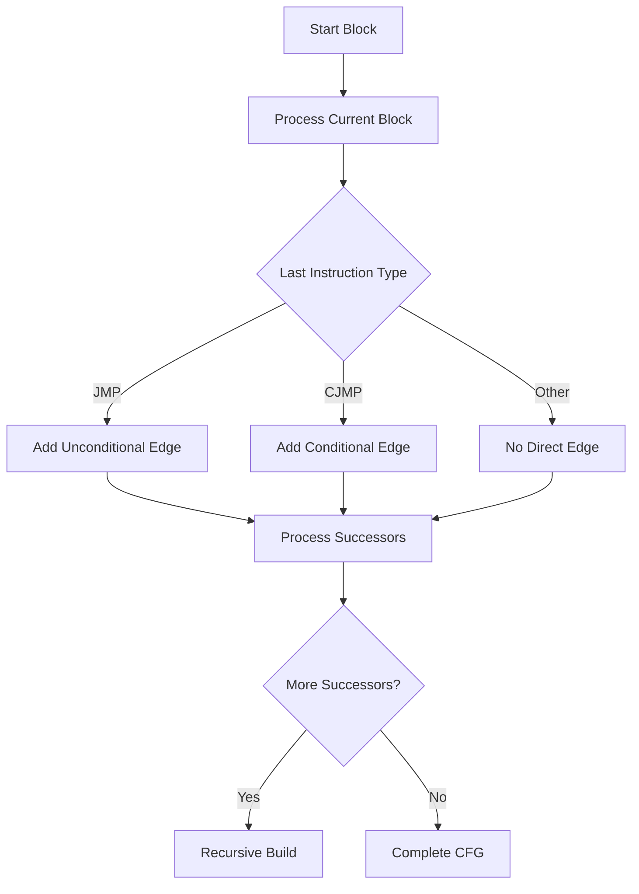
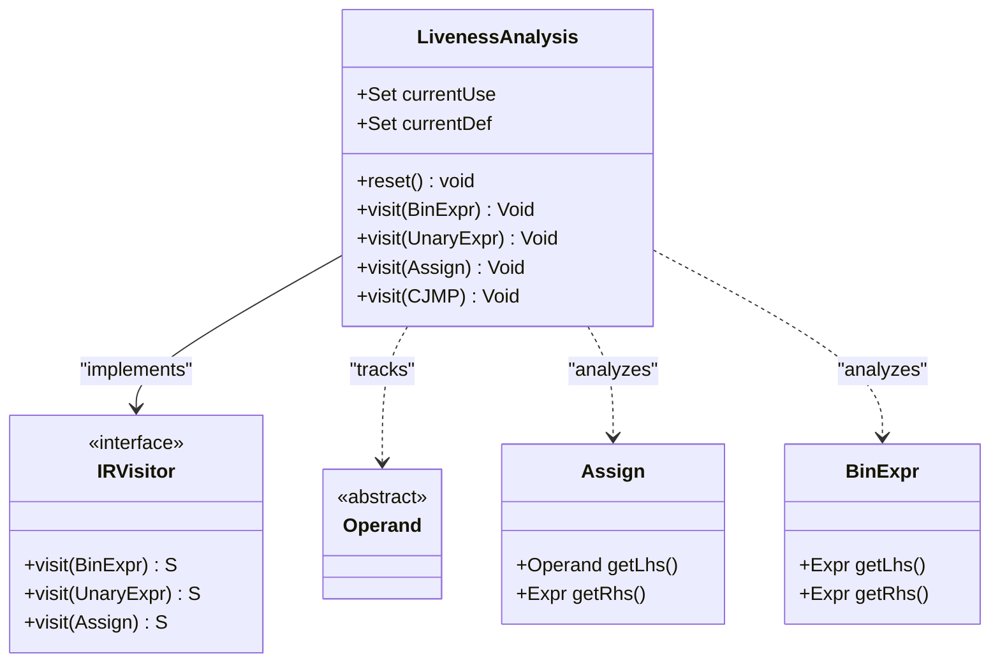
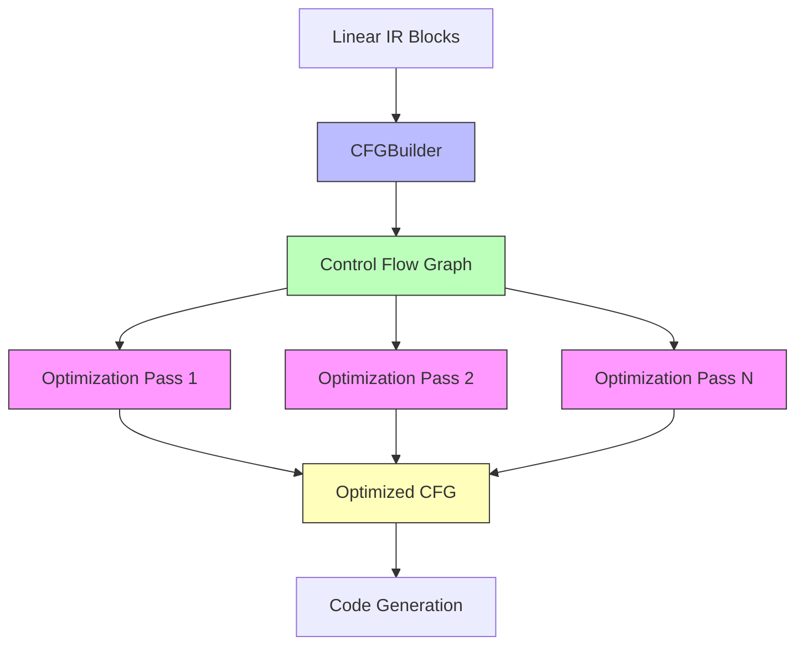
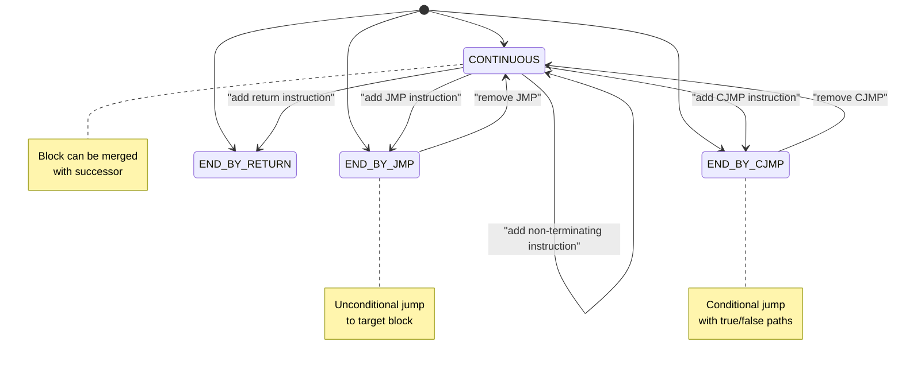
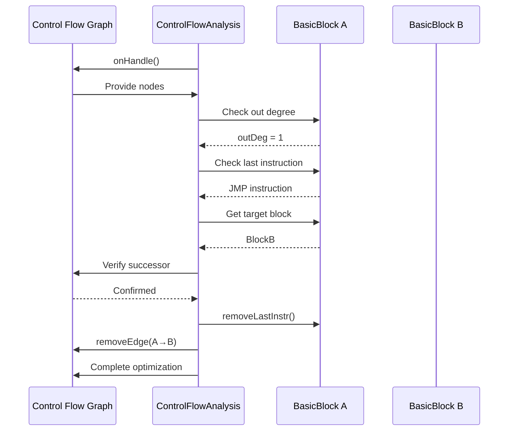
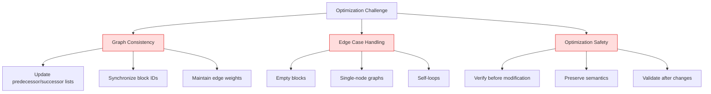

# Optimization and Advanced Compilation

<cite>
**Referenced Files in This Document**   
- [CFGBuilder.java](file://ep20/src/main/java/org/teachfx/antlr4/ep20/pass/cfg/CFGBuilder.java)
- [LivenessAnalysis.java](file://ep20/src/main/java/org/teachfx/antlr4/ep20/pass/cfg/LivenessAnalysis.java)
- [BasicBlock.java](file://ep20/src/main/java/org/teachfx/antlr4/ep20/pass/cfg/BasicBlock.java)
- [LinearIRBlock.java](file://ep20/src/main/java/org/teachfx/antlr4/ep20/pass/cfg/LinearIRBlock.java)
- [CFG.java](file://ep20/src/main/java/org/teachfx/antlr4/ep20/pass/cfg/CFG.java)
- [ControlFlowAnalysis.java](file://ep20/src/main/java/org/teachfx/antlr4/ep20/pass/cfg/ControlFlowAnalysis.java)
- [JMP.java](file://ep20/src/main/java/org/teachfx/antlr4/ep20/ir/stmt/JMP.java)
- [CJMP.java](file://ep20/src/main/java/org/teachfx/antlr4/ep20/ir/stmt/CJMP.java)
</cite>

## Table of Contents
1. [Introduction](#introduction)
2. [Control Flow Graph Construction](#control-flow-graph-construction)
3. [Data Flow Analysis and Liveness](#data-flow-analysis-and-liveness)
4. [Optimization Pipeline Architecture](#optimization-pipeline-architecture)
5. [Basic Block Identification and Merging](#basic-block-identification-and-merging)
6. [Jump Threading Optimization](#jump-threading-optimization)
7. [Dominator Tree and Control Flow Analysis](#dominator-tree-and-control-flow-analysis)
8. [Optimization Pass Design](#optimization-pass-design)
9. [Challenges in Optimization Implementation](#challenges-in-optimization-implementation)
10. [Extending the Optimization Framework](#extending-the-optimization-framework)
11. [Conclusion](#conclusion)

## Introduction
The optimization framework in ep20-ep21 implements a sophisticated compilation pipeline that transforms intermediate representation (IR) code through systematic control flow analysis and optimization passes. This document details the architecture and implementation of the optimization system, focusing on control flow graph construction, data flow analysis, and the extensible optimization pipeline. The framework enables advanced compiler optimizations while maintaining code correctness and providing a foundation for future enhancements.

## Control Flow Graph Construction

The control flow graph (CFG) construction process begins with the `CFGBuilder` class, which transforms linear IR blocks into a structured control flow graph. The construction algorithm recursively processes basic blocks and establishes edges based on control flow instructions.



**Diagram sources**
- [CFGBuilder.java](file://ep20/src/main/java/org/teachfx/antlr4/ep20/pass/cfg/CFGBuilder.java#L11-L64)
- [LinearIRBlock.java](file://ep20/src/main/java/org/teachfx/antlr4/ep20/pass/cfg/LinearIRBlock.java#L150-L200)

**Section sources**
- [CFGBuilder.java](file://ep20/src/main/java/org/teachfx/antlr4/ep20/pass/cfg/CFGBuilder.java#L9-L62)
- [LinearIRBlock.java](file://ep20/src/main/java/org/teachfx/antlr4/ep20/pass/cfg/LinearIRBlock.java#L100-L236)

## Data Flow Analysis and Liveness

The `LivenessAnalysis` class implements a visitor pattern to perform live variable analysis on the IR. This analysis determines which variables are live (will be used) at each program point, enabling optimizations like dead code elimination and register allocation.



**Diagram sources**
- [LivenessAnalysis.java](file://ep20/src/main/java/org/teachfx/antlr4/ep20/pass/cfg/LivenessAnalysis.java#L16-L146)
- [IRVisitor.java](file://ep20/src/main/java/org/teachfx/antlr4/ep20/ir/IRVisitor.java)

**Section sources**
- [LivenessAnalysis.java](file://ep20/src/main/java/org/teachfx/antlr4/ep20/pass/cfg/LivenessAnalysis.java#L16-L146)
- [Operand.java](file://ep20/src/main/java/org/teachfx/antlr4/ep20/ir/expr/Operand.java)

## Optimization Pipeline Architecture

The optimization framework is structured as an extensible pipeline where multiple optimization passes can be applied sequentially to the control flow graph. The `CFG` class serves as the central data structure that coordinates optimization passes through the `IFlowOptimizer` interface.



**Diagram sources**
- [CFG.java](file://ep20/src/main/java/org/teachfx/antlr4/ep20/pass/cfg/CFG.java#L50-L158)
- [IFlowOptimizer.java](file://ep20/src/main/java/org/teachfx/antlr4/ep20/pass/cfg/IFlowOptimizer.java)

**Section sources**
- [CFG.java](file://ep20/src/main/java/org/teachfx/antlr4/ep20/pass/cfg/CFG.java#L1-L158)
- [IFlowOptimizer.java](file://ep20/src/main/java/org/teachfx/antlr4/ep20/pass/cfg/IFlowOptimizer.java#L1-L20)

## Basic Block Identification and Merging

Basic block identification is performed through the `LinearIRBlock` class, which categorizes blocks based on their termination instructions. The framework supports block merging operations to eliminate unnecessary jumps and streamline control flow.



**Diagram sources**
- [LinearIRBlock.java](file://ep20/src/main/java/org/teachfx/antlr4/ep20/pass/cfg/LinearIRBlock.java#L70-L100)
- [Kind.java](file://ep20/src/main/java/org/teachfx/antlr4/ep20/utils/Kind.java)

**Section sources**
- [LinearIRBlock.java](file://ep20/src/main/java/org/teachfx/antlr4/ep20/pass/cfg/LinearIRBlock.java#L1-L236)
- [BasicBlock.java](file://ep20/src/main/java/org/teachfx/antlr4/ep20/pass/cfg/BasicBlock.java#L1-L130)

## Jump Threading Optimization

Jump threading is implemented in the `ControlFlowAnalysis` class, which identifies and eliminates redundant jump instructions. The optimization removes unnecessary jumps when a block ends with a jump to its immediate successor, effectively threading the control flow.



**Diagram sources**
- [ControlFlowAnalysis.java](file://ep20/src/main/java/org/teachfx/antlr4/ep20/pass/cfg/ControlFlowAnalysis.java#L1-L68)
- [JMP.java](file://ep20/src/main/java/org/teachfx/antlr4/ep20/ir/stmt/JMP.java#L1-L45)

**Section sources**
- [ControlFlowAnalysis.java](file://ep20/src/main/java/org/teachfx/antlr4/ep20/pass/cfg/ControlFlowAnalysis.java#L1-L68)
- [JMPInstr.java](file://ep20/src/main/java/org/teachfx/antlr4/ep20/ir/JMPInstr.java#L1-L7)

## Dominator Tree and Control Flow Analysis

The control flow analysis framework provides methods to analyze graph structure, including in-degree, out-degree, and predecessor/successor relationships. These analyses form the foundation for more advanced optimizations like dominator tree construction.

```mermaid
erDiagram
CFG ||--o{ BasicBlock : contains
CFG ||--o{ Edge : contains
BasicBlock ||--o{ IRNode : contains
BasicBlock ||--o{ Operand : defines
BasicBlock ||--o{ Operand : uses
CFG {
List<BasicBlock> nodes
List<Edge> edges
List<Links> links
}
BasicBlock {
int id
Kind kind
List<Loc> codes
Set<Operand> def
Set<Operand> liveUse
Set<Operand> liveIn
Set<Operand> liveOut
}
Edge {
int from
int to
int weight
}
Loc {
IRNode instr
Set<Operand> liveIn
Set<Operand> liveOut
}
```

**Diagram sources**
- [CFG.java](file://ep20/src/main/java/org/teachfx/antlr4/ep20/pass/cfg/CFG.java#L30-L158)
- [BasicBlock.java](file://ep20/src/main/java/org/teachfx/antlr4/ep20/pass/cfg/BasicBlock.java#L1-L130)

**Section sources**
- [CFG.java](file://ep20/src/main/java/org/teachfx/antlr4/ep20/pass/cfg/CFG.java#L1-L158)
- [BasicBlock.java](file://ep20/src/main/java/org/teachfx/antlr4/ep20/pass/cfg/BasicBlock.java#L1-L130)

## Optimization Pass Design

The optimization framework is designed with extensibility in mind, allowing new optimization passes to be added through the `IFlowOptimizer` interface. Each pass operates on the control flow graph and can modify its structure to improve code quality.

```mermaid
classDiagram
class CFG {
+List<BasicBlock> nodes
+List<Triple> edges
+List<Pair> links
+addOptimizer(IFlowOptimizer) void
+applyOptimizers() void
}
class IFlowOptimizer {
<<interface>>
+onHandle(CFG) void
}
class ControlFlowAnalysis {
+onHandle(CFG) void
}
class DataFlowAnalysis {
+onHandle(CFG) void
}
class RegisterAllocator {
+onHandle(CFG) void
}
CFG --> IFlowOptimizer : "has"
IFlowOptimizer <|-- ControlFlowAnalysis
IFlowOptimizer <|-- DataFlowAnalysis
IFlowOptimizer <|-- RegisterAllocator
note right of CFG
Central coordination
point for optimizations
end note
note right of IFlowOptimizer
Contract for all
optimization passes
end note
```

**Diagram sources**
- [CFG.java](file://ep20/src/main/java/org/teachfx/antlr4/ep20/pass/cfg/CFG.java#L100-L158)
- [IFlowOptimizer.java](file://ep20/src/main/java/org/teachfx/antlr4/ep20/pass/cfg/IFlowOptimizer.java#L1-L15)

**Section sources**
- [CFG.java](file://ep20/src/main/java/org/teachfx/antlr4/ep20/pass/cfg/CFG.java#L1-L158)
- [IFlowOptimizer.java](file://ep20/src/main/java/org/teachfx/antlr4/ep20/pass/cfg/IFlowOptimizer.java#L1-L20)

## Challenges in Optimization Implementation

Implementing correct and efficient optimizations presents several challenges, including maintaining graph consistency, handling edge cases, and ensuring optimization safety. The framework addresses these through careful state management and validation.



**Section sources**
- [CFG.java](file://ep20/src/main/java/org/teachfx/antlr4/ep20/pass/cfg/CFG.java#L1-L158)
- [ControlFlowAnalysis.java](file://ep20/src/main/java/org/teachfx/antlr4/ep20/pass/cfg/ControlFlowAnalysis.java#L1-L68)

## Extending the Optimization Framework

The framework can be extended with new optimization passes by implementing the `IFlowOptimizer` interface and registering the pass with the control flow graph. This modular design allows for incremental enhancement of the optimization capabilities.

```mermaid
graph TD
A[New Optimization Pass] --> B[Implement IFlowOptimizer]
B --> C[Override onHandle() method]
C --> D[Analyze CFG structure]
D --> E[Apply transformations]
E --> F[Ensure correctness]
F --> G[Register with CFG]
G --> H[Call applyOptimizers()]
style A fill:#bbf,stroke:#333
style H fill:#bfb,stroke:#333
```

**Section sources**
- [IFlowOptimizer.java](file://ep20/src/main/java/org/teachfx/antlr4/ep20/pass/cfg/IFlowOptimizer.java#L1-L20)
- [CFG.java](file://ep20/src/main/java/org/teachfx/antlr4/ep20/pass/cfg/CFG.java#L130-L158)

## Conclusion
The optimization framework in ep20-ep21 provides a robust foundation for advanced compiler optimizations through systematic control flow analysis and a modular optimization pipeline. By implementing control flow graph construction with `CFGBuilder`, data flow analysis with `LivenessAnalysis`, and extensible optimization passes, the framework enables sophisticated code transformations while maintaining correctness. The architecture supports basic optimizations like jump threading and provides the infrastructure for more advanced analyses such as dominator tree construction and register allocation. This design allows for incremental enhancement of optimization capabilities while ensuring the integrity of the compilation process.