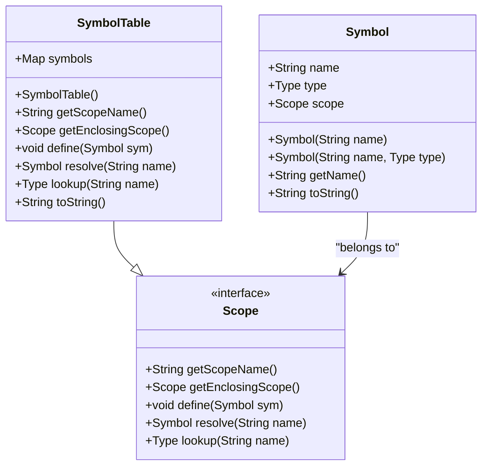
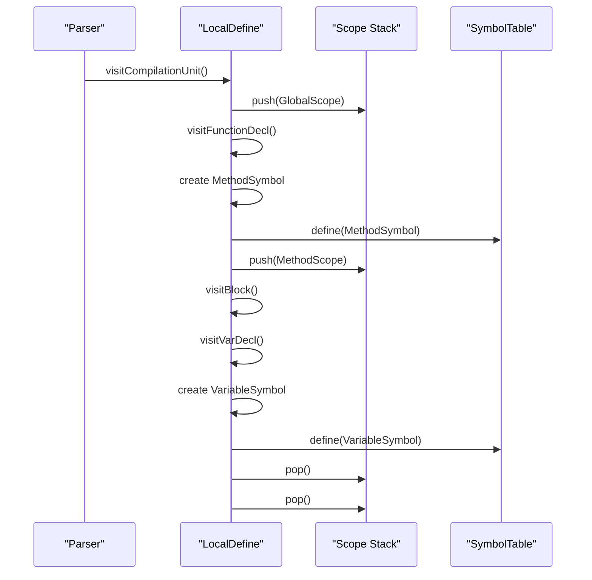
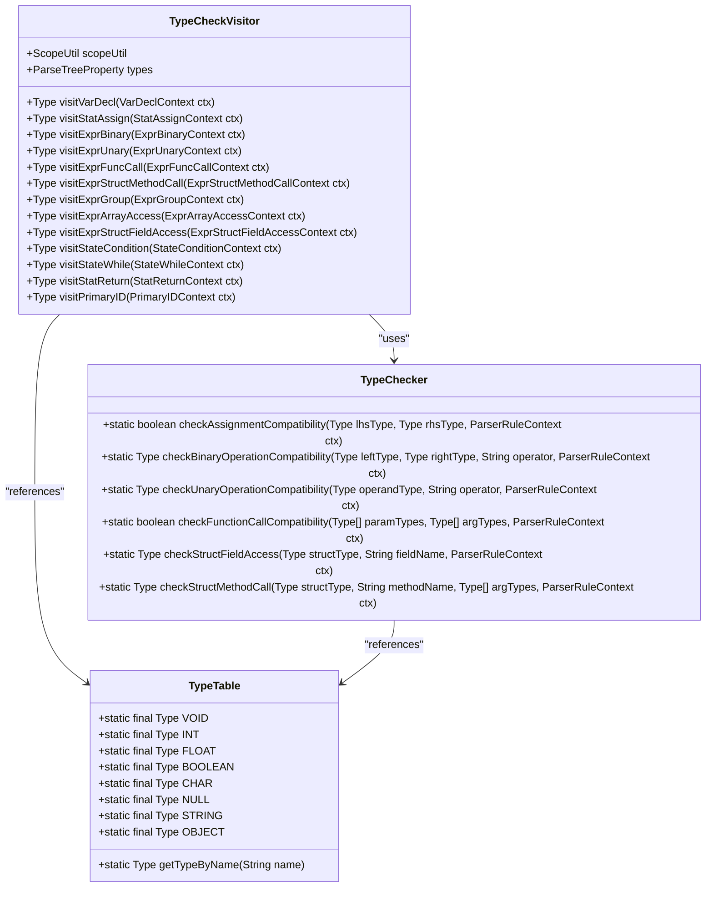
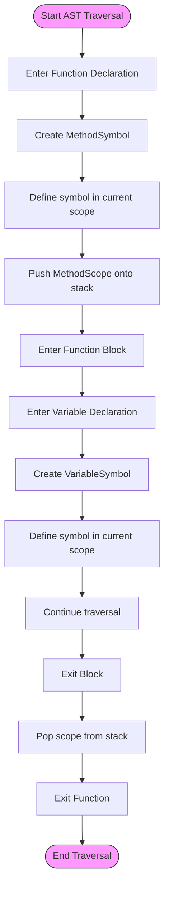
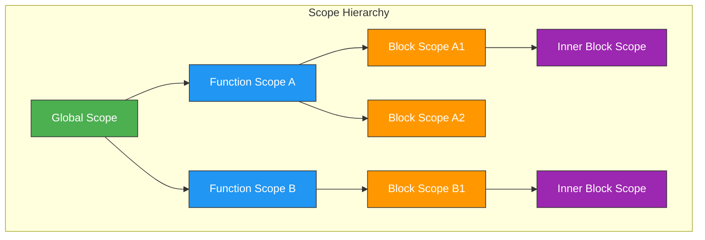
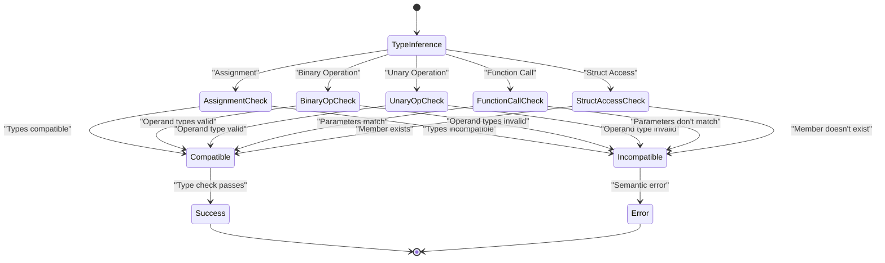
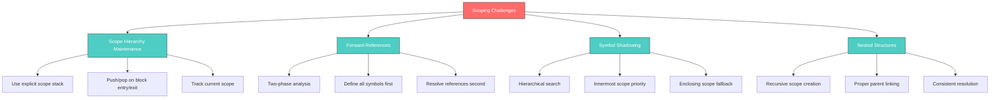

# Symbol Table and Semantic Analysis

<cite>
**Referenced Files in This Document**   
- [Symbol.java](file://ep14/src/main/java/org/teachfx/antlr4/ep14/symtab/Symbol.java)
- [Scope.java](file://ep14/src/main/java/org/teachfx/antlr4/ep14/symtab/Scope.java)
- [SymbolTable.java](file://ep14/src/main/java/org/teachfx/antlr4/ep14/symtab/SymbolTable.java)
- [LocalScope.java](file://ep16/src/main/java/org/teachfx/antlr4/ep16/symtab/LocalScope.java)
- [LocalDefine.java](file://ep16/src/main/java/org/teachfx/antlr4/ep16/visitor/LocalDefine.java)
- [LocalResolver.java](file://ep16/src/main/java/org/teachfx/antlr4/ep16/visitor/LocalResolver.java)
- [TypeTable.java](file://ep19/src/main/java/org/teachfx/antlr4/ep19/symtab/TypeTable.java)
- [TypeChecker.java](file://ep19/src/main/java/org/teachfx/antlr4/ep19/symtab/TypeChecker.java)
- [TypeCheckVisitor.java](file://ep19/src/main/java/org/teachfx/antlr4/ep19/pass/TypeCheckVisitor.java)
- [LocalDefine.java](file://ep19/src/main/java/org/teachfx/antlr4/ep19/pass/LocalDefine.java)
- [LocalResolver.java](file://ep19/src/main/java/org/teachfx/antlr4/ep19/pass/LocalResolver.java)
</cite>

## Table of Contents
1. [Introduction](#introduction)
2. [Symbol and Scope Hierarchy in ep14](#symbol-and-scope-hierarchy-in-ep14)
3. [Variable Declaration and Resolution in ep16](#variable-declaration-and-resolution-in-ep16)
4. [Advanced Type Checking in ep19](#advanced-type-checking-in-ep19)
5. [Symbol Table Construction and AST Traversal](#symbol-table-construction-and-ast-traversal)
6. [Scope Nesting and Symbol Shadowing](#scope-nesting-and-symbol-shadowing)
7. [Type Inference and Compatibility](#type-inference-and-compatibility)
8. [Challenges in Scoping Rules Implementation](#challenges-in-scoping-rules-implementation)
9. [Efficient Symbol Lookup Strategies](#efficient-symbol-lookup-strategies)
10. [Conclusion](#conclusion)

## Introduction
This document provides a comprehensive analysis of symbol management and semantic analysis in the Cymbol compiler implementation across episodes 14 to 19. It details the evolution from basic symbol tracking to advanced type checking, covering the hierarchical scope management system, variable declaration and reference resolution, and full type checking capabilities. The documentation explains how symbol tables are built during AST traversal, how variable references are resolved, and how semantic errors are detected throughout the compilation process.

## Symbol and Scope Hierarchy in ep14
Episode 14 introduces the foundational symbol and scope hierarchy for basic symbol tracking. The implementation establishes a clear separation between symbols and their scopes, creating a robust foundation for subsequent semantic analysis phases. The core components include the `Symbol` class, which represents named entities in the program, and the `Scope` interface, which defines the contract for scope management.

The `Symbol` class contains essential attributes such as the symbol's name, its type information, and a reference to its enclosing scope. This design enables bidirectional navigation between symbols and their scopes, facilitating efficient symbol resolution. The `Scope` interface defines critical operations including `define()` for adding symbols to a scope, `resolve()` for looking up symbols by name, and `getEnclosingScope()` for navigating the scope hierarchy.



**Diagram sources**
- [Symbol.java](file://ep14/src/main/java/org/teachfx/antlr4/ep14/symtab/Symbol.java#L2-L31)
- [Scope.java](file://ep14/src/main/java/org/teachfx/antlr4/ep14/symtab/Scope.java#L5-L16)

**Section sources**
- [Symbol.java](file://ep14/src/main/java/org/teachfx/antlr4/ep14/symtab/Symbol.java#L2-L31)
- [Scope.java](file://ep14/src/main/java/org/teachfx/antlr4/ep14/symtab/Scope.java#L5-L16)

## Variable Declaration and Resolution in ep16
Episode 16 implements the `LocalDefine` and `LocalResolver` components for variable declaration and reference resolution. This phase introduces a two-pass approach to semantic analysis, where symbol definitions are established in the first pass, and symbol references are resolved in the second pass. The `LocalDefine` visitor traverses the AST to collect symbol declarations and establish the scope hierarchy, while `LocalResolver` resolves variable references against the constructed symbol table.

The `LocalDefine` visitor creates a stack-based scope management system, where new scopes are pushed onto the stack when entering blocks, functions, or other scoping constructs, and popped when exiting them. This ensures proper nesting of scopes and enables correct symbol shadowing behavior. The visitor defines symbols for variables, functions, and parameters, associating each with its appropriate scope.



**Diagram sources**
- [LocalDefine.java](file://ep16/src/main/java/org/teachfx/antlr4/ep16/visitor/LocalDefine.java#L13-L151)
- [LocalScope.java](file://ep16/src/main/java/org/teachfx/antlr4/ep16/symtab/LocalScope.java#L0-L13)

**Section sources**
- [LocalDefine.java](file://ep16/src/main/java/org/teachfx/antlr4/ep16/visitor/LocalDefine.java#L13-L151)
- [LocalResolver.java](file://ep16/src/main/java/org/teachfx/antlr4/ep16/visitor/LocalResolver.java#L15-L212)

## Advanced Type Checking in ep19
Episode 19 advances to full type checking with the introduction of `TypeTable` and `TypeChecker` components. This phase implements comprehensive type system validation, ensuring type safety throughout the program. The `TypeTable` class serves as a central registry for built-in types, providing a consistent reference for type objects across the compiler. The `TypeChecker` utility class contains static methods for verifying type compatibility in various contexts, including assignments, binary operations, function calls, and structural access.

The type checking process is implemented through the `TypeCheckVisitor`, which traverses the AST to validate type correctness at each node. The visitor performs several critical checks: assignment compatibility, binary operation validity, function call parameter matching, and structural member access. For assignments, the checker ensures that the right-hand side type is compatible with the left-hand side type, allowing for implicit conversions where appropriate (such as int to float).



**Diagram sources**
- [TypeTable.java](file://ep19/src/main/java/org/teachfx/antlr4/ep19/symtab/TypeTable.java#L4-L32)
- [TypeChecker.java](file://ep19/src/main/java/org/teachfx/antlr4/ep19/symtab/TypeChecker.java#L11-L316)
- [TypeCheckVisitor.java](file://ep19/src/main/java/org/teachfx/antlr4/ep19/pass/TypeCheckVisitor.java#L0-L627)

**Section sources**
- [TypeTable.java](file://ep19/src/main/java/org/teachfx/antlr4/ep19/symtab/TypeTable.java#L4-L32)
- [TypeChecker.java](file://ep19/src/main/java/org/teachfx/antlr4/ep19/symtab/TypeChecker.java#L11-L316)
- [TypeCheckVisitor.java](file://ep19/src/main/java/org/teachfx/antlr4/ep19/pass/TypeCheckVisitor.java#L0-L627)

## Symbol Table Construction and AST Traversal
The process of building symbol tables during AST traversal follows a systematic two-phase approach. In the first phase, implemented by `LocalDefine`, the compiler traverses the AST to identify all symbol declarations and establish the scope hierarchy. This phase creates symbol objects for variables, functions, parameters, and other named entities, placing them in their appropriate scopes.

The traversal begins at the compilation unit level, where a global scope is established. As the visitor encounters scoping constructs such as function declarations or blocks, it creates new scopes and manages the scope stack accordingly. For each variable declaration, the visitor creates a `VariableSymbol` object, associates it with the current scope, and adds it to the symbol table. Function declarations result in `MethodSymbol` objects that serve as both symbols and scopes for their parameters and local variables.



**Diagram sources**
- [LocalDefine.java](file://ep19/src/main/java/org/teachfx/antlr4/ep19/pass/LocalDefine.java#L31-L324)
- [LocalResolver.java](file://ep19/src/main/java/org/teachfx/antlr4/ep19/pass/LocalResolver.java#L25-L702)

**Section sources**
- [LocalDefine.java](file://ep19/src/main/java/org/teachfx/antlr4/ep19/pass/LocalDefine.java#L31-L324)
- [LocalResolver.java](file://ep19/src/main/java/org/teachfx/antlr4/ep19/pass/LocalResolver.java#L25-L702)

## Scope Nesting and Symbol Shadowing
The implementation demonstrates proper handling of scope nesting and symbol shadowing through the hierarchical scope management system. Each scope maintains a reference to its enclosing (parent) scope, creating a chain that extends from local scopes up to the global scope. When resolving a symbol, the system searches the current scope first, then proceeds to the enclosing scope, and so on, until the symbol is found or the global scope is exhausted.

Symbol shadowing occurs when a symbol in an inner scope has the same name as a symbol in an outer scope. The implementation correctly handles this by prioritizing the innermost declaration, effectively "hiding" the outer symbol within the inner scope. This behavior is essential for supporting common programming patterns such as loop variables that shadow function parameters or local variables that shadow global variables.

The scope hierarchy is maintained through the `LocalDefine` visitor, which creates new `LocalScope` instances for blocks and `MethodSymbol` instances for functions. Each new scope is linked to its parent through the `enclosingScope` reference, preserving the nesting structure. The `resolve()` method in the `BaseScope` class implements the search algorithm that traverses this hierarchy.



**Diagram sources**
- [LocalScope.java](file://ep16/src/main/java/org/teachfx/antlr4/ep16/symtab/LocalScope.java#L0-L13)
- [BaseScope.java](file://ep16/src/main/java/org/teachfx/antlr4/ep16/symtab/BaseScope.java)

**Section sources**
- [LocalScope.java](file://ep16/src/main/java/org/teachfx/antlr4/ep16/symtab/LocalScope.java#L0-L13)
- [BaseScope.java](file://ep16/src/main/java/org/teachfx/antlr4/ep16/symtab/BaseScope.java)

## Type Inference and Compatibility
The type system implements comprehensive type inference and compatibility checking to ensure program correctness. Type inference occurs during the symbol resolution phase, where the `LocalResolver` visitor determines the type of expressions based on their components. For example, when resolving a variable reference, the resolver looks up the variable's symbol in the appropriate scope and retrieves its declared type.

Type compatibility is enforced through the `TypeChecker` class, which implements rules for various operations. Assignment compatibility allows implicit conversions from int to float but not vice versa, and permits null values to be assigned to non-primitive types. Binary operations have specific compatibility requirements: arithmetic operations require numeric operands, comparison operations require compatible types, and logical operations require boolean operands.

The implementation also handles more complex type relationships, such as array types and structural types. Array access expressions have their type inferred as the element type of the array, while structural field access expressions have their type determined by the field's declaration within the structure. Function calls require parameter type compatibility between arguments and parameters, with the call expression's type being the function's return type.



**Diagram sources**
- [TypeChecker.java](file://ep19/src/main/java/org/teachfx/antlr4/ep19/symtab/TypeChecker.java#L11-L316)
- [LocalResolver.java](file://ep19/src/main/java/org/teachfx/antlr4/ep19/pass/LocalResolver.java#L25-L702)

**Section sources**
- [TypeChecker.java](file://ep19/src/main/java/org/teachfx/antlr4/ep19/symtab/TypeChecker.java#L11-L316)
- [LocalResolver.java](file://ep19/src/main/java/org/teachfx/antlr4/ep19/pass/LocalResolver.java#L25-L702)

## Challenges in Scoping Rules Implementation
Implementing proper scoping rules presents several challenges that the compiler addresses through careful design and implementation. One major challenge is maintaining the correct scope hierarchy during AST traversal, particularly when dealing with nested and irregular scoping constructs. The implementation solves this by using an explicit scope stack managed by the `LocalDefine` visitor, ensuring that scopes are properly nested and that the current scope is always correctly identified.

Another challenge is handling forward references, where a symbol is used before it is declared. The two-phase approach (definition followed by resolution) naturally addresses this issue, as all symbols are defined before any references are resolved. This allows the compiler to detect and report forward references as semantic errors.

A third challenge involves correctly handling shadowing and name resolution in complex scenarios, such as when a local variable shadows a parameter, which in turn shadows a global variable. The hierarchical search algorithm in the `resolve()` method ensures that the correct symbol is found by searching from the innermost scope outward.



**Section sources**
- [LocalDefine.java](file://ep19/src/main/java/org/teachfx/antlr4/ep19/pass/LocalDefine.java#L31-L324)
- [BaseScope.java](file://ep19/src/main/java/org/teachfx/antlr4/ep19/symtab/scope/BaseScope.java)

## Efficient Symbol Lookup Strategies
The implementation employs several strategies to ensure efficient symbol lookup during semantic analysis. The primary strategy is the use of hash-based symbol tables, where symbols are stored in HashMaps keyed by their names. This provides O(1) average-case lookup time, making symbol resolution highly efficient even in large programs.

For hierarchical scope resolution, the implementation uses a combination of local scope tables and scope chaining. Each scope maintains its own symbol table, allowing for fast local lookups. When a symbol is not found in the current scope, the search continues in the enclosing scope, following the chain until the symbol is found or the global scope is reached.

The two-phase analysis approach also contributes to efficiency by separating symbol definition from reference resolution. This allows the compiler to perform all symbol definitions in a single pass, building a complete symbol table before beginning the more complex reference resolution phase.

```mermaid
graph TD
A[Symbol Lookup] --> B[Hash-Based Storage]
A --> C[Hierarchical Search]
A --> D[Two-Phase Analysis]
B --> B1[HashMap per scope]
B --> B2[O(1) average lookup]
B --> B3[Fast insertion/removal]
C --> C1[Search current scope]
C --> C2[Then enclosing scope]
C --> C3[Chain to global scope]
D --> D1[Phase 1: Define symbols]
D --> D2[Phase 2: Resolve references]
D --> D3[Complete table before use]
style A fill:#9C27B0,stroke:#333,color:white
style B fill:#3F51B5,stroke:#333,color:white
style C fill:#3F51B5,stroke:#333,color:white
style D fill:#3F51B5,stroke:#333,color:white
```

**Section sources**
- [SymbolTable.java](file://ep14/src/main/java/org/teachfx/antlr4/ep14/symtab/SymbolTable.java#L0-L49)
- [BaseScope.java](file://ep19/src/main/java/org/teachfx/antlr4/ep19/symtab/scope/BaseScope.java)

## Conclusion
The evolution of symbol management and semantic analysis from ep14 to ep19 demonstrates a systematic progression from basic symbol tracking to comprehensive type checking. The implementation establishes a robust foundation with the Symbol and Scope hierarchy in ep14, advances to variable declaration and reference resolution in ep16, and culminates in full type checking with TypeTable and TypeChecker in ep19.

The hierarchical scope management system, implemented through SymbolTable.java and LocalScope.java, provides an effective mechanism for handling nested scopes and symbol shadowing. The two-phase analysis approach, with separate LocalDefine and LocalResolver passes, ensures that all symbols are properly defined before references are resolved, enabling accurate semantic checking.

The type system implementation demonstrates sophisticated handling of type inference, compatibility checking, and error detection. By combining efficient symbol lookup strategies with comprehensive type validation, the compiler achieves both performance and correctness in semantic analysis. These components work together to transform raw syntax into a semantically validated representation, paving the way for subsequent compilation phases such as code generation and optimization.