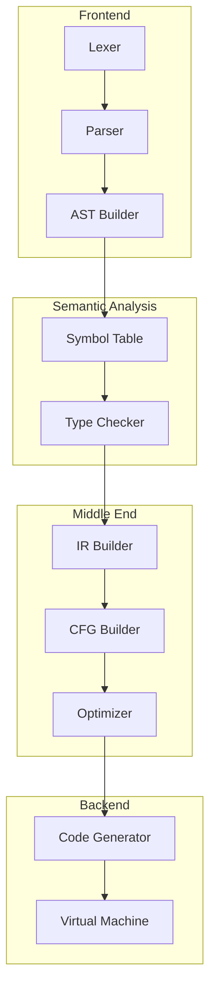
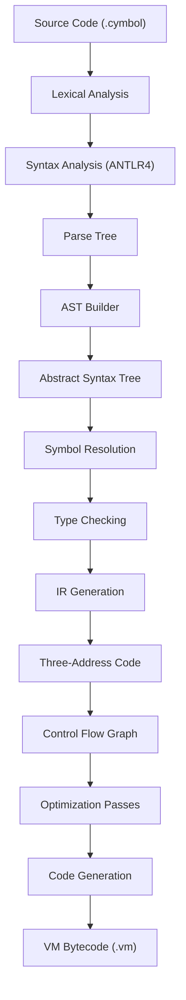

# Project Overview

<cite>
**Referenced Files in This Document**   
- [README.md](file://README.md)
- [README_EN.md](file://README_EN.md)
- [ep19/README.md](file://ep19/README.md)
- [ep20/README.md](file://ep20/README.md)
- [ep18/VM_Design.md](file://ep18/VM_Design.md)
- [ep20/docs/project-architecture.md](file://ep20/docs/project-architecture.md)
- [ep20/docs/compilation-sequence.md](file://ep20/docs/compilation-sequence.md)
- [ep20/src/main/java/org/teachfx/antlr4/ep20/Compiler.java](file://ep20/src/main/java/org/teachfx/antlr4/ep20/Compiler.java)
- [ep18/src/main/java/org/teachfx/antlr4/ep18/VMInterpreter.java](file://ep18/src/main/java/org/teachfx/antlr4/ep18/VMInterpreter.java)
</cite>

## Table of Contents
1. [Introduction](#introduction)
2. [Educational Framework and Learning Path](#educational-framework-and-learning-path)
3. [Cymbol Language Specification](#cymbol-language-specification)
4. [Compilation Pipeline Stages](#compilation-pipeline-stages)
5. [Core Architectural Principles](#core-architectural-principles)
6. [Data Structures and Key Concepts](#data-structures-and-key-concepts)
7. [High-Level Architecture](#high-level-architecture)
8. [Compilation Data Flow](#compilation-data-flow)
9. [Target Audience and Educational Goals](#target-audience-and-educational-goals)

## Introduction

The How_to_implment_PL_in_Antlr4 repository is an educational compiler framework designed to teach compiler construction principles using ANTLR4 and Java. This comprehensive project provides a progressive learning path through 21 distinct episodes (ep1-ep21), each representing a specific stage in the development of a complete compiler for the Cymbol programming language. The framework systematically evolves from basic lexical analysis to advanced code generation and optimization techniques, offering students and developers a hands-on approach to understanding compiler design.

The repository demonstrates best practices in compiler construction, featuring a modular architecture with clear separation of concerns across compilation phases. It implements core compiler components including Abstract Syntax Tree (AST) generation, symbol table management, type checking, Intermediate Representation (IR) generation, Control Flow Graph (CFG) construction, optimization passes, and code generation for a stack-based virtual machine. The educational approach emphasizes test-driven development with comprehensive test coverage and detailed documentation for each implementation stage.

**Section sources**
- [README.md](file://README.md#L1-L250)
- [README_EN.md](file://README_EN.md#L1-L147)

## Educational Framework and Learning Path

The How_to_implment_PL_in_Antlr4 repository follows a progressive learning structure through 21 episodes, each building upon the previous one to incrementally develop compiler capabilities. The learning path begins with fundamental concepts and gradually advances to sophisticated compiler techniques, providing a structured approach to mastering compiler construction.

The initial episodes (ep1-ep10) focus on foundational compiler components, starting with lexical analysis and progressing through syntax analysis, AST construction, and basic interpretation. These early stages introduce essential concepts such as tokenization, parse trees, visitor patterns, and simple language features. Episode 11 marks the transition to more advanced topics with the implementation of an arithmetic interpreter based on AST traversal, followed by the addition of assignment statements and variable declarations in episode 12.

Episodes 14-17 introduce critical compiler infrastructure, including symbol table recording, variable scope determination, and function resolution with type checking. This phase establishes the semantic analysis foundation necessary for robust language processing. Episode 18 implements a stack-based virtual machine, providing the target platform for subsequent code generation efforts.

The later episodes (ep19-ep21) focus on advanced compilation techniques, including intermediate representation generation, control flow graph construction, optimization passes, and final code generation. Episode 20 represents a comprehensive compiler implementation that transforms Cymbol source code into executable bytecode, while episode 21 extends these capabilities with Three-Address Code (TAC) generation, Static Single Assignment (SSA) form, and sophisticated CFG analysis.

This progressive structure enables learners to grasp complex compiler concepts incrementally, with each episode providing a working implementation that can be studied, modified, and extended. The framework emphasizes practical implementation over theoretical abstraction, allowing students to see the immediate results of their work while building a deep understanding of compiler internals.

**Section sources**
- [README_EN.md](file://README_EN.md#L1-L147)
- [README.md](file://README.md#L1-L250)

## Cymbol Language Specification

The Cymbol language, implemented throughout the How_to_implment_PL_in_Antlr4 repository, is a C-like programming language designed for educational purposes with features that demonstrate key compiler construction concepts. The language supports a comprehensive set of data types, operators, and control structures that enable the implementation of non-trivial programs while remaining accessible to learners.

Cymbol features primitive data types including `int`, `float`, `bool`, `string`, and `void`, providing a foundation for type system implementation. The language supports array types with single-dimensional arrays and initialization syntax, allowing for the demonstration of memory layout and access patterns. Struct types enable the creation of custom data structures with field access via dot notation, illustrating record management and memory organization.

The language includes a rich set of operators for arithmetic operations (`+`, `-`, `*`, `/`, `%`), comparison (`==`, `!=`, `<`, `>`, `<=`, `>=`), logical operations (`&&`, `!`), and assignment (`=`). Array access is supported through bracket notation (`array[index]`), while field access uses dot notation (`struct.field`). Type casting is implemented with C-style syntax `(type)value`, demonstrating type conversion mechanisms.

Control flow constructs include `if-else` conditional statements, `while` loops with support for `break` and `continue` statements, and function definitions with parameters and return values. Functions can be defined with various return types and parameter lists, enabling the implementation of recursive algorithms and modular programming patterns. The `main` function serves as the program entry point, following conventional programming language design.

Cymbol also supports advanced features such as `typedef` for creating type aliases, enhancing type system flexibility and demonstrating symbol management techniques. The language design balances simplicity with sufficient complexity to illustrate important compiler concepts, making it an ideal vehicle for teaching compiler construction principles.

**Section sources**
- [ep20/README.md](file://ep20/README.md#L1-L294)
- [ep19/README.md](file://ep19/README.md#L1-L340)

## Compilation Pipeline Stages

The How_to_implment_PL_in_Antlr4 repository implements a comprehensive compilation pipeline that transforms Cymbol source code through multiple stages of processing, each with specific responsibilities and outputs. This multi-phase approach follows established compiler design principles, providing a clear separation of concerns and enabling modular implementation and testing.

The compilation process begins with **Lexical Analysis**, where the source code character stream is converted into a sequence of tokens using ANTLR4-generated lexer. This phase identifies keywords, identifiers, literals, and operators, forming the basic building blocks for subsequent processing. The token stream is then processed by the **Syntax Analysis** phase, which uses an ANTLR4-generated parser to construct a parse tree according to the Cymbol grammar rules.

The **AST Construction** phase transforms the parse tree into an Abstract Syntax Tree (AST), a hierarchical representation of the program structure that eliminates syntactic details and focuses on semantic content. This tree structure enables efficient traversal and manipulation during later compilation stages. Following AST construction, the **Symbol Resolution** phase establishes symbol tables and resolves identifier references, managing variable and function declarations across nested scopes.

**Type Checking** validates the program's type correctness, ensuring type compatibility in expressions and assignments while detecting type errors. This semantic analysis phase enforces the language's type system rules and prepares the program for code generation. The **IR Generation** phase converts the typed AST into Intermediate Representation (IR), specifically Three-Address Code, which simplifies complex expressions into sequences of basic operations.

**Control Flow Graph (CFG) Construction** organizes the IR into basic blocks connected by control flow edges, representing the program's execution paths. This graph structure enables sophisticated analysis and optimization. The **Optimization** phase applies transformations such as jump optimization, empty label elimination, and redundant jump removal to improve code efficiency.

Finally, the **Code Generation** phase translates the optimized IR into bytecode for the EP18 stack-based virtual machine, producing executable instructions that can be interpreted by the VM runtime. Each stage in this pipeline builds upon the previous one, creating a robust foundation for compiler implementation while demonstrating best practices in software engineering.

**Section sources**
- [ep20/README.md](file://ep20/README.md#L1-L294)
- [ep20/docs/project-architecture.md](file://ep20/docs/project-architecture.md#L1-L624)
- [ep20/docs/compilation-sequence.md](file://ep20/docs/compilation-sequence.md#L1-L303)

## Core Architectural Principles

The How_to_implment_PL_in_Antlr4 repository embodies several key architectural principles that reflect best practices in compiler construction and software engineering. These principles ensure the framework's educational value, maintainability, and extensibility while providing a realistic model of professional compiler development.

The framework follows a **modular design** with clear separation of compilation phases, each implemented as distinct components with well-defined interfaces. This separation of concerns allows learners to study individual aspects of compiler construction in isolation while understanding their integration into the complete system. The use of Maven multi-module structure reinforces this modularity, with each episode representing an independent module containing its source code, tests, and configuration.

**Test-driven development (TDD)** is a fundamental principle throughout the project, with comprehensive test suites for each implementation stage. The framework maintains high test coverage (92%+ overall, 95%+ for core modules) with unit tests, integration tests, and end-to-end tests that validate functionality at multiple levels. This emphasis on testing teaches learners the importance of verification and quality assurance in software development.

The architecture employs established **design patterns** to solve common compiler construction problems. The Visitor pattern enables efficient traversal and manipulation of AST and IR nodes, while the Factory pattern facilitates node creation in the IR builder. The Strategy pattern supports different code generation approaches through the operator emitter interface, and the Singleton pattern ensures global access to shared resources like type tables and symbol tables.

**Error handling and reporting** are implemented with robust mechanisms that provide detailed diagnostic information, including source location tracking and phase-specific error categorization. This comprehensive error management teaches learners how to create user-friendly compiler tools that assist developers in identifying and correcting code issues.

The framework also emphasizes **debugging and visualization** capabilities, providing tools for AST, IR, and CFG visualization in Mermaid format. These debugging aids help learners understand the internal representations generated during compilation and diagnose issues in their implementations.

**Section sources**
- [ep20/docs/project-architecture.md](file://ep20/docs/project-architecture.md#L1-L624)
- [README.md](file://README.md#L1-L250)
- [ep19/README.md](file://ep19/README.md#L1-L340)

## Data Structures and Key Concepts

The How_to_implment_PL_in_Antlr4 repository implements several fundamental data structures and concepts that are essential to compiler construction, providing learners with concrete examples of how these abstractions are realized in practice. These structures form the backbone of the compilation process and demonstrate key principles in programming language implementation.

The **Abstract Syntax Tree (AST)** is implemented as a hierarchical structure of nodes representing program constructs, with base classes for expressions, statements, and declarations. Each node type corresponds to a specific language construct, such as binary operations, function calls, or variable declarations. The AST employs the Visitor pattern for traversal, enabling operations like symbol resolution, type checking, and code generation to be implemented as visitor classes that process nodes according to their type.

The **Symbol Table** system manages identifier information across nested scopes, using a hierarchical structure of scope objects that support variable and function resolution. The implementation includes global and local scopes, with proper handling of variable shadowing and scope chaining. Symbol objects store information such as name, type, and storage location, while the symbol table provides methods for defining new symbols and resolving references.

**Intermediate Representation (IR)** is implemented as Three-Address Code, with nodes representing basic operations like arithmetic, assignments, and control flow. The IR structure includes expressions with temporary variables and statements that form basic blocks in the control flow graph. This representation simplifies complex expressions into sequences of elementary operations, facilitating optimization and code generation.

The **Control Flow Graph (CFG)** represents program execution paths as a directed graph of basic blocks connected by control flow edges. Each basic block contains a sequence of IR statements, with edges representing possible execution transitions. The CFG enables sophisticated analysis techniques like liveness analysis and optimization passes that improve code efficiency.

Other key data structures include the **Type System** with type compatibility checking, the **Operand Stack** for virtual machine execution, and **Stack Frames** for function call management. These structures work together to implement the complete compilation and execution process, providing learners with a comprehensive understanding of how programming languages are processed and executed.

**Section sources**
- [ep20/docs/project-architecture.md](file://ep20/docs/project-architecture.md#L1-L624)
- [ep20/README.md](file://ep20/README.md#L1-L294)
- [ep18/VM_Design.md](file://ep18/VM_Design.md#L1-L130)

## High-Level Architecture

The How_to_implment_PL_in_Antlr4 repository features a well-structured high-level architecture that organizes compiler components into logical modules, each responsible for specific aspects of the compilation process. This architecture follows established compiler design principles while providing a clear and educational implementation that demonstrates best practices in software engineering.

**Diagram sources**
- [ep20/docs/project-architecture.md](file://ep20/docs/project-architecture.md#L1-L624)
- [ep20/docs/compilation-sequence.md](file://ep20/docs/compilation-sequence.md#L1-L303)

The architecture is organized into distinct phases that correspond to traditional compiler components. The **Frontend** handles language-specific processing, including lexical analysis, syntax analysis, and AST construction. The **Semantic Analysis** phase manages symbol resolution and type checking, establishing the program's meaning and constraints.

The **Middle End** performs language-independent optimizations on the intermediate representation, including control flow analysis and various optimization passes. This phase transforms the program into a more efficient form while preserving its semantics. The **Backend** generates target-specific code for the stack-based virtual machine, handling instruction selection and emission.

Each component communicates through well-defined interfaces and data structures, with the AST serving as the primary representation after parsing, the IR as the intermediate form for optimization, and the CFG as the basis for control flow analysis. This layered architecture enables modular development and testing while providing a realistic model of professional compiler design.

**Section sources**
- [ep20/docs/project-architecture.md](file://ep20/docs/project-architecture.md#L1-L624)
- [ep20/README.md](file://ep20/README.md#L1-L294)

## Compilation Data Flow

The compilation process in the How_to_implment_PL_in_Antlr4 repository follows a well-defined data flow that transforms source code through multiple representations, each serving specific purposes in the compilation pipeline. This flow demonstrates the progressive refinement of program representation from concrete syntax to executable instructions.

**Diagram sources**
- [ep20/README.md](file://ep20/README.md#L1-L294)
- [ep20/docs/compilation-sequence.md](file://ep20/docs/compilation-sequence.md#L1-L303)

The data flow begins with source code as a character stream, which is transformed into tokens by the lexer. The parser then constructs a parse tree that represents the syntactic structure according to the grammar rules. This parse tree is converted into an Abstract Syntax Tree (AST) that captures the essential program structure while eliminating syntactic noise.

The AST is processed by the symbol resolution phase, which annotates nodes with symbol information and establishes scope relationships. Type checking then validates the program's type correctness, adding type information to AST nodes. The IR generator converts the typed AST into Three-Address Code, a low-level representation that simplifies complex expressions into sequences of basic operations.

The IR is organized into basic blocks and connected by control flow edges to form a Control Flow Graph (CFG), which represents all possible execution paths. Optimization passes analyze and transform the CFG to improve code efficiency, eliminating redundant operations and optimizing control flow. Finally, the code generator translates the optimized IR into bytecode instructions for the stack-based virtual machine, producing an executable format that can be interpreted by the VM runtime.

This data flow demonstrates the principle of progressive lowering, where high-level language constructs are systematically transformed into lower-level representations suitable for execution, while maintaining the program's original semantics.

**Section sources**
- [ep20/README.md](file://ep20/README.md#L1-L294)
- [ep20/docs/compilation-sequence.md](file://ep20/docs/compilation-sequence.md#L1-L303)
- [ep20/src/main/java/org/teachfx/antlr4/ep20/Compiler.java](file://ep20/src/main/java/org/teachfx/antlr4/ep20/Compiler.java#L1-L162)

## Target Audience and Educational Goals

The How_to_implment_PL_in_Antlr4 repository is designed for students and developers who are learning compiler design and implementation, providing a comprehensive educational framework that bridges theoretical concepts with practical implementation. The target audience includes computer science students studying programming language theory, software engineers interested in language implementation, and developers seeking to understand the inner workings of compilers and interpreters.

The primary educational goals of the repository are to demystify compiler construction by providing a complete, working example that can be studied and modified. The progressive episode structure allows learners to build understanding incrementally, starting with basic concepts like lexical analysis and gradually advancing to sophisticated techniques like optimization and code generation. This approach enables students to grasp complex topics through hands-on experience rather than abstract theory alone.

The framework emphasizes practical skills in software engineering, including modular design, test-driven development, and debugging techniques. By implementing a complete compiler with comprehensive test coverage and detailed documentation, learners gain experience in professional software development practices while mastering compiler-specific concepts.

The repository also teaches important computer science principles such as formal language theory, automata, and program analysis. Through the implementation of ASTs, symbol tables, type systems, and control flow graphs, students gain deep understanding of data structures and algorithms used in language processing. The integration with a virtual machine demonstrates the relationship between high-level language constructs and low-level execution models.

By providing a realistic model of compiler development with modern tools and practices, the How_to_implment_PL_in_Antlr4 repository prepares learners for both academic study and professional software development in the field of programming languages and compiler construction.

**Section sources**
- [README_EN.md](file://README_EN.md#L1-L147)
- [README.md](file://README.md#L1-L250)
- [ep19/README.md](file://ep19/README.md#L1-L340)