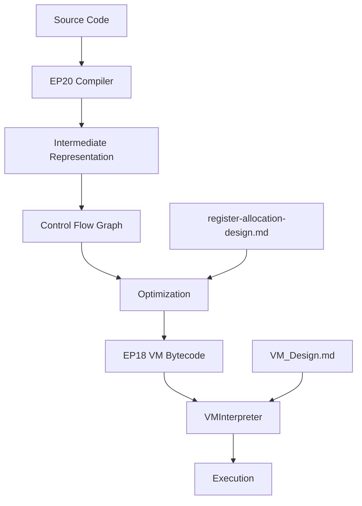

# References and Further Reading

<cite>
**Referenced Files in This Document**   
- [VM_Design.md](file://ep18/VM_Design.md)
- [register-allocation-design.md](file://ep20/docs/design/register-allocation-design.md)
- [project-architecture.md](file://ep20/docs/project-architecture.md)
- [register-allocation-algorithm-details.md](file://ep20/docs/design/register-allocation-algorithm-details.md)
- [README.md](file://ep19/README.md)
- [Design.md](file://ep19/Design.md)
- [README.md](file://ep20/README.md)
</cite>

## Table of Contents
1. [Introduction](#introduction)
2. [Core Textbooks on Compiler Construction](#core-textbooks-on-compiler-construction)
3. [Research Papers on Key Compiler Topics](#research-papers-on-key-compiler-topics)
4. [Open-Source Compiler Projects for Study](#open-source-compiler-projects-for-study)
5. [ANTLR4 Documentation and Tutorials](#antlr4-documentation-and-tutorials)
6. [Virtual Machine Design and Implementation](#virtual-machine-design-and-implementation)
7. [Online Courses and Educational Resources](#online-courses-and-educational-resources)
8. [Conclusion](#conclusion)

## Introduction
This document provides a comprehensive reference guide for individuals seeking to deepen their understanding of compiler design and implementation. It curates essential textbooks, research papers, open-source projects, and educational resources related to compiler construction, with a particular focus on tools and techniques demonstrated in the provided codebase. The resources are organized by topic and difficulty level to guide learners based on their expertise, covering fundamental principles, advanced optimization techniques, virtual machine design, and practical implementation using ANTLR4.

## Core Textbooks on Compiler Construction
The foundational knowledge of compiler design is best acquired through established textbooks that provide a thorough theoretical and practical foundation. The most authoritative and widely recognized text in the field is "Compilers: Principles, Techniques, and Tools" by Alfred V. Aho, Monica S. Lam, Ravi Sethi, and Jeffrey D. Ullman, commonly known as the "Dragon Book." This comprehensive work covers the entire compilation process, from lexical analysis and parsing to semantic analysis, optimization, and code generation. It is suitable for advanced undergraduate and graduate students and serves as an indispensable reference for professionals. For a more accessible introduction, "Engineering a Compiler" by Keith D. Cooper and Linda Torczon offers a modern perspective with a focus on practical implementation and recent advancements in optimization. Another excellent resource is "Modern Compiler Implementation in Java" by Andrew W. Appel, which provides a hands-on approach with complete code examples, making it ideal for readers who learn by doing. These textbooks collectively provide the theoretical underpinnings necessary to understand the multi-phase compilation pipeline, including the construction of abstract syntax trees (AST), symbol table management, type checking, and intermediate representation (IR) generation, all of which are core components of the Cymbol compiler project in the provided codebase.

**Section sources**
- [project-architecture.md](file://ep20/docs/project-architecture.md#41-整体流程图)

## Research Papers on Key Compiler Topics
Advanced compiler techniques are often detailed in seminal research papers. For register allocation, the paper "Register Allocation via Coloring" by Gregory J. Chaitin et al. (1981) introduced the graph-coloring approach, which remains a cornerstone of modern compilers. This technique is directly relevant to the EP20 project's design for a register allocation optimizer, which aims to map virtual registers to physical ones to minimize memory access. The algorithm involves building a conflict graph based on variable liveness and then applying a coloring strategy, as detailed in the project's design documentation. For optimization algorithms, "Global Common Subexpression Elimination" by Alfred V. Aho and Jeffrey D. Ullman provides a foundational understanding of data-flow analysis, a technique used for various optimizations like dead code elimination and constant propagation. The EP20 project implements a control flow graph (CFG) and performs liveness analysis, which are prerequisites for such optimizations. Regarding parsing techniques, "Top-Down Parsing in Less Than 100 Lines of Code" by Peter Pepper offers a clear explanation of recursive descent parsing, a method that ANTLR4 uses under the hood to generate parsers from grammar files. Understanding these papers provides deep insight into the algorithms that power the various stages of the compilation process, from the initial syntax analysis to the final code generation.

**Section sources**
- [register-allocation-design.md](file://ep20/docs/design/register-allocation-design.md#41-整体架构图)
- [register-allocation-algorithm-details.md](file://ep20/docs/design/register-allocation-algorithm-details.md#31-标准图着色流程)

## Open-Source Compiler Projects for Study
Studying open-source compiler projects is an invaluable way to learn practical implementation details. The provided codebase itself, a series of tutorials on implementing a programming language with ANTLR4, serves as an excellent educational resource. The progression from EP19 to EP20 demonstrates the evolution from a simple interpreter to a sophisticated compiler with a multi-phase pipeline. EP19 implements a complete interpreter for the Cymbol language, featuring a symbol table, type system, and runtime memory management, as documented in its README and design files. EP20 significantly advances this by introducing an intermediate representation (IR), a control flow graph (CFG), and a code generator for a stack-based virtual machine. This project is a practical example of a real-world compiler architecture, showcasing the use of design patterns like the visitor pattern for AST traversal and the implementation of complex features such as three-address code generation and CFG-based optimization. Other notable open-source projects for study include the LLVM Compiler Infrastructure, which provides a modular and reusable set of compiler and toolchain technologies, and the GCC (GNU Compiler Collection), one of the most widely used compilers with a vast codebase to explore. These projects allow learners to see how theoretical concepts from textbooks are applied to build robust, production-grade software.

**Section sources**
- [README.md](file://ep19/README.md#编译器架构)
- [Design.md](file://ep19/Design.md#编译流程)
- [README.md](file://ep20/README.md#Compilation-Pipeline)
- [project-architecture.md](file://ep20/docs/project-architecture.md#31-AST模块-Abstract-Syntax-Tree)

## ANTLR4 Documentation and Tutorials
ANTLR4 (ANother Tool for Language Recognition) is a powerful parser generator that is central to the projects in the provided codebase. The official ANTLR4 documentation and website (https://www.antlr.org/) are the primary resources for learning the tool. The documentation includes a comprehensive guide to the ANTLR4 grammar syntax, the runtime APIs for various target languages (Java, Python, C#, etc.), and detailed explanations of its algorithms. The book "The Definitive ANTLR 4 Reference" by Terence Parr, the creator of ANTLR, is the authoritative guide and is essential for mastering the tool. It covers everything from writing grammar files to generating and using parsers and listeners. The provided codebase, particularly the `Cymbol.g4` grammar file used in EP19 and EP20, serves as a practical tutorial. By examining how the grammar defines the syntax of the Cymbol language and how the generated parser is used in conjunction with visitor classes to build an AST and perform semantic analysis, learners can gain hands-on experience. The project structure, with its clear separation of phases like `LocalDefine`, `LocalResolver`, and `TypeCheckVisitor`, demonstrates a best-practice approach to building a language processor with ANTLR4.

**Section sources**
- [README.md](file://ep19/README.md#语言特性)
- [README.md](file://ep20/README.md#Language-Features)

## Virtual Machine Design and Implementation
The final stage of the compilation process often involves generating code for a virtual machine (VM). The EP18 project in the codebase provides a detailed example of a stack-based virtual machine design. The `VM_Design.md` document outlines the VM's instruction set, which includes arithmetic operations (iconst, iadd, imul), control flow (call, ret, halt), and memory access (load). The execution engine is based on a classic fetch-decode-execute cycle, managing an operand stack, program counter, and stack frames for function calls. The core classes, such as `VMInterpreter` for execution and `ByteCodeAssembler` for converting human-readable assembly to bytecode, illustrate the key components of a VM. The design emphasizes runtime checks for safety, including stack overflow/underflow and division by zero. This project provides a concrete model for understanding how high-level language constructs are translated into low-level instructions and executed. For further study, the Java Virtual Machine (JVM) Specification is a definitive resource for a production VM, detailing its class file format, instruction set, and memory model. Understanding VM design is crucial for anyone interested in the back-end of a compiler.

**Diagram sources**
- [VM_Design.md](file://ep18/VM_Design.md#1-字节码定义和指令集)
- [register-allocation-design.md](file://ep20/docs/design/register-allocation-design.md#41-整体架构图)

**Section sources**
- [VM_Design.md](file://ep18/VM_Design.md#2-虚拟机执行引擎)
- [README.md](file://ep20/README.md#Integration-with-EP18-VM)

## Online Courses and Educational Resources
A wealth of online courses can accelerate the learning of compiler development. University-level courses such as Stanford's CS143 (Compilers) and MIT's 6.035 (Computer Language Engineering) offer free lecture videos and materials online, providing a rigorous academic foundation. Platforms like Coursera and edX host specialized courses on programming language theory and implementation. For a more project-based approach, the "Crafting Interpreters" book by Robert Nystrom (https://craftinginterpreters.com/) is an exceptional resource that guides the reader through building both a tree-walking interpreter and a bytecode virtual machine in two different languages. This hands-on method is highly effective and mirrors the incremental learning approach of the provided ANTLR4 tutorial series. The official ANTLR4 website also hosts numerous examples and tutorials. The combination of theoretical courses and practical, step-by-step projects like the ones in this repository provides a well-rounded education in compiler design.

## Conclusion
This curated list of resources provides a structured path for deepening one's understanding of compiler design. Starting with foundational textbooks like the "Dragon Book" provides the necessary theoretical background. Studying research papers on topics like register allocation and optimization reveals the cutting-edge algorithms used in modern compilers. Examining open-source projects, including the detailed progression from EP19 to EP20 in this codebase, offers invaluable practical insights into real-world implementation. Mastering tools like ANTLR4 through its official documentation and practical tutorials is essential for building language processors. Finally, understanding virtual machine design, as exemplified by the EP18 project, completes the picture of the compilation and execution process. By leveraging these resources, learners can systematically build their expertise from basic principles to advanced techniques in compiler construction.