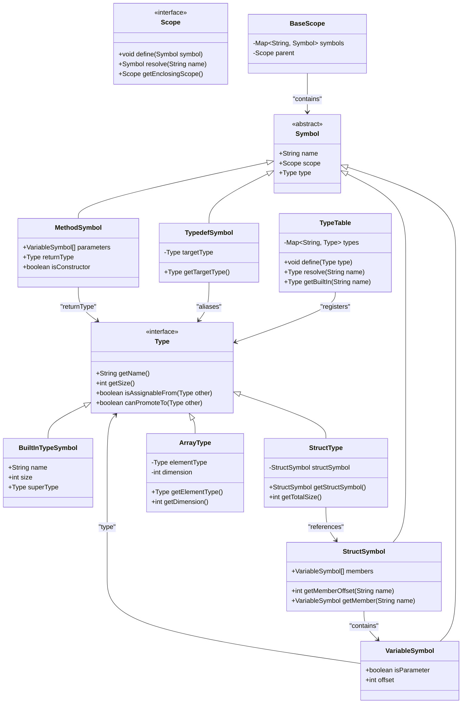
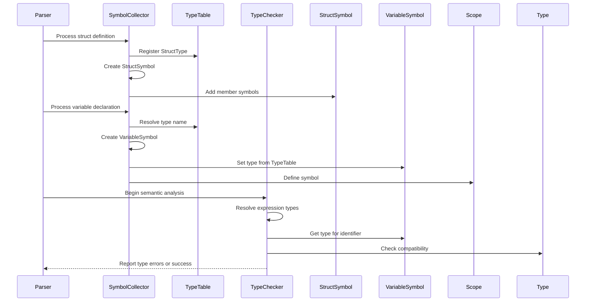

# Integration with Type System

<cite>
**Referenced Files in This Document**   
- [Type.java](file://ep19/src/main/java/org/teachfx/antlr4/ep19/symtab/Type.java)
- [TypeTable.java](file://ep19/src/main/java/org/teachfx/antlr4/ep19/symtab/TypeTable.java)
- [BuiltInTypeSymbol.java](file://ep19/src/main/java/org/teachfx/antlr4/ep19/symtab/symbol/BuiltInTypeSymbol.java)
- [StructType.java](file://ep19/src/main/java/org/teachfx/antlr4/ep19/symtab/type/StructType.java)
- [ArrayType.java](file://ep19/src/main/java/org/teachfx/antlr4/ep19/symtab/type/ArrayType.java)
- [VariableSymbol.java](file://ep19/src/main/java/org/teachfx/antlr4/ep19/symtab/symbol/VariableSymbol.java)
- [TypedefSymbol.java](file://ep19/src/main/java/org/teachfx/antlr4/ep19/symtab/symbol/TypedefSymbol.java)
- [StructSymbol.java](file://ep19/src/main/java/org/teachfx/antlr4/ep19/symtab/symbol/StructSymbol.java)
- [MethodSymbol.java](file://ep19/src/main/java/org/teachfx/antlr4/ep19/symtab/symbol/MethodSymbol.java)
- [TypeChecker.java](file://ep19/src/main/java/org/teachfx/antlr4/ep19/pass/TypeCheckVisitor.java)
- [Scope.java](file://ep19/src/main/java/org/teachfx/antlr4/ep19/symtab/scope/Scope.java)
- [BaseScope.java](file://ep19/src/main/java/org/teachfx/antlr4/ep19/symtab/scope/BaseScope.java)
</cite>

## Table of Contents
1. [Introduction](#introduction)
2. [Core Type System Components](#core-type-system-components)
3. [Symbol Table and Type Registration](#symbol-table-and-type-registration)
4. [Primitive and Built-in Types](#primitive-and-built-in-types)
5. [Composite Types: Structs and Arrays](#composite-types-structs-and-arrays)
6. [Symbol-Type Binding and Type Resolution](#symbol-type-binding-and-type-resolution)
7. [Type Checking and Semantic Analysis](#type-checking-and-semantic-analysis)
8. [Typedef and Type Aliasing](#typedef-and-type-aliasing)
9. [Struct Member Binding](#struct-member-binding)
10. [Diagrams: Symbol, Scope, and Type Relationships](#diagrams-symbol-scope-and-type-relationships)
11. [Conclusion](#conclusion)

## Introduction
This document details the integration between the symbol table infrastructure and the type system in the compiler implementation. It explains how types are represented, registered, and resolved during semantic analysis. The design centers around `Type.java` as the foundational type representation, `TypeTable.java` as the global registry, and symbol objects that bind identifiers to their respective types. The system supports primitive types, composite types (structs and arrays), typedefs, and function return types, enabling robust type checking and resolution.

## Core Type System Components

The type system is built around several key classes that define and manage type information throughout the compilation process.

**Section sources**
- [Type.java](file://ep19/src/main/java/org/teachfx/antlr4/ep19/symtab/Type.java#L1-L50)
- [TypeTable.java](file://ep19/src/main/java/org/teachfx/antlr4/ep19/symtab/TypeTable.java#L1-L40)

## Symbol Table and Type Registration

The `TypeTable` class serves as a central registry for all known types in the program. It ensures that each type is uniquely represented and can be efficiently retrieved during type resolution. The table is initialized with built-in primitive types and expanded as user-defined types (such as structs and typedefs) are encountered during symbol collection.

Types are registered when the `SymbolCollector` processes declarations, ensuring that all type definitions are available before type checking begins. The `TypeTable` provides methods to define new types, retrieve existing ones by name, and resolve type aliases.

**Section sources**
- [TypeTable.java](file://ep19/src/main/java/org/teachfx/antlr4/ep19/symtab/TypeTable.java#L41-L100)

## Primitive and Built-in Types

Primitive types such as `int`, `float`, `bool`, and `void` are represented by instances of `BuiltInTypeSymbol`. These symbols are pre-defined in the global scope and registered in the `TypeTable` during compiler initialization. Each built-in type has a corresponding `Type` object that encapsulates its properties, such as size and alignment.

The `BuiltInTypeSymbol` class extends `ScopedSymbol` and implements the `Type` interface, allowing it to function both as a symbol in the symbol table and as a type descriptor during expression evaluation.

**Section sources**
- [BuiltInTypeSymbol.java](file://ep19/src/main/java/org/teachfx/antlr4/ep19/symtab/symbol/BuiltInTypeSymbol.java#L1-L60)

## Composite Types: Structs and Arrays

Composite types are supported through `StructType` and `ArrayType` classes, both of which implement the `Type` interface.

- `StructType` represents user-defined structures. It contains a reference to a `StructSymbol` which holds the member variables and their types. The struct's layout and size are computed based on its members.
- `ArrayType` represents array types with a specified element type and dimension. It supports multi-dimensional arrays by nesting `ArrayType` instances.

These types are created dynamically as struct and array declarations are parsed, and they are registered in the `TypeTable` under their canonical names.

**Section sources**
- [StructType.java](file://ep19/src/main/java/org/teachfx/antlr4/ep19/symtab/type/StructType.java#L1-L50)
- [ArrayType.java](file://ep19/src/main/java/org/teachfx/antlr4/ep19/symtab/type/ArrayType.java#L1-L50)

## Symbol-Type Binding and Type Resolution

Symbols such as `VariableSymbol`, `MethodSymbol`, and `TypedefSymbol` maintain a reference to their associated `Type` object. During symbol definition, the type is resolved using the `TypeTable` and bound to the symbol.

For example, when processing a variable declaration like `int x;`, the type name `"int"` is looked up in the `TypeTable`, and the resulting `Type` object is assigned to the `VariableSymbol`. Similarly, function return types are resolved and stored in the `MethodSymbol`.

Type resolution also occurs during expression evaluation, where the result type of an operation is determined based on the operand types, leveraging the type system's rules for promotion and compatibility.

**Section sources**
- [VariableSymbol.java](file://ep19/src/main/java/org/teachfx/antlr4/ep19/symtab/symbol/VariableSymbol.java#L1-L40)
- [MethodSymbol.java](file://ep19/src/main/java/org/teachfx/antlr4/ep19/symtab/symbol/MethodSymbol.java#L1-L50)

## Type Checking and Semantic Analysis

Type checking is performed during semantic analysis using the `TypeChecker` visitor. It traverses the AST and validates that all expressions and assignments are type-consistent.

The checker uses the type information stored in symbols to:
- Verify assignment compatibility
- Ensure function arguments match parameter types
- Validate return type correctness
- Check array indexing and member access

When a type mismatch is detected, the checker issues a semantic error. The process relies on the `Type` interface's methods such as `isAssignableFrom()` and `canPromoteTo()` to determine type compatibility.

**Section sources**
- [TypeChecker.java](file://ep19/src/main/java/org/teachfx/antlr4/ep19/pass/TypeCheckVisitor.java#L1-L120)

## Typedef and Type Aliasing

Typedefs are supported through the `TypedefSymbol` class, which binds an alias name to an existing type. When a typedef declaration like `typedef int MyInt;` is processed, a `TypedefSymbol` is created and registered in the current scope.

During type resolution, if a type name matches a typedef, the resolver follows the chain of aliases until it reaches a concrete type (primitive or struct). This resolution is handled transparently by the `TypeTable`, ensuring that aliased types are treated identically to their underlying types during type checking.

**Section sources**
- [TypedefSymbol.java](file://ep19/src/main/java/org/teachfx/antlr4/ep19/symtab/symbol/TypedefSymbol.java#L1-L45)

## Struct Member Binding

Struct members are bound to their respective `StructSymbol` during struct definition. Each member is represented as a `VariableSymbol` added to the struct's scope. The `StructSymbol` maintains a list of its members and computes the memory layout (offsets and size) based on the member types.

Member access expressions (e.g., `s.x`) are resolved by looking up the field name in the struct's scope. The resulting `VariableSymbol` provides the member's type, offset, and other attributes needed for code generation.

**Section sources**
- [StructSymbol.java](file://ep19/src/main/java/org/teachfx/antlr4/ep19/symtab/symbol/StructSymbol.java#L1-L70)

## Diagrams: Symbol, Scope, and Type Relationships

**Diagram sources**
- [Type.java](file://ep19/src/main/java/org/teachfx/antlr4/ep19/symtab/Type.java#L1-L50)
- [TypeTable.java](file://ep19/src/main/java/org/teachfx/antlr4/ep19/symtab/TypeTable.java#L1-L40)
- [BuiltInTypeSymbol.java](file://ep19/src/main/java/org/teachfx/antlr4/ep19/symtab/symbol/BuiltInTypeSymbol.java#L1-L60)
- [StructType.java](file://ep19/src/main/java/org/teachfx/antlr4/ep19/symtab/type/StructType.java#L1-L50)
- [ArrayType.java](file://ep19/src/main/java/org/teachfx/antlr4/ep19/symtab/type/ArrayType.java#L1-L50)
- [VariableSymbol.java](file://ep19/src/main/java/org/teachfx/antlr4/ep19/symtab/symbol/VariableSymbol.java#L1-L40)
- [MethodSymbol.java](file://ep19/src/main/java/org/teachfx/antlr4/ep19/symtab/symbol/MethodSymbol.java#L1-L50)
- [TypedefSymbol.java](file://ep19/src/main/java/org/teachfx/antlr4/ep19/symtab/symbol/TypedefSymbol.java#L1-L45)
- [StructSymbol.java](file://ep19/src/main/java/org/teachfx/antlr4/ep19/symtab/symbol/StructSymbol.java#L1-L70)
- [BaseScope.java](file://ep19/src/main/java/org/teachfx/antlr4/ep19/symtab/scope/BaseScope.java#L1-L30)

**Diagram sources**
- [SymbolCollector.java](file://ep19/src/main/java/org/teachfx/antlr4/ep19/pass/LocalDefine.java#L1-L100)
- [TypeTable.java](file://ep19/src/main/java/org/teachfx/antlr4/ep19/symtab/TypeTable.java#L1-L100)
- [TypeChecker.java](file://ep19/src/main/java/org/teachfx/antlr4/ep19/pass/TypeCheckVisitor.java#L1-L120)
- [VariableSymbol.java](file://ep19/src/main/java/org/teachfx/antlr4/ep19/symtab/symbol/VariableSymbol.java#L1-L40)

## Conclusion
The integration between the symbol table and type system forms the foundation of semantic analysis in the compiler. By centralizing type information in `TypeTable` and binding types to symbols during declaration, the system enables accurate type resolution and checking. The design supports both primitive and composite types, typedef aliases, and structured data through structs and arrays. This robust type infrastructure ensures type safety and enables advanced features such as member access, function signature validation, and array operations.