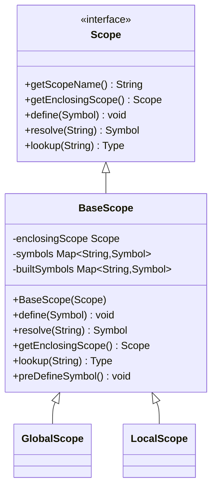
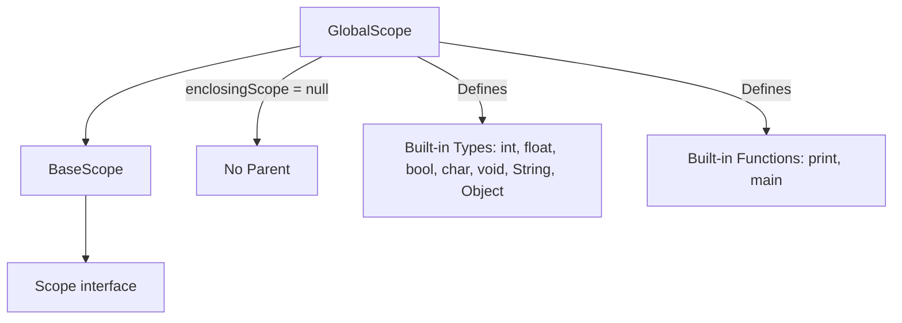
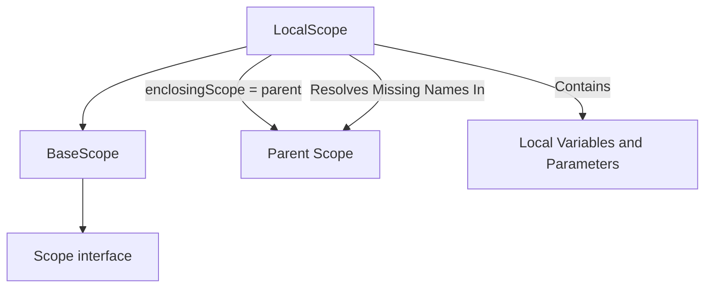
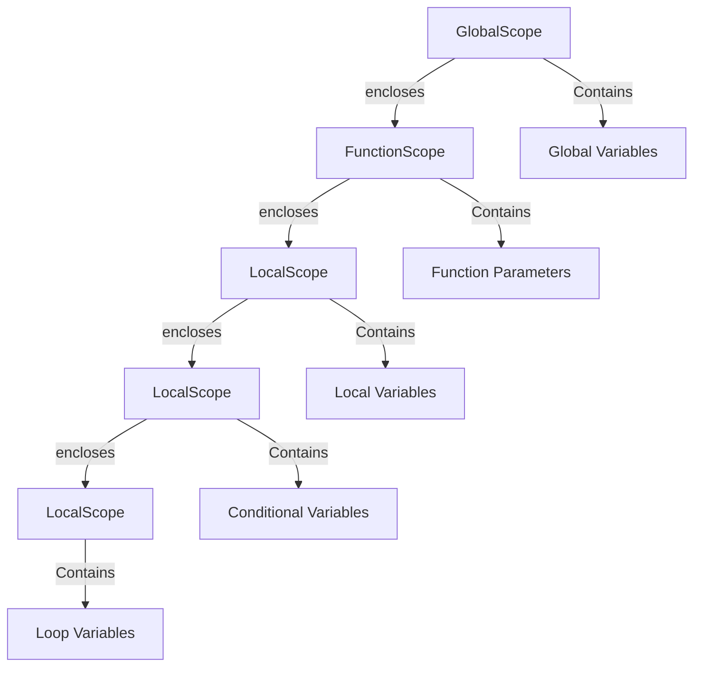
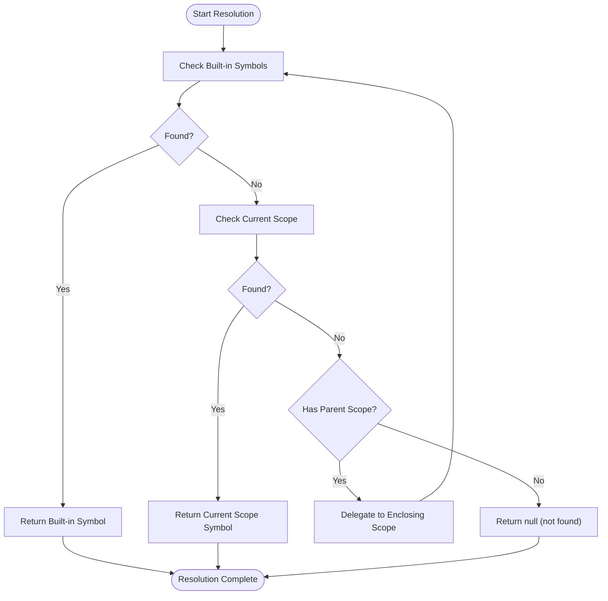
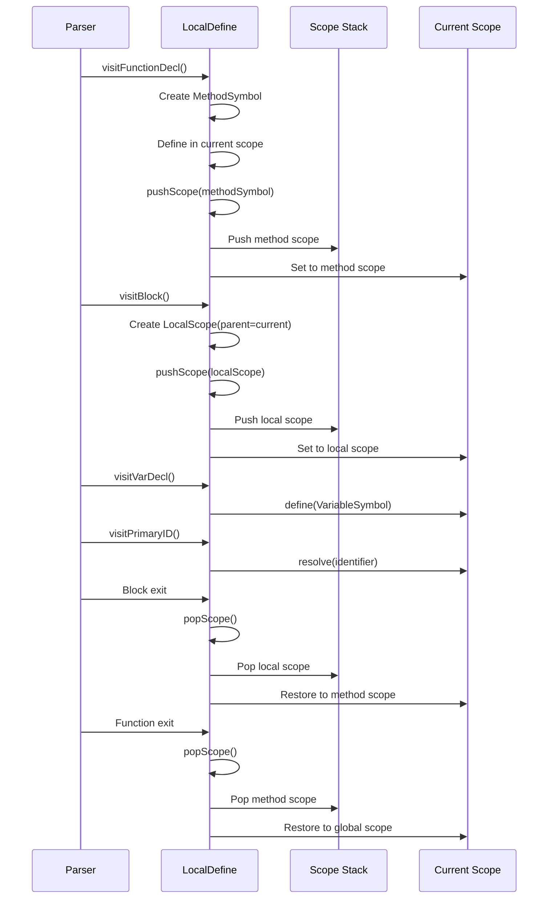
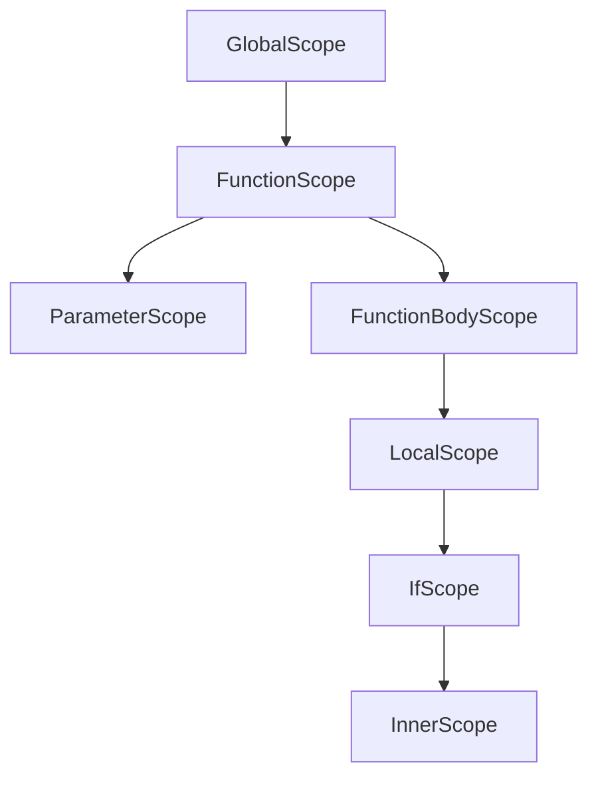
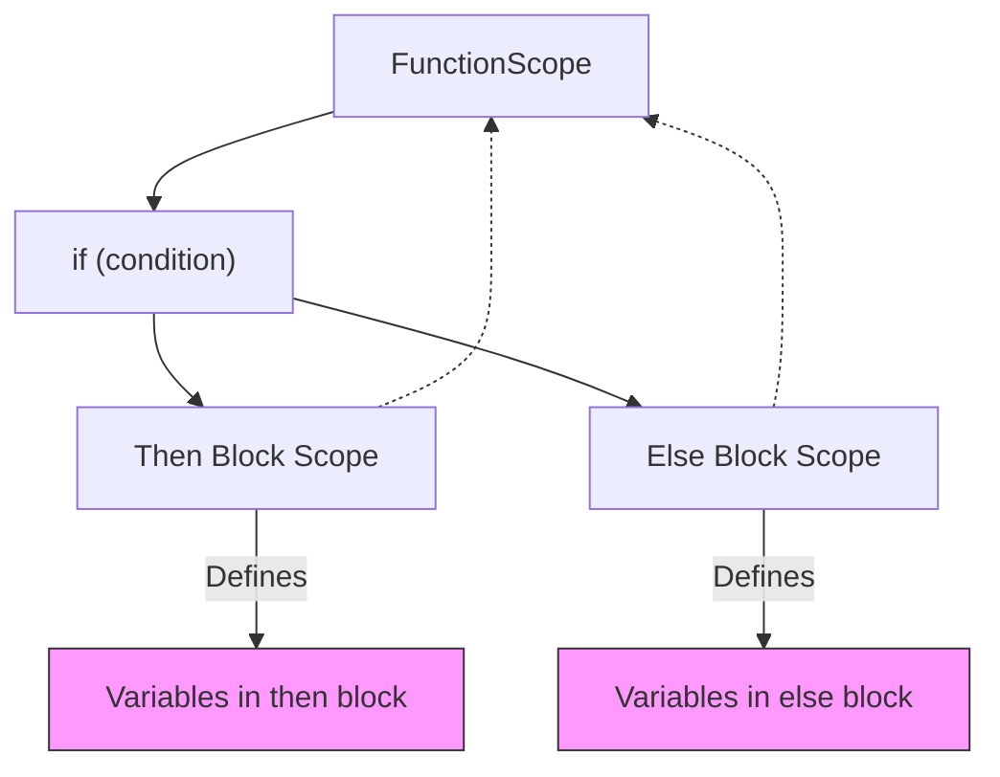
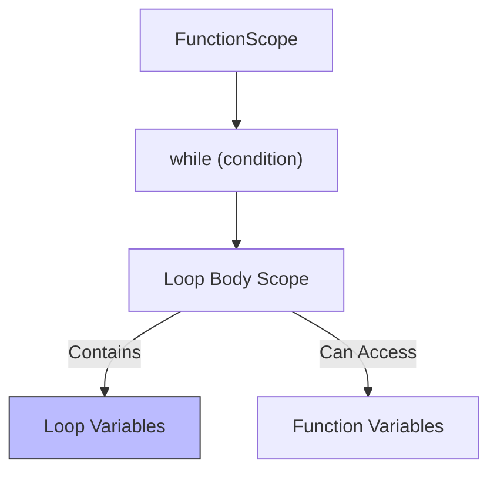

# Scope Hierarchy and Management

<cite>
**Referenced Files in This Document**   
- [Scope.java](file://ep19/src/main/java/org/teachfx/antlr4/ep19/symtab/scope/Scope.java)
- [BaseScope.java](file://ep19/src/main/java/org/teachfx/antlr4/ep19/symtab/scope/BaseScope.java)
- [GlobalScope.java](file://ep19/src/main/java/org/teachfx/antlr4/ep19/symtab/scope/GlobalScope.java)
- [LocalScope.java](file://ep19/src/main/java/org/teachfx/antlr4/ep19/symtab/scope/LocalScope.java)
- [LocalDefine.java](file://ep19/src/main/java/org/teachfx/antlr4/ep19/pass/LocalDefine.java)
- [Compiler.java](file://ep19/src/main/java/org/teachfx/antlr4/ep19/Compiler.java)
</cite>

## Table of Contents
1. [Introduction](#introduction)
2. [Core Components of Scope System](#core-components-of-scope-system)
3. [Scope Interface and BaseScope Abstraction](#scope-interface-and-basescope-abstraction)
4. [GlobalScope: Program-Wide Symbol Management](#globalscope-program-wide-symbol-management)
5. [LocalScope: Function and Block-Level Scoping](#localscope-function-and-block-level-scoping)
6. [Lexical Nesting and Parent-Child Relationships](#lexical-nesting-and-parent-child-relationships)
7. [Symbol Resolution and Shadowing Behavior](#symbol-resolution-and-shadowing-behavior)
8. [Scope Lifecycle During AST Traversal](#scope-lifecycle-during-ast-traversal)
9. [Scope Nesting in Control Structures](#scope-nesting-in-control-structures)
10. [Conclusion](#conclusion)

## Introduction
The scope hierarchy system is a fundamental component of the compiler's semantic analysis phase, enabling proper symbol resolution, type checking, and name binding according to lexical scoping rules. This document details the implementation and usage of the scope management infrastructure used in the Cymbol compiler, focusing on how scopes are structured, nested, and traversed during compilation. The system supports both global and local symbol visibility, handles variable shadowing, and ensures correct name resolution across function, block, and conditional contexts.

## Core Components of Scope System

The scope management system consists of several key components that work together to maintain symbol visibility and enable correct name resolution:

- **Scope interface**: Defines the contract for all scope implementations
- **BaseScope abstract class**: Provides common functionality for scope operations
- **GlobalScope**: Represents the outermost scope containing program-wide symbols
- **LocalScope**: Manages symbols within functions, blocks, and control structures
- **LocalDefine visitor**: Responsible for creating and managing scope instances during AST traversal

These components collectively implement a hierarchical scope chain that mirrors the lexical structure of the source code.

**Section sources**
- [Scope.java](file://ep19/src/main/java/org/teachfx/antlr4/ep19/symtab/scope/Scope.java#L1-L20)
- [BaseScope.java](file://ep19/src/main/java/org/teachfx/antlr4/ep19/symtab/scope/BaseScope.java#L1-L68)
- [GlobalScope.java](file://ep19/src/main/java/org/teachfx/antlr4/ep19/symtab/scope/GlobalScope.java#L1-L16)
- [LocalScope.java](file://ep19/src/main/java/org/teachfx/antlr4/ep19/symtab/scope/LocalScope.java#L1-L14)

## Scope Interface and BaseScope Abstraction

The `Scope` interface defines the essential operations that all scope implementations must support:

```java
public interface Scope {
    String getScopeName();
    Scope getEnclosingScope();
    void define(Symbol sym);
    Symbol resolve(String name);
    Type lookup(String name);
}
```

This interface establishes the core contract for scope behavior, including symbol definition, name resolution, and access to parent scopes.

The `BaseScope` class provides a concrete implementation of common scope functionality through inheritance. It maintains:
- A reference to the enclosing (parent) scope
- A symbol table (`LinkedHashMap<String, Symbol>`) for storing defined symbols
- Built-in symbol registry for primitive types
- Default implementations of scope operations

Key methods in `BaseScope` include:
- `define(Symbol sym)`: Adds a symbol to the current scope
- `resolve(String name)`: Searches for a symbol by name, checking current scope then parent scopes
- `getEnclosingScope()`: Returns the parent scope in the hierarchy
- `lookup(String name)`: Retrieves type information for a symbol

The base class also pre-defines built-in types (int, float, bool, etc.) and registers them in a shared symbol map to ensure consistent availability across all scopes.



**Diagram sources**
- [Scope.java](file://ep19/src/main/java/org/teachfx/antlr4/ep19/symtab/scope/Scope.java#L1-L20)
- [BaseScope.java](file://ep19/src/main/java/org/teachfx/antlr4/ep19/symtab/scope/BaseScope.java#L1-L68)

**Section sources**
- [Scope.java](file://ep19/src/main/java/org/teachfx/antlr4/ep19/symtab/scope/Scope.java#L1-L20)
- [BaseScope.java](file://ep19/src/main/java/org/teachfx/antlr4/ep19/symtab/scope/BaseScope.java#L1-L68)

## GlobalScope: Program-Wide Symbol Management

The `GlobalScope` class represents the root of the scope hierarchy and contains symbols that are accessible throughout the entire program. It extends `BaseScope` with a null parent, establishing it as the top-level scope.

During initialization, the `GlobalScope`:
- Inherits all base functionality from `BaseScope`
- Registers built-in primitive types (int, float, bool, char, void, String, Object)
- Defines built-in functions such as `print` and `main`
- Serves as the starting point for all symbol resolution

The constructor explicitly sets the parent scope to null, indicating that it has no enclosing context:

```java
public GlobalScope() {
    super(null);
}
```

This design ensures that when name resolution reaches the global scope and fails to find a symbol, the search terminates rather than continuing indefinitely.



**Diagram sources**
- [GlobalScope.java](file://ep19/src/main/java/org/teachfx/antlr4/ep19/symtab/scope/GlobalScope.java#L1-L16)
- [BaseScope.java](file://ep19/src/main/java/org/teachfx/antlr4/ep19/symtab/scope/BaseScope.java#L1-L68)

**Section sources**
- [GlobalScope.java](file://ep19/src/main/java/org/teachfx/antlr4/ep19/symtab/scope/GlobalScope.java#L1-L16)
- [LocalDefine.java](file://ep19/src/main/java/org/teachfx/antlr4/ep19/pass/LocalDefine.java#L30-L55)

## LocalScope: Function and Block-Level Scoping

The `LocalScope` class manages symbols that are local to functions, blocks, and other nested contexts. It extends `BaseScope` and accepts a parent scope during construction:

```java
public LocalScope(Scope parent) {
    super(parent);
}
```

Each `LocalScope` instance:
- Maintains its own symbol table for locally defined identifiers
- References its enclosing scope for name resolution
- Supports nested scoping through the parent-child relationship
- Provides isolation between different local contexts

Local scopes are created whenever the compiler encounters:
- Function bodies
- Code blocks (enclosed in {})
- Conditional statements (if, else)
- Loop constructs (while, for)

The `getScopeName()` method returns "Local" to identify the scope type during debugging and analysis.



**Diagram sources**
- [LocalScope.java](file://ep19/src/main/java/org/teachfx/antlr4/ep19/symtab/scope/LocalScope.java#L1-L14)
- [BaseScope.java](file://ep19/src/main/java/org/teachfx/antlr4/ep19/symtab/scope/BaseScope.java#L1-L68)

**Section sources**
- [LocalScope.java](file://ep19/src/main/java/org/teachfx/antlr4/ep19/symtab/scope/LocalScope.java#L1-L14)
- [LocalDefine.java](file://ep19/src/main/java/org/teachfx/antlr4/ep19/pass/LocalDefine.java#L145-L152)

## Lexical Nesting and Parent-Child Relationships

The scope system implements lexical scoping through a hierarchical parent-child relationship structure. Each scope maintains a reference to its enclosing scope, forming a chain that reflects the nested structure of the source code.

When a new scope is entered:
1. A new scope instance is created with the current scope as its parent
2. The current scope pointer is updated to the new scope
3. Symbols defined within the new scope are added to its local symbol table

When a scope is exited:
1. The current scope pointer is restored to its parent
2. The local symbol table becomes inaccessible
3. Name resolution continues in the parent scope

This creates a scope chain where name resolution proceeds from innermost to outermost scopes:



The parent-child relationship enables proper handling of nested declarations and ensures that inner scopes can access symbols from outer scopes while maintaining isolation.

**Diagram sources**
- [BaseScope.java](file://ep19/src/main/java/org/teachfx/antlr4/ep19/symtab/scope/BaseScope.java#L1-L68)
- [LocalDefine.java](file://ep19/src/main/java/org/teachfx/antlr4/ep19/pass/LocalDefine.java#L145-L152)

**Section sources**
- [BaseScope.java](file://ep19/src/main/java/org/teachfx/antlr4/ep19/symtab/scope/BaseScope.java#L1-L68)
- [LocalDefine.java](file://ep19/src/main/java/org/teachfx/antlr4/ep19/pass/LocalDefine.java#L145-L152)

## Symbol Resolution and Shadowing Behavior

Symbol resolution follows a hierarchical search pattern that starts in the current scope and proceeds up the scope chain until a match is found or the global scope is reached.

The resolution process in `BaseScope.resolve()`:
1. First checks built-in symbols (primitive types)
2. Searches the current scope's symbol table
3. If not found, delegates to the enclosing scope
4. Returns null if no symbol is found in the entire chain

Shadowing occurs when a local declaration has the same name as a symbol in an outer scope. The scope system naturally supports shadowing because:
- The search order prioritizes inner scopes
- Local definitions mask outer ones without removing them
- When the inner scope exits, the original symbol becomes visible again

For example:
```c
int x = 10;        // Global x
void func() {
    int x = 20;    // Local x shadows global x
    // Here, 'x' refers to local x
} // When func exits, global x becomes visible again
```

The resolution algorithm ensures that the most closely enclosing declaration takes precedence, which is the fundamental principle of lexical scoping.



**Diagram sources**
- [BaseScope.java](file://ep19/src/main/java/org/teachfx/antlr4/ep19/symtab/scope/BaseScope.java#L35-L50)
- [Scope.java](file://ep19/src/main/java/org/teachfx/antlr4/ep19/symtab/scope/Scope.java#L1-L20)

**Section sources**
- [BaseScope.java](file://ep19/src/main/java/org/teachfx/antlr4/ep19/symtab/scope/BaseScope.java#L35-L50)
- [Scope.java](file://ep19/src/main/java/org/teachfx/antlr4/ep19/symtab/scope/Scope.java#L1-L20)

## Scope Lifecycle During AST Traversal

The `LocalDefine` visitor class manages the scope lifecycle during AST traversal, creating and destroying scopes as the parser encounters different syntactic constructs.

Scope management follows these patterns:

### Scope Creation
- **Global scope**: Created in `LocalDefine` constructor
- **Function scope**: Created in `visitFunctionDecl()`
- **Block scope**: Created in `visitBlock()`
- **Structure scope**: Created in `visitStructDecl()`

### Scope Entry and Exit
The visitor uses a stack-based approach:
- `pushScope(scope)`: Enters a new scope
- `popScope()`: Exits current scope, returns to parent
- `stashScope(ctx)`: Associates AST node with current scope

Key traversal points:
- **Function declaration**: Creates method symbol and pushes function scope
- **Block statement**: Creates new `LocalScope` and pushes it onto stack
- **Variable declaration**: Defines symbol in current scope
- **Identifier reference**: Resolves symbol against current scope chain



**Diagram sources**
- [LocalDefine.java](file://ep19/src/main/java/org/teachfx/antlr4/ep19/pass/LocalDefine.java#L1-L326)
- [BaseScope.java](file://ep19/src/main/java/org/teachfx/antlr4/ep19/symtab/scope/BaseScope.java#L1-L68)

**Section sources**
- [LocalDefine.java](file://ep19/src/main/java/org/teachfx/antlr4/ep19/pass/LocalDefine.java#L1-L326)
- [BaseScope.java](file://ep19/src/main/java/org/teachfx/antlr4/ep19/symtab/scope/BaseScope.java#L1-L68)

## Scope Nesting in Control Structures

The scope system handles various control structures by creating appropriate nested scopes:

### Function Scope Nesting


### Conditional Statement Scoping
When processing an if-else construct:
- Each block creates its own `LocalScope`
- The condition expression uses the current scope
- Branches have independent symbol tables
- Variables declared in one branch are not visible in others



### Loop Construct Scoping
For while loops:
- Loop condition uses current scope
- Loop body creates new `LocalScope`
- Variables declared in loop body are local to each iteration context



### Variable Declaration in Control Structures
The `LocalDefine` visitor handles scope creation uniformly:
- `visitBlock()`: Creates new `LocalScope` for any block
- `visitFunctionDecl()`: Creates function-specific scope
- `visitStructDecl()`: Creates structure scope
- Each scope maintains proper parent linkage to enable correct name resolution

This consistent approach ensures that all syntactic constructs that introduce new naming contexts are handled uniformly, maintaining the integrity of the lexical scoping model.

**Diagram sources**
- [LocalDefine.java](file://ep19/src/main/java/org/teachfx/antlr4/ep19/pass/LocalDefine.java#L145-L152)
- [LocalScope.java](file://ep19/src/main/java/org/teachfx/antlr4/ep19/symtab/scope/LocalScope.java#L1-L14)

**Section sources**
- [LocalDefine.java](file://ep19/src/main/java/org/teachfx/antlr4/ep19/pass/LocalDefine.java#L145-L152)
- [LocalScope.java](file://ep19/src/main/java/org/teachfx/antlr4/ep19/symtab/scope/LocalScope.java#L1-L14)

## Conclusion
The scope hierarchy system provides a robust foundation for lexical scoping in the Cymbol compiler. By implementing a clear hierarchy of `Scope`, `BaseScope`, `GlobalScope`, and `LocalScope` components, the system enables proper symbol management across different program contexts. The `LocalDefine` visitor orchestrates scope creation and destruction during AST traversal, ensuring that each syntactic construct maintains appropriate symbol visibility. The parent-child relationship between scopes supports hierarchical name resolution, while the design naturally accommodates variable shadowing and nested declarations. This comprehensive scope management infrastructure is essential for accurate semantic analysis, type checking, and code generation in the compiler pipeline.