# Symbol Declaration and Resolution Process

<cite>
**Referenced Files in This Document**   
- [LocalDefine.java](file://ep20/src/main/java/org/teachfx/antlr4/ep20/pass/symtab/LocalDefine.java)
- [Scope.java](file://ep20/src/main/java/org/teachfx/antlr4/ep20/symtab/scope/Scope.java)
- [BaseScope.java](file://ep20/src/main/java/org/teachfx/antlr4/ep20/symtab/scope/BaseScope.java)
- [GlobalScope.java](file://ep20/src/main/java/org/teachfx/antlr4/ep20/symtab/scope/GlobalScope.java)
- [LocalScope.java](file://ep20/src/main/java/org/teachfx/antlr4/ep20/symtab/scope/LocalScope.java)
- [Symbol.java](file://ep20/src/main/java/org/teachfx/antlr4/ep20/symtab/symbol/Symbol.java)
- [MethodSymbol.java](file://ep20/src/main/java/org/teachfx/antlr4/ep20/symtab/symbol/MethodSymbol.java)
- [ErrorIssuer.java](file://ep20/src/main/java/org/teachfx/antlr4/ep20/driver/ErrorIssuer.java)
- [VarDeclNode.java](file://ep20/src/main/java/org/teachfx/antlr4/ep20/ast/decl/VarDeclNode.java)
- [FuncDeclNode.java](file://ep20/src/main/java/org/teachfx/antlr4/ep20/ast/decl/FuncDeclNode.java)
- [IDExprNode.java](file://ep20/src/main/java/org/teachfx/antlr4/ep20/ast/expr/IDExprNode.java)
- [CompileUnit.java](file://ep20/src/main/java/org/teachfx/antlr4/ep20/ast/CompileUnit.java)
</cite>

## Table of Contents
1. [Introduction](#introduction)
2. [Symbol Table Architecture](#symbol-table-architecture)
3. [LocalDefine: Symbol Population Pass](#localdefine-symbol-population-pass)
4. [Scope Hierarchy and Management](#scope-hierarchy-and-management)
5. [Symbol Declaration Process](#symbol-declaration-process)
6. [Name Resolution Mechanism](#name-resolution-mechanism)
7. [Duplicate Symbol Detection](#duplicate-symbol-detection)
8. [Error Reporting and Location Tracking](#error-reporting-and-location-tracking)
9. [Integration with AST](#integration-with-ast)
10. [Step-by-Step Examples](#step-by-step-examples)
11. [Conclusion](#conclusion)

## Introduction
The symbol declaration and resolution process is a fundamental phase in the semantic analysis of programming languages implemented with ANTLR4. This document details how the `LocalDefine.java` class serves as the primary visitor pass for populating the symbol table during AST traversal. The process involves identifying declarations (variables, functions, parameters) and inserting corresponding symbols into appropriate scopes, establishing the foundation for subsequent name resolution and type checking phases.

**Section sources**
- [LocalDefine.java](file://ep20/src/main/java/org/teachfx/antlr4/ep20/pass/symtab/LocalDefine.java#L1-L41)
- [Scope.java](file://ep20/src/main/java/org/teachfx/antlr4/ep20/symtab/scope/Scope.java#L1-L35)

## Symbol Table Architecture
The symbol table implementation follows a hierarchical scope model where symbols are organized in nested scopes. The architecture is built around several key components that work together to manage symbol definitions and resolutions.

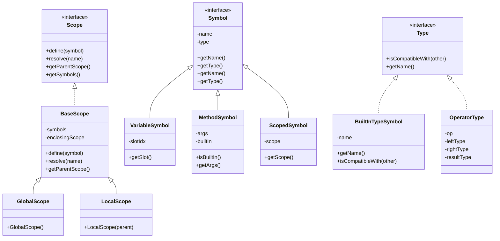

**Diagram sources**
- [Scope.java](file://ep20/src/main/java/org/teachfx/antlr4/ep20/symtab/scope/Scope.java#L1-L35)
- [BaseScope.java](file://ep20/src/main/java/org/teachfx/antlr4/ep20/symtab/scope/BaseScope.java#L1-L71)
- [Symbol.java](file://ep20/src/main/java/org/teachfx/antlr4/ep20/symtab/symbol/Symbol.java#L1-L56)

## LocalDefine: Symbol Population Pass
The `LocalDefine` class implements the visitor pattern to traverse the AST and populate the symbol table during the first pass of semantic analysis. It acts as the primary mechanism for symbol declaration, establishing the initial binding between identifiers and their corresponding symbol objects.

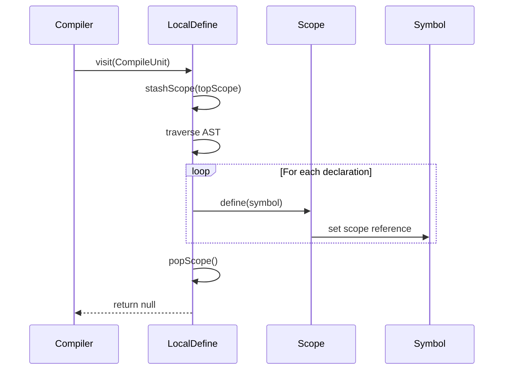

**Diagram sources**
- [LocalDefine.java](file://ep20/src/main/java/org/teachfx/antlr4/ep20/pass/symtab/LocalDefine.java#L1-L170)
- [Scope.java](file://ep20/src/main/java/org/teachfx/antlr4/ep20/symtab/scope/Scope.java#L1-L35)

**Section sources**
- [LocalDefine.java](file://ep20/src/main/java/org/teachfx/antlr4/ep20/pass/symtab/LocalDefine.java#L1-L170)

## Scope Hierarchy and Management
The scope management system implements a stack-based approach to handle nested scopes during AST traversal. Each scope maintains a reference to its enclosing scope, creating a hierarchical structure that reflects the lexical nesting of the source code.

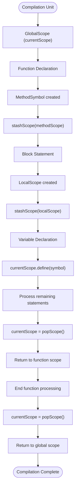

**Diagram sources**
- [LocalDefine.java](file://ep20/src/main/java/org/teachfx/antlr4/ep20/pass/symtab/LocalDefine.java#L1-L170)
- [BaseScope.java](file://ep20/src/main/java/org/teachfx/antlr4/ep20/symtab/scope/BaseScope.java#L1-L71)
- [GlobalScope.java](file://ep20/src/main/java/org/teachfx/antlr4/ep20/symtab/scope/GlobalScope.java#L1-L36)

**Section sources**
- [LocalDefine.java](file://ep20/src/main/java/org/teachfx/antlr4/ep20/pass/symtab/LocalDefine.java#L1-L170)
- [BaseScope.java](file://ep20/src/main/java/org/teachfx/antlr4/ep20/symtab/scope/BaseScope.java#L1-L71)

## Symbol Declaration Process
The symbol declaration process occurs during the first pass of semantic analysis when `LocalDefine` visits declaration nodes in the AST. The visitor identifies various types of declarations and inserts corresponding symbols into the appropriate scopes.

### Variable Declaration
When encountering a variable declaration, `LocalDefine` creates a `VariableSymbol` and adds it to the current scope:

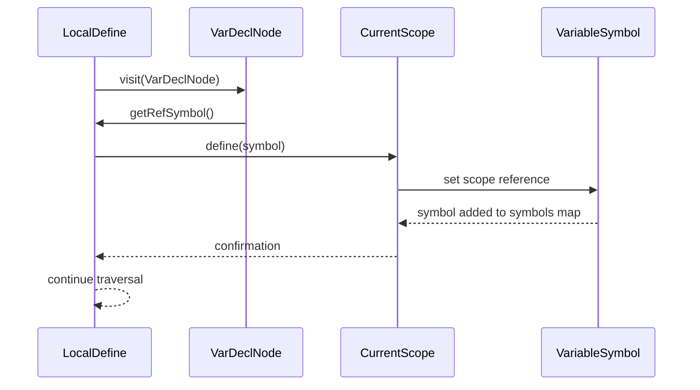

**Diagram sources**
- [LocalDefine.java](file://ep20/src/main/java/org/teachfx/antlr4/ep20/pass/symtab/LocalDefine.java#L50-L55)
- [VarDeclNode.java](file://ep20/src/main/java/org/teachfx/antlr4/ep20/ast/decl/VarDeclNode.java#L1-L20)

### Function Declaration
Function declarations are handled by creating a `MethodSymbol` that represents the function signature and establishing a new scope for the function body:

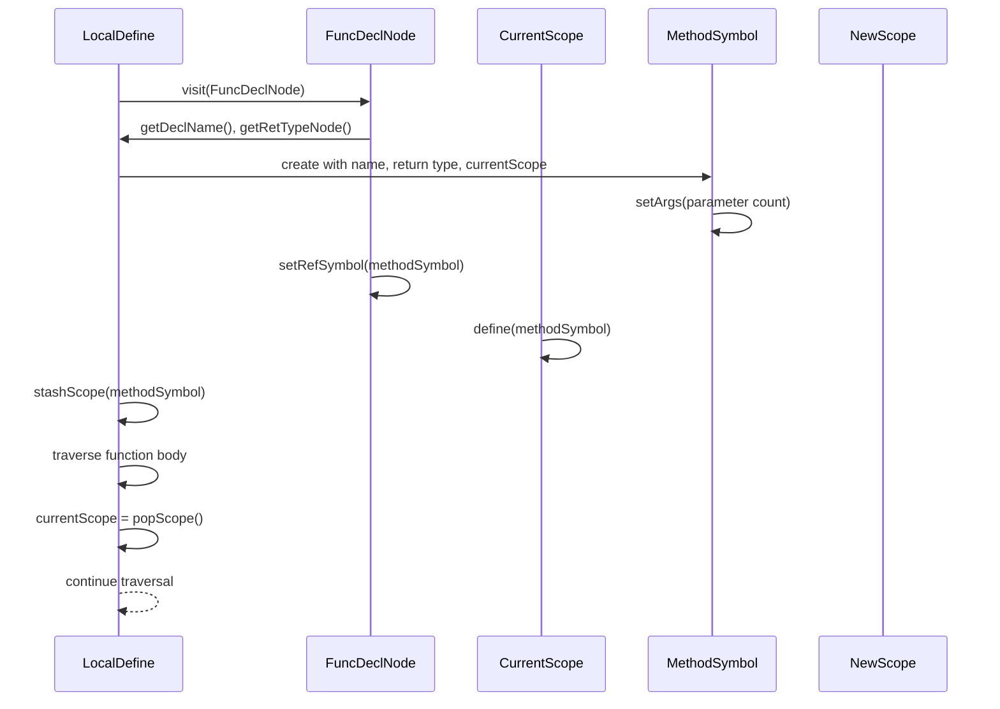

**Diagram sources**
- [LocalDefine.java](file://ep20/src/main/java/org/teachfx/antlr4/ep20/pass/symtab/LocalDefine.java#L57-L78)
- [FuncDeclNode.java](file://ep20/src/main/java/org/teachfx/antlr4/ep20/ast/decl/FuncDeclNode.java#L1-L30)
- [MethodSymbol.java](file://ep20/src/main/java/org/teachfx/antlr4/ep20/symtab/symbol/MethodSymbol.java#L1-L150)

**Section sources**
- [LocalDefine.java](file://ep20/src/main/java/org/teachfx/antlr4/ep20/pass/symtab/LocalDefine.java#L50-L78)
- [MethodSymbol.java](file://ep20/src/main/java/org/teachfx/antlr4/ep20/symtab/symbol/MethodSymbol.java#L1-L150)

## Name Resolution Mechanism
Name resolution occurs during subsequent passes after the symbol table has been populated. The `LocalDefine` visitor also participates in name resolution by attempting to resolve identifiers against the symbol table.

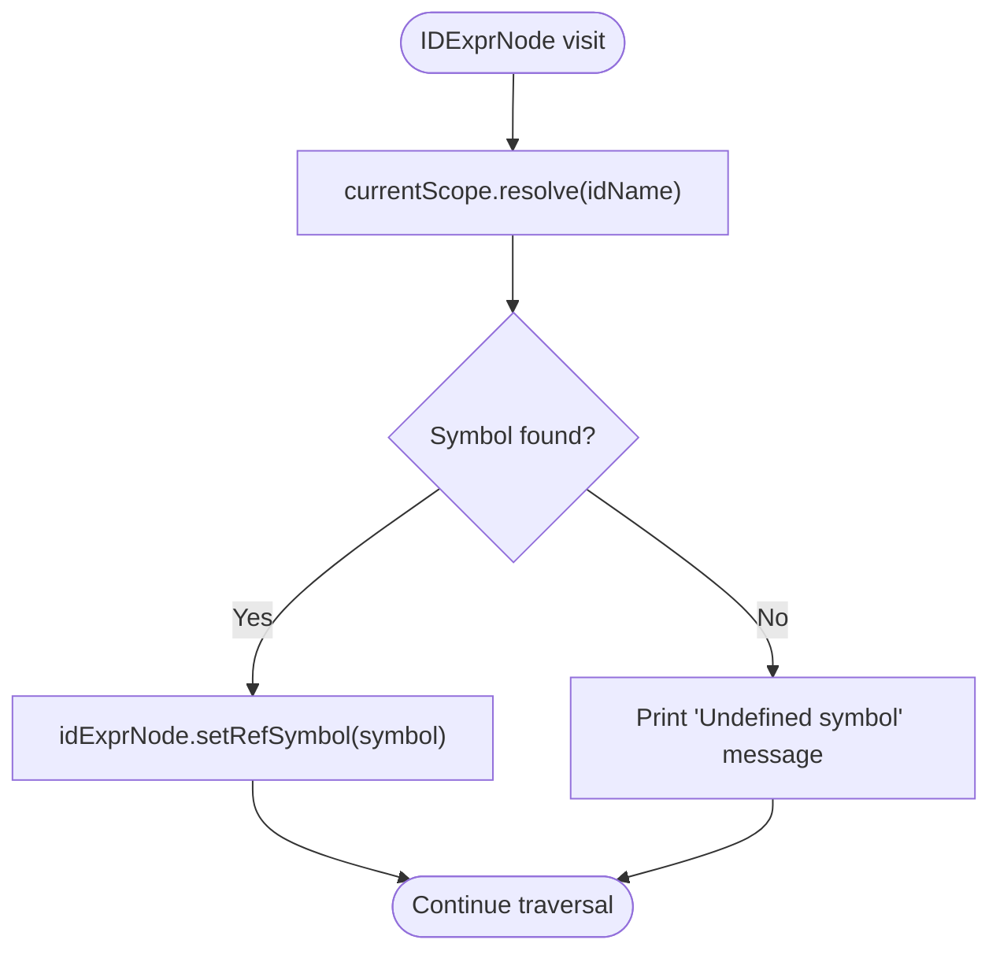

The resolution process follows a hierarchical search pattern, starting from the current scope and traversing up through enclosing scopes until the symbol is found or the global scope is reached:

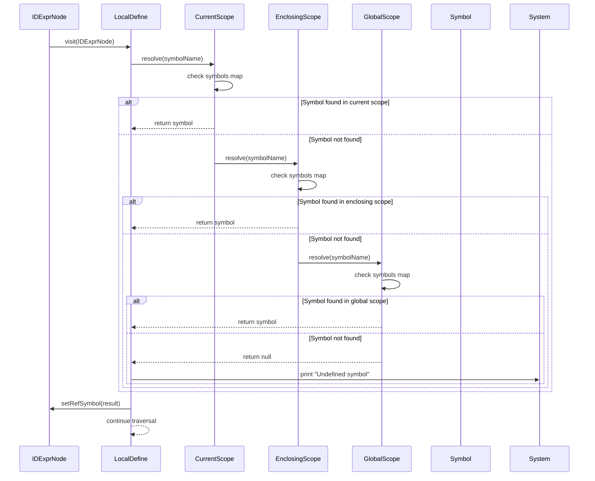

**Diagram sources**
- [LocalDefine.java](file://ep20/src/main/java/org/teachfx/antlr4/ep20/pass/symtab/LocalDefine.java#L43-L49)
- [Scope.java](file://ep20/src/main/java/org/teachfx/antlr4/ep20/symtab/scope/Scope.java#L1-L35)
- [BaseScope.java](file://ep20/src/main/java/org/teachfx/antlr4/ep20/symtab/scope/BaseScope.java#L1-L71)

**Section sources**
- [LocalDefine.java](file://ep20/src/main/java/org/teachfx/antlr4/ep20/pass/symtab/LocalDefine.java#L43-L49)

## Duplicate Symbol Detection
The symbol table architecture inherently supports duplicate symbol detection through the `define` method in the `BaseScope` class. When a symbol is defined, it is added to the scope's symbol map using the symbol name as the key.

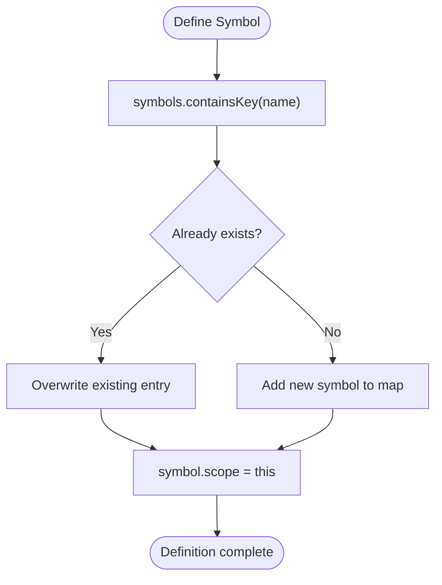

While the current implementation does not explicitly prevent duplicate symbols, the map-based storage means that subsequent definitions with the same name will overwrite previous ones. A more robust implementation would check for existing symbols before adding new ones and issue appropriate error messages.

**Diagram sources**
- [BaseScope.java](file://ep20/src/main/java/org/teachfx/antlr4/ep20/symtab/scope/BaseScope.java#L40-L45)
- [Symbol.java](file://ep20/src/main/java/org/teachfx/antlr4/ep20/symtab/symbol/Symbol.java#L1-L56)

**Section sources**
- [BaseScope.java](file://ep20/src/main/java/org/teachfx/antlr4/ep20/symtab/scope/BaseScope.java#L40-L45)

## Error Reporting and Location Tracking
Error reporting is integrated into the symbol declaration and resolution process through the `ErrorIssuer` interface and location information preserved in the AST nodes.

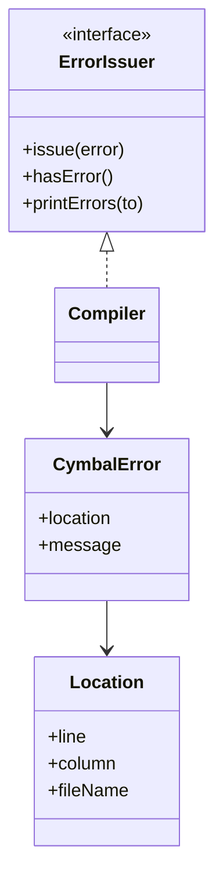

When an undefined symbol is encountered during name resolution, the system outputs a diagnostic message to the console. A more complete implementation would use the `ErrorIssuer` to properly record and report these errors with precise location information.

**Diagram sources**
- [ErrorIssuer.java](file://ep20/src/main/java/org/teachfx/antlr4/ep20/driver/ErrorIssuer.java#L1-L44)
- [LocalDefine.java](file://ep20/src/main/java/org/teachfx/antlr4/ep20/pass/symtab/LocalDefine.java#L46-L48)

**Section sources**
- [ErrorIssuer.java](file://ep20/src/main/java/org/teachfx/antlr4/ep20/driver/ErrorIssuer.java#L1-L44)
- [LocalDefine.java](file://ep20/src/main/java/org/teachfx/antlr4/ep20/pass/symtab/LocalDefine.java#L46-L48)

## Integration with AST
The `LocalDefine` visitor integrates tightly with the AST structure, visiting specific node types and establishing connections between AST nodes and symbol table entries.

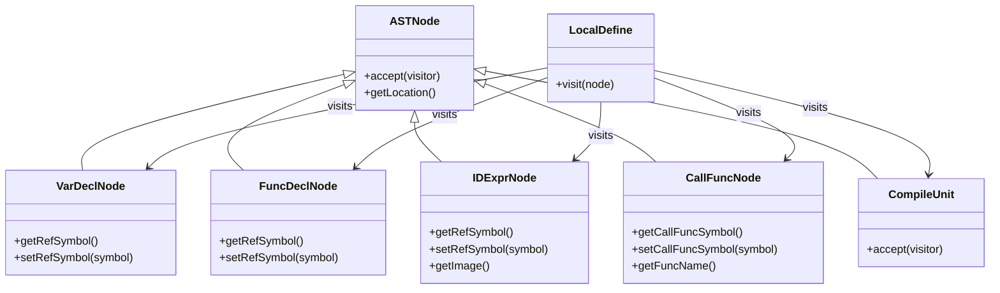

The integration points include:
- **VarDeclNode**: Binds variable declarations to `VariableSymbol` instances
- **FuncDeclNode**: Binds function declarations to `MethodSymbol` instances
- **IDExprNode**: Resolves identifier references to their corresponding symbols
- **CallFuncNode**: Resolves function calls to their method symbols
- **CompileUnit**: Entry point for the entire traversal process

**Diagram sources**
- [LocalDefine.java](file://ep20/src/main/java/org/teachfx/antlr4/ep20/pass/symtab/LocalDefine.java#L1-L170)
- [VarDeclNode.java](file://ep20/src/main/java/org/teachfx/antlr4/ep20/ast/decl/VarDeclNode.java#L1-L20)
- [FuncDeclNode.java](file://ep20/src/main/java/org/teachfx/antlr4/ep20/ast/decl/FuncDeclNode.java#L1-L30)
- [IDExprNode.java](file://ep20/src/main/java/org/teachfx/antlr4/ep20/ast/expr/IDExprNode.java#L1-L15)
- [CallFuncNode.java](file://ep20/src/main/java/org/teachfx/antlr4/ep20/ast/expr/CallFuncNode.java#L1-L20)
- [CompileUnit.java](file://ep20/src/main/java/org/teachfx/antlr4/ep20/ast/CompileUnit.java#L1-L15)

**Section sources**
- [LocalDefine.java](file://ep20/src/main/java/org/teachfx/antlr4/ep20/pass/symtab/LocalDefine.java#L1-L170)

## Step-by-Step Examples

### Global Variable Declaration
This example demonstrates the process of declaring a global variable:

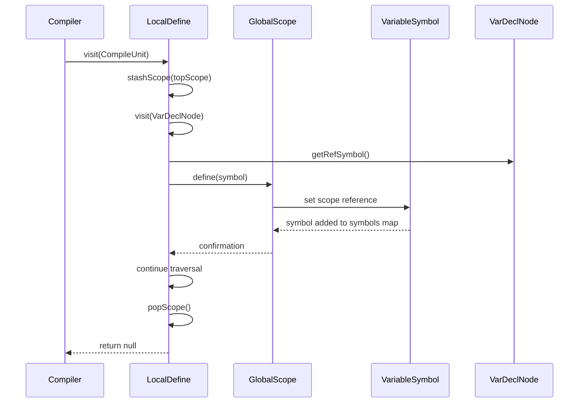

**Diagram sources**
- [LocalDefine.java](file://ep20/src/main/java/org/teachfx/antlr4/ep20/pass/symtab/LocalDefine.java#L50-L55)
- [GlobalScope.java](file://ep20/src/main/java/org/teachfx/antlr4/ep20/symtab/scope/GlobalScope.java#L1-L36)

### Function with Parameters
This example shows how function parameters are handled during symbol declaration:

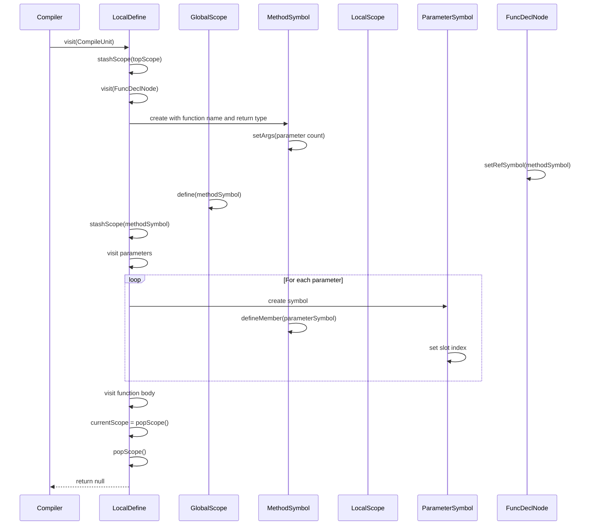

**Diagram sources**
- [LocalDefine.java](file://ep20/src/main/java/org/teachfx/antlr4/ep20/pass/symtab/LocalDefine.java#L57-L78)
- [MethodSymbol.java](file://ep20/src/main/java/org/teachfx/antlr4/ep20/symtab/symbol/MethodSymbol.java#L1-L150)

### Nested Block Scopes
This example illustrates the handling of nested block scopes with local variables:

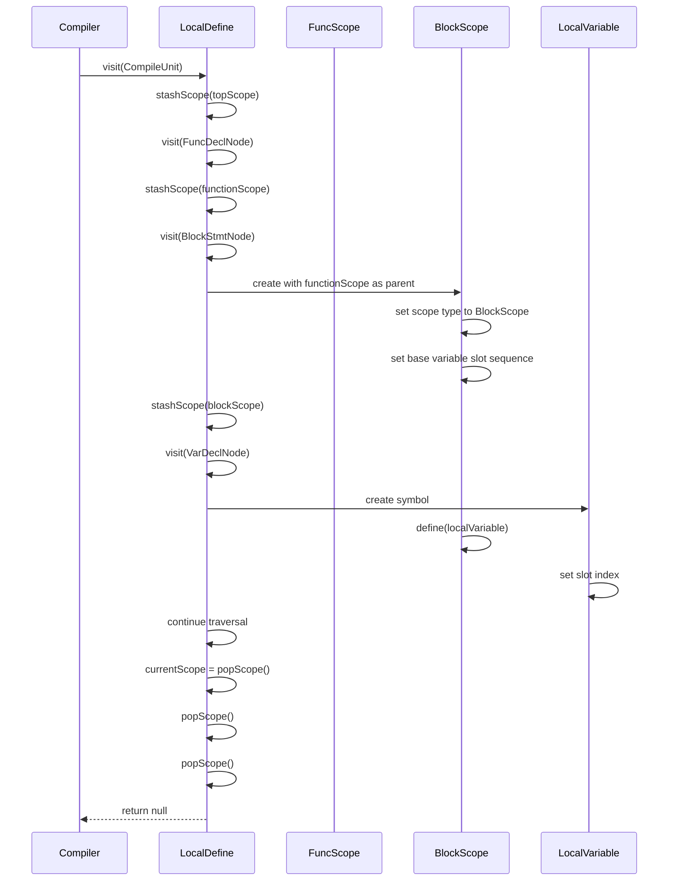

**Diagram sources**
- [LocalDefine.java](file://ep20/src/main/java/org/teachfx/antlr4/ep20/pass/symtab/LocalDefine.java#L79-L95)
- [LocalScope.java](file://ep20/src/main/java/org/teachfx/antlr4/ep20/symtab/scope/LocalScope.java#L1-L51)

## Conclusion
The symbol declaration and resolution process implemented in `LocalDefine.java` provides a robust foundation for semantic analysis in the ANTLR4-based language implementation. By leveraging the visitor pattern, the system efficiently traverses the AST to populate the symbol table during the first pass of analysis. The hierarchical scope management enables proper handling of nested declarations and block structures, while the integration with the AST preserves location information for error reporting. The process establishes symbol bindings that are essential for subsequent phases of compilation, including name resolution, type checking, and code generation. The design demonstrates a clean separation of concerns between symbol declaration (performed by `LocalDefine`) and symbol resolution (performed in subsequent passes), following established compiler construction patterns.