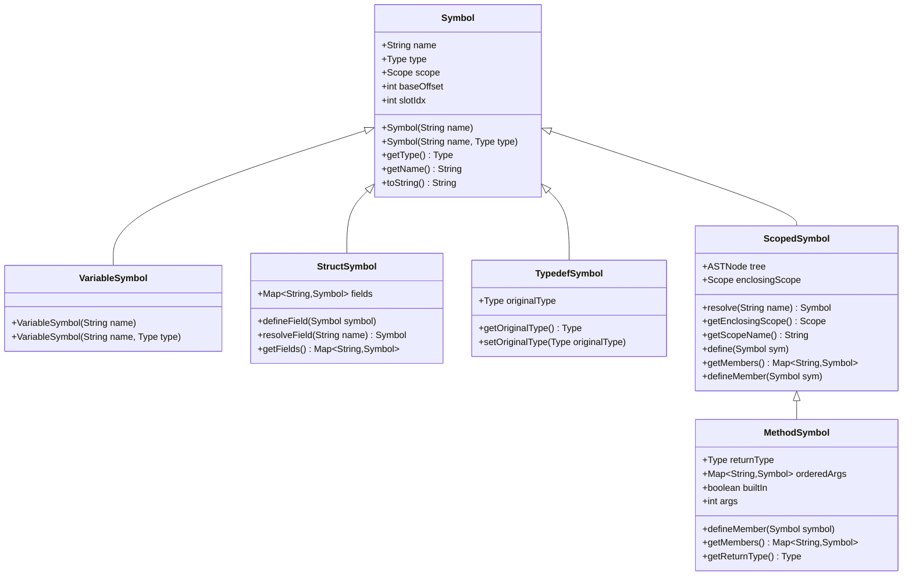

# Symbol Definitions and Types

<cite>
**Referenced Files in This Document**   
- [Symbol.java](file://ep20/src/main/java/org/teachfx/antlr4/ep20/symtab/symbol/Symbol.java)
- [VariableSymbol.java](file://ep20/src/main/java/org/teachfx/antlr4/ep20/symtab/symbol/VariableSymbol.java)
- [MethodSymbol.java](file://ep20/src/main/java/org/teachfx/antlr4/ep20/symtab/symbol/MethodSymbol.java)
- [StructSymbol.java](file://ep20/src/main/java/org/teachfx/antlr4/ep20/symtab/symbol/StructSymbol.java)
- [TypedefSymbol.java](file://ep20/src/main/java/org/teachfx/antlr4/ep20/symtab/symbol/TypedefSymbol.java)
- [ScopedSymbol.java](file://ep20/src/main/java/org/teachfx/antlr4/ep20/symtab/symbol/ScopedSymbol.java)
</cite>

## Table of Contents
1. [Introduction](#introduction)
2. [Symbol Base Class](#symbol-base-class)
3. [Concrete Symbol Types](#concrete-symbol-types)
   - [VariableSymbol](#variablesymbol)
   - [MethodSymbol](#methodsymbol)
   - [StructSymbol](#structsymbol)
   - [TypedefSymbol](#typedefsymbol)
4. [ScopedSymbol Mixin](#scopedsymbol-mixin)
5. [Symbol Inheritance Hierarchy](#symbol-inheritance-hierarchy)
6. [Symbol Creation and Population](#symbol-creation-and-population)
7. [Symbol Metadata Storage and Access](#symbol-metadata-storage-and-access)

## Introduction
This document provides a comprehensive overview of the symbol system in the Cymbol compiler implementation. It details the Symbol base class, its concrete implementations, and the ScopedSymbol mixin that enables scoping capabilities. The documentation explains how symbols are used to represent program entities such as variables, functions, and user-defined types, and how they maintain metadata about their type, scope, and other attributes.

## Symbol Base Class

The Symbol class serves as the foundation for all symbol types in the compiler's symbol table system. It represents the most basic program entity with essential attributes including name, type, and scope. The Symbol class provides the core functionality that is inherited by all concrete symbol types.

Key attributes of the Symbol class include:
- **name**: A string identifier for the symbol
- **type**: Reference to the symbol's type information
- **scope**: Reference to the scope in which the symbol is defined
- **baseOffset**: Memory offset for code generation
- **slotIdx**: Index for variable slot allocation

The Symbol class provides constructors for creating symbols with or without an explicit type, and includes methods for accessing and modifying its properties. It also implements equality and hashing based on name and type, enabling proper symbol resolution in the symbol table.

**Section sources**
- [Symbol.java](file://ep20/src/main/java/org/teachfx/antlr4/ep20/symtab/symbol/Symbol.java#L0-L93)

## Concrete Symbol Types

### VariableSymbol
The VariableSymbol class represents variables in the program. It extends the base Symbol class and inherits all its properties. VariableSymbol is used to represent both local and global variables, capturing their name and type information.

VariableSymbol instances are created during parsing when variable declarations are encountered. The constructor accepts either just a name (for later type resolution) or both name and type. The class maintains the variable's type information and provides standard equality comparison based on the parent Symbol class.

**Section sources**
- [VariableSymbol.java](file://ep20/src/main/java/org/teachfx/antlr4/ep20/symtab/symbol/VariableSymbol.java#L0-L19)

### MethodSymbol
The MethodSymbol class represents functions or methods in the program. It extends ScopedSymbol (which itself extends Symbol) and implements the Type interface, indicating that methods are also considered types in the type system.

MethodSymbol contains specific metadata for functions:
- **returnType**: The type returned by the function
- **orderedArgs**: A LinkedHashMap maintaining the order of parameters
- **builtIn**: Flag indicating if the method is a built-in language function
- **args**: Count of parameters
- **LABEL_SEQ and VAR_SLOT_SEQ**: Sequencers for code generation

The class provides methods to define parameters (defineMember), retrieve the return type (getReturnType), and manage variable slots for local variables. MethodSymbol also maintains scope information through its inheritance from ScopedSymbol, allowing it to contain its own scope for local variables and parameters.

**Section sources**
- [MethodSymbol.java](file://ep20/src/main/java/org/teachfx/antlr4/ep20/symtab/symbol/MethodSymbol.java#L0-L150)

### StructSymbol
The StructSymbol class represents user-defined composite types (structures). It extends the base Symbol class and contains a collection of fields that make up the structure.

Key features of StructSymbol include:
- **fields**: A HashMap storing the structure's member fields by name
- Methods to define new fields (defineField) and resolve existing ones (resolveField)
- Access to all fields through getFields()

When a struct is defined in the source code, a StructSymbol is created with the struct's name. As field declarations are processed, they are added to the struct's symbol through the defineField method. This allows the type system to validate field accesses and perform type checking on struct operations.

**Section sources**
- [StructSymbol.java](file://ep20/src/main/java/org/teachfx/antlr4/ep20/symtab/symbol/StructSymbol.java#L0-L39)

### TypedefSymbol
The TypedefSymbol class represents type aliases created with typedef declarations. It extends the base Symbol class and maintains a reference to the original type being aliased.

The class contains:
- **originalType**: The underlying type that this symbol represents an alias for
- Getter and setter methods for the original type

When a typedef is encountered during parsing, a TypedefSymbol is created with the alias name and the original type. This allows the type system to resolve the alias to its underlying type when the symbol is referenced elsewhere in the code.

**Section sources**
- [TypedefSymbol.java](file://ep20/src/main/java/org/teachfx/antlr4/ep20/symtab/symbol/TypedefSymbol.java#L0-L29)

## ScopedSymbol Mixin

The ScopedSymbol class serves as a mixin that provides scoping capabilities to symbols that define their own scope. It extends Symbol and implements the Scope interface, enabling symbols to act as containers for other symbols.

ScopedSymbol is designed to be inherited by symbols that create new scopes, such as functions and compound statements. It provides:
- **enclosingScope**: Reference to the parent/outer scope
- **tree**: Reference to the AST node associated with this scope
- **getMembers() and defineMember()**: Abstract methods for managing contained symbols
- **resolve()**: Method to look up symbols by name, checking first in the current scope then in enclosing scopes
- **getEnclosingScope()**: Accessor for the parent scope

The two constructors allow creation of scoped symbols either with a specific type or without one. The resolve method implements the standard lexical scoping rule: first check the current scope, then recursively check enclosing scopes until the symbol is found or the global scope is reached.

**Section sources**
- [ScopedSymbol.java](file://ep20/src/main/java/org/teachfx/antlr4/ep20/symtab/symbol/ScopedSymbol.java#L0-L71)

## Symbol Inheritance Hierarchy

**Diagram sources**
- [Symbol.java](file://ep20/src/main/java/org/teachfx/antlr4/ep20/symtab/symbol/Symbol.java#L0-L93)
- [VariableSymbol.java](file://ep20/src/main/java/org/teachfx/antlr4/ep20/symtab/symbol/VariableSymbol.java#L0-L19)
- [MethodSymbol.java](file://ep20/src/main/java/org/teachfx/antlr4/ep20/symtab/symbol/MethodSymbol.java#L0-L150)
- [StructSymbol.java](file://ep20/src/main/java/org/teachfx/antlr4/ep20/symtab/symbol/StructSymbol.java#L0-L39)
- [TypedefSymbol.java](file://ep20/src/main/java/org/teachfx/antlr4/ep20/symtab/symbol/TypedefSymbol.java#L0-L29)
- [ScopedSymbol.java](file://ep20/src/main/java/org/teachfx/antlr4/ep20/symtab/symbol/ScopedSymbol.java#L0-L71)

## Symbol Creation and Population

Symbol creation occurs during the parsing and AST construction phase, typically through visitor patterns that traverse the parse tree. When a declaration is encountered, the appropriate symbol type is instantiated and populated with metadata.

For function declarations:
1. A MethodSymbol is created with the function name
2. The return type is set from the declaration
3. Parameters are processed, creating VariableSymbol instances that are added to the MethodSymbol's orderedArgs map
4. The MethodSymbol is defined in the current scope

For struct definitions:
1. A StructSymbol is created with the struct name
2. Each field declaration creates a VariableSymbol that is added to the StructSymbol's fields map via defineField
3. The StructSymbol is defined in the current scope

For variable declarations:
1. A VariableSymbol is created with the variable name
2. The type is set from the declaration
3. The VariableSymbol is defined in the current scope

The symbol creation process is typically handled by a symbol collector or local definition visitor that processes declaration nodes in the AST and creates the corresponding symbol table entries.

**Section sources**
- [MethodSymbol.java](file://ep20/src/main/java/org/teachfx/antlr4/ep20/symtab/symbol/MethodSymbol.java#L0-L150)
- [StructSymbol.java](file://ep20/src/main/java/org/teachfx/antlr4/ep20/symtab/symbol/StructSymbol.java#L0-L39)
- [VariableSymbol.java](file://ep20/src/main/java/org/teachfx/antlr4/ep20/symtab/symbol/VariableSymbol.java#L0-L19)

## Symbol Metadata Storage and Access

Symbol metadata is stored as instance fields within each symbol type and accessed through getter and setter methods. The base Symbol class stores fundamental metadata like name, type, and scope, while concrete symbol types store additional type-specific metadata.

Metadata access patterns include:
- **Type information**: Accessed via getType() and setType() methods inherited from Symbol
- **Scope resolution**: Performed through the resolve() method in ScopedSymbol, which searches the current scope and enclosing scopes
- **Parameter access**: For MethodSymbol, parameters are accessed through the orderedArgs map
- **Field access**: For StructSymbol, fields are accessed through the fields map or resolveField() method
- **Alias resolution**: For TypedefSymbol, the original type is accessed via getOriginalType()

The symbol system enables efficient metadata access during semantic analysis phases such as type checking, where the type system needs to validate operations based on symbol information, and code generation, where memory layout and calling conventions depend on symbol metadata.

**Section sources**
- [Symbol.java](file://ep20/src/main/java/org/teachfx/antlr4/ep20/symtab/symbol/Symbol.java#L0-L93)
- [MethodSymbol.java](file://ep20/src/main/java/org/teachfx/antlr4/ep20/symtab/symbol/MethodSymbol.java#L0-L150)
- [StructSymbol.java](file://ep20/src/main/java/org/teachfx/antlr4/ep20/symtab/symbol/StructSymbol.java#L0-L39)
- [TypedefSymbol.java](file://ep20/src/main/java/org/teachfx/antlr4/ep20/symtab/symbol/TypedefSymbol.java#L0-L29)
- [ScopedSymbol.java](file://ep20/src/main/java/org/teachfx/antlr4/ep20/symtab/symbol/ScopedSymbol.java#L0-L71)