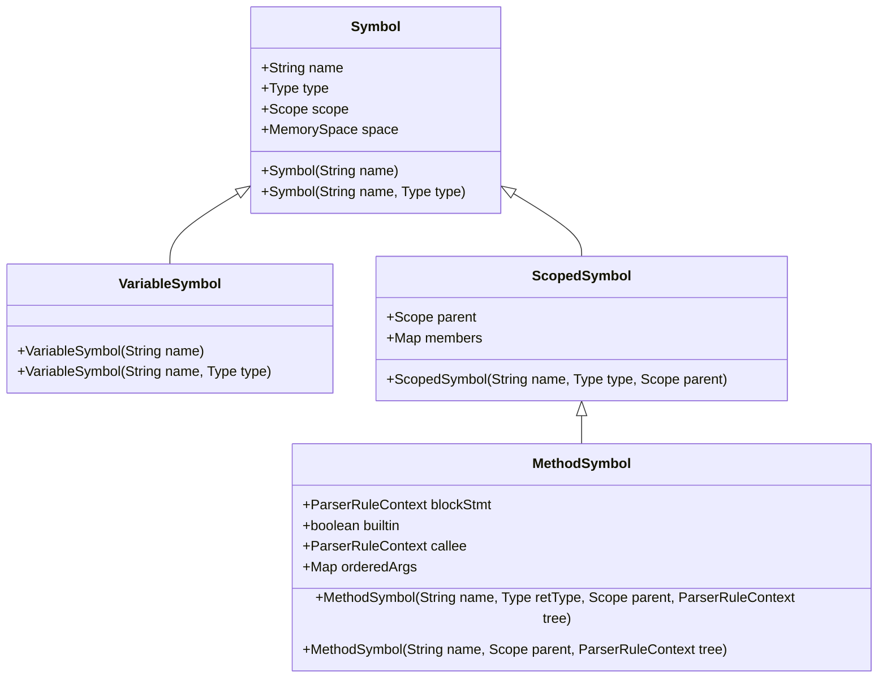
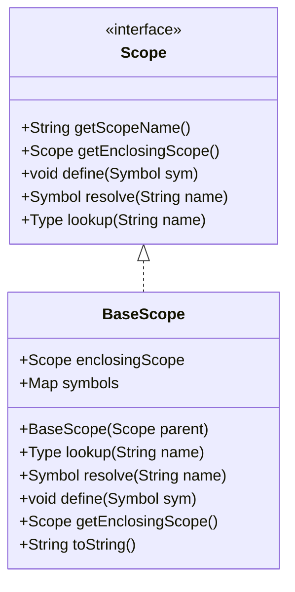
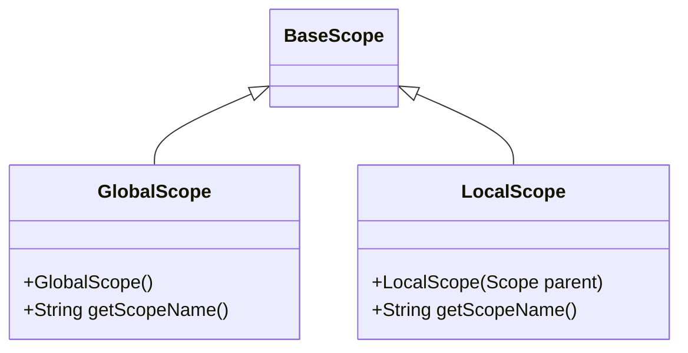
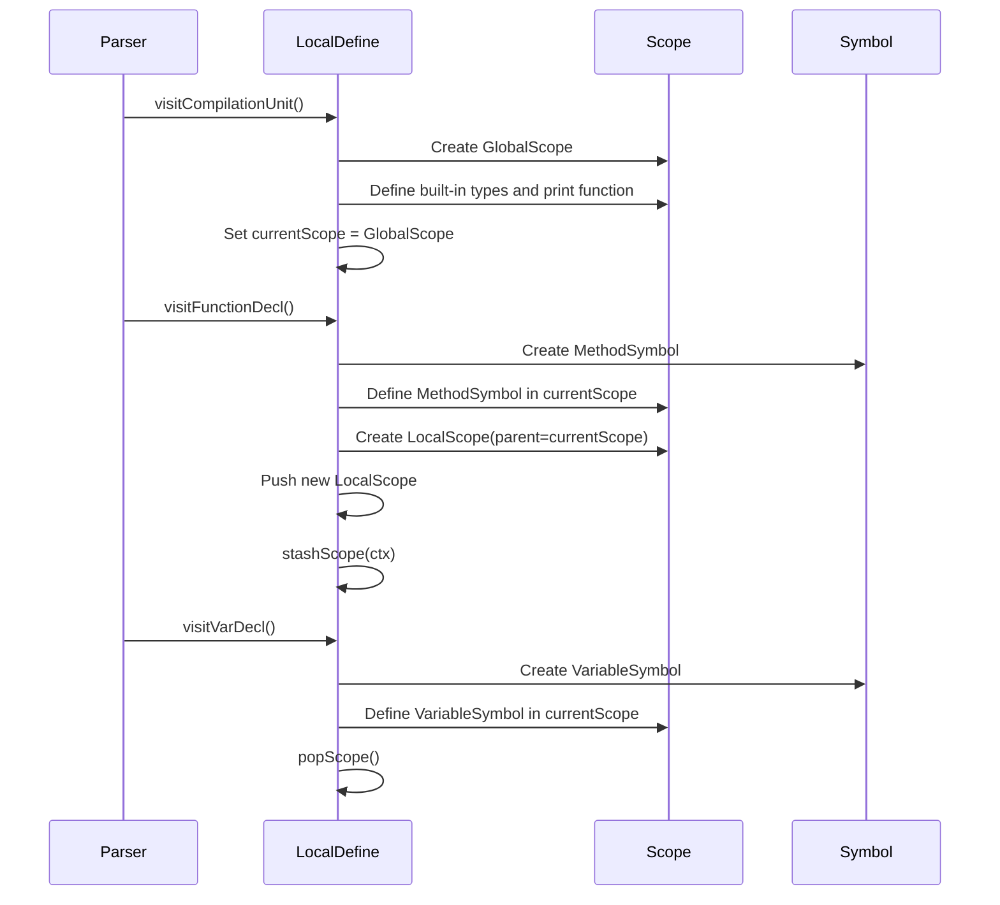

# Symbol Table and Scoping

<cite>
**Referenced Files in This Document**   
- [Symbol.java](file://ep16/src/main/java/org/teachfx/antlr4/ep16/symtab/Symbol.java)
- [VariableSymbol.java](file://ep16/src/main/java/org/teachfx/antlr4/ep16/symtab/VariableSymbol.java)
- [MethodSymbol.java](file://ep16/src/main/java/org/teachfx/antlr4/ep16/symtab/MethodSymbol.java)
- [Scope.java](file://ep16/src/main/java/org/teachfx/antlr4/ep16/symtab/Scope.java)
- [BaseScope.java](file://ep16/src/main/java/org/teachfx/antlr4/ep16/symtab/BaseScope.java)
- [GlobalScope.java](file://ep16/src/main/java/org/teachfx/antlr4/ep16/symtab/GlobalScope.java)
- [LocalScope.java](file://ep16/src/main/java/org/teachfx/antlr4/ep16/symtab/LocalScope.java)
- [LocalDefine.java](file://ep16/src/main/java/org/teachfx/antlr4/ep16/visitor/LocalDefine.java)
</cite>

## Table of Contents
1. [Introduction](#introduction)
2. [Symbol Base Class and Inheritance Hierarchy](#symbol-base-class-and-inheritance-hierarchy)
3. [Scope Interface and Base Implementation](#scope-interface-and-base-implementation)
4. [Global and Local Scope Implementations](#global-and-local-scope-implementations)
5. [Symbol Resolution and Definition Mechanism](#symbol-resolution-and-definition-mechanism)
6. [LocalDefine: Symbol Declaration and Scope Tracking](#localdefine-symbol-declaration-and-scope-tracking)
7. [Scope Nesting and Symbol Shadowing](#scope-nesting-and-symbol-shadowing)
8. [Role in Semantic Analysis and Type Checking](#role-in-semantic-analysis-and-type-checking)
9. [Collision Detection and Error Reporting](#collision-detection-and-error-reporting)
10. [Diagrams of Scope Hierarchies](#diagrams-of-scope-hierarchies)

## Introduction
The symbol table and scoping system is a fundamental component of the compiler's semantic analysis phase. It enables the tracking of identifiers such as variables, functions, and types across different scopes, ensuring correct declaration, resolution, and type checking. This document details the implementation of the symbol table system, focusing on the hierarchical scope structure, symbol management, and integration with the AST traversal process.

## Symbol Base Class and Inheritance Hierarchy

The `Symbol` class serves as the foundation for all symbol types in the system. It encapsulates core attributes such as name, type, scope, and memory space. Derived classes like `VariableSymbol` and `MethodSymbol` extend this base to represent specific kinds of declarations.

`VariableSymbol` inherits directly from `Symbol` and represents variable declarations, maintaining type information and scope context. `MethodSymbol`, on the other hand, extends `ScopedSymbol`, which allows it to act as a container for parameters and local variables, reflecting the nested nature of function bodies.



**Diagram sources**
- [Symbol.java](file://ep16/src/main/java/org/teachfx/antlr4/ep16/symtab/Symbol.java#L1-L38)
- [VariableSymbol.java](file://ep16/src/main/java/org/teachfx/antlr4/ep16/symtab/VariableSymbol.java#L1-L13)
- [MethodSymbol.java](file://ep16/src/main/java/org/teachfx/antlr4/ep16/symtab/MethodSymbol.java#L1-L31)

**Section sources**
- [Symbol.java](file://ep16/src/main/java/org/teachfx/antlr4/ep16/symtab/Symbol.java#L1-L38)
- [VariableSymbol.java](file://ep16/src/main/java/org/teachfx/antlr4/ep16/symtab/VariableSymbol.java#L1-L13)
- [MethodSymbol.java](file://ep16/src/main/java/org/teachfx/antlr4/ep16/symtab/MethodSymbol.java#L1-L31)

## Scope Interface and Base Implementation

The `Scope` interface defines the contract for all scope implementations, specifying methods for retrieving the scope name, accessing the enclosing (parent) scope, defining new symbols, and resolving symbol names. This abstraction enables uniform handling of global, local, and function scopes.

`BaseScope` provides a concrete implementation of the `Scope` interface using a `LinkedHashMap` to store symbols in declaration order. It supports hierarchical symbol resolution by first checking the current scope and then delegating to the enclosing scope if the symbol is not found. Built-in types (int, float, void) are automatically defined in every scope during initialization.



**Diagram sources**
- [Scope.java](file://ep16/src/main/java/org/teachfx/antlr4/ep16/symtab/Scope.java#L1-L16)
- [BaseScope.java](file://ep16/src/main/java/org/teachfx/antlr4/ep16/symtab/BaseScope.java#L1-L45)

**Section sources**
- [Scope.java](file://ep16/src/main/java/org/teachfx/antlr4/ep16/symtab/Scope.java#L1-L16)
- [BaseScope.java](file://ep16/src/main/java/org/teachfx/antlr4/ep16/symtab/BaseScope.java#L1-L45)

## Global and Local Scope Implementations

`GlobalScope` extends `BaseScope` and represents the outermost scope of the program. It is initialized with no parent scope and provides a fixed name ("gloabl"). This scope contains all globally declared functions and variables, including built-in functions like `print`.

`LocalScope` represents block-level or function-local scopes. It is created with a parent scope (typically a function or another block) and inherits all symbol resolution capabilities through its parent. Each time a new block is entered during AST traversal, a new `LocalScope` is pushed onto the scope stack.



**Diagram sources**
- [GlobalScope.java](file://ep16/src/main/java/org/teachfx/antlr4/ep16/symtab/GlobalScope.java#L1-L15)
- [LocalScope.java](file://ep16/src/main/java/org/teachfx/antlr4/ep16/symtab/LocalScope.java#L1-L13)

**Section sources**
- [GlobalScope.java](file://ep16/src/main/java/org/teachfx/antlr4/ep16/symtab/GlobalScope.java#L1-L15)
- [LocalScope.java](file://ep16/src/main/java/org/teachfx/antlr4/ep16/symtab/LocalScope.java#L1-L13)

## Symbol Resolution and Definition Mechanism

Symbols are defined using the `define(Symbol sym)` method, which inserts the symbol into the current scope's symbol map and sets the symbol's scope reference. This ensures bidirectional linking between symbols and their scopes.

Symbol resolution follows a lexical scoping rule: when resolving a name, the system first checks the current scope, then recursively checks each enclosing scope until the symbol is found or the global scope is reached. If no symbol is found, `null` is returned, indicating an undefined identifier.

The `lookup(String name)` method delegates to `resolve` but returns a `Type` object, useful in type checking contexts where only type information is needed.

## LocalDefine: Symbol Declaration and Scope Tracking

The `LocalDefine` class is an AST visitor responsible for establishing scope boundaries and defining symbols during the first pass of semantic analysis. It maintains a `currentScope` pointer and a `ParseTreeProperty<Scope>` to associate each AST node with its corresponding scope.

During traversal:
- At program entry, a `GlobalScope` is created and set as the current scope.
- Built-in functions (e.g., `print`) are pre-defined in the global scope.
- When entering a function declaration, a `MethodSymbol` is created and added to the current scope, then a new scope is pushed for the function body.
- Block statements trigger the creation of a `LocalScope`, which becomes the new current scope.
- Variable declarations are processed by creating `VariableSymbol` instances and defining them in the current scope.

The `stashScope(ctx)` method records the current scope for each AST node, enabling later passes (like type checking) to access the correct symbol context.



**Diagram sources**
- [LocalDefine.java](file://ep16/src/main/java/org/teachfx/antlr4/ep16/visitor/LocalDefine.java#L1-L152)

**Section sources**
- [LocalDefine.java](file://ep16/src/main/java/org/teachfx/antlr4/ep16/visitor/LocalDefine.java#L1-L152)

## Scope Nesting and Symbol Shadowing

The system supports nested scopes through the parent-child relationship between `BaseScope` instances. When a symbol is resolved, the search proceeds outward from the innermost scope to the outermost.

Symbol shadowing occurs when a variable in an inner scope has the same name as one in an outer scope. The inner declaration "shadows" the outer one, making the inner symbol accessible while the outer one is temporarily hidden. This behavior is naturally supported by the resolution algorithm, which returns the first match found in the scope chain.

For example, a local variable named `x` inside a function will shadow a global variable `x`. The resolution process finds the local `x` first and does not continue to the global scope.

## Role in Semantic Analysis and Type Checking

The symbol table is essential for semantic analysis, enabling:
- **Declaration Checking**: Ensuring variables and functions are declared before use.
- **Type Checking**: Verifying that operations are performed on compatible types by retrieving symbol types.
- **Scope Validation**: Confirming that identifiers are used within their valid scope.
- **Function Signature Matching**: Validating argument counts and types during function calls using `MethodSymbol` parameter lists.

Later passes, such as `TypeCheckVisitor`, use the `ParseTreeProperty<Scope>` populated by `LocalDefine` to retrieve the correct scope for each expression and perform type resolution.

## Collision Detection and Error Reporting

While the current implementation does not explicitly prevent duplicate symbol definitions, the `symbols` map in `BaseScope` will overwrite entries with the same key. A robust implementation would check for existing symbols before defining new ones and issue compilation errors for redeclarations.

For example, attempting to declare two variables with the same name in the same scope should generate an error. This can be implemented by checking `symbols.containsKey(name)` before calling `put()` in the `define()` method.

Built-in functions like `print` are defined once in the global scope, preventing user redefinition and ensuring consistent behavior.

## Diagrams of Scope Hierarchies

The following diagram illustrates a typical scope hierarchy for a program with global variables, a function declaration, and nested blocks:

```mermaid
graph TD
Global[GlobalScope] --> |enclosingScope| null
Global --> Method[MethodSymbol: main]
Global --> Var1[VariableSymbol: globalVar]
Method --> Local[LocalScope]
Local --> Block1[BlockScope]
Local --> Var2[VariableSymbol: localVar]
Block1 --> Inner[LocalScope]
Block1 --> Var3[VariableSymbol: temp]
Inner --> Var4[VariableSymbol: localVar (shadows outer)]
```

**Diagram sources**
- [GlobalScope.java](file://ep16/src/main/java/org/teachfx/antlr4/ep16/symtab/GlobalScope.java#L1-L15)
- [LocalScope.java](file://ep16/src/main/java/org/teachfx/antlr4/ep16/symtab/LocalScope.java#L1-L13)
- [MethodSymbol.java](file://ep16/src/main/java/org/teachfx/antlr4/ep16/symtab/MethodSymbol.java#L1-L31)

**Section sources**
- [BaseScope.java](file://ep16/src/main/java/org/teachfx/antlr4/ep16/symtab/BaseScope.java#L1-L45)
- [LocalDefine.java](file://ep16/src/main/java/org/teachfx/antlr4/ep16/visitor/LocalDefine.java#L1-L152)