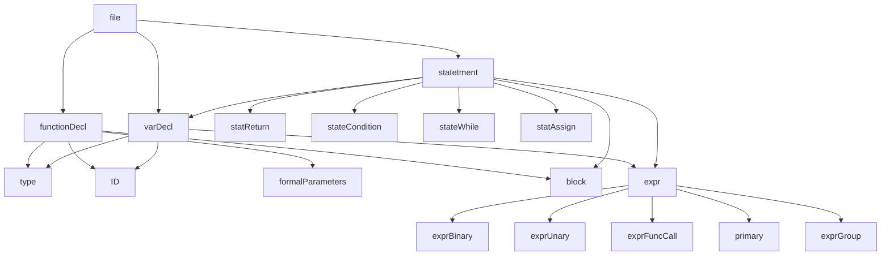
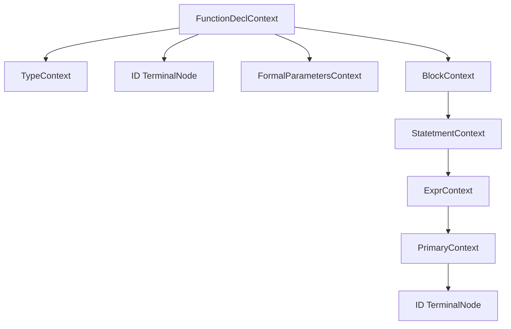
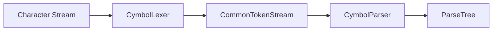

# Syntactic Analysis

<cite>
**Referenced Files in This Document**   
- [CymbolParser.java](file://ep16/src/main/java/org/teachfx/antlr4/ep16/parser/CymbolParser.java)
- [CymbolLexer.java](file://ep16/src/main/java/org/teachfx/antlr4/ep16/parser/CymbolLexer.java)
- [Compiler.java](file://ep16/src/main/java/org/teachfx/antlr4/ep16/Compiler.java)
- [VariableSymbol.java](file://ep16/src/main/java/org/teachfx/antlr4/ep16/symtab/VariableSymbol.java)
- [MethodSymbol.java](file://ep16/src/main/java/org/teachfx/antlr4/ep16/symtab/MethodSymbol.java)
- [Type.java](file://ep16/src/main/java/org/teachfx/antlr4/ep16/symtab/Type.java)
</cite>

## Table of Contents
1. [Introduction](#introduction)
2. [Grammar Structure and Rules](#grammar-structure-and-rules)
3. [Parse Tree Construction](#parse-tree-construction)
4. [Error Handling and Recovery](#error-handling-and-recovery)
5. [Lexer-Parser Integration](#lexer-parser-integration)
6. [Grammar Design Considerations](#grammar-design-considerations)
7. [Examples of Valid and Invalid Syntax](#examples-of-valid-and-invalid-syntax)

## Introduction
The syntactic analysis phase in the Cymbol language implementation using ANTLR4 involves the construction of a parser that validates the structure of source code according to a context-free grammar. The CymbolParser.java file contains the generated parser code that defines the syntax rules for program structure, declarations, statements, and expressions. This document explains how the parser implements these rules, constructs parse trees, handles errors, and integrates with the lexer through a token stream.

**Section sources**
- [CymbolParser.java](file://ep16/src/main/java/org/teachfx/antlr4/ep16/parser/CymbolParser.java#L0-L1567)

## Grammar Structure and Rules
The Cymbol grammar is defined using ANTLR4 syntax, which generates the CymbolParser.java class. The grammar includes rules for various language constructs such as program structure, declarations, statements, and expressions. The parser uses these rules to validate the syntax of Cymbol source code.

The grammar rules are organized hierarchically, with the `file` rule serving as the entry point for parsing. This rule can contain function declarations, variable declarations, and statements. Function declarations are defined by the `functionDecl` rule, which includes a return type, function name, formal parameters, and a block of statements. Variable declarations are handled by the `varDecl` rule, which specifies a type, variable name, optional initialization expression, and a semicolon.

Statements are defined by the `statetment` rule, which supports various types of statements including blocks, variable declarations, return statements, conditional statements, loops, assignments, and expression statements. Expressions are handled by the `expr` rule, which supports binary operations, unary operations, function calls, primary expressions, and grouped expressions.



**Diagram sources**
- [CymbolParser.java](file://ep16/src/main/java/org/teachfx/antlr4/ep16/parser/CymbolParser.java#L0-L1567)

**Section sources**
- [CymbolParser.java](file://ep16/src/main/java/org/teachfx/antlr4/ep16/parser/CymbolParser.java#L0-L1567)

## Parse Tree Construction
The Cymbol parser constructs a parse tree that represents the syntactic structure of the source code. Each rule in the grammar corresponds to a node in the parse tree. The parse tree is built during the parsing process as the parser matches input tokens to grammar rules.

For example, when parsing a function declaration, the parser creates a `FunctionDeclContext` node that contains child nodes for the return type, function name, formal parameters, and function body. Similarly, when parsing an expression, the parser creates an `ExprContext` node that may have child nodes for operands and operators.

The parse tree is represented using the ANTLR4 ParseTree interface, with specific context classes generated for each grammar rule. These context classes provide methods to access the tokens and child contexts that make up the parsed construct. The parse tree can be traversed using listeners or visitors to perform further analysis or code generation.



**Diagram sources**
- [CymbolParser.java](file://ep16/src/main/java/org/teachfx/antlr4/ep16/parser/CymbolParser.java#L0-L1567)

**Section sources**
- [CymbolParser.java](file://ep16/src/main/java/org/teachfx/antlr4/ep16/parser/CymbolParser.java#L0-L1567)

## Error Handling and Recovery
The Cymbol parser includes mechanisms for error handling and recovery to provide meaningful feedback when encountering invalid syntax. When the parser detects a syntax error, it reports the error using the error handler and attempts to recover so that it can continue parsing the rest of the input.

The parser uses ANTLR4's built-in error recovery strategies, which include panic mode recovery and error reporting. In panic mode recovery, the parser discards input tokens until it finds a token that allows it to continue parsing. This helps prevent cascading errors where one syntax error leads to multiple error reports.

The error handler can be customized to provide more specific error messages or to implement different recovery strategies. The parser also supports semantic predicates, which allow for context-sensitive parsing decisions and can be used to implement more sophisticated error recovery mechanisms.

**Section sources**
- [CymbolParser.java](file://ep16/src/main/java/org/teachfx/antlr4/ep16/parser/CymbolParser.java#L0-L1567)

## Lexer-Parser Integration
The Cymbol parser integrates with the lexer through a token stream, which provides a sequence of tokens for the parser to consume. The lexer, implemented in CymbolLexer.java, is responsible for breaking the input character stream into tokens based on the lexical rules defined in the grammar.

The token stream acts as an intermediary between the lexer and parser, allowing the parser to request tokens as needed during the parsing process. The parser uses the token types defined in the lexer to match input tokens to grammar rules. This separation of concerns allows the lexer to focus on lexical analysis while the parser handles syntactic analysis.

The integration between the lexer and parser is seamless, with the parser automatically using the token types and rule names generated by ANTLR4 from the grammar specification. This ensures consistency between the lexical and syntactic levels of the language definition.



**Diagram sources**
- [CymbolLexer.java](file://ep16/src/main/java/org/teachfx/antlr4/ep16/parser/CymbolLexer.java#L0-L264)
- [CymbolParser.java](file://ep16/src/main/java/org/teachfx/antlr4/ep16/parser/CymbolParser.java#L0-L1567)

**Section sources**
- [CymbolLexer.java](file://ep16/src/main/java/org/teachfx/antlr4/ep16/parser/CymbolLexer.java#L0-L264)
- [CymbolParser.java](file://ep16/src/main/java/org/teachfx/antlr4/ep16/parser/CymbolParser.java#L0-L1567)

## Grammar Design Considerations
The Cymbol grammar is designed with several considerations in mind, including ambiguity resolution, operator precedence, and associativity rules. These design choices ensure that the parser can correctly interpret the intended meaning of source code constructs.

Ambiguity in the grammar is resolved through careful rule ordering and the use of syntactic predicates. For example, the grammar distinguishes between function calls and variable references by requiring parentheses for function calls. This eliminates ambiguity between similar constructs.

Operator precedence and associativity are implemented using a recursive descent approach with multiple levels of expression rules. Higher precedence operators are parsed before lower precedence operators, ensuring that expressions are evaluated correctly according to the language's precedence rules. For example, multiplication and division have higher precedence than addition and subtraction.

The grammar also includes rules for handling common programming language constructs such as control flow statements, variable declarations, and function definitions. These rules are designed to be both expressive and unambiguous, allowing for a wide range of valid programs while preventing syntactically invalid constructs.

**Section sources**
- [CymbolParser.java](file://ep16/src/main/java/org/teachfx/antlr4/ep16/parser/CymbolParser.java#L0-L1567)

## Examples of Valid and Invalid Syntax
The Cymbol parser can handle a variety of valid syntax constructs, including function declarations, variable declarations, control flow statements, and expressions. For example, a valid function declaration might look like:

```cymbol
int add(int a, int b) {
    return a + b;
}
```

This would be parsed successfully, with the parser constructing a parse tree that represents the function's structure.

Invalid syntax, such as missing semicolons, mismatched parentheses, or undeclared variables, would result in parse errors. For example:

```cymbol
int x = 5
int y = 10;
```

This would generate a parse error due to the missing semicolon after the first variable declaration. The parser would report this error and attempt to recover, possibly by inserting a semicolon token and continuing to parse the rest of the input.

The parser's error recovery mechanisms help provide useful feedback to developers, indicating the location and nature of syntax errors while allowing the parsing process to continue for the remainder of the source file.

**Section sources**
- [CymbolParser.java](file://ep16/src/main/java/org/teachfx/antlr4/ep16/parser/CymbolParser.java#L0-L1567)