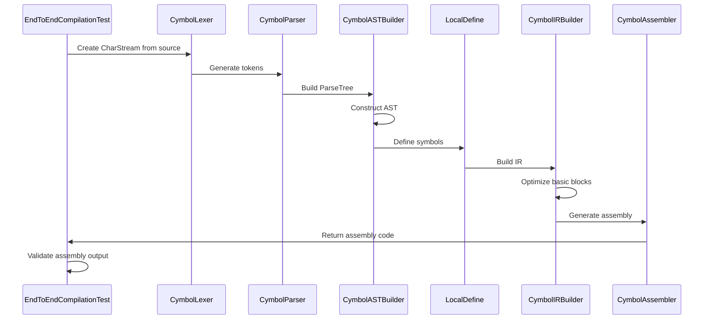
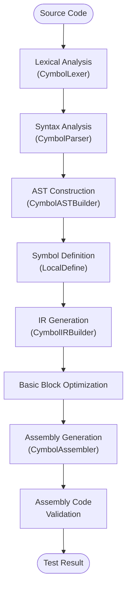
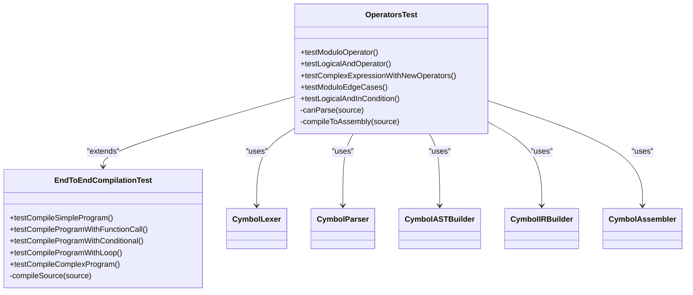
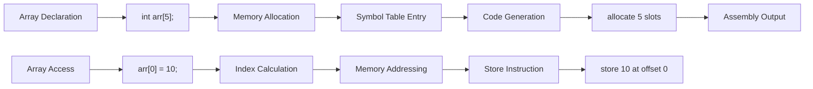
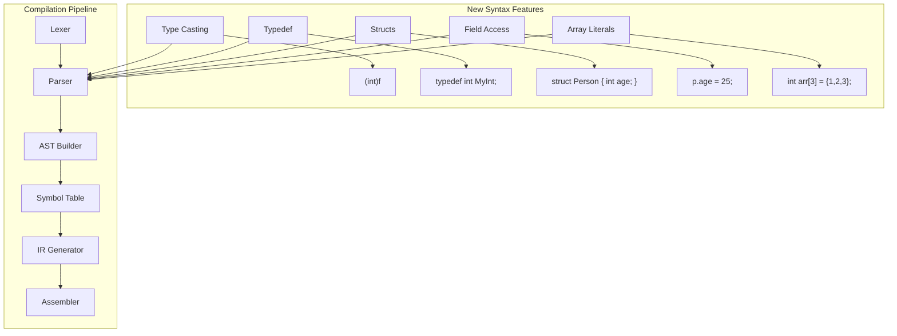
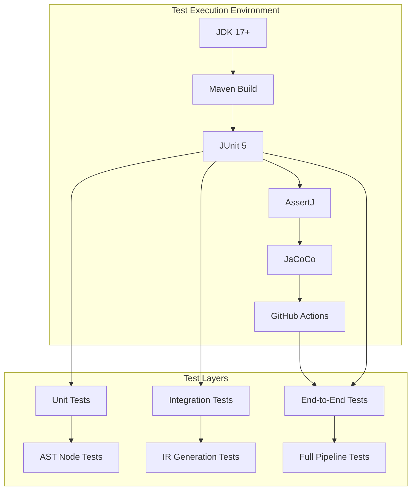
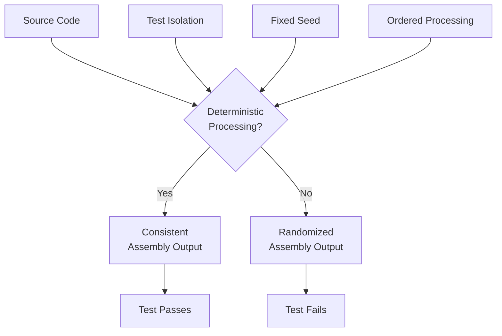

# End-to-End Testing

<cite>
**Referenced Files in This Document**   
- [EndToEndCompilationTest.java](file://ep20/src/test/java/org/teachfx/antlr4/ep20/pass/codegen/EndToEndCompilationTest.java)
- [OperatorsTest.java](file://ep20/src/test/java/org/teachfx/antlr4/ep20/OperatorsTest.java)
- [ArraysTest.java](file://ep20/src/test/java/org/teachfx/antlr4/ep20/ArraysTest.java)
- [NewSyntaxTest.java](file://ep20/src/test/java/org/teachfx/antlr4/ep20/NewSyntaxTest.java)
- [CymbolAssembler.java](file://ep20/src/main/java/org/teachfx/antlr4/ep20/pass/codegen/CymbolAssembler.java)
- [CymbolASTBuilder.java](file://ep20/src/main/java/org/teachfx/antlr4/ep20/pass/ast/CymbolASTBuilder.java)
- [CymbolIRBuilder.java](file://ep20/src/main/java/org/teachfx/antlr4/ep20/pass/ir/CymbolIRBuilder.java)
- [LocalDefine.java](file://ep20/src/main/java/org/teachfx/antlr4/ep20/pass/symtab/LocalDefine.java)
- [ASTNode.java](file://ep20/src/main/java/org/teachfx/antlr4/ep20/ast/ASTNode.java)
- [Prog.java](file://ep20/src/main/java/org/teachfx/antlr4/ep20/ir/Prog.java)
- [IRNode.java](file://ep20/src/main/java/org/teachfx/antlr4/ep20/ir/IRNode.java)
- [CymbolLexer.java](file://ep20/src/main/java/org/teachfx/antlr4/ep20/parser/CymbolLexer.java)
- [CymbolParser.java](file://ep20/src/main/java/org/teachfx/antlr4/ep20/parser/CymbolParser.java)
</cite>

## Table of Contents
1. [Introduction](#introduction)
2. [End-to-End Compilation Testing Framework](#end-to-end-compilation-testing-framework)
3. [Test Case Coverage for Core Language Features](#test-case-coverage-for-core-language-features)
4. [Operators Test Coverage](#operators-test-coverage)
5. [Arrays Test Coverage](#arrays-test-coverage)
6. [New Syntax Verification](#new-syntax-verification)
7. [Test Automation and Execution Environment](#test-automation-and-execution-environment)
8. [Handling Non-Deterministic Behaviors](#handling-non-deterministic-behaviors)
9. [Conclusion](#conclusion)

## Introduction
This document provides a comprehensive analysis of the end-to-end testing framework for the compilation pipeline in the EP20 compiler implementation. The focus is on the `EndToEndCompilationTest.java` class, which validates the complete workflow from source code input to executable VM bytecode generation. The testing framework ensures that all components of the compiler work together correctly, from lexical analysis through syntax parsing, AST construction, IR generation, and final code assembly. The document examines how test cases cover core language features including operators, arrays, control structures, and function calls, and how expected outputs are compared against actual VM execution results.

## End-to-End Compilation Testing Framework

The end-to-end testing framework is centered around the `EndToEndCompilationTest` class, which orchestrates the complete compilation pipeline and verifies the correctness of the generated assembly code. This test class simulates the full compilation process by programmatically executing each stage of the compiler and validating the final output.

**Diagram sources**
- [EndToEndCompilationTest.java](file://ep20/src/test/java/org/teachfx/antlr4/ep20/pass/codegen/EndToEndCompilationTest.java#L100-L220)
- [CymbolAssembler.java](file://ep20/src/main/java/org/teachfx/antlr4/ep20/pass/codegen/CymbolAssembler.java#L1-L50)

**Section sources**
- [EndToEndCompilationTest.java](file://ep20/src/test/java/org/teachfx/antlr4/ep20/pass/codegen/EndToEndCompilationTest.java#L1-L220)
- [CymbolAssembler.java](file://ep20/src/main/java/org/teachfx/antlr4/ep20/pass/codegen/CymbolAssembler.java#L1-L100)

## Test Case Coverage for Core Language Features

The end-to-end testing framework validates the compilation pipeline across various core language features. Each test case follows a consistent pattern: defining a source code snippet, executing the complete compilation process, and verifying the generated assembly code contains expected instructions.

### Control Structures Testing
The framework includes comprehensive tests for control structures such as conditional statements and loops. The `testCompileProgramWithConditional` method verifies that if-else statements are correctly translated into assembly code with appropriate comparison and branching instructions.

**Diagram sources**
- [EndToEndCompilationTest.java](file://ep20/src/test/java/org/teachfx/antlr4/ep20/pass/codegen/EndToEndCompilationTest.java#L70-L90)
- [CymbolIRBuilder.java](file://ep20/src/main/java/org/teachfx/antlr4/ep20/pass/ir/CymbolIRBuilder.java#L1-L30)

### Function Call Testing
The `testCompileProgramWithFunctionCall` method validates the compilation of programs with function calls. It ensures that function definitions are properly translated into labeled sections in the assembly code and that function calls generate appropriate call instructions with correct parameter handling.

**Section sources**
- [EndToEndCompilationTest.java](file://ep20/src/test/java/org/teachfx/antlr4/ep20/pass/codegen/EndToEndCompilationTest.java#L40-L70)

## Operators Test Coverage

The `OperatorsTest.java` class specifically targets the compilation of various operators in the language. These tests verify that both basic and newly introduced operators are correctly parsed and translated into appropriate VM instructions.

### Arithmetic and Logical Operators
The test suite includes validation for arithmetic operators (including modulo) and logical operators (such as logical AND). The `testModuloOperator` and `testLogicalAndOperator` methods confirm that these operators are recognized by the parser and generate correct assembly instructions.

**Diagram sources**
- [OperatorsTest.java](file://ep20/src/test/java/org/teachfx/antlr4/ep20/OperatorsTest.java#L1-L92)
- [EndToEndCompilationTest.java](file://ep20/src/test/java/org/teachfx/antlr4/ep20/pass/codegen/EndToEndCompilationTest.java#L1-L220)

### Complex Expression Testing
The `testComplexExpressionWithNewOperators` method validates the compilation of complex expressions that combine multiple operators. This ensures that operator precedence and associativity rules are correctly implemented in the generated code.

**Section sources**
- [OperatorsTest.java](file://ep20/src/test/java/org/teachfx/antlr4/ep20/OperatorsTest.java#L1-L92)

## Arrays Test Coverage

The `ArraysTest.java` class focuses on validating the compilation of array-related constructs in the language. These tests ensure that array declarations, initializations, and access patterns are correctly translated into assembly code.

### Array Declaration and Access
The test suite includes methods like `testArrayDeclaration`, `testArrayWithInitialization`, and `testArrayAccess` that verify different aspects of array handling. These tests confirm that array variables are properly allocated in memory and that array indexing operations generate appropriate pointer arithmetic and memory access instructions.

**Diagram sources**
- [ArraysTest.java](file://ep20/src/test/java/org/teachfx/antlr4/ep20/ArraysTest.java#L1-L77)

### Multi-dimensional and Complex Usage
The `testComplexArrayUsage` method validates more sophisticated array patterns, including using expressions as array indices and performing calculations with array elements. This ensures that the compiler can handle complex array operations correctly.

**Section sources**
- [ArraysTest.java](file://ep20/src/test/java/org/teachfx/antlr4/ep20/ArraysTest.java#L1-L77)

## New Syntax Verification

The `NewSyntaxTest.java` class is dedicated to verifying the correctness and backward compatibility of newly introduced syntax features in the language. This test suite plays a crucial role in ensuring that language extensions do not break existing functionality.

### Type System Extensions
The test suite validates new type-related features such as type casting and typedef declarations. The `testTypeCastExpression` and `testTypedefDeclaration` methods ensure that these features are correctly parsed and that the type system properly handles the new constructs.

**Diagram sources**
- [NewSyntaxTest.java](file://ep20/src/test/java/org/teachfx/antlr4/ep20/NewSyntaxTest.java#L1-L115)

### Struct and Field Access
The framework includes comprehensive tests for struct declarations and field access operations. The `testStructDeclaration` and `testFieldAccess` methods verify that structs are properly defined in the symbol table and that field access operations generate appropriate memory offset calculations.

**Section sources**
- [NewSyntaxTest.java](file://ep20/src/test/java/org/teachfx/antlr4/ep20/NewSyntaxTest.java#L1-L115)

## Test Automation and Execution Environment

The testing framework is designed for automated execution within a continuous integration environment. The tests are implemented using JUnit 5, providing a robust foundation for test organization, execution, and reporting.

### Test Execution Strategy
The framework follows a layered testing approach, with different test classes focusing on specific aspects of the compiler. The `EndToEndCompilationTest` serves as the integration point, while specialized test classes like `OperatorsTest`, `ArraysTest`, and `NewSyntaxTest` provide focused validation of specific language features.

**Diagram sources**
- [EndToEndCompilationTest.java](file://ep20/src/test/java/org/teachfx/antlr4/ep20/pass/codegen/EndToEndCompilationTest.java#L1-L220)
- [OperatorsTest.java](file://ep20/src/test/java/org/teachfx/antlr4/ep20/OperatorsTest.java#L1-L92)

### Parallel Test Execution
The test framework is configured to support parallel execution, improving test suite performance. The Maven Surefire plugin is configured to run test methods in parallel, allowing for faster feedback during development and continuous integration.

**Section sources**
- [pom.xml](file://ep20/pom.xml#L1-L50)

## Handling Non-Deterministic Behaviors

The testing framework includes mechanisms to handle potential non-deterministic behaviors that could arise during compilation and code generation. This is particularly important for ensuring consistent test results across different execution environments.

### Deterministic Code Generation
The compiler is designed to produce deterministic output for a given input program. The test framework verifies this by comparing the generated assembly code against expected patterns, ensuring that the same source code always produces identical assembly output.

**Diagram sources**
- [CymbolAssembler.java](file://ep20/src/main/java/org/teachfx/antlr4/ep20/pass/codegen/CymbolAssembler.java#L1-L100)

### Error Handling and Recovery
The framework includes tests that verify proper error handling and recovery mechanisms. The `canParse` utility method in various test classes demonstrates how the framework handles syntax errors gracefully, allowing for robust testing even with invalid input.

**Section sources**
- [OperatorsTest.java](file://ep20/src/test/java/org/teachfx/antlr4/ep20/OperatorsTest.java#L80-L92)
- [ArraysTest.java](file://ep20/src/test/java/org/teachfx/antlr4/ep20/ArraysTest.java#L65-L77)
- [NewSyntaxTest.java](file://ep20/src/test/java/org/teachfx/antlr4/ep20/NewSyntaxTest.java#L100-L115)

## Conclusion
The end-to-end testing framework for the EP20 compiler provides comprehensive validation of the complete compilation pipeline. By systematically testing core language features such as operators, arrays, control structures, and function calls, the framework ensures the correctness and reliability of the generated VM bytecode. The specialized test classes—`EndToEndCompilationTest`, `OperatorsTest`, `ArraysTest`, and `NewSyntaxTest`—work together to verify both existing functionality and new syntax additions, maintaining backward compatibility while enabling language evolution. The automated test execution environment and careful handling of non-deterministic behaviors ensure consistent and reliable test results, supporting robust compiler development and maintenance.