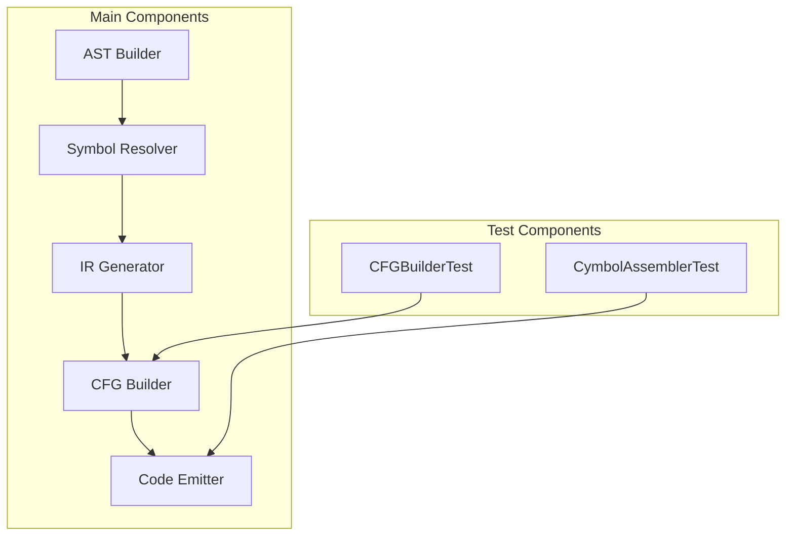
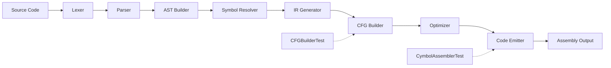
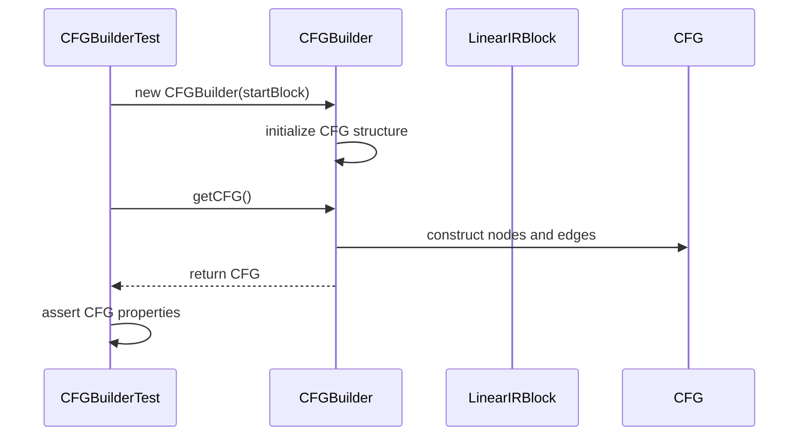
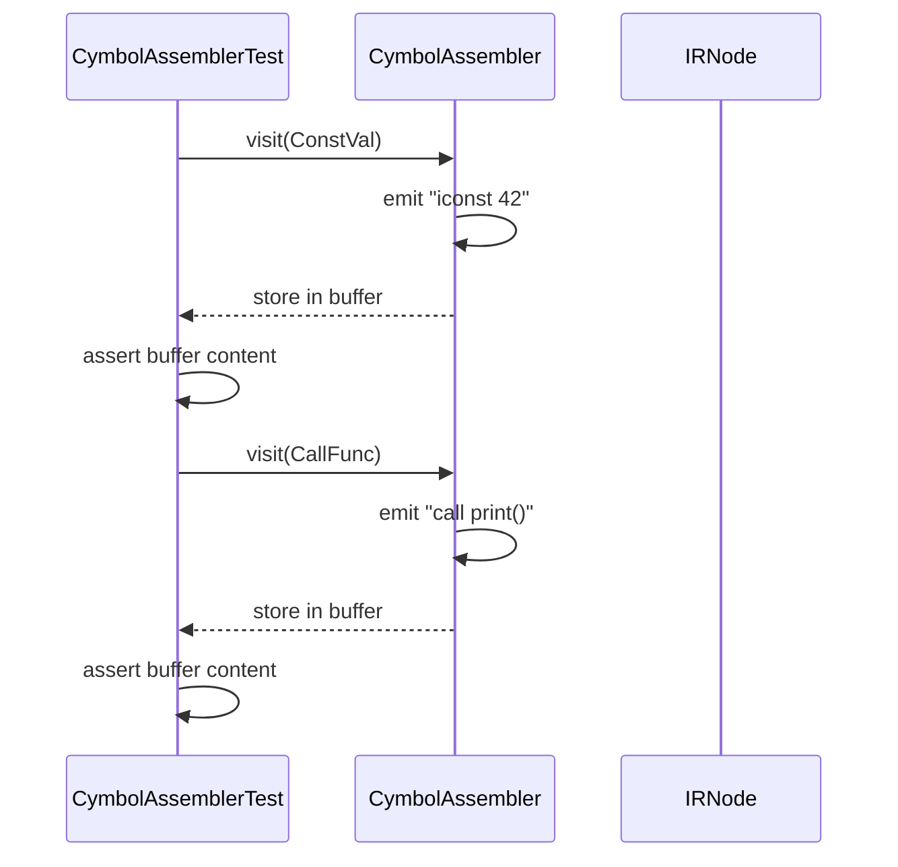
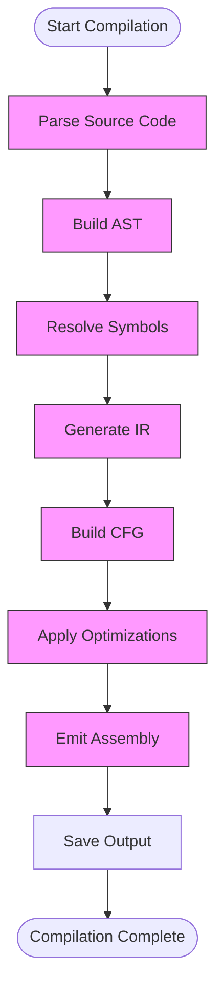
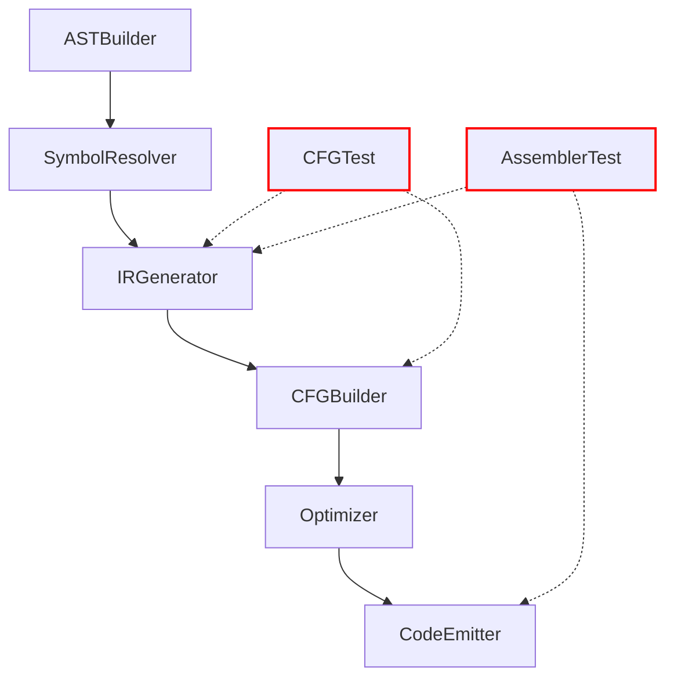

# Integration Testing

<cite>
**Referenced Files in This Document**   
- [CFGBuilderTest.java](file://ep20/src/test/java/org/teachfx/antlr4/ep20/pass/cfg/CFGBuilderTest.java)
- [CymbolAssemblerTest.java](file://ep20/src/test/java/org/teachfx/antlr4/ep20/pass/codegen/CymbolAssemblerTest.java)
- [Compiler.java](file://ep20/src/main/java/org/teachfx/antlr4/ep20/Compiler.java)
- [CymbolIRBuilder.java](file://ep20/src/main/java/org/teachfx/antlr4/ep20/pass/ir/CymbolIRBuilder.java)
- [CFGBuilder.java](file://ep20/src/main/java/org/teachfx/antlr4/ep20/pass/cfg/CFGBuilder.java)
- [CymbolAssembler.java](file://ep20/src/main/java/org/teachfx/antlr4/ep20/pass/codegen/CymbolAssembler.java)
</cite>

## Table of Contents
1. [Introduction](#introduction)
2. [Project Structure](#project-structure)
3. [Core Components](#core-components)
4. [Architecture Overview](#architecture-overview)
5. [Detailed Component Analysis](#detailed-component-analysis)
6. [Dependency Analysis](#dependency-analysis)
7. [Performance Considerations](#performance-considerations)
8. [Troubleshooting Guide](#troubleshooting-guide)
9. [Conclusion](#conclusion)

## Introduction
This document provides a comprehensive analysis of integration testing across compiler phases in the Antlr4-based compiler implementation. It focuses on how key components such as the AST builder, symbol resolver, IR generator, and code emitter interact and are tested together. The analysis centers on test implementations that validate intermediate representations after transformation passes, with particular emphasis on control flow graph construction, liveness analysis, and instruction emission. The document examines test scenarios that simulate real-world compilation workflows and addresses challenges in debugging integration failures between compiler phases.

## Project Structure
The project follows a modular structure with distinct phases of compilation separated into different packages. Each phase is implemented as a visitor pattern that traverses the AST and generates appropriate intermediate representations. The test structure mirrors the implementation, with integration tests located in corresponding test packages for each phase.

**Diagram sources**
- [Compiler.java](file://ep20/src/main/java/org/teachfx/antlr4/ep20/Compiler.java#L1-L162)
- [CymbolIRBuilder.java](file://ep20/src/main/java/org/teachfx/antlr4/ep20/pass/ir/CymbolIRBuilder.java#L1-L474)

**Section sources**
- [Compiler.java](file://ep20/src/main/java/org/teachfx/antlr4/ep20/Compiler.java#L1-L162)
- [CymbolIRBuilder.java](file://ep20/src/main/java/org/teachfx/antlr4/ep20/pass/ir/CymbolIRBuilder.java#L1-L474)

## Core Components
The compiler pipeline consists of several interconnected components that transform source code through multiple phases. The AST builder constructs the abstract syntax tree from parsed input, the symbol resolver establishes symbol tables and scopes, the IR generator produces three-address code, the CFG builder constructs control flow graphs from linear IR blocks, and the code emitter generates target assembly instructions. Integration testing ensures these components work together correctly, with test fixtures validating the output of each phase before it becomes input to the next.

**Section sources**
- [Compiler.java](file://ep20/src/main/java/org/teachfx/antlr4/ep20/Compiler.java#L1-L162)
- [CymbolIRBuilder.java](file://ep20/src/main/java/org/teachfx/antlr4/ep20/pass/ir/CymbolIRBuilder.java#L1-L474)

## Architecture Overview
The compiler architecture follows a phased approach where source code is processed through a series of transformations. Each phase produces an intermediate representation that serves as input to the subsequent phase. The integration testing framework validates the correctness of these transformations by examining the intermediate representations at key boundaries between phases.

**Diagram sources**
- [Compiler.java](file://ep20/src/main/java/org/teachfx/antlr4/ep20/Compiler.java#L1-L162)
- [CymbolIRBuilder.java](file://ep20/src/main/java/org/teachfx/antlr4/ep20/pass/ir/CymbolIRBuilder.java#L1-L474)

## Detailed Component Analysis

### Control Flow Graph Integration Testing
The CFGBuilderTest validates the construction of control flow graphs from intermediate representation blocks. It verifies that basic blocks are correctly linked according to control flow semantics and that the resulting CFG accurately represents the program's execution paths.

**Diagram sources**
- [CFGBuilderTest.java](file://ep20/src/test/java/org/teachfx/antlr4/ep20/pass/cfg/CFGBuilderTest.java#L1-L112)
- [CFGBuilder.java](file://ep20/src/main/java/org/teachfx/antlr4/ep20/pass/cfg/CFGBuilder.java)

**Section sources**
- [CFGBuilderTest.java](file://ep20/src/test/java/org/teachfx/antlr4/ep20/pass/cfg/CFGBuilderTest.java#L1-L112)

### Code Generation Integration Testing
The CymbolAssemblerTest verifies the correct emission of assembly instructions from IR nodes. It tests various instruction types including constant loading, function calls, and control flow operations, ensuring that the code emitter produces syntactically correct assembly output.

**Diagram sources**
- [CymbolAssemblerTest.java](file://ep20/src/test/java/org/teachfx/antlr4/ep20/pass/codegen/CymbolAssemblerTest.java#L1-L128)
- [CymbolAssembler.java](file://ep20/src/main/java/org/teachfx/antlr4/ep20/pass/codegen/CymbolAssembler.java)

**Section sources**
- [CymbolAssemblerTest.java](file://ep20/src/test/java/org/teachfx/antlr4/ep20/pass/codegen/CymbolAssemblerTest.java#L1-L128)

### Pipeline Integration
The Compiler class orchestrates the complete compilation pipeline, integrating all phases from source parsing to code generation. It demonstrates how multiple components work together in a real-world compilation workflow.

**Diagram sources**
- [Compiler.java](file://ep20/src/main/java/org/teachfx/antlr4/ep20/Compiler.java#L1-L162)
- [CymbolIRBuilder.java](file://ep20/src/main/java/org/teachfx/antlr4/ep20/pass/ir/CymbolIRBuilder.java#L1-L474)

**Section sources**
- [Compiler.java](file://ep20/src/main/java/org/teachfx/antlr4/ep20/Compiler.java#L1-L162)

## Dependency Analysis
The integration testing framework relies on a well-defined dependency chain between compiler components. Each phase depends on the successful completion of the previous phase, with intermediate representations serving as the contract between components.

**Diagram sources**
- [Compiler.java](file://ep20/src/main/java/org/teachfx/antlr4/ep20/Compiler.java#L1-L162)
- [CymbolIRBuilder.java](file://ep20/src/main/java/org/teachfx/antlr4/ep20/pass/ir/CymbolIRBuilder.java#L1-L474)

**Section sources**
- [Compiler.java](file://ep20/src/main/java/org/teachfx/antlr4/ep20/Compiler.java#L1-L162)

## Performance Considerations
The integration tests are designed to validate correctness rather than performance. However, the test structure allows for performance benchmarking by measuring execution time across the entire compilation pipeline. The use of visitor patterns and incremental IR generation helps minimize memory overhead during compilation.

## Troubleshooting Guide
When integration tests fail, the following strategies can help isolate faults between phases:
1. Verify the input to each phase matches expected intermediate representation
2. Check symbol table contents after symbol resolution
3. Validate IR instruction sequences before CFG construction
4. Examine CFG structure for correct basic block linking
5. Trace assembly output against expected instruction patterns

Common issues include incorrect symbol resolution, malformed IR instructions, broken control flow edges, and improper instruction encoding.

**Section sources**
- [CFGBuilderTest.java](file://ep20/src/test/java/org/teachfx/antlr4/ep20/pass/cfg/CFGBuilderTest.java#L1-L112)
- [CymbolAssemblerTest.java](file://ep20/src/test/java/org/teachfx/antlr4/ep20/pass/codegen/CymbolAssemblerTest.java#L1-L128)

## Conclusion
The integration testing framework effectively validates the interaction between compiler phases, ensuring that intermediate representations are correctly transformed from one phase to the next. The test cases for CFG construction and code generation demonstrate comprehensive coverage of key compilation workflows. By using realistic test fixtures that simulate complete compilation pipelines, the framework provides confidence in the correctness of the compiler implementation across all phases.