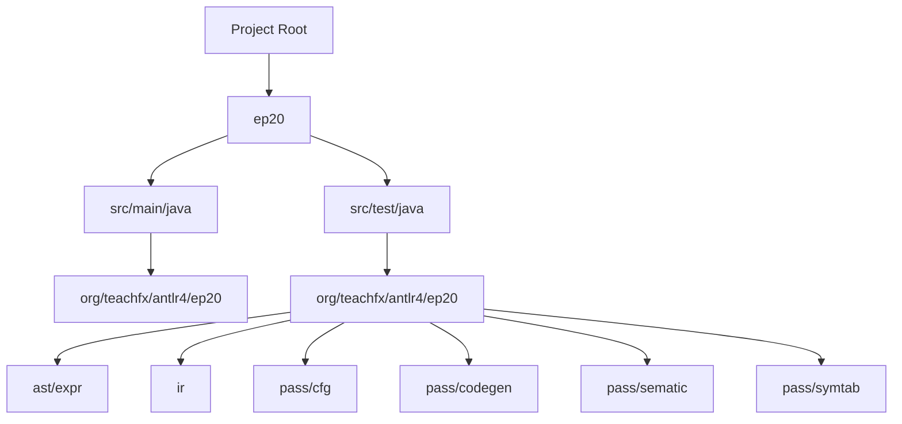
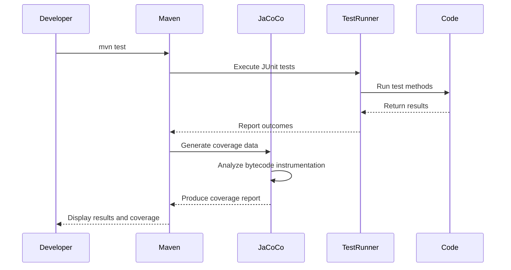
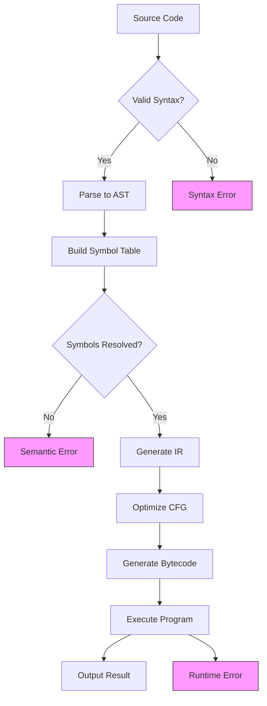

# Test Organization and Coverage

<cite>
**Referenced Files in This Document**   
- [pom.xml](file://ep20/pom.xml)
- [ComprehensiveTest.java](file://ep19/src/test/java/org/teachfx/antlr4/ep19/ComprehensiveTest.java)
- [IntegrationTest.java](file://ep19/src/test/java/org/teachfx/antlr4/ep19/IntegrationTest.java)
- [CymbolAssemblerTest.java](file://ep21/src/test/java/org/teachfx/antlr4/ep21/pass/codegen/CymbolAssemblerTest.java)
- [LivenessAnalysisTest.java](file://ep20/src/test/java/org/teachfx/antlr4/ep20/pass/cfg/LivenessAnalysisTest.java)
</cite>

## Table of Contents
1. [Introduction](#introduction)
2. [Project Structure and Test Organization](#project-structure-and-test-organization)
3. [Directory Structure Mirroring Main Components](#directory-structure-mirroring-main-components)
4. [Maven Integration and Test Execution](#maven-integration-and-test-execution)
5. [Test Categories and Selective Execution](#test-categories-and-selective-execution)
6. [Achieving High Test Coverage Across Critical Paths](#achieving-high-test-coverage-across-critical-paths)
7. [Best Practices for Test Naming and Data Management](#best-practices-for-test-naming-and-data-management)
8. [Documentation of Test Assumptions](#documentation-of-test-assumptions)
9. [Strategies for Maintaining Coverage in EP21 and Beyond](#strategies-for-maintaining-coverage-in-ep21-and-beyond)
10. [Conclusion](#conclusion)

## Introduction
This document provides a comprehensive overview of test organization principles and coverage measurement within the Antlr4-based compiler implementation project. It details how the test structure aligns with core compiler components such as AST, IR, passes, and symbol tables, enabling maintainable and navigable test suites. The integration of Maven via `pom.xml` facilitates standardized test execution and coverage reporting using JaCoCo. The document also explores strategies for organizing unit, integration, and end-to-end tests, ensuring high coverage across critical compilation paths. Best practices for naming conventions, managing test data, and documenting assumptions are discussed, along with forward-looking strategies to preserve coverage as new features are introduced in EP21 and future iterations.

## Project Structure and Test Organization
The project follows a modular structure where each evolutionary phase (ep1, ep10, ..., ep21) represents incremental development of the compiler. Test organization is consistent across phases, particularly evident from ep19 onward, where JUnit 5 is used for testing and Maven manages the build lifecycle. The `src/test/java` directory mirrors the main source structure under `src/main/java`, allowing for direct correspondence between test classes and implementation units. This alignment simplifies navigation and ensures that test files are colocated with their respective modules, enhancing maintainability and clarity.



**Diagram sources**
- [pom.xml](file://ep20/pom.xml)

**Section sources**
- [pom.xml](file://ep20/pom.xml)

## Directory Structure Mirroring Main Components
The test directory structure directly reflects the architecture of the compiler’s main components: **ast**, **ir**, **pass**, and **symtab**. Each component has a corresponding test subdirectory, enabling developers to quickly locate relevant tests. For example:
- `ast/expr` contains tests for expression nodes like `BinaryExprNodeTest.java`
- `ir` includes tests for intermediate representation constructs such as `ThreeAddressCodeTest.java`
- `pass/cfg` houses control flow graph analyses including `LivenessAnalysisTest.java`
- `pass/codegen` contains code generation logic tests like `CymbolAssemblerTest.java`

This mirroring supports modular development and isolated testing, making it easier to verify changes within specific compiler phases without affecting unrelated components.

**Section sources**
- [LivenessAnalysisTest.java](file://ep20/src/test/java/org/teachfx/antlr4/ep20/pass/cfg/LivenessAnalysisTest.java)
- [CymbolAssemblerTest.java](file://ep21/src/test/java/org/teachfx/antlr4/ep21/pass/codegen/CymbolAssemblerTest.java)

## Maven Integration and Test Execution
Maven is used as the build automation tool, configured through `pom.xml`. The configuration includes dependencies for testing frameworks (JUnit, AssertJ, Mockito) and integrates JaCoCo for code coverage analysis. The JaCoCo plugin is set up to generate coverage reports during the `test` phase and enforce minimum coverage rules if needed.

Key elements in `pom.xml`:
- **JaCoCo Plugin**: Prepares the agent, generates reports, and can enforce coverage thresholds.
- **JUnit 5 Support**: Enabled via standard Maven test execution.
- **ANTLR4 Plugin**: Generates parsers and visitors from grammar files, which are then tested.

Tests can be executed using standard Maven commands:
```bash
mvn test           # Runs all tests
mvn jacoco:report  # Generates coverage report in target/site/jacoco/
```

The generated HTML report provides line-by-line coverage metrics, helping identify untested branches and statements.



**Diagram sources**
- [pom.xml](file://ep20/pom.xml#L100-L140)

**Section sources**
- [pom.xml](file://ep20/pom.xml)

## Test Categories and Selective Execution
The test suite is organized into distinct categories based on scope and purpose:

### Unit Tests
Focused on individual classes or methods. Examples include:
- `BinaryExprNodeTest.java`: Validates AST node behavior
- `LivenessAnalysisTest.java`: Verifies liveness analysis logic at the IR level

These tests use fine-grained assertions and often employ mocking where dependencies exist.

### Integration Tests
Validate interactions between components. For example:
- `IntegrationTest.java` in ep19 verifies the full pipeline from source input to execution output.
- Tests cover struct declarations, method calls, recursion, and control flow.

### End-to-End Tests
Ensure the entire compiler functions correctly on real programs. These may involve:
- Parsing, semantic analysis, IR generation, code generation, and execution
- Verification of runtime behavior and error handling

Selective execution is supported via JUnit tags or Maven profiles. For instance:
```bash
mvn test -Dgroups="integration"  # Run only integration tests
```

Or using JUnit’s `@Tag("end-to-end")` annotations to filter test execution.

**Section sources**
- [IntegrationTest.java](file://ep19/src/test/java/org/teachfx/antlr4/ep19/IntegrationTest.java)
- [LivenessAnalysisTest.java](file://ep20/src/test/java/org/teachfx/antlr4/ep20/pass/cfg/LivenessAnalysisTest.java)

## Achieving High Test Coverage Across Critical Paths
High test coverage is achieved by systematically testing critical compiler paths:
- **Parsing and AST Construction**: Ensuring correct tree formation from valid and invalid inputs
- **Semantic Analysis**: Type checking, scope resolution, symbol table management
- **Control Flow and Data Flow**: Liveness analysis, CFG construction
- **Code Generation**: Instruction emission, register allocation (in later phases)

In `ComprehensiveTest.java`, edge cases such as type compatibility, implicit conversions, recursive functions, and error conditions are explicitly tested. Each test method targets a specific scenario, ensuring both positive and negative paths are covered.

For example:
- `testTypeCompatibilityInAssignment()` checks for type mismatch errors
- `testRecursiveFunction()` validates correct handling of recursion
- `testRuntimeError()` confirms detection of division by zero

JaCoCo reports help quantify coverage, guiding developers to add tests for uncovered branches.



**Diagram sources**
- [ComprehensiveTest.java](file://ep19/src/test/java/org/teachfx/antlr4/ep19/ComprehensiveTest.java)
- [IntegrationTest.java](file://ep19/src/test/java/org/teachfx/antlr4/ep19/IntegrationTest.java)

**Section sources**
- [ComprehensiveTest.java](file://ep19/src/test/java/org/teachfx/antlr4/ep19/ComprehensiveTest.java)

## Best Practices for Test Naming and Data Management
Clear naming conventions enhance test readability and maintenance:
- Test class names end with `Test` (e.g., `CymbolAssemblerTest`)
- Test methods use descriptive names in camelCase or with underscores (e.g., `testVisitAssign`)
- Use of `@DisplayName` annotations for human-readable descriptions (e.g., `"应正确访问赋值语句节点"`)

Test data is managed inline within test methods using strings representing source code snippets. This approach avoids external file dependencies and keeps tests self-contained. Helper methods like `assertCompilesNoError()` and `assertCompilationError()` abstract common assertion patterns, reducing duplication.

Example:
```java
private void assertCompilesNoError(String code) {
    CompilerTestUtil.CompilationResult result = CompilerTestUtil.compile(code, false);
    assertTrue(result.success, "Code should compile without errors");
}
```

This promotes consistency and makes test intent clear.

**Section sources**
- [ComprehensiveTest.java](file://ep19/src/test/java/org/teachfx/antlr4/ep19/ComprehensiveTest.java)
- [CymbolAssemblerTest.java](file://ep21/src/test/java/org/teachfx/antlr4/ep21/pass/codegen/CymbolAssemblerTest.java)

## Documentation of Test Assumptions
Each test class includes JavaDoc comments explaining its purpose and scope. For example:
- `ComprehensiveTest.java` documents its focus on edge cases in type checking and control flow
- `IntegrationTest.java` clarifies that it verifies the full compiler pipeline

Assertions are accompanied by meaningful failure messages that include the input code and expected behavior. This aids debugging when tests fail. Additionally, test setup methods (annotated with `@BeforeEach`) ensure consistent initial state, and variable names clearly reflect their role (e.g., `command1`, `slot1`).

Assumptions about language semantics (e.g., no implicit float-to-int conversion) are validated through dedicated test cases, making behavioral expectations explicit.

**Section sources**
- [ComprehensiveTest.java](file://ep19/src/test/java/org/teachfx/antlr4/ep19/ComprehensiveTest.java)
- [IntegrationTest.java](file://ep19/src/test/java/org/teachfx/antlr4/ep19/IntegrationTest.java)

## Strategies for Maintaining Coverage in EP21 and Beyond
As new features are added in EP21 and subsequent phases, maintaining high test coverage requires:
- **Test-Driven Development (TDD)**: Writing tests before implementing new features
- **Automated Coverage Monitoring**: Using JaCoCo thresholds to prevent coverage regression
- **Modular Test Expansion**: Adding test files in parallel with new source files
- **Regression Test Suites**: Preserving existing tests while extending functionality

For example, in EP21, new AST expression types or IR optimizations should be accompanied by corresponding unit tests in matching directories. Integration tests should be updated to include new syntax or runtime behaviors.

Continuous integration (CI) pipelines can automate test execution and coverage reporting, ensuring every pull request is validated against coverage standards.

**Section sources**
- [CymbolAssemblerTest.java](file://ep21/src/test/java/org/teachfx/antlr4/ep21/pass/codegen/CymbolAssemblerTest.java)

## Conclusion
The test organization in this Antlr4-based compiler project exemplifies best practices in software engineering: modular structure, comprehensive coverage, and tool integration. By mirroring the main components (ast, ir, pass, symtab) in the test hierarchy, the suite remains navigable and maintainable. Maven and JaCoCo provide robust infrastructure for execution and measurement, while JUnit 5 enables expressive, well-documented tests. With disciplined application of naming conventions, data management, and assumption documentation, the project ensures reliability and scalability. As development progresses into EP21 and beyond, these foundations will support sustainable growth and high-quality implementation.