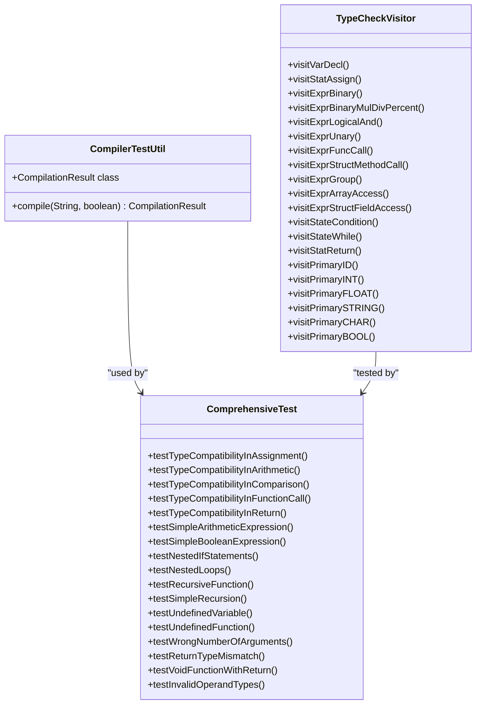
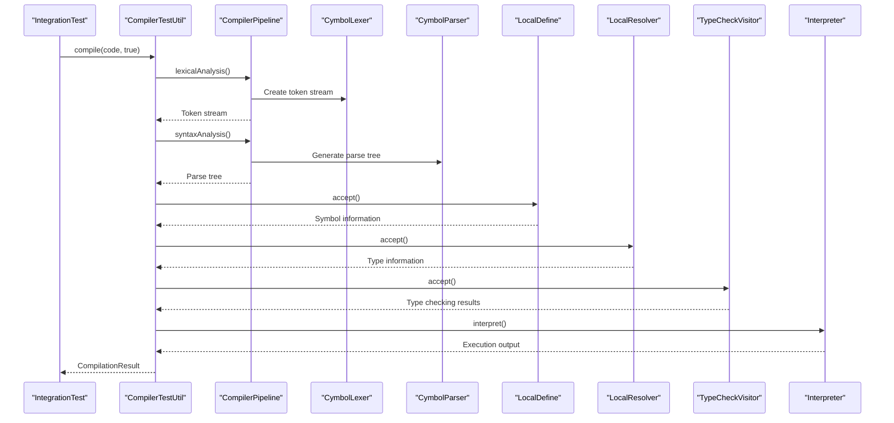
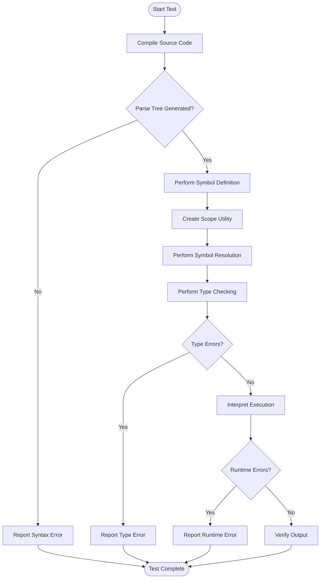
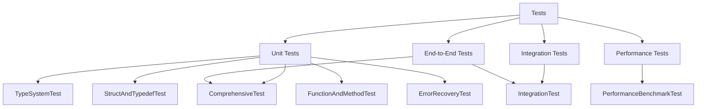
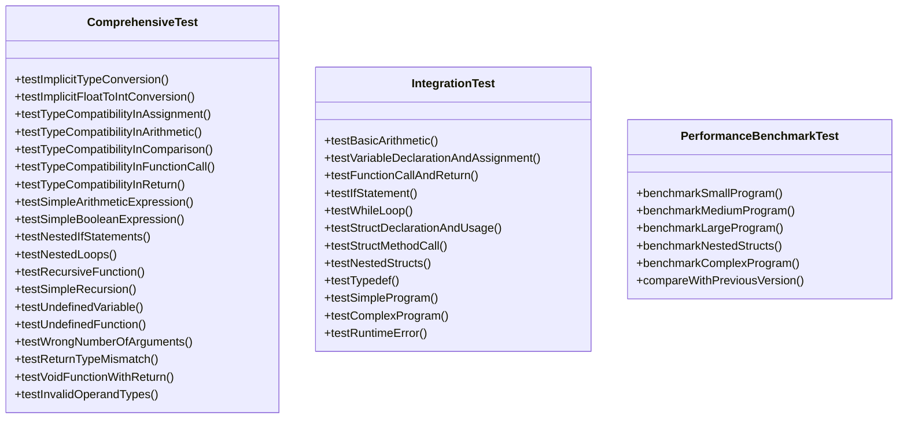
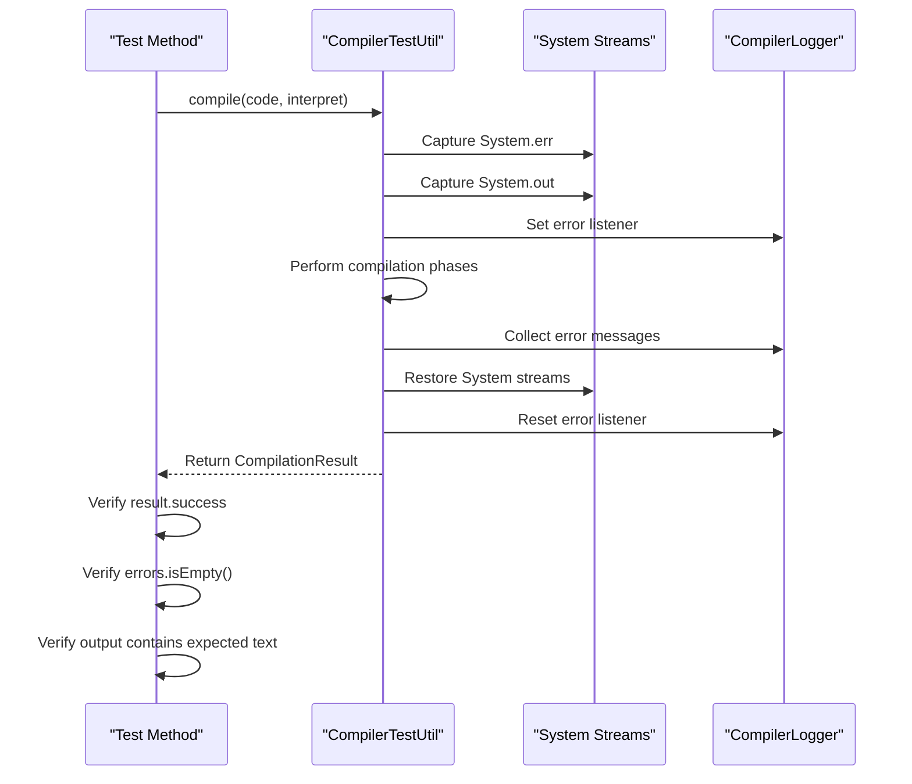
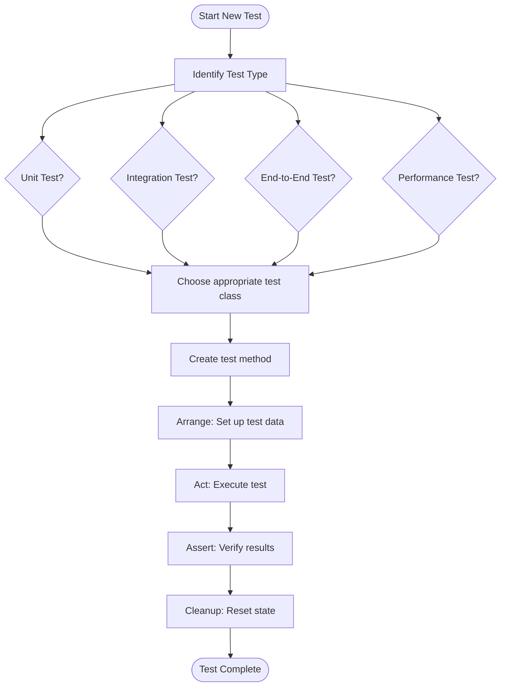
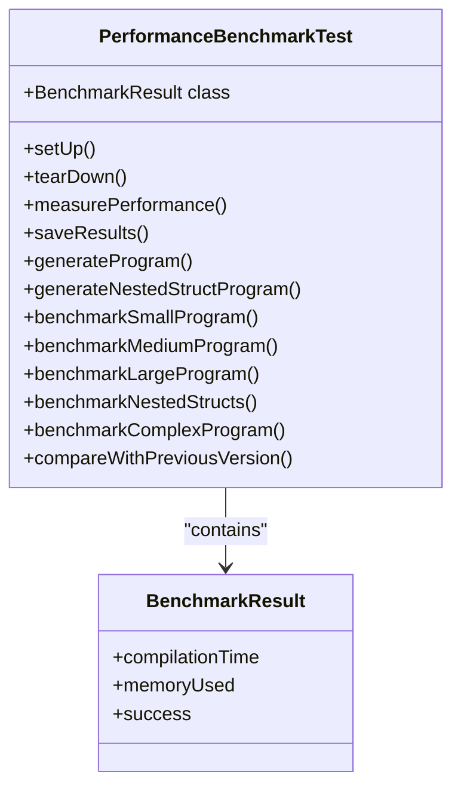
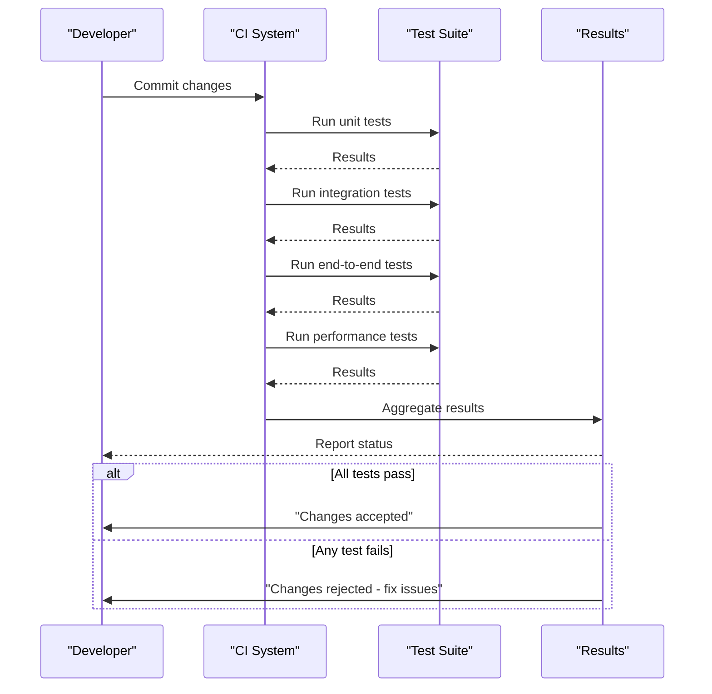

# Testing Strategy

<cite>
**Referenced Files in This Document**   
- [ComprehensiveTest.java](file://ep19/src/test/java/org/teachfx/antlr4/ep19/ComprehensiveTest.java)
- [IntegrationTest.java](file://ep19/src/test/java/org/teachfx/antlr4/ep19/IntegrationTest.java)
- [PerformanceBenchmarkTest.java](file://ep19/src/test/java/org/teachfx/antlr4/ep19/PerformanceBenchmarkTest.java)
- [CompilerTestUtil.java](file://ep19/src/test/java/org/teachfx/antlr4/ep19/CompilerTestUtil.java)
- [CompilerPipeline.java](file://ep19/src/main/java/org/teachfx/antlr4/ep19/pipeline/CompilerPipeline.java)
- [DefaultCompilerPipeline.java](file://ep19/src/main/java/org/teachfx/antlr4/ep19/pipeline/DefaultCompilerPipeline.java)
- [CompilationResult.java](file://ep19/src/main/java/org/teachfx/antlr4/ep19/pipeline/CompilationResult.java)
- [TypeCheckVisitor.java](file://ep19/src/main/java/org/teachfx/antlr4/ep19/pass/TypeCheckVisitor.java)
</cite>

## Table of Contents
1. [Introduction](#introduction)
2. [Unit Testing Strategy](#unit-testing-strategy)
3. [Integration Testing](#integration-testing)
4. [End-to-End Testing](#end-to-end-testing)
5. [Test Organization](#test-organization)
6. [Test Case Examples](#test-case-examples)
7. [Test Fixtures and Output Verification](#test-fixtures-and-output-verification)
8. [Test Coverage Measurement](#test-coverage-measurement)
9. [Writing New Tests](#writing-new-tests)
10. [Performance Benchmarking](#performance-benchmarking)
11. [Regression Testing](#regression-testing)

## Introduction
The testing framework for the Cymbol compiler is designed to ensure robustness, correctness, and performance across all compilation phases. The strategy employs a multi-layered approach with unit tests for individual components, integration tests for phase interactions, and end-to-end tests for complete program compilation and execution. The framework uses JUnit 5 as the primary testing framework and includes comprehensive performance benchmarking capabilities.

## Unit Testing Strategy

The unit testing strategy focuses on verifying individual compiler components in isolation. Each compilation phase has dedicated test classes that validate functionality through targeted test cases.

**Diagram sources**
- [ComprehensiveTest.java](file://ep19/src/test/java/org/teachfx/antlr4/ep19/ComprehensiveTest.java)
- [TypeCheckVisitor.java](file://ep19/src/main/java/org/teachfx/antlr4/ep19/pass/TypeCheckVisitor.java)

**Section sources**
- [ComprehensiveTest.java](file://ep19/src/test/java/org/teachfx/antlr4/ep19/ComprehensiveTest.java)
- [TypeCheckVisitor.java](file://ep19/src/main/java/org/teachfx/antlr4/ep19/pass/TypeCheckVisitor.java)

## Integration Testing

Integration tests verify the interaction between compilation phases, ensuring that the output of one phase correctly serves as input to the next phase in the compilation pipeline.

**Diagram sources**
- [IntegrationTest.java](file://ep19/src/test/java/org/teachfx/antlr4/ep19/IntegrationTest.java)
- [CompilerTestUtil.java](file://ep19/src/test/java/org/teachfx/antlr4/ep19/CompilerTestUtil.java)
- [DefaultCompilerPipeline.java](file://ep19/src/main/java/org/teachfx/antlr4/ep19/pipeline/DefaultCompilerPipeline.java)

**Section sources**
- [IntegrationTest.java](file://ep19/src/test/java/org/teachfx/antlr4/ep19/IntegrationTest.java)
- [CompilerTestUtil.java](file://ep19/src/test/java/org/teachfx/antlr4/ep19/CompilerTestUtil.java)

## End-to-End Testing

End-to-end tests validate the complete compilation and execution process, from source code input to program output. These tests ensure that the entire compiler pipeline functions correctly.

**Diagram sources**
- [IntegrationTest.java](file://ep19/src/test/java/org/teachfx/antlr4/ep19/IntegrationTest.java)
- [CompilerTestUtil.java](file://ep19/src/test/java/org/teachfx/antlr4/ep19/CompilerTestUtil.java)

**Section sources**
- [IntegrationTest.java](file://ep19/src/test/java/org/teachfx/antlr4/ep19/IntegrationTest.java)

## Test Organization

The test suite is organized by component and phase, following the structure of the compiler architecture. Each major component has its own test class, and tests are grouped by functionality.

**Diagram sources**
- [ComprehensiveTest.java](file://ep19/src/test/java/org/teachfx/antlr4/ep19/ComprehensiveTest.java)
- [IntegrationTest.java](file://ep19/src/test/java/org/teachfx/antlr4/ep19/IntegrationTest.java)
- [PerformanceBenchmarkTest.java](file://ep19/src/test/java/org/teachfx/antlr4/ep19/PerformanceBenchmarkTest.java)

**Section sources**
- [ComprehensiveTest.java](file://ep19/src/test/java/org/teachfx/antlr4/ep19/ComprehensiveTest.java)
- [IntegrationTest.java](file://ep19/src/test/java/org/teachfx/antlr4/ep19/IntegrationTest.java)
- [PerformanceBenchmarkTest.java](file://ep19/src/test/java/org/teachfx/antlr4/ep19/PerformanceBenchmarkTest.java)

## Test Case Examples

The test suite includes comprehensive examples for edge cases and error conditions, ensuring robust handling of various scenarios.

**Diagram sources**
- [ComprehensiveTest.java](file://ep19/src/test/java/org/teachfx/antlr4/ep19/ComprehensiveTest.java)
- [IntegrationTest.java](file://ep19/src/test/java/org/teachfx/antlr4/ep19/IntegrationTest.java)
- [PerformanceBenchmarkTest.java](file://ep19/src/test/java/org/teachfx/antlr4/ep19/PerformanceBenchmarkTest.java)

**Section sources**
- [ComprehensiveTest.java](file://ep19/src/test/java/org/teachfx/antlr4/ep19/ComprehensiveTest.java)
- [IntegrationTest.java](file://ep19/src/test/java/org/teachfx/antlr4/ep19/IntegrationTest.java)
- [PerformanceBenchmarkTest.java](file://ep19/src/test/java/org/teachfx/antlr4/ep19/PerformanceBenchmarkTest.java)

## Test Fixtures and Output Verification

The testing framework uses test fixtures and expected output verification to ensure consistent and reliable test results.

**Diagram sources**
- [CompilerTestUtil.java](file://ep19/src/test/java/org/teachfx/antlr4/ep19/CompilerTestUtil.java)
- [IntegrationTest.java](file://ep19/src/test/java/org/teachfx/antlr4/ep19/IntegrationTest.java)

**Section sources**
- [CompilerTestUtil.java](file://ep19/src/test/java/org/teachfx/antlr4/ep19/CompilerTestUtil.java)

## Test Coverage Measurement

Test coverage is measured through comprehensive test cases that validate all major functionality paths and error conditions in the compiler.

```mermaid
graph TD
Coverage[Test Coverage] --> Unit[Unit Test Coverage]
Coverage --> Integration[Integration Test Coverage]
Coverage --> EndToEnd[End-to-End Test Coverage]
Coverage --> Performance[Performance Test Coverage]
Unit --> TypeChecking[Type Checking]
Unit --> Expression[Expression Evaluation]
Unit --> Statement[Statement Processing]
Unit --> ControlFlow[Control Flow]
Unit --> Function[Function Handling]
Unit --> Struct[Struct Handling]
Unit --> Typedef[Typedef Handling]
Integration --> PhaseInteraction[Phase Interactions]
Integration --> ErrorRecovery[Error Recovery]
Integration --> SymbolResolution[Symbol Resolution]
EndToEnd --> ProgramExecution[Program Execution]
EndToEnd --> OutputVerification[Output Verification]
EndToEnd --> RuntimeError[Runtime Error Handling]
Performance --> CompilationTime[Compilation Time]
Performance --> MemoryUsage[Memory Usage]
Performance --> Scalability[Scalability]
```

**Diagram sources**
- [ComprehensiveTest.java](file://ep19/src/test/java/org/teachfx/antlr4/ep19/ComprehensiveTest.java)
- [IntegrationTest.java](file://ep19/src/test/java/org/teachfx/antlr4/ep19/IntegrationTest.java)
- [PerformanceBenchmarkTest.java](file://ep19/src/test/java/org/teachfx/antlr4/ep19/PerformanceBenchmarkTest.java)

**Section sources**
- [ComprehensiveTest.java](file://ep19/src/test/java/org/teachfx/antlr4/ep19/ComprehensiveTest.java)
- [IntegrationTest.java](file://ep19/src/test/java/org/teachfx/antlr4/ep19/IntegrationTest.java)
- [PerformanceBenchmarkTest.java](file://ep19/src/test/java/org/teachfx/antlr4/ep19/PerformanceBenchmarkTest.java)

## Writing New Tests

When extending the compiler, new tests should follow the established patterns and conventions to maintain consistency and coverage.

**Diagram sources**
- [ComprehensiveTest.java](file://ep19/src/test/java/org/teachfx/antlr4/ep19/ComprehensiveTest.java)
- [IntegrationTest.java](file://ep19/src/test/java/org/teachfx/antlr4/ep19/IntegrationTest.java)
- [PerformanceBenchmarkTest.java](file://ep19/src/test/java/org/teachfx/antlr4/ep19/PerformanceBenchmarkTest.java)

**Section sources**
- [ComprehensiveTest.java](file://ep19/src/test/java/org/teachfx/antlr4/ep19/ComprehensiveTest.java)
- [IntegrationTest.java](file://ep19/src/test/java/org/teachfx/antlr4/ep19/IntegrationTest.java)
- [PerformanceBenchmarkTest.java](file://ep19/src/test/java/org/teachfx/antlr4/ep19/PerformanceBenchmarkTest.java)

## Performance Benchmarking

Performance benchmarking tests measure compilation time and memory usage for different program sizes and complexities.

**Diagram sources**
- [PerformanceBenchmarkTest.java](file://ep19/src/test/java/org/teachfx/antlr4/ep19/PerformanceBenchmarkTest.java)

**Section sources**
- [PerformanceBenchmarkTest.java](file://ep19/src/test/java/org/teachfx/antlr4/ep19/PerformanceBenchmarkTest.java)

## Regression Testing

Regression testing is performed through the comprehensive test suite, ensuring that new changes do not break existing functionality.

**Diagram sources**
- [ComprehensiveTest.java](file://ep19/src/test/java/org/teachfx/antlr4/ep19/ComprehensiveTest.java)
- [IntegrationTest.java](file://ep19/src/test/java/org/teachfx/antlr4/ep19/IntegrationTest.java)
- [PerformanceBenchmarkTest.java](file://ep19/src/test/java/org/teachfx/antlr4/ep19/PerformanceBenchmarkTest.java)

**Section sources**
- [ComprehensiveTest.java](file://ep19/src/test/java/org/teachfx/antlr4/ep19/ComprehensiveTest.java)
- [IntegrationTest.java](file://ep19/src/test/java/org/teachfx/antlr4/ep19/IntegrationTest.java)
- [PerformanceBenchmarkTest.java](file://ep19/src/test/java/org/teachfx/antlr4/ep19/PerformanceBenchmarkTest.java)