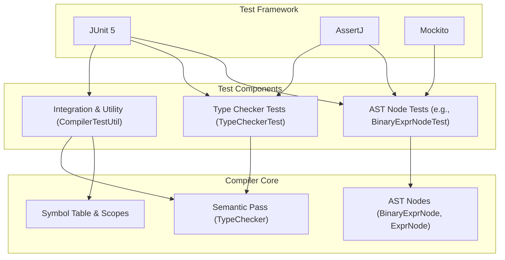
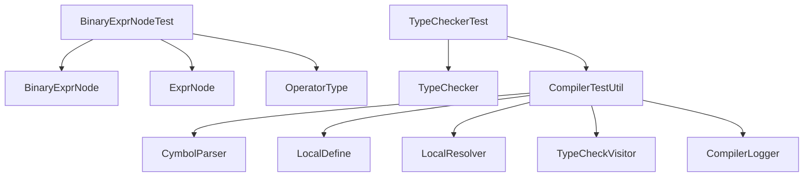

# Unit Testing

<cite>
**Referenced Files in This Document**   
- [BinaryExprNodeTest.java](file://ep20/src/test/java/org/teachfx/antlr4/ep20/ast/expr/BinaryExprNodeTest.java)
- [TypeCheckerTest.java](file://ep20/src/test/java/org/teachfx/antlr4/ep20/pass/sematic/TypeCheckerTest.java)
- [BinaryExprNode.java](file://ep20/src/main/java/org/teachfx/antlr4/ep20/ast/expr/BinaryExprNode.java)
- [TypeChecker.java](file://ep20/src/main/java/org/teachfx/antlr4/ep20/pass/sematic/TypeChecker.java)
- [CompilerTestUtil.java](file://ep19/src/test/java/org/teachfx/antlr4/ep19/CompilerTestUtil.java)
</cite>

## Table of Contents
1. [Introduction](#introduction)
2. [Core Components](#core-components)
3. [Architecture Overview](#architecture-overview)
4. [Detailed Component Analysis](#detailed-component-analysis)
5. [Dependency Analysis](#dependency-analysis)
6. [Performance Considerations](#performance-considerations)
7. [Troubleshooting Guide](#troubleshooting-guide)
8. [Conclusion](#conclusion)

## Introduction
This document provides a comprehensive overview of the unit testing framework within the compiler implementation, focusing on how JUnit is utilized to validate individual components such as abstract syntax tree (AST) nodes, intermediate representation (IR) expressions, symbol table operations, and type checking logic. The analysis covers test structure, assertion patterns, exception handling, and strategies for testing edge cases like invalid type assignments or malformed expressions. It also includes guidance on writing new tests when extending language features or adding compiler passes, with emphasis on test isolation, mocking, and performance for rapid feedback.

## Core Components

The unit testing infrastructure is built around JUnit 5 and leverages assertion libraries like AssertJ for expressive test conditions. Key components under test include AST node implementations (e.g., `BinaryExprNode`), semantic analysis passes (e.g., `TypeChecker`), and utility classes that support compilation phases. Test utilities such as `CompilerTestUtil` provide reusable scaffolding for parsing, resolving scopes, and capturing diagnostic output during test execution.

**Section sources**
- [BinaryExprNodeTest.java](file://ep20/src/test/java/org/teachfx/antlr4/ep20/ast/expr/BinaryExprNodeTest.java#L1-L106)
- [TypeCheckerTest.java](file://ep20/src/test/java/org/teachfx/antlr4/ep20/pass/sematic/TypeCheckerTest.java#L1-L14)
- [CompilerTestUtil.java](file://ep19/src/test/java/org/teachfx/antlr4/ep19/CompilerTestUtil.java#L1-L132)

## Architecture Overview

The testing architecture follows a layered approach where individual compiler components are tested in isolation using mock objects for dependencies such as parser context (`ParserRuleContext`). Higher-level integration tests use full parse trees and real symbol tables to validate end-to-end behavior. The `CompilerTestUtil` class encapsulates common setup logic, including error collection, stream redirection, and phase execution (parsing, name resolution, type checking).



**Diagram sources**
- [BinaryExprNodeTest.java](file://ep20/src/test/java/org/teachfx/antlr4/ep20/ast/expr/BinaryExprNodeTest.java#L1-L106)
- [TypeCheckerTest.java](file://ep20/src/test/java/org/teachfx/antlr4/ep20/pass/sematic/TypeCheckerTest.java#L1-L14)
- [CompilerTestUtil.java](file://ep19/src/test/java/org/teachfx/antlr4/ep19/CompilerTestUtil.java#L1-L132)

## Detailed Component Analysis

### Binary Expression Node Testing

The `BinaryExprNodeTest` class validates the correctness of binary expression node creation, operation type assignment, operand management, and structural equality. It uses mock instances of `ParserRuleContext` to satisfy constructor requirements without relying on actual parsing.

#### Test Case Design
```mermaid
classDiagram
class BinaryExprNode {
+getOpType() BinaryOpType
+getLhs() ExprNode
+getRhs() ExprNode
+setOpType(BinaryOpType)
+setLhs(ExprNode)
+setRhs(ExprNode)
+getExprType() Type
}
class ExprNode {
<<abstract>>
}
class IntExprNode {
+IntExprNode(int, ParserRuleContext)
}
class OperatorType$BinaryOpType {
<<enumeration>>
ADD
SUB
MUL
DIV
}
BinaryExprNode --> ExprNode : extends
IntExprNode --> ExprNode : extends
BinaryExprNode --> OperatorType$BinaryOpType : has
```

**Diagram sources**
- [BinaryExprNode.java](file://ep20/src/main/java/org/teachfx/antlr4/ep20/ast/expr/BinaryExprNode.java#L1-L96)
- [BinaryExprNodeTest.java](file://ep20/src/test/java/org/teachfx/antlr4/ep20/ast/expr/BinaryExprNodeTest.java#L1-L106)

**Section sources**
- [BinaryExprNodeTest.java](file://ep20/src/test/java/org/teachfx/antlr4/ep20/ast/expr/BinaryExprNodeTest.java#L1-L106)
- [BinaryExprNode.java](file://ep20/src/main/java/org/teachfx/antlr4/ep20/ast/expr/BinaryExprNode.java#L1-L96)

### Type Checker Testing Framework

The `TypeCheckerTest` class is designed to validate semantic analysis logic, particularly type inference and validation rules. Although the current implementation only includes setup and teardown methods, it serves as a foundation for testing complex type checking scenarios such as assignment compatibility, function call validation, and operator overloading.

#### Expected Exception Handling and Edge Cases
While not yet implemented in the provided code, future extensions of `TypeCheckerTest` should include:
- Validation of invalid type assignments (e.g., assigning string to integer variable)
- Detection of malformed expressions (e.g., binary operations between incompatible types)
- Handling of null or undefined identifiers
- Recursive type resolution in nested scopes

A robust test suite would use `CompilerTestUtil.compile()` to execute full compilation pipelines and assert on collected error messages.

```mermaid
sequenceDiagram
participant Test as "TypeCheckerTest"
participant Util as "CompilerTestUtil"
participant Parser as "CymbolParser"
participant Resolver as "LocalResolver"
participant Checker as "TypeChecker"
Test->>Util : compile("int x = \"hello\";")
Util->>Parser : Parse source
Parser-->>Util : ParseTree
Util->>Resolver : Accept(LocalDefine)
Resolver-->>Util : Scoped symbols
Util->>Checker : Accept(TypeChecker)
Checker->>Checker : Report type mismatch
Checker-->>Util : Error logged
Util-->>Test : CompilationResult (success=false, errors=...)
Test->>Test : assertThat(result.errors).contains("type mismatch")
```

**Diagram sources**
- [TypeCheckerTest.java](file://ep20/src/test/java/org/teachfx/antlr4/ep20/pass/sematic/TypeCheckerTest.java#L1-L14)
- [CompilerTestUtil.java](file://ep19/src/test/java/org/teachfx/antlr4/ep19/CompilerTestUtil.java#L1-L132)
- [TypeChecker.java](file://ep20/src/main/java/org/teachfx/antlr4/ep20/pass/sematic/TypeChecker.java#L1-L105)

**Section sources**
- [TypeCheckerTest.java](file://ep20/src/test/java/org/teachfx/antlr4/ep20/pass/sematic/TypeCheckerTest.java#L1-L14)
- [CompilerTestUtil.java](file://ep19/src/test/java/org/teachfx/antlr4/ep19/CompilerTestUtil.java#L1-L132)

## Dependency Analysis

The unit testing framework depends on several core modules:
- **AST Nodes**: Directly tested components like `BinaryExprNode`
- **Symbol Table Infrastructure**: Used indirectly via `LocalDefine`, `LocalResolver`, and `ScopeUtil`
- **Parser Runtime**: ANTLR's `ParserRuleContext` is mocked to avoid parsing overhead in unit tests
- **Error Reporting**: `CompilerLogger` is intercepted to capture and validate diagnostic messages



**Diagram sources**
- [BinaryExprNodeTest.java](file://ep20/src/test/java/org/teachfx/antlr4/ep20/ast/expr/BinaryExprNodeTest.java#L1-L106)
- [TypeCheckerTest.java](file://ep20/src/test/java/org/teachfx/antlr4/ep20/pass/sematic/TypeCheckerTest.java#L1-L14)
- [CompilerTestUtil.java](file://ep19/src/test/java/org/teachfx/antlr4/ep19/CompilerTestUtil.java#L1-L132)

**Section sources**
- [BinaryExprNodeTest.java](file://ep20/src/test/java/org/teachfx/antlr4/ep20/ast/expr/BinaryExprNodeTest.java#L1-L106)
- [TypeCheckerTest.java](file://ep20/src/test/java/org/teachfx/antlr4/ep20/pass/sematic/TypeCheckerTest.java#L1-L14)
- [CompilerTestUtil.java](file://ep19/src/test/java/org/teachfx/antlr4/ep19/CompilerTestUtil.java#L1-L132)

## Performance Considerations

Unit tests are optimized for fast execution by:
- Using mock objects instead of full parser runs where possible
- Reusing test utilities like `CompilerTestUtil` to minimize boilerplate
- Isolating tests to specific compiler phases (AST construction vs. type checking)
- Avoiding I/O operations through stream redirection and in-memory input

For large-scale test suites, parallel test execution is recommended to reduce feedback time during development.

## Troubleshooting Guide

Common issues in unit testing the compiler framework include:
- **Missing error captures**: Ensure `CompilerLogger.setErrorListener()` is properly set in `CompilerTestUtil`
- **Mocking failures**: Use `mock(ParserRuleContext.class)` consistently for AST node construction
- **Type resolution errors**: Verify that `LocalDefine` and `LocalResolver` have executed before type checking
- **Equality mismatches**: Confirm that `equals()` and `hashCode()` are correctly implemented in AST nodes

When writing new tests for language features:
1. Extend existing test classes or create new ones following the same pattern
2. Use `CompilerTestUtil.compile()` for integration-level validation
3. Mock dependencies to isolate the component under test
4. Validate both successful compilation and expected error cases

**Section sources**
- [CompilerTestUtil.java](file://ep19/src/test/java/org/teachfx/antlr4/ep19/CompilerTestUtil.java#L1-L132)
- [BinaryExprNodeTest.java](file://ep20/src/test/java/org/teachfx/antlr4/ep20/ast/expr/BinaryExprNodeTest.java#L1-L106)

## Conclusion

The unit testing framework provides a solid foundation for validating compiler components through isolated, repeatable tests. By leveraging JUnit, Mockito, and custom test utilities, developers can ensure correctness across AST construction, semantic analysis, and code generation phases. Future work should expand `TypeCheckerTest` to cover more complex type system behaviors and integrate property-based testing for robustness verification.