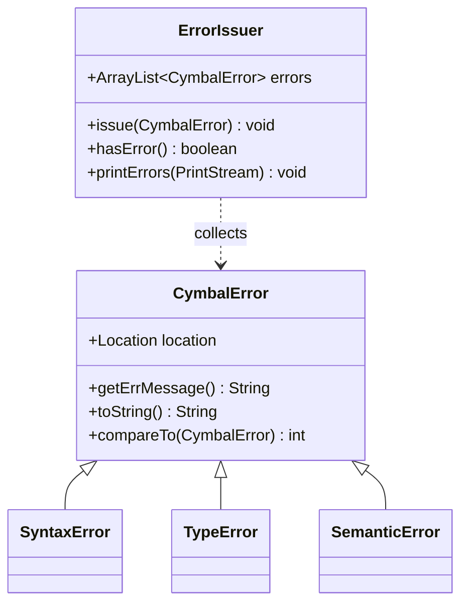
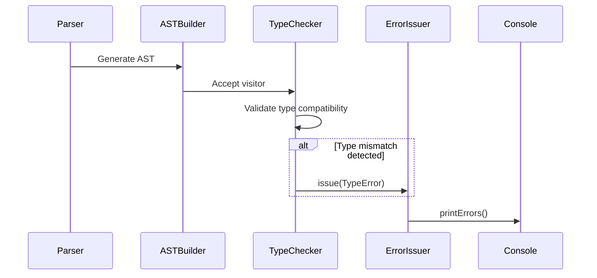
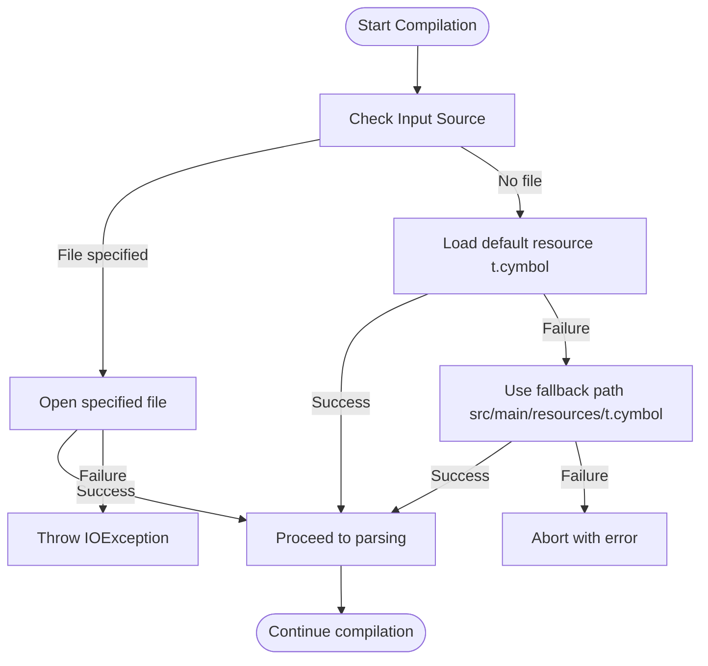

# Troubleshooting

<cite>
**Referenced Files in This Document**   
- [CymbalError.java](file://ep20/src/main/java/org/teachfx/antlr4/ep20/error/CymbalError.java)
- [ErrorIssuer.java](file://ep20/src/main/java/org/teachfx/antlr4/ep20/driver/ErrorIssuer.java)
- [CompilerLogger.java](file://ep19/src/main/java/org/teachfx/antlr4/ep19/misc/CompilerLogger.java)
- [Compiler.java](file://ep20/src/main/java/org/teachfx/antlr4/ep20/Compiler.java)
- [TypeChecker.java](file://ep20/src/main/java/org/teachfx/antlr4/ep20/pass/sematic/TypeChecker.java)
</cite>

## Table of Contents
1. [Introduction](#introduction)
2. [Error Classification and Reporting Mechanism](#error-classification-and-reporting-mechanism)
3. [Common Compilation Errors](#common-compilation-errors)
4. [Build and Runtime Environment Issues](#build-and-runtime-environment-issues)
5. [Interpreting Error Messages and Stack Traces](#interpreting-error-messages-and-stack-traces)
6. [Debugging Techniques](#debugging-techniques)
7. [Code Generation and VM Execution Problems](#code-generation-and-vm-execution-problems)
8. [Performance and Memory Usage Concerns](#performance-and-memory-usage-concerns)
9. [Troubleshooting Checklist for New Users](#troubleshooting-checklist-for-new-users)

## Introduction
This document provides comprehensive guidance for troubleshooting common issues encountered in the Cymbal compiler framework. It covers error classification, reporting mechanisms, debugging techniques, and solutions for compilation, runtime, and performance problems. The focus is on practical resolution strategies for developers working with ANTLR4-based language implementation.

## Error Classification and Reporting Mechanism

The compiler framework implements a structured error reporting system centered around `CymbalError.java` and `ErrorIssuer.java`. Errors are classified by type and location, enabling precise diagnostics.



**Diagram sources**
- [CymbalError.java](file://ep20/src/main/java/org/teachfx/antlr4/ep20/error/CymbalError.java#L1-L36)
- [ErrorIssuer.java](file://ep20/src/main/java/org/teachfx/antlr4/ep20/driver/ErrorIssuer.java#L1-L43)

**Section sources**
- [CymbalError.java](file://ep20/src/main/java/org/teachfx/antlr4/ep20/error/CymbalError.java#L1-L36)
- [ErrorIssuer.java](file://ep20/src/main/java/org/teachfx/antlr4/ep20/driver/ErrorIssuer.java#L1-L43)

## Common Compilation Errors

### Syntax Errors
Syntax errors occur during parsing and are typically related to incorrect grammar usage. The parser detects these through ANTLR4's parsing mechanism and reports them with precise location information.

### Type Mismatches
Type checking is performed by the `TypeChecker` visitor during semantic analysis. Type mismatches are identified when operations are applied to incompatible types or when assignments violate type rules.



**Diagram sources**
- [TypeChecker.java](file://ep20/src/main/java/org/teachfx/antlr4/ep20/pass/sematic/TypeChecker.java#L1-L105)
- [ErrorIssuer.java](file://ep20/src/main/java/org/teachfx/antlr4/ep20/driver/ErrorIssuer.java#L1-L43)

### Undefined Symbols
Undefined symbol errors occur when identifiers are referenced but not declared in the current or any enclosing scope. The symbol table mechanism in the compiler detects these during name resolution.

### Semantic Violations
Semantic errors include violations of language rules such as duplicate declarations, invalid control flow, or incorrect function usage. These are detected during the semantic analysis phase by specialized visitors.

**Section sources**
- [TypeChecker.java](file://ep20/src/main/java/org/teachfx/antlr4/ep20/pass/sematic/TypeChecker.java#L1-L105)
- [CymbalError.java](file://ep20/src/main/java/org/teachfx/antlr4/ep20/error/CymbalError.java#L1-L36)

## Build and Runtime Environment Issues

Common build issues include missing dependencies, incorrect classpaths, and resource loading failures. The `Compiler.java` main method handles input stream initialization and may fail if required resources are not found.



**Diagram sources**
- [Compiler.java](file://ep20/src/main/java/org/teachfx/antlr4/ep20/Compiler.java#L25-L85)

**Section sources**
- [Compiler.java](file://ep20/src/main/java/org/teachfx/antlr4/ep20/Compiler.java#L1-L161)

## Interpreting Error Messages and Stack Traces

Error messages follow the format: `*** Error at [filename]:[line]:[column]: [description]`. The `toString()` method in `CymbalError` formats messages with location information when available.

Stack traces typically originate from:
- Parser exceptions during syntax analysis
- Visitor pattern execution in semantic analysis
- Code generation phase failures
- Runtime exceptions in the virtual machine

**Section sources**
- [CymbalError.java](file://ep20/src/main/java/org/teachfx/antlr4/ep20/error/CymbalError.java#L25-L35)

## Debugging Techniques

### Logging with CompilerLogger
The framework uses `CompilerLogger.java` for diagnostic logging. Debug-level messages are written to the log, including IR tree representations and file operations.

```mermaid
flowchart LR
A[Compilation Phase] --> B{Should log?}
B --> |Yes| C[Generate debug message]
C --> D[Logger.debug(message)]
D --> E[Output to console/file]
B --> |No| F[Continue processing]
```

**Diagram sources**
- [Compiler.java](file://ep20/src/main/java/org/teachfx/antlr4/ep20/Compiler.java#L15-L23)
- [CompilerLogger.java](file://ep19/src/main/java/org/teachfx/antlr4/ep19/misc/CompilerLogger.java)

### Diagnostic Tools
The compiler generates intermediate representations (IR) and control flow graphs (CFGs) that are saved as Markdown files with Mermaid diagrams. These can be visualized to understand program structure and optimization results.

**Section sources**
- [Compiler.java](file://ep20/src/main/java/org/teachfx/antlr4/ep20/Compiler.java#L70-L100)
- [CompilerLogger.java](file://ep19/src/main/java/org/teachfx/antlr4/ep19/misc/CompilerLogger.java)

## Code Generation and VM Execution Problems

Issues in code generation typically manifest as:
- Incorrect bytecode assembly
- Register allocation errors
- Function call linkage problems
- Memory layout inconsistencies

The `CymbolAssembler` class is responsible for translating IR to VM instructions. Problems in this phase can be diagnosed by examining the generated `.vm` files and comparing them with expected patterns.

**Section sources**
- [Compiler.java](file://ep20/src/main/java/org/teachfx/antlr4/ep20/Compiler.java#L100-L130)

## Performance and Memory Usage Concerns

Performance bottlenecks may occur in:
- Large AST traversal operations
- Inefficient symbol table lookups
- Excessive string concatenation in code generation
- Memory-intensive intermediate representation storage

The framework uses streaming operations and efficient data structures to minimize memory footprint. Monitoring garbage collection patterns and heap usage can help identify memory-related issues.

**Section sources**
- [Compiler.java](file://ep20/src/main/java/org/teachfx/antlr4/ep20/Compiler.java#L50-L70)

## Troubleshooting Checklist for New Users

1. **Verify input file availability**: Ensure the source file exists or the default resource is accessible
2. **Check grammar correctness**: Validate that the input conforms to the Cymbol language syntax
3. **Confirm symbol declarations**: Ensure all variables and functions are properly declared before use
4. **Validate type compatibility**: Check that operations are performed on compatible types
5. **Review error output**: Examine the complete error message with location information
6. **Enable debug logging**: Set logging level to DEBUG to get detailed compilation information
7. **Inspect generated artifacts**: Check the generated `.vm` and `.md` files for expected content
8. **Validate environment setup**: Ensure all dependencies (ANTLR4, Log4j2) are correctly configured

**Section sources**
- [Compiler.java](file://ep20/src/main/java/org/teachfx/antlr4/ep20/Compiler.java)
- [ErrorIssuer.java](file://ep20/src/main/java/org/teachfx/antlr4/ep20/driver/ErrorIssuer.java)
- [CymbalError.java](file://ep20/src/main/java/org/teachfx/antlr4/ep20/error/CymbalError.java)