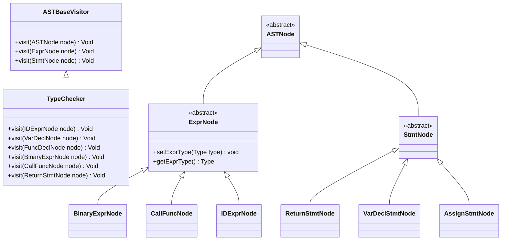
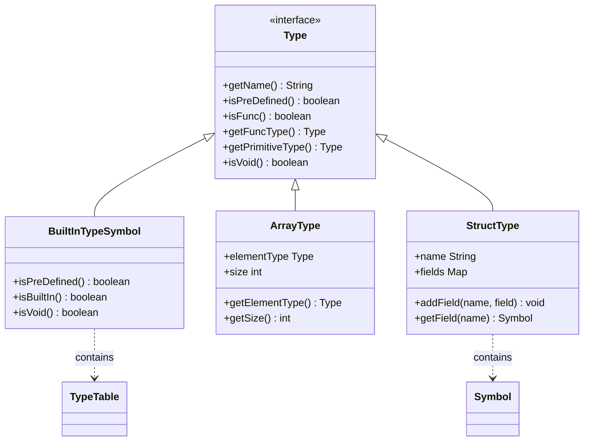
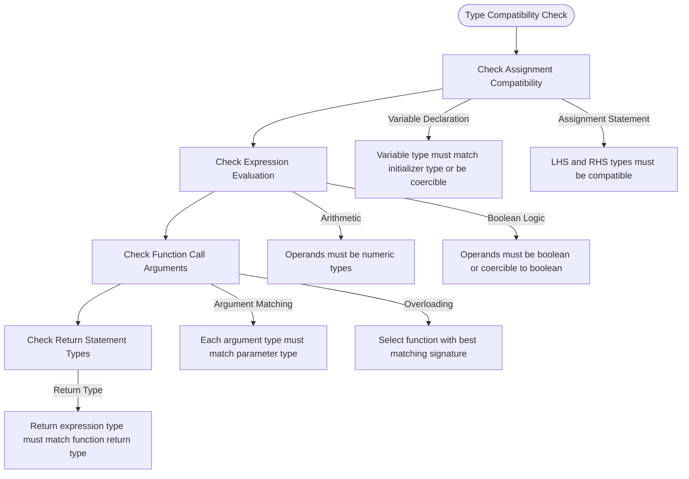
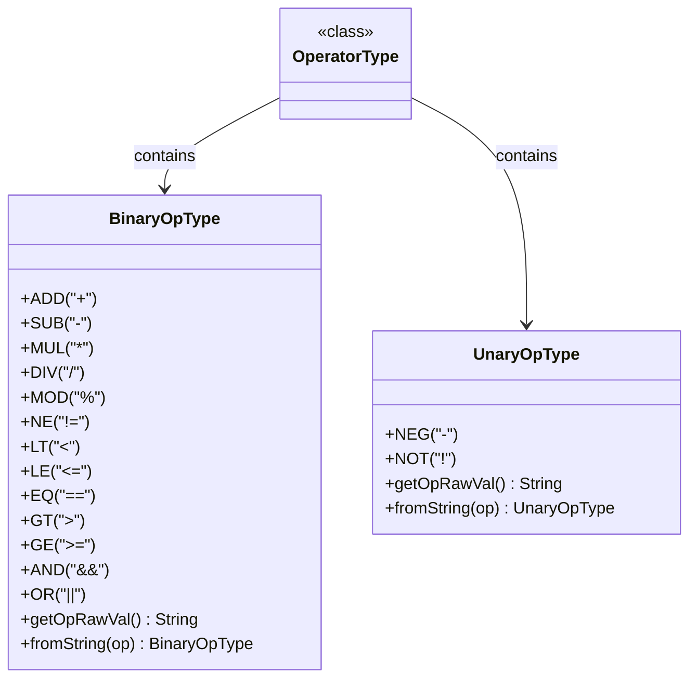
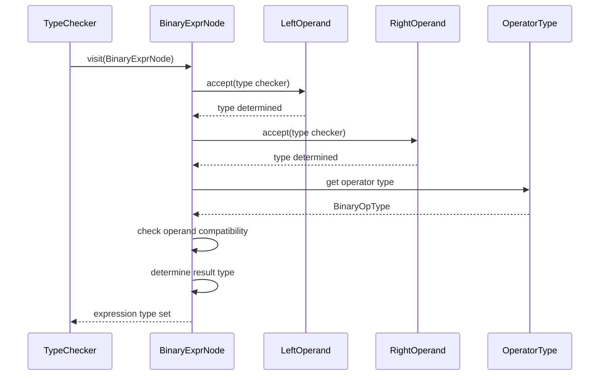
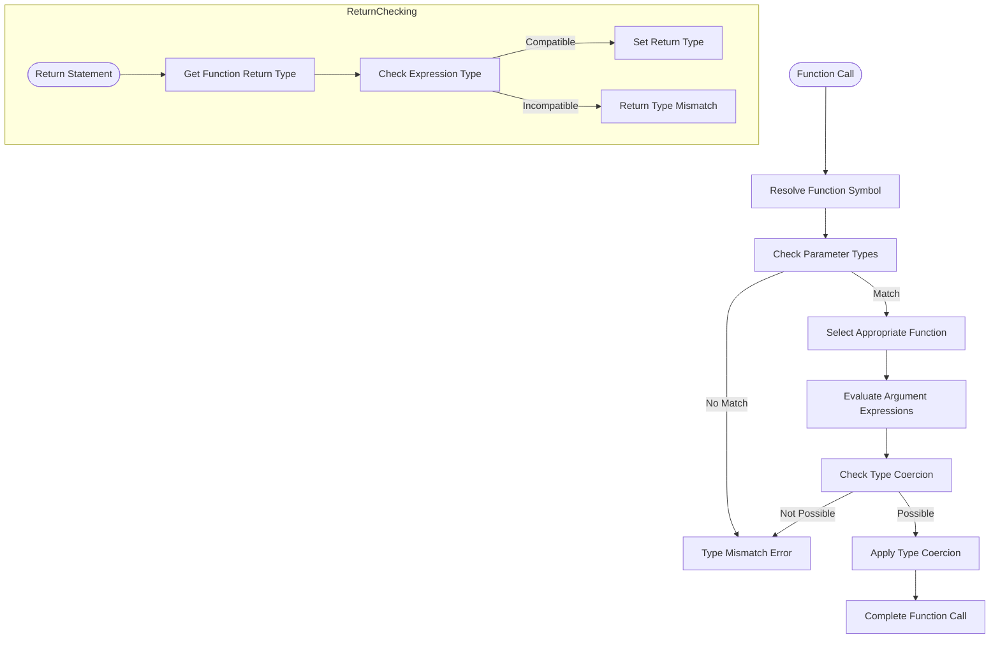
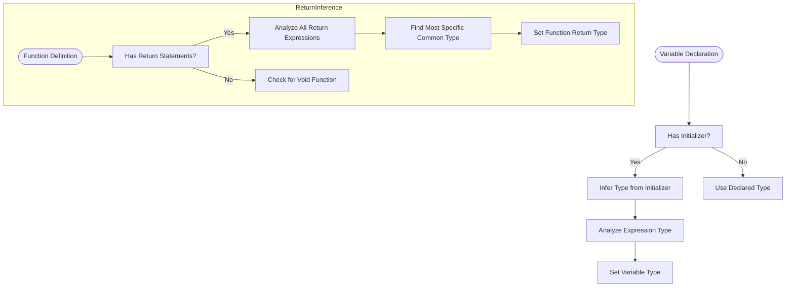
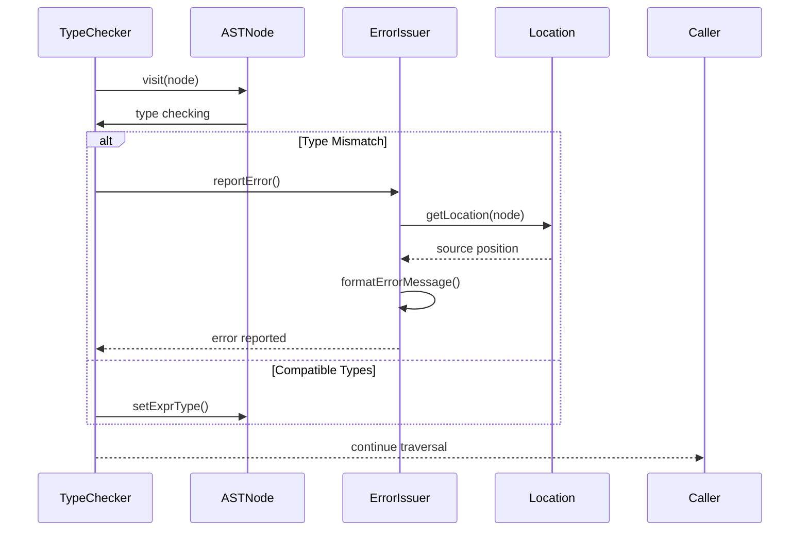

# Type Checking

<cite>
**Referenced Files in This Document**   
- [TypeChecker.java](file://ep20/src/main/java/org/teachfx/antlr4/ep20/pass/sematic/TypeChecker.java)
- [OperatorType.java](file://ep20/src/main/java/org/teachfx/antlr4/ep20/symtab/type/OperatorType.java)
- [Type.java](file://ep20/src/main/java/org/teachfx/antlr4/ep20/symtab/type/Type.java)
- [TypeTable.java](file://ep20/src/main/java/org/teachfx/antlr4/ep20/symtab/type/TypeTable.java)
- [ArrayType.java](file://ep20/src/main/java/org/teachfx/antlr4/ep20/symtab/type/ArrayType.java)
- [StructType.java](file://ep20/src/main/java/org/teachfx/antlr4/ep20/symtab/type/StructType.java)
- [BuiltInTypeSymbol.java](file://ep20/src/main/java/org/teachfx/antlr4/ep20/symtab/type/BuiltInTypeSymbol.java)
</cite>

## Table of Contents
1. [Introduction](#introduction)
2. [Visitor-Based Type Checking Architecture](#visitor-based-type-checking-architecture)
3. [Core Type System Components](#core-type-system-components)
4. [Type Compatibility Rules](#type-compatibility-rules)
5. [Operator Type Signatures and Overloading](#operator-type-signatures-and-overloading)
6. [Expression Type Checking](#expression-type-checking)
7. [Function Call and Return Type Checking](#function-call-and-return-type-checking)
8. [Type Inference Mechanism](#type-inference-mechanism)
9. [Type Coercion Between Compatible Types](#type-coercion-between-compatible-types)
10. [Error Reporting for Type Mismatches](#error-reporting-for-type-mismatches)

## Introduction
This document provides a comprehensive analysis of the type checking algorithm implemented in the compiler framework. The system employs a visitor-based approach to traverse the Abstract Syntax Tree (AST) and verify type correctness throughout the program. The type checker ensures semantic validity by enforcing type compatibility rules for assignments, expressions, and function calls, while supporting type inference and coercion mechanisms. Built-in operators are defined with specific type signatures that support overloading based on operand types. The error reporting system provides precise source location information for type mismatches, enabling effective debugging.

## Visitor-Based Type Checking Architecture

The type checking system is implemented using the Visitor design pattern, which enables separation of type analysis logic from the AST structure. The `TypeChecker` class extends `ASTBaseVisitor` and implements type verification for each node type in the AST hierarchy.



**Diagram sources**
- [TypeChecker.java](file://ep20/src/main/java/org/teachfx/antlr4/ep20/pass/sematic/TypeChecker.java#L1-L105)
- [ASTBaseVisitor.java](file://ep20/src/main/java/org/teachfx/antlr4/ep20/pass/ast/ASTBaseVisitor.java)

**Section sources**
- [TypeChecker.java](file://ep20/src/main/java/org/teachfx/antlr4/ep20/pass/sematic/TypeChecker.java#L1-L105)

## Core Type System Components

The type system is built around a hierarchy of type representations that define the semantic properties of values in the language. The core interface `Type` serves as the foundation for all type definitions, with implementations for built-in types, arrays, and structures.



**Diagram sources**
- [Type.java](file://ep20/src/main/java/org/teachfx/antlr4/ep20/symtab/type/Type.java#L1-L15)
- [BuiltInTypeSymbol.java](file://ep20/src/main/java/org/teachfx/antlr4/ep20/symtab/type/BuiltInTypeSymbol.java#L1-L41)
- [ArrayType.java](file://ep20/src/main/java/org/teachfx/antlr4/ep20/symtab/type/ArrayType.java#L1-L54)
- [StructType.java](file://ep20/src/main/java/org/teachfx/antlr4/ep20/symtab/type/StructType.java#L1-L75)

**Section sources**
- [Type.java](file://ep20/src/main/java/org/teachfx/antlr4/ep20/symtab/type/Type.java#L1-L15)
- [TypeTable.java](file://ep20/src/main/java/org/teachfx/antlr4/ep20/symtab/type/TypeTable.java#L1-L21)
- [BuiltInTypeSymbol.java](file://ep20/src/main/java/org/teachfx/antlr4/ep20/symtab/type/BuiltInTypeSymbol.java#L1-L41)

## Type Compatibility Rules

The type checking system enforces compatibility rules for various operations including assignments, expression evaluations, and function calls. These rules ensure that operations are performed on compatible types and prevent type errors.



**Section sources**
- [TypeChecker.java](file://ep20/src/main/java/org/teachfx/antlr4/ep20/pass/sematic/TypeChecker.java#L1-L105)
- [Type.java](file://ep20/src/main/java/org/teachfx/antlr4/ep20/symtab/type/Type.java#L1-L15)

## Operator Type Signatures and Overloading

The `OperatorType` class defines type signatures for built-in operators and supports operator overloading through enum-based operator definitions. Each operator has specific type requirements for its operands.



**Diagram sources**
- [OperatorType.java](file://ep20/src/main/java/org/teachfx/antlr4/ep20/symtab/type/OperatorType.java#L1-L60)

**Section sources**
- [OperatorType.java](file://ep20/src/main/java/org/teachfx/antlr4/ep20/symtab/type/OperatorType.java#L1-L60)
- [TypeChecker.java](file://ep20/src/main/java/org/teachfx/antlr4/ep20/pass/sematic/TypeChecker.java#L1-L105)

## Expression Type Checking

The type checker analyzes expressions to ensure type correctness and determines the resulting type of each expression. This includes arithmetic expressions, boolean logic, and other operations.



**Diagram sources**
- [TypeChecker.java](file://ep20/src/main/java/org/teachfx/antlr4/ep20/pass/sematic/TypeChecker.java#L1-L105)
- [BinaryExprNode.java](file://ep20/src/main/java/org/teachfx/antlr4/ep20/ast/expr/BinaryExprNode.java)

**Section sources**
- [TypeChecker.java](file://ep20/src/main/java/org/teachfx/antlr4/ep20/pass/sematic/TypeChecker.java#L1-L105)

## Function Call and Return Type Checking

The type checker verifies function calls by matching argument types with parameter types and ensures that return statements comply with the function's declared return type.



**Section sources**
- [TypeChecker.java](file://ep20/src/main/java/org/teachfx/antlr4/ep20/pass/sematic/TypeChecker.java#L1-L105)
- [CallFuncNode.java](file://ep20/src/main/java/org/teachfx/antlr4/ep20/ast/expr/CallFuncNode.java)
- [ReturnStmtNode.java](file://ep20/src/main/java/org/teachfx/antlr4/ep20/ast/stmt/ReturnStmtNode.java)

## Type Inference Mechanism

The type system includes a type inference mechanism that determines types for variable declarations and return types when they are not explicitly specified.



**Section sources**
- [TypeChecker.java](file://ep20/src/main/java/org/teachfx/antlr4/ep20/pass/sematic/TypeChecker.java#L1-L105)
- [VarDeclNode.java](file://ep20/src/main/java/org/teachfx/antlr4/ep20/ast/decl/VarDeclNode.java)

## Type Coercion Between Compatible Types

The type checker implements type coercion rules that allow automatic conversion between compatible types, such as numeric promotions and boolean conversions.

```mermaid
graph TD
A[int] --> |promote to| B[float]
B --> |promote to| C[double]
D[char] --> |promote to| A
E[boolean] --> |coerce to| F[int]
F --> |coerce to| B
style A fill:#f9f,stroke:#333
style B fill:#ff9,stroke:#333
style C fill:#9ff,stroke:#333
style D fill:#9f9,stroke:#333
style E fill:#f99,stroke:#333
style F fill:#99f,stroke:#333
note right of A
Implicit numeric
promotion rules
end note
note right of E
Boolean to int
coercion (0/1)
end note
```

**Section sources**
- [TypeChecker.java](file://ep20/src/main/java/org/teachfx/antlr4/ep20/pass/sematic/TypeChecker.java#L1-L105)
- [Type.java](file://ep20/src/main/java/org/teachfx/antlr4/ep20/symtab/type/Type.java#L1-L15)

## Error Reporting for Type Mismatches

The type checking system includes comprehensive error reporting that identifies type mismatches and provides precise source location information.



**Diagram sources**
- [TypeChecker.java](file://ep20/src/main/java/org/teachfx/antlr4/ep20/pass/sematic/TypeChecker.java#L1-L105)
- [ErrorIssuer.java](file://ep20/src/main/java/org/teachfx/antlr4/ep20/driver/ErrorIssuer.java)

**Section sources**
- [TypeChecker.java](file://ep20/src/main/java/org/teachfx/antlr4/ep20/pass/sematic/TypeChecker.java#L1-L105)
- [ErrorIssuer.java](file://ep20/src/main/java/org/teachfx/antlr4/ep20/driver/ErrorIssuer.java)